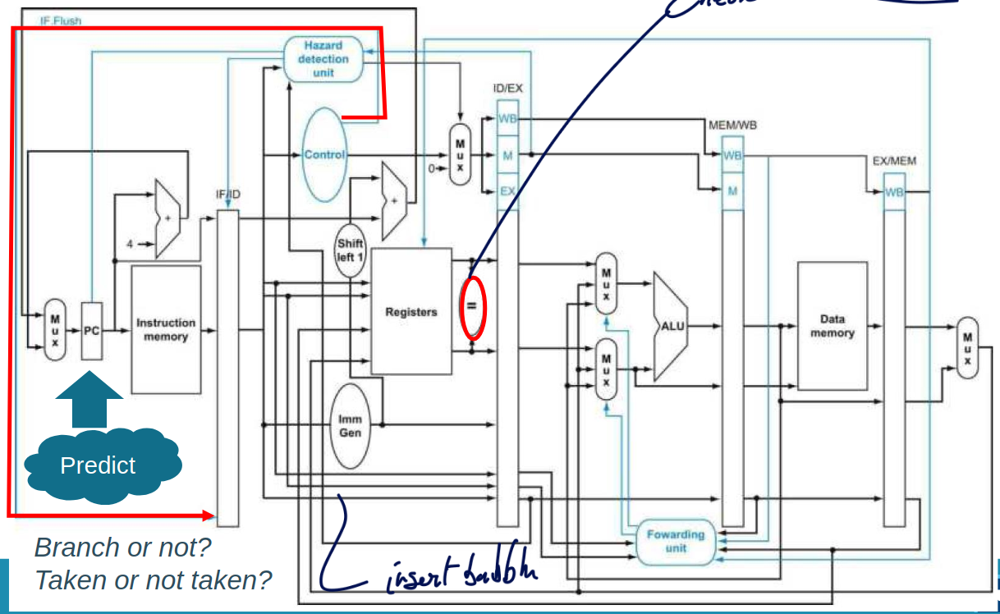
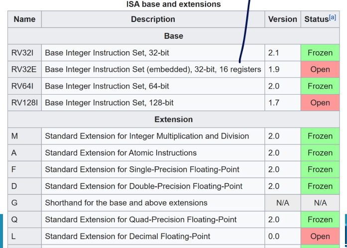
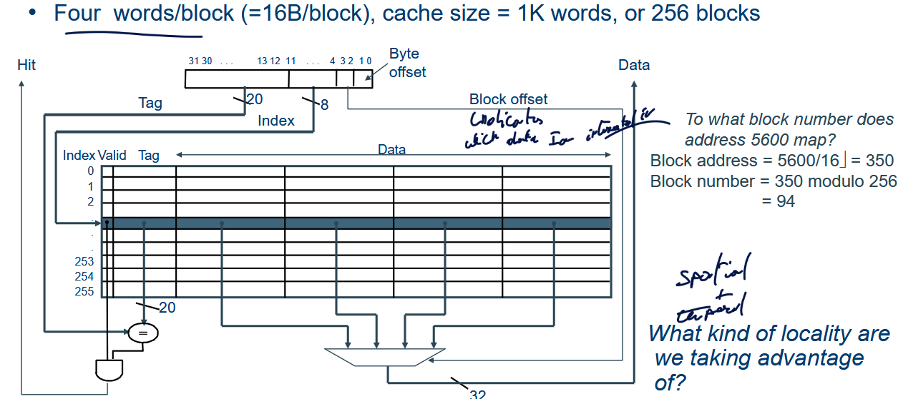
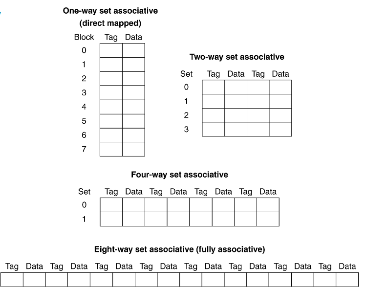

# Recap of pipelined processor

## ISA

Stands for **I**nstruction **S**et **A**rchitecture :

1.  CISC : Complex instruction set computer : VAX, X86

2.  RISC : Reduced instruction set computer : ARM, MIPS, SPARC, RISC-V

When we talk about RISC-V we always use **32 bits instructions** and
**xx bits data and address space**. Typical name is RVxxI : RV64I in
this course. We also have multiples types in RISC-V of instructions :

1.  R : **Arithmetic** : we always need to specify the output register
    and the two input registers.

2.  I : **Immediate** : they are similar to R-type but now we can add
    some *immediate* instead of an input register. **Important** the
    immediate is maximum 12 bits so we need to use some tricks to use 64
    bits immediate.

3.  S : **Store** : used to store data, needs to read and write from
    multiple registers (data, destination). *Note:* to load we are using
    the I-type since we just need the destination, address register and
    an immediate to offset.

4.  B : **Branch** : allows us to create some specific condition to
    maybe trigger some subroutine when combined with Jump instruction.

5.  J : **Jump** : used to jump to other part of the code. Jump and link
    allows us to jump further than using the Jump and link reg since
    this one uses the I-type instruction format.

6.  U :

``` {.objectivec language="C"}
// Typical R type
    add x1, x2, x3 // x1 = x2 + x3
```

In R-type, we use rs1, rs2 and rd as 5 bits describing the address
register (super small memory !). The opcode serves as an indication of
which type is used and the *funct7* and *funct3* are used as function
codes augmenting the opcode.\
Immediate can be maximum 12 bits as indicated in the RISC-V card. We
don't use a funct7 anymore. Important to notice the *regularity* of the
bits in the different type, aligning them makes it easier and requires
less multiplexer, \...\
Load instuction are like this : `ld x1, 24(x2)` where we have the rd as
x1 and x2 serves to indicate the address in the DM, the immediate
indicates how much we need to jump (good for iterating) usually the
immediate is a multiple of 8 since we are working with 64 bits memory
word.\
The store instruction is like `sd x2, 24(x1)`. Important to notice that
we don't have any rd register ! So that's the reason why we use another
structure. Indeed to store we just need a register containing the value,
the address and an immediate to jump in the memory. So indeed no need to
have a result register *rd*.\
For branching it is important to notice how the various way to jump
leads to various type having some limitations and perks. To gain some
reach, we are not using the MSB of the immediate which is 1 and adds non
useful granularity. **WHY THIS WEIRD SPLIT ?**. The jump and link is of
type J which is perfect to quickly jump further than needed since we
just have rd and no other rs and we can even remove the funct 7 and 3
since it is an unique type for this instructions.

``` {.objectivec language="C"}
// C
while(save[i] == k)
    i += 1;

// RISC-V code
Loop:
    add  x1, x3, x6
    ld   x2, 0(x1)
    bne  x2, x5, Exit
    addi x3, x3, 8
    jal  x0, Loop
Exit:
    ...
```

:::: wrapfigure
r0.28

::: center
{width="90%"} []{#fig:caller-callee
label="fig:caller-callee"}
:::
::::

It is interesting to notice how the tag *Exit* will be converted to a
relative jump instead of an absolute to the line 12 for example.

### Return loops and nesting subroutine

When we do a `jal` we save in `ra` the current program counter but after
resuming and calling other functions, we have no guarantee that this
register won't be changed !

We have some conventions in RISC-V regarding some registers and their
use but also who \"owns\" it and is allowed to tweak its value. In other
words, it creates some cohesion between developer and indicates what
registers we may expect their value to be changed before and after a
call.

### Pseudo-instruction {#macro}

We will sometimes use `li` which is a pseudo instruction which helps
with loading large immediate values than are bigger than 12 bits :\

``` {.objectivec language="C"}
li   x5, 0xB34FE0A3

    // Becomes
    lui  x5, 0XB34FE
    addi x5, x5, 0X0A3
```

``` {.objectivec language="C" caption="Other Pseudo instructions"}
nop                 addi x0, x0, 0              //No operation
    li rd, imm          //Myriad sequences          Load immediate
    mv rd, rs           addi rd, rs, 0              //Copy register
    beqz rs, offset     beq rs, x0, offset          //Branch if zero
    j offset            jal x0, offset              //Jump
    call offset         auipc x1, offset[31:12]     //Call far-away subroutine
                        jalr x1, x1, offset[11:0]
```

## Single cycle processor {#scp}

{#fig:enter-label
width="65%"}

We usually first **fetch** the instruction (so moving the program
counter to see which line we need to run next). So updating the program
counter in 32 bits instruction requires to move 4 bytes at each time
hence the +4. It is important to notice that reading from memory is
*unclocked* while writing to memory is *clocked*, this allows that the
instruction read won't take an extra clock cycle and will propagate
directly resulting in a more efficient CPU.\
Then we **decode**, here we can see why aligning data and instruction
matters, we need less multiplexer. We can read up to 2 registers and
write to one the data.\
After this, we **execute** and we expect the control unit to properly
set the signal for the ALU and other components to properly execute the
various instructions. Important to notice that the data 1 and 2 going
through the ALU are **64 bits** in RISC64I.

## Pipelined processor

We can start back from the simple Single cycle processor
([1.2](#scp){reference-type="ref" reference="scp"}) and simply at
registers along the way. But watch out, this will increase latency but
can improve throughput since we have a relaxed timing. Of course, we
can't neglect the energy and power usage of such registers and other
physical phenomena.\
In the classic 5 stages pipelined processor we have :

1.  **IF** : Instruction fetch from memory

2.  **ID** : Instruction decode & register read

3.  **EX** : Execute operation (or add offset to address)

4.  **MEM** : Access memory operand

5.  **WB** : Write result back to register

{#fig:5-stage-label
width="75%"}

Notice here that we write back on falling edge of the clock while we
read on raising clock. This is done so the read of a future instruction
can use fresh memory and do not need to wait for an extra clock cycle.\
One of the most important metric is the CPU time :

$$CPU \quad time = \underbrace{\frac{Instructions}{Program}}_{Instruction \quad Count} \cdot \underbrace{\frac{Clock \quad Cycles}{Instruction}}_{CPI} \cdot \underbrace{\frac{Seconds}{Clock \quad Cycles}}_{Clock \quad Cycle \quad Time}
    \label{eq:fundamental_perf}$$

Pipelining will improve the clock cycle time and will slightly worsen
the CPI due to the fact we will have some data and control hazard.

### Data hazard

::: wrapfigure
r0.5 {width="95%"}
:::

One approach is a *static* approach where the compiler can add some
**NOP** to let the processor do meaningless operation while waiting to
get the memory write back. Or the compiler can be a little smart and
reshuffle some instruction if it sees that there is no data
dependencies.\
A better approach is a *dynamic* or processor based approach where we
are going to introduce **forwarding/bypassing**. We are going to create
some wires that can go from the ALU to the input of the ALU in case this
data is needed for the next clock cycle.\
This forwarding unit block can be prorgrammed in verilog with :

``` {.verilog language="verilog" caption="data hazard"}
if [EX/MEM.RegWrite and (EX/MEM.RegisterRd != x0) 
    and (EX/MEM.RegisterRd == ID/EX.RegisterRs1) ]
        ForwardA = 2 // The red wire

if [ MEM/WB.RegWrite and (MEM/WB.RegisterRd != x0)
    and (MEM/WB.RegisterRd = ID/EX.RegisterRs1) ]
    and not[ EX/MEM.RegWrite and (EX/MEM.RegisterRd != x0)
    and (EX/MEM.RegisterRd == ID/EX.RegisterRs1) ]
        ForwardA = 1 // The blue wire
```

The added *not* in the second condition is there so we don't have a
concurrent bypass of data. So we will always use the most recent version
for bypassing (here the red wire from the ALU).\
But sometimes we don't just want to access from the ALU but after a read
! For example in a load instruction the data after the memory access is
of interest. In that case, we are forced to add a NOP and to stall the
pipeline. To do this we will simply not change the program counter to
fetch the instruction after the NOP bubble. We call this *stalling the
pipeline*.

``` {.verilog language="verilog" caption="load data hazard"}
If (ID/EX.MemRead ==1   //load
    and ((ID/EX.RegisterRd == IF/ID.RegisterRs1) or
    (ID/EX.RegisterRd == IF/ID.RegisterRs2))
        stall pipeline      // NOP
```

### Control hazard

Again, we can have a *static* approach where the compiler will add some
NOP or do some loop unrolling to avoid too many branches.\
But a better approach is *dynamic* where the processor controls the
branches and will predict and flush if wrong. To flush, it is important
the the wrong instructions didn't access the register write back stage
or that it didn't change a value in RAM or the drive. After flushing, we
can fetch the correct instruction.

{#fig:flush-label
width="75%"}

With this approach, we will only lose 1 clock cycle after the registers
read which will feedback any issue. We will insert those NOP operation
if we see that the branch prediction wasn't correct. We have some simple
branch prediction schemes :

1.  [Simple prediction :]{.underline} branch not taken $30-40 \%$
    accuracy.

2.  [Static prediction :]{.underline} if branch to forward PC do not
    take if branch to backward PC do take. $60-70 \%$ accuracy. Better
    accuracy because it is based on usual programming where we loop a
    lot and sometimes throw exception (see chap.
    [3](#part-3){reference-type="ref" reference="part-3"}).

## Architecture variants

RV64I is simply an ISA so we are free to implement it as we would like.
Some implementation can reduce or not the amount of bubble it needs to
insert for compute-use, load-use and branch instruction. This always
depend on the specific implementation of the CPU.

## Instruction extensions

We can add some variants to spice up our ISA and make it more efficient
or better at specific task.

{#fig:riscv-extensions-label
width="55%"}

### Multiplier example

If we are taking the example of the multiplier, we can't simply use
`mul t2, s1, s2` since multipling $N$ bits with $N$ bits will give us a
$2N$ bits number. So we need to multiply the LSB first then MSB.

``` {.[x86masm]Assembler language="[x86masm]Assembler"}
mul r0, r1, r2      ; multiply 32 bits with 32 bits store the LSB of 64 bits results in a 32 bits register
mulh r0, r1, r2     ; multiply 32 bits with 32 bits store the MSB of 64 bits results in a 32 bits register
mulhu r0, r1, r2    ; multiply 32 bits unsigned with 32 bits unsigned store the MSB of 64 bits results in a 32 bits register
mulshu r0, r1, r2   ; multiply 32 bits signed with 32 bits unsigned store the MSB of 64 bits results in a 32 bits register
```

We can also modify the datapath for multiplier for example if it doesn't
meet the timing criteria. We can make it span over the ALU and memory
read since we don't need to use a multiplier for load or store operation
(only reason why ALU is before a memory access).\
We can also think about variable length pipeline to make some
instructions run more longer than other but we will run into collision
problems. We can use some dynamic scheduling for this.

This type of exercise will be the same at the exam !

# The memory hierarchy

The biggest bottleneck in modern computer is the time access of RAM. The
larger the memory the slower it will since we will have higher
capacitance due to the interconnect.

::: {#tab:memory_comparison}
  **Memory Type**             **Location**             **Access Time**            **Cost per GB**
  ------------------------ ------------------ ---------------------------------- -----------------
  Registers (flip-flops)        On-chip                 $\leq$ 0.1 ns                   \-
  Static RAM (SRAM)             On-chip          $\sim$`<!-- -->`{=html}1 ns       $\sim$ \$1000
  Dynamic RAM (DRAM)         Companion chip      $\sim$`<!-- -->`{=html}50 ns       $\sim$ \$10
  Flash (SSD)               External storage   $\sim$`<!-- -->`{=html}10 $\mu$s     $\sim$ \$1
  Magnetic disk (HD)        External storage     $\sim$`<!-- -->`{=html}1 ms          \<\$0.1

  : Comparison of different memory types
:::

Ideally we would have everything in a register but this is simply
impossible. Even having everything in SRAM is not feasible. What we will
try to do with *memory hierarchy* is to not see this tradeoff. We will
also use locality in this context.

{#fig:enter-label
width="75%"}

## Locality, caching and virtual memory

There is two type of locality :

1.  [Temporal :]{.underline} if a memory location is referenced, then it
    will tend to be referenced again soon. So we keep the most recently
    accessed data items.

2.  [Spatial :]{.underline} if a memory location is referenced, the
    neighboring locations tend to be referenced afterwards so we will
    load to full block of contiguous words.

If we want to access something that isn't in the memory, we will have
what we call a **miss**. We will have to get the data from a higher
level memory location (SRAM, SSD, HDD, \...). That time that is lost to
access the data is called the **miss penalty** and the amount of misses
is called the **miss ratio** (MR = 1 - hit ratio). If the data was in
the cache we have a **hit**.

## Caching basics (recap)

Cache is the closest memory to the CPU and the data are not always
ordered. We need some sort of scheme to understand and know which data
are present or not.

### Direct mapped cache

We use the LSB of the addresses as the location in the cache. So we do
block address modulo the amount of blocks in cache. The amount of block
needs to be a power of 2. Then we can use some validity bits and tag
(MSB of the address) to know exactly what data is stored and if they are
valid.

Here if we try to access the data 11010, we can see the tag doesn't
match so it will result into a miss and we will most likely replace the
10010 data.

::: {#tab:cache_table}
             **Index**                        **V**                        **Tag**                             **Data**
  ------------------------------- ----------------------------- ------------------------------ ----------------------------------------
                000                             Y                             10                             Mem\[10000\]
                001                             N                                              
   **[010]{style="color: red"}**   **[Y]{style="color: red"}**   **[10]{style="color: red"}**   **[Mem\[10010\]]{style="color: red"}**
                011                             Y                             00                             Mem\[00011\]
                100                             N                                              
                101                             N                                              
                110                             Y                             10                             Mem\[10110\]
                111                             N                                              

  : Cache Table Representation
:::

So if we want to store some words (4 bytes) we will work with 32 bits
addressees. The LSB of 2 are not used since we want to access a full
word. Then we can have a cache of $2^{10} = 1024$ entries, we will use
the $32-2-10 = 20$ as the tag. On top of those $32+20$ bits of
information to store we also need an extra bits for validity. So at the
end the cache size needs to be
$(1+20+32)\cdot(2^{10}) = 54272 \text{ bits} = 13568 \text{ bytes}$.\
When we will store some data, there is two main strategies to update the
cache and the main memory :

-   [Write through :]{.underline} update in the cache and in memory.
    **Write miss** : write allocate : fetch the block and then perform
    as for a write hit. *write around* : don't fetch the block just
    write in cache (good for initialization in program)

-   [Write back :]{.underline} update only the cache. Add a *dirty bit*
    which shows if the data has been modified. Implemented a sub-routine
    to update from the cache the memory. **Write miss** : just fetch the
    block and update it.

## Measuring cache performance Impact

We want to quantify and be able to compare various algorithm to see what
is the best for us in a given case or for a given application.

When we have a cache hit, nice everything goes as smoothly. But if we
have a *cache miss* we need to **stall** the CPU pipeline, fetch the
block with the desired data from higher level hierarchy. But we can also
have cache miss on *CPU instructions* in which case we need to fetch
until we get the right instruction.

We remember eq.
[\[eq:fundamental_perf\]](#eq:fundamental_perf){reference-type="ref"
reference="eq:fundamental_perf"}, we can simplify it with :

$$\text{CPU time} = IC \cdot CPI \cdot \text{clock cycle time}$$

And now our *CPI* needs to take into account the *program execution
cycles* (add the possible cache hit time) and the time where we need to
*stall the pipeline* (memory stall cycles) to get the data.

$$\text{Memory stall cycles} = \underbrace{\frac{\text{memory accesses}}{IC}}_{\text{How many time per instruction is it accessed}} \cdot \overbrace{\text{Miss rate}}^{miss/access} \cdot \underbrace{\text{Miss penalty}}_{\text{Clock cycle to wait}}$$

From now on we will differentiate the cache for the instructions with
**I-cache** and the cache for the data **D-cache**. With this we can
separate and have various strategies depending on the type of cache.

There is also other interesting metrics such as the Average Memory Acess
Time (AMAT) :

$$AMAT = \text{Hit time } + \text{ Miss rate } \cdot \text{Miss penalty}$$

To reduce AMAT, we can reduce *hit time*, reduce *miss rate*, reduce
*miss penalty*[^1].

## Cache optimizations

### Source of Misses

-   [Compulsory misses :]{.underline} First access to a block. Typically
    at initialization time

-   [Conflict misses :]{.underline} In a non-fully associative cache.
    Due to competition for entries in a set. Would not occur in a fully
    associative cache of the same total size. This **is not a space
    issue** but an issue with a set. If we change the amount of set we
    could avoid this error.

-   [Capacity misses :]{.underline} Due to finite cache size. A replaced
    block is later accessed again (as it would be in fully associative
    cache)

-   [Coherence misses :]{.underline} Miss because other processor has
    invalidated the cache line. Due to a store or manipulation, \...

### Basic

::: {#tab:cache_optimisation}
  **Optimisation**                                          **[Hit Time]{style="color: red"}**   **[Miss Rate]{style="color: ForestGreen"}**   **[Miss Penalty]{style="color: blue"}**  **Hardware Complexity**
  -------------------------------------------------------- ------------------------------------ --------------------------------------------- ----------------------------------------- -------------------------
  0\. split/unified I/D cache                                                                                                                                                           0
  1\. larger cache                                                          \-                                       \+                                                                 1
  2\. larger block size                                                 \+ (or -)                                                                                \-                     0
  3\. higher associativity                                                  \-                                     \+ (-)                                                               1
  4\. multi-level cache                                                                                                                                          \+                     2
  5\. read priority over write                                                                                                                                   \+                     1
  6\. no address translation *(see part Virtual Memory)*                    \+                                                                                                          1

  : Cache Optimization Techniques
:::

#### 0. Split vs. unified instruction/data caches

We either use the same cache for instructions and data (**unified**) or
we can choose to split in two (**split**). Instructions have better
locality than data since we mostly access them sequently and thus we can
use some specific strategies. Split cache is mostly used at lowest
level.

#### 1. Larger cache

We can simply use larger cache so we will have less misses. But it will
increase the hit time since we will have more interconnect and
capacitance when loading the data in. It will consume more power (static
& dynamic) and will come at an increased cost. So we can only do this
for shared or off-chip caches.

#### 2. Larger block sizes

To avoid to always load data from the cache, we can increase the block
size hoping the user will request data that are next to the currently
accessed data. It take advantage of the *spatial locality* principle.

Increasing it will have its benefit up to a certain point. This
equilibrium is different depending on the cache size but we can always
observe a degradation for bigger blocks. This is due to the fact we will
quickly saturate the memory with data that are not useful for the user
(*pollution*). So this will simply *increase the miss rate*.

We will also have a bigger miss penalty since we load more data. We can
use *early restart* and *critical-word-first* to help with this problem.

{#fig:data-block-label
width="85%"}

#### 3. Higher associativity

-   Full associativity : any block can go anywhere in cache

-   Set associative : a block can only go to a set of the cache

-   Direct mapped : a block can only go to a specific place of the cache

To describe the amount of sets, we are talking about **N-way set
associative**. Where for N blocks of cache, N-associative correspond to
*full associativity* and 1-associative to *direct mapped*.

To do full associativity we need to be able to search the whole cache
and use *comparator* per entry ! When using sets we can reduce the
amount of comparator and reduce the search space.

<figure id="fig:set-asso-label">
<p> </p>
<figcaption>Set associativity represented in cache</figcaption>
</figure>

We can see that increasing the associativity will decrease the miss rate
up to a certain point where we have little gain. On the other hand, we
need extra logic and comparators ($n$). If we are comparing at equal
gate amount, we will have less cache. The hit time is also slightly
increased since we need to test every spot.

{#fig:set-associativity-impl-label
width="75%"}

For direct mapped, the replacement policy is pretty straightforward, we
will simply update the spot. For set associativity we will first remove
non-valid entry and then check other candidate based on 3 different
approach :

1.  **Least-Recently Used (LRU) :** we will remove the data that was
    accessed a long time ago. For 2-way it is simple, 4-way it gets
    trickier and then it becomes just too hard.

2.  **FIFO :** we simply delete the oldest block, but it is inferior to
    LRU since we can have a block where we loop on it and use it all the
    time.

3.  **Random :** delete one randomly. The performance is pretty similar
    to LRU for high associativity which is a good thing !

#### 4. Multi-level caches

The idea is to have cache for cache. We will have smaller and smaller
cache closer to the CPU. Those smaller caches are *low associative* to
have better speed performance but will have larger miss rate with a
small block size. For second level, we will try to minimize the miss
rate we need larger cache, higher associativity, larger block size.

We often denote those caches like $1\$$ or $2\$$, when in an exercise we
give the hit rate, we are always talking with **local rate** so from
$1\$$ to $2\$$ and not from the processor to the $2\$$. So how to
compute the *AMAT* ?

$$AMAT = \text{hit time L1} + \text{miss rate L1} \cdot (\text{hit time L2} + \text{miss rate L2}\cdot \text{miss penalty L2})$$

So we simply need the local misses from one level to the other. By using
this formula with some real example, we can see we can get much much
closer to the ideal $1$ clock cycle for data access.

::: {#tab:hit_rate_performance}
   **hit rate**  **L1 and main**   **L1, L15 and main**   **L1, L10, L20 and main**   **L1, L3, L10, L20 and main**   **L1, L3, L5, \..., L19, main**   **all levels**
  -------------- ----------------- ---------------------- --------------------------- ------------------------------- --------------------------------- ----------------
      100.00     1.00              1.00                   1.00                        1.00                            1.00                              1.00
      99.00      1.50              1.16                   1.10                        1.03                            1.03                              1.02
      98.00      2.00              1.32                   1.21                        1.06                            1.06                              1.04
      97.00      2.50              1.50                   1.32                        1.10                            1.09                              1.06
      96.00      3.00              1.68                   1.44                        1.14                            1.13                              1.09
      95.00      3.50              1.88                   1.56                        1.18                            1.16                              1.11
      90.00      6.00              3.00                   2.25                        1.43                            1.36                              1.23
      80.00      11.00             6.00                   4.20                        2.24                            1.87                              1.56
      70.00      16.00             10.00                  7.15                        3.75                            2.65                              2.04
      60.00      21.00             15.00                  11.40                       6.36                            3.89                              2.79
      50.00      26.00             21.00                  17.25                       10.63                           5.99                              4.06

  : Hit Rate vs. Cache Levels Performance
:::

#### 5. Prioritize reads over writes

In this optimization, we will have a *write buffer* and a read miss will
stall the processor. We don't want a write to stall the processor even
though they may take quite some time to complete. To evict a dirty block
for a read, we can copy dirty block to write buffer and immediately
proceed to read data.

In *write through*, we will let the processor write to the buffer and
then it will be written to $2\$$ cache. For *write back*, we will let
the $1\$$ cache write to the buffer and then a sub-routine will copy
this data to the $2\$$ cache.

### Advanced

::: {#tab:cache_advanced_optimizations}
  **optimisation**                        **[hit time]{style="color: red"}**   **bandwidth**   **[miss rate]{style="color: green"}**   **[miss penalty]{style="color: blue"}**   **power consumption**   **hardware complexity**
  --------------------------------------- ------------------------------------ --------------- --------------------------------------- ----------------------------------------- ----------------------- -------------------------
  1 way-predicting                                                             \+                                                      \-                                        \+                      1
  2 pipelined                             \+ (but multicycle)                                                                                                                                            1
  3 multi-banked                                                               \+                                                                                                                        2
  4 non-blocking                                                               \+                                                      \+                                                                3
  5 critical word first & early restart                                                                                                \+                                                                2
  6 merging write buffer                                                                                                               \+                                        \-                      1
  7 (HW or SW) prefetching                                                                     \+                                      \+                                                                2/3
  8 compiler optimizations                                                                     \+                                      \+                                                                3

  : Cache Optimization Techniques and Their Effects
:::

#### 1. Way prediction

We will try to load the next access and pre-set the mux since there is a
lot of logic on the way from the tag to the data out. If we miss, it
will cost more time so increasing the hit time but the accuracy is quite
good, $>90\%$ for two-way and $>80\%$ for four-way. We got better
accuracy for I cache than D cache. It will still consume a lot of power
since we may access unwanted slice so we will put some cell into sleep
mode.

#### 2. Pipelined caches

It is to clock the CPU even faster than the L1 cache access time. But
this will increases the branch mis-prediction penalty and we can easily
increase associativity since it's not too bad to slow down the cache
now.

#### 3. Multi-banked caches

To read efficiently, we will try to read with a *single port* but we
could have *simultaneous* read access for shared cache.

**READ MORE THIS PART CAUSE I DONT UNDERSTAND IT**

#### 4. Non-blocking cache

In an *in-order* processor, the cache miss will result into a *processor
stalls* so we simply have to wait until we get the data back. With an
*out-of-order* processor, we can do other instructions while waiting for
previous ones.

We won't stall when we get a load instructions and will simply keep
running other independent instructions. But if we have other load
instructions, we could still stall if we are encountering blocking or
non-blocking cache.

With non-blocking cache, we will not stall but still service other
memory requests. We can have hit before previous misses complete \"*hit
under miss*\", \"*hit under multiple miss*\" but also stall with \"*miss
under miss*\". We have blocking L2 cache which will not hide the miss
penalty sadly. But this has its fair bit of problems :

-   multiple outstanding misses: keep track which instruction asked for
    it

-   arbitration between outstanding requests: L1 hits can collide with
    misses returning from L2. Multiple misses returning from L2 can
    collide when mapped to the same block. L2 data can return out of
    order

#### 5. Critical word first, early restart

This method is applicable for caches with block size bigger than 1 upon
cache miss. We start with the critical word first. Request missed word
from memory first then we send it to the processor as soon it arrives.

For early restart, we request words in normal order and we send the
missed work to the processor as soon as it arrives. The effectiveness of
these strategies depends on the block size and likelihood of another
access to the portion of the block that has not yet been fetched.

#### 6. Merging write buffer

When we store to a block that is already pending in the write buffer, we
update the write buffer. It reduces the stalls due to a full write
buffer and reduce write buffer entries.

#### 7. Prefetching

We request the data from the cache before it is actually needed. So we
give the time to the cache to handle a miss by the time the data is
needed. We will have longer lifetime of the data in the cache and we
could interfere with other previous memory accesses which would have
worse performance.

We can do it in HW which is usually done for L1 cache but it requires
more hardware. But we can also do it in software (through the compiler
or the programmer itself). We can do some loop unrolling or prepare some
load and pipeline the software. It will requires thus a bit more
instructions.

#### 8. Other compiler optimizations

Typically, we can do some better matrix and array access. For example,
since we know we will load a full row in the cache, instead of accessing
the elements from top to bottom, we can decide to access from left to
right. This will increase the hit rate since we will load in memory the
full row when accessing the first entry. We can do some *loop
inversion*.

If the row is too big to be loaded in cache, memory, \... we can do
*tiling* where we will break down a loop into smaller pieces. It will
have a better locality, and it usually looks like this :

``` {.c language="c" caption="Typical tiling"}
for (i1 = 0; i1 <= 1; i1 = i1 + 1)
    for (j = 0; j < N; j = j + 1)
        for (i2 = 0; i < N/2; i2 = i2 + 1){
            i = N/2*i1+i2;
            z[i][j] = z[i-1][j] + x[i][j]*y[i][j];
        };
```

## Virtual machines and virtual memory

In this paradigm, we explore the idea of having the speed of DRAM with
the space of a disk. Even 32 GB of RAM is not always enough to run every
program all at once and OS's have developed technique to put unused
software in standby and to free up ram.

We know that all of the programs, files, \... are stored on a
**secondary memory** called disk space. And when we run a program we
would like to load the full program to be able to run it and exploit it.
But this is not always feasible, so we will use a **swap space** that is
a sort of extension of the ram into the disk space. But this requires a
better *book keeping* for the OS to know which piece of code is in ram
or not. We need a good management unit.

### Virtual memory

We use the memory as a cache for the secondary storage. We are going to
use clean, stable and unified addresses that are both managed by the CPU
and the OS. The virtual address space is **larger than** the physical
address space, we give the illusion of an infinite ressource.

The processor will work with virtual memory that is contiguous and
unified from his POV. Those virtual memory addresses will get
automatically translated into physical one later. Easier to develop an
application since we don't need to think how it will be managed in
memory. Makes it more secure with isolation processes and can give more
ressources than actual present on the machine by using swap.

#### Page

We call a virtual memory block a **page**. Usually they contain multiple
addresses and we will use this as the *page offset*.

{#fig:translation-va-label
width="75%"}

There is a LUT that is stored in memory that helps with the translation
of the VA into physical one. There is only one page for each process and
they form with the program counter and register the current state of a
program. When starting a new process, the operating system simply loads
the page table register to point to the page table of the process it
wants to make active (and loads the register file and the program
counter)

{#fig:tlb-label width="75%"}

#### Page tables

It stores the placement information and is an array of page entries that
we index by virtual page number. Page table register in CPU points to
page table in physical memory. If a page is present in memory, the *page
table entry* will store the physical page number. We will also add dirty
bit and reference bit.

When we have a *fault*, we need to look into the swap space, this is
handled by the OS and takes *millions* of CPU cycles. That's why we need
smart replacement algorithms and fully associative placement of pages in
main memory.

#### Replacement

The ideal algorithm is the LRU but hard to keep track of all access and
updating it, too costly. We will use the *reference bit* algorithm where
we set to 1 when it has been accessed. The OS will *periodically* clear
those bits to put them back to 0. When we need to do replacement, we
will first remove the one where their bit is 0.

{#fig:cache-tlb-label width="95%"}

This makes cache access pretty expensive, that's why we are going to use
a TLB for this purpose. This will make accessing memory much much
faster. It is a pretty small with 19 to 512 entries.

{#fig:hierarchy-tlb-label
width="95%"}

If we have a TLB miss, we can either have the page loaded in memory and
so we can add this entry into the TLB. But if it is not the case, we
have a page miss which will have a higher penalty. Luckily, TLB misses
are more frequent than total page misses.

#### Why Not a Virtually Addressed Cache?

A virtually addressed cache would only require address translation on
cache misses. But with this idea, we can't do shared data. Since each
process will have its own VA and so its own entry in the TLB. So
modifying one data will force us to update the other one manually. Not
that efficient in the end.

To reduce the translation time, we can overlap the cache access with the
TLB access. It works when the high order bits of the VA are used to
access the TLB while the low order bits are used as index into cache.

::: {#tab:tlb_page_table_cache}
   **TLB**   **Page Table**   **Cache**  **Possible? Under what circumstances?**
  --------- ---------------- ----------- ---------------------------------------------------------------------------------------------------
     Hit          Hit            Hit     [Yes]{style="color: ForestGreen"} -- what we want!
     Hit          Hit           Miss     [Yes]{style="color: ForestGreen"} -- although the page table is not checked if the TLB hits
    Miss          Hit            Hit     [Yes]{style="color: ForestGreen"} -- TLB miss, PA in page table
    Miss          Hit           Miss     [Yes]{style="color: ForestGreen"} -- TLB miss, PA in page table, but data not in cache
    Miss          Miss          Miss     [Yes]{style="color: ForestGreen"} -- page fault
     Hit          Miss        Miss/Hit   [Impossible]{style="color: red"} -- TLB translation not possible if page is not present in memory
    Miss          Miss           Hit     [Impossible]{style="color: red"} -- data not allowed in cache if page is not in memory

  : TLB, Page Table, and Cache Possibilities
:::

**Up to page 103**

## Scratchpads and DMA

Sometimes, we don't want this high level and virtualization and we want
to access all of this at the Software level. If we know we will often
reuse data, we want to better plan and better use the memory.

Using cache is good for:

-   Non real time software, and no predictive data (aka, we can't have
    things arriving late and we can't do sw optimization)

-   Cache used in GP CPU

-   Easy to program with it

We shouldn't use cache for:

-   Hard real-time application with strict deadline (we can't have TLB
    miss or stuff like this)

-   We can predict patterns and do better software programming

The idea behind *scratch pad* is for the programmer to better plan the
memory usage and be able to plan how his elements will be stored in
memory. Heavily used in DSP where we have repetitive and fast processes.

### Direct Memory Access (DMA)

Transferring data is taking a lot of time and we wouldn't want our
precious CPU cycles to be wasted just moving data. That's why we have
created the DMA which is a *hardwired state machine*, its only goal is
to store data, move data to memory or peripheral and back. It has its
own subroutine and run in parallel to the CPU.

{#fig:DMA-controller-label
width="75%"}

#### BUS arbitration

We need to implement an algorithm to transfer the ownership of the BUS
between peripherals. When we are done using the BUS through one
peripheral, we let the ownership go and another device can take control.

This is implement with active low signal. It is in 4 phases

1.  DMAC request BUS with $\overline{BR}$

2.  $\mu P$ finishes its current operations and grand the bus through
    $\overline{BG}$

3.  DMAC starts controlling and releases the BUS and releases
    $\overline{BR}$.

4.  $\mu P$ releases $\overline{BG}$ and gets the control of BUS.

<!-- -->

    WHILE 1
        WHILE StartDMA=0;
        BR' := 0;
        WHILE BG'=1;
        WHILE Nr > 0
            Out := Mem[StartAddress+Nr];
            || Nr := Nr -1;
        BR' := 1;
        WHILE BG'=0

::: {#tab:my_label}
         Method        Advantages                                                     Disadvantages                                                     Use
  -------------------- -------------------------------------------------------------- ----------------------------------------------------------------- -----------------------------------------------------------------------------------------------------------------------------------------------------------
     Burst mode DMA    just one time overhead, pages burst memory modes can be used   Processor is idle during long time                                good for fast non-interruptable peripherals. Advanced processors with memory bottleneck and with advanced memory chips.
   Cycle stealing DMA  Memory BUS is not blocked for a long time                      High overhead cause we need to renegotiate bus mastership often   Slow peripherals that would keep the DMA controller waiting between successive transfers. Low performance system where memory access is not a bottleneck.

  : DMA method
:::

## Memory technologies

-   [SRAM:]{.underline} We can't physically have more L1 cache since it
    is using 6 transistor cells to store one bit, we have a low density.
    Moreover, it is expensive and high power but will keep data on
    forever until it is powered off. Fast $1ns$

-   [DRAM:]{.underline} High density only 1 transistor per cell,
    requires low power and cheaper. Needs to be refreshed (every
    $\sim 8ms$). Pretty slow $50 ns$.

-   [HDD/SSD:]{.underline} pretty slow but non-volatile.

### Memory array

All the data in memory are agenced in an **array** like structure. Where
we have *wordline* controlled by the MSBs and the *bitline* controlled
by the LSBs.

#### Read Only Memory (ROM)

As the name suggests, it is a type of memory that can only be written,
an absence of transistor is a 1 and a transistor is a 0. Good for Boot
loader and critical component like those.

{#fig:ROM-label width="40%"}

#### Programmable ROM (PROM)

Instead of only using a hardware specific ROM, we can link the gate of
the transistors to the matrix with a fuse and when we want to write a
program to it, we burn those fuses.

### SRAM

{#fig:enter-label width="50%"}

It is basically a latch with two inverter and some nmos at the input to
let and store the data.

As year progress, most of the area is used in a SOC by the cache and not
really by new or re-used IP blocks.

### DRAM

{#fig:DRAM-structure-label
width="75%"}

The capacitance are implemented vertically in the wafer to maximize
their values while maintaining a high density as possible.

In DRAM, we need to precharge before doing a read or the values may not
be read correctly. When we read, the values are slightly higher than
$V_{DD}/2$ for a 1 bit and slightly below. It is pretty small difference
that's why we need a comparator to check the value.

We read the full word line in DRAM. We then refresh the values after the
comparator to reset the value that was read. Summary:

1.  Precharge

2.  Row Address Select: read all cells on a single wordline (destructive
    process)

3.  Sense comparator

4.  Column Address Select: we can be only interested in one bit for
    example

5.  Refresh: restor the content

We must refresh after each read but also when the data is not used for
quite some times since we have leakage on the capacitance.

#### Processor Memory interface

{#fig:enter-label width="75%"}

In a RAM stick, there is multiple RAM chip so we first need to indicate
which chip is of interest with chip select wire. Then we can specify the
the CAS and RAS. But this process is quite slow so we spent lot of
efforts to make this process quite faster.

#### SDRAM

{#fig:SDRAM-label
width="75%"}

It allows us to pipeline and so operate at a slightly faster rate. We
can also use some *bank interleaving* so we can use one bank and wait
for another to precharge etc.

#### DDR

One of the most recent and paradigm that gets update regularly is the
Double Data Rate scheme where we can read on the rising and the falling
edge. So we can have a faster internal clock. This method assumes
consecutive words to realize this technique.

#### Stacked packaging

In ARM and more efficient processor, we are stacking the memory on the
same die or just nearby. We are talking about 3D DRAM if we stack it
directly on top of the CPU die (quite challenging to do), or 2.5D DRAM
if we put that stack DRAM just next to the CPU die.

Most high level caches are becoming eDRAM, especially seen in IBM server
processor but still experimental.

# Exploiting Instruction Level Parllelism (ILP) {#part-3}

## The roofline diagram

It is a type of diagram that is used to evaluate and compare various
solution for a given task.

We first start analyzing and checking how many useful operation per
second can a given processor execute. This metric is given in GFLOP/s:

$$Peak= f_{clk} \cdot op/clock \text{ } cycle \qquad IPC = instruction/cycle = 1/CPI$$

We know a system is then constrained by its memory bandwidth, so we can
draw a line indicating how constrained it is. This line is expressed in
bytes per second.

The graph has the **Arithmetic Intensity** as its x axis, it indicates
the ratio of operation per byte. So it is easy to know looking at the
roofline graph if we are communication constrained or computational
constrained.

Analyzing such graphs can quickly transmit a lot of information about a
system and helps us creating the best one possible. Ideally, we want to
be at the cut-off to avoid any waste.

## Tricks and limitations of static ILP

One way to enhance and run more instructions per second is using static
ILP. It is the compiler's responsibility to compile properly the
instruction and to distribute the load. So, we need to compile for each
and every possible platform. It is not a one fits all solution.

We call this a **Very Large Instruction Word**, because if we have 4
processors for example running at 32 bits, we will get some 128 bits
instruction ! So the IPC \> 1 and the CPI \< 1.

### Issues

Typically, in such processors they won't all run the same instructions,
we can have some dedicated processor for operations.

One other challenge is that those type of processors are not always
efficient for every program. Typically, we need high parallelism and
avoid data dependency to be able to gain from it.

The compiler can't decide for the programmer so it is up to the
programmer to be smart.

#### Overcoming

One good way to overcome this is by using **loop unrolling** and
**predication**. We can optimize *basic blocks*[^2].

But also, hardware designer try to optimize their hardware for frequent
use cases such as for loops. Indeed, it is not always smart to always
increment a variable in a predictive manner. We are losing a precious
clock cycle. So they came up with a better idea:

``` {.[RISC-V]Assembler language="[RISC-V]Assembler"}
lp.setupi   100, Lend
    lw          x2, 0(x10)
    addi        x10, x10, 5
    addi        x2, x2, 1
    sw          x2, 0(x11)
Lend: addi      x11, x11, 4
```

So here, it will update the counter before the instructions memory.

Another way to optimize is to use some **guarded execution using
predicates**. Instead of doing a conditional jump and so breaking a
basic block, we will make the two condition execute and only write back
after evaluation:

``` {.[RISC-V]Assembler language="[RISC-V]Assembler"}
r1 = 10;
r2 = A[r1];
r7 = (r2 > 0);
(r7) r3 = r3 + r2;
(r7)` r3= r3 - r2;
r5 = r4 - r3;
r6 = r3 + r4;
```

To use this extension, we need to support conditional write.

{#fig:VLIW-label width="75%"}

### Pipelined processor performance

The hazard limit processor performance, we want more IPC but only
possible in static schedule so we must optimize accross branches.

### Summary

-   Yet, needs large "basic block size" to shuffle instructions around
    (gives degrees of freedom to compiler)

-   Loop unrolling and predication (and later SIMD, see Part 4) help,
    but\...

-   Remaining challenges:

    -   No code compatibility among different processors (each processor
        needs own compiler!)

    -   Even with all previous tricks, hard to prevent all stalls at
        compile time (missing run-time information)

We would like rather to rearrange instructions on the fly to be more
flexible and dynamic.

## Dynamic ILP and Tomasulo's algorithm

Here, the CPU is the master and no longer the compiler, he is in charge
of dispatching the instructions. So we don't have to recompile for every
platforms and flavors of an architecture. More flexible and dynamic so
can handle dependencies unknown at compile time.

Come at the cost of more complex hardware.

Such CPU can run instructions in or out-of-order instructions. But we
need to carefully handle data hazards

### Data hazards

We have 3 types of data hazards that can be real one and ones that are
due to the limited amount of available registers:

1.  [**Read After Write:**]{.underline} we have a *true dependence*
    between data and some data are not directly accessible.

2.  [**Write After Read:**]{.underline} we have an *anti-dependence* due
    to reusing a register name we may overwrite before the previous
    instruction has run. Possible and problematic in out-of-order
    execution only!

3.  [**Write After Write:**]{.underline} we have an **output
    dependence** because we are reusing the same name. Only possible and
    problematic in out-of-order execution only!

``` {.[RISC-V]Assembler language="[RISC-V]Assembler"}
; RAW
    x2 <- x1 + x3
    x4 <- x2 + x3

; WAR
    x2 <- x1 + x3
    x3 <- x4 + x5

; WAW
    x2 <- x1 + x3
    x2 <- x4 + x5
```

### Principles

{#fig:dynamic_principle-label
width="85%"}

To prevent WAW and WAR, we can do some registers renaming to avoid those
false dependencies. But to do it on the fly we will use the **Tomasulo's
algorithm** for it.

### Tomasulo's algorithm

1.  [**Issue (IS):**]{.underline} we get the instruction from the
    instruction unit. If we have one reservation station free we issue
    an instruction and send operands.

2.  [**Execute (EX):**]{.underline} when both operands are ready we
    execute or we wait and monitor the Common Data Bus for result.

3.  [**Write result (WR):**]{.underline} write on Common Data Bus to all
    awaiting units and mark the reservation station as available.

{#fig:tomasulo-label
width="75%"}

Column names:

-   [Op:]{.underline} operation to perform in the unit

-   [Vj, Vk:]{.underline} value of source operands, store bufer has
    result to be stored in Vj field.

-   [Qj, Qk:]{.underline} reservation stations producing source
    registers. If they are = 0 then it means it is ready.

-   [Busy:]{.underline} indicates if a reservation station or FU is busy

The renaming is *automatically* done inside the reservation stations. We
fetch and buffer operands in the reservation station as soon it is
available.

At instruction issue, available register file values are copied to
reservation stations (eliminate WAR). Specifiers for source operands not
available are renamed to the names of the reservation stations when the
operand will come from. Values can exist in reservation station or
register file. Instructions waiting for input still to be computed, keep
track of reservation station which will provide this input.

When we waiting for an operand we keep monitoring the CDB.

#### Data bus: Normal vs Common

In a common data bus we send data to a destination. In a common data
bus, we broadcast the results and indicate where it came from. The
operation in the reservation stations will listen and write if they see
one source matching.

<figure id="fig:tomasulo-example-label">
<p>  </p>
<figcaption>Tomasulo Example</figcaption>
</figure>

It eliminates the stalls due to WAW and WAR which is pretty beneficial
in loops. It also distributes the hazard detection and mitigation logic.

BUT, it requires more hardware and monitoring all tags that pass by on
the CDB comes at a cost. We still didn't improve the load store
conflict. In fact we could have some `ld` and `sd` that could point
towards the same address, there is two ways to mitigate this:

1.  Force load and store to be in order

2.  Check if the `ld` and `sd` are allowed to execute:

    -   `ld`: only if no uncompleted store with same memory address
        pending

    -   `sd`: only if no uncompleted load OR store with the same address
        pending

Will result in more stalls, we could mitigate it using some ReOrder
Buffer. WAW conflicts can result in wrong outcomes !

Also, branch mispredictions and cache misses become very expensive as we
need to flush or stall many **parallel** instructions.

## Hardware speculation

We will try to avoid data dependencies by loading data much in advance.
We need to have some speculation since branching causes further
throughput losses in Out Of Order processor. That is why we want to do
some hardware speculation to guess what instructions should be executed.
We increase the basic block size by reshuffling opportunities accross
branches. We can however make mistakes.

### Speculations

1.  Speculate that a store: it will not have the same address. Used for
    store before a load.

2.  Speculate on the outcome of a conditional branch: correct if branch
    was wrongly predicted but very low miss rates needed.

In speculation and prediction there is 3 big sorts of them:

1.  Simple: same decision all the time

2.  Static: if the branch is forward we do not take it else we take it.
    (good for loops and if)

3.  Dynamic: use run-time information

### Branch Prediction Buffer - BHT

{#fig:BHT-label width="65%"}

We add a little piece of memory in the instructions fetching that stores
the **lower bits of the PC** with the information if the branch was
taken or not.

#### 1-bit prediction buffer

We simply store one bit indicating if it was taken or not the last time.
We need $2^k$ bits for storage space (so it depends on the $k$ lowest
bits we want to save). The accuracy is around $85\%$ and for a loop with
$N$ iterations we have an accuracy of $\frac{N- 2}{N}$. So it is good
for loops with large iterations.

#### 2-bit prediction buffer

Here we will store 4 possibles states. We have an extra nuance where we
have jump weakly taken and weakly not taken. It is useful for nested
loops for example as we will re-enter such loops later and don't want to
exit it too soon. It has $2 \cdot 2^k$ bits of storage for a $90\%$ of
accuracy. For loops we have a precision of $\frac{N-1}{N}$. Not really
effective to add more states.

#### Correlating predictors

Here we exploit informations for m branches and use a sort of *global
branch history*. We keep those 2 bit predictors but add the informations
about the branches which give us $2 \cdot 2^m \cdot 2^k$ bits storage
space. It gives real good results with a $\sim 95\%$ accuracy.

{#fig:enter-label width="50%"}

#### g-share

It is an even more efficient implementation where $m=k$. The idea is to
XOR to reduce the storage that is needed. So we will have just around
$2 \cdot 2^k$ bits for storage.

{#fig:enter-label width="50%"}

#### Other techniques

The best techniques that exists currently reaches $97/98 \%$ of
accuracy. It is *tournament predictors, tagged hybrid predictors, \...*
using local and global predictors.

### Branch Target Buffer - BTB

But in our current implementation, we still loose one or more cycle to
compute the branch address so it didn't really help. The BHT tells when
or not to take a branch but not where its taken to !

That's when the BTB comes into play. It is also located in the IF stage
and allows to look up the branch target address using the lower PC
address bits ! So we use the BHT to trigger a mux and the BTB feeds into
this mux.

{#fig:enter-label width="50%"}

#### Branch Buffer Indexing

Branch target & history table do not have to be large. E.g. only 128
entries (k=7) Done every clock cycle:

-   Index memory with lower k bits of PC

-   Compare stored PC of memory entry with actual PC

-   If same, then jump to target address, if not, PC=PC+1

-   (later): check whether branch did take place; and if needed update
    BHT, BTB

### Compiler - Hardware speculation

The compiler can reorder the instructions, move load before branches,
\... It is quite crucial in VLIW and in-order processors. It is
something that is static.

The hardware can also look ahead for instructions to execute. We put the
results of those instructions in a buffer until they are actually
correct. We have to flush buffers on incorrect speculation. Superscalar
out-of-order, this is something that is dynamic.

#### Danger of Hardware based speculation

We have to be careful with those transient executions as we should only
write back if we are allowed too. We have to add a new piece of hardware
that ensures this data integrity.

## Out-of-order completion

It is quite tricky to dynamically schedule a processor. In fact various
operations can have various delay due to pipelined operations. So we
really have to be extra careful with writing back as the results can
come back out of order.

        fld  f0, 0(x1)
        fmul f4, f0, f2
        fld  f4, -8(x1)
        ...

Here, we could already start the second `fld` operation but we cannot
write back to f4 as the multiplication may not have yet finished.

So a good practice is to execute out of order but commit result to
registers in order.

### Reorder Buffer - ROB

It is a buffer that is designed to hold the result between execution and
commit time. It is also able to supply next instructions with
*speculative* inputs. Keep an ordered list of the instruction.

Finally, it puts the instruction results back in the original program
order after the instructions have finished executions. No more WAW
hazards.

We use a round buffer that has different fields:

1.  [Instruction type:]{.underline} branch, store, register, \...

2.  [Destination field:]{.underline} register number or mem address

3.  [Value field:]{.underline} output value

4.  [Ready field:]{.underline} completed execution ?

{#fig:ROB-reorder-label
width="70%"}

#### Operations with such buffer

1.  Issue: allocate RS and ROB, read available operands

2.  Execute: begin execution when operand values are available

3.  Write result: write result and ROB tag on CDB

4.  Commit: when ROB reaches head of ROB, update register. When
    mispredicted branch reaches head of ROB, discard all entries.

{#fig:enter-label
width="75%"}

#### Commit consequences of speculation

We start as it was a normal instruction. We then propagate the result up
to commit buffer. But before committing, we have to check whether the
guess was right. We have to verify if the branch was taken, load store
conflict, \... If we messed up we have to roll-back and do the right
thing.

We have to keep those results until we determine they are correct.

{#fig:ROB-architecture-label width="50%"}

## Hybrid forms

If we want to achieve $CPI<1$ we have to run and complete multiple
instructions per clock. To achieve this we have seen 4 main
possibilities:

1.  VLIW where it is statically scheduled

2.  In-order superscalar processors (static and dynamic scheduling)

3.  Dynamically scheduled OOO superscalar processors, single thread

4.  Dynamically scheduled OOO superscalar processors, multithreading

{#fig:enter-label
width="80%"}

If we look at the roofline diagram, we can see how dynamic scheduling
and multiple issue processor enables to reach new limits in what is
possible on a processor.

# Exploiting Data Level Parllelism (DLP)

# Exploiting Thread Level Parallelism (TLP)

# Zooming out: Trends and system level considerations

[^1]: More detailed for reference -- H&P B.7

[^2]: Sequence of instructions with no embedded branches or branch
    targets
