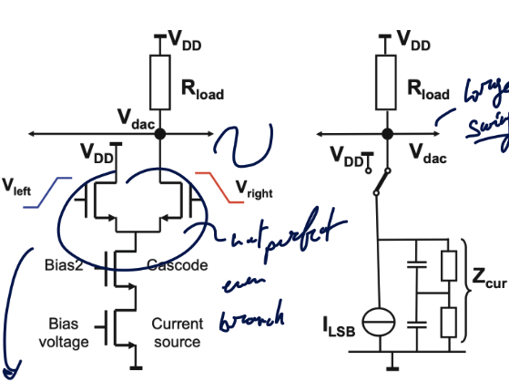

# Sample & Hold

This summary isn't a perfect 100$\%$ of the class, it is giving the
broad idea of the class without always going over all the details and
implementation.

## Introduction

Doing analog to digital conversion requires 2 type of discretization :

1.  [Time]{.underline} : sampling

2.  [Amplitude]{.underline} : quantization

<figure>

<figcaption>adc to dac
conversion</figcaption>
</figure>

::: wrapfigure
r0.5

::: center
{width="0.95\\linewidth"}
:::
:::

And of course, going from digital to analog requires to do some
amplitude restoration and holding the signal to make it continuous.
Important to understand that the digital values only make sense if we
have a sampling frequency and a reference voltage where
$111...111 = V_{ref}$. So the binary number represents a fraction of
this reference voltage.\
To sample this we are using a *Track and Hold* rather than a sample and
hold since it is not quite easy to sample (opening the switch for a
small small amount of time). Of course, this switch is implemented as a
MOS transistor where we can take advantage of its symmetry to either
charge or discharge the capacitance.\
If we want to have a *Sample and Hold* we can chain two track and hold
back to back using inverted clocks. But it can be quite tricky to have
such precision when designing the circuit.

#### Requirements

We want good *speed*, so short tracking period and have a high bandwidth
which implies to have a small $\tau$ (big switch, small cap). On the
other hand, for accuracy we want to have a low noise ($\frac{kT}{C}$) so
a big capacitance and low distortion so a linear switch. We can see this
is a major trade-off in T&H design.

## Non-idealities

### Noise

::: wrapfigure
r0.33

::: center
{width="0.95\\linewidth"}
:::
:::

We can represent the switch (implement as a transistor) with a resistor
that has an equivalent noise source $e_{noise}$. Depending on the
$C_{hold}$ value we will have various difference equivalent noise
voltages:

$$\begin{aligned}
    v_{C,noise}^2 &= \int_{f=0}^{f=\infty} \frac{4kTR df}{1 + (2\pi f)^2R^2C^2} = \frac{kT}{C}\\
    SNR &= \frac{P_{signal}}{P_{noise}} = \frac{A^2/2}{kT/C}
\end{aligned}$$

Where $A/\sqrt{2}$ represents the RMS amplitude of the signal. It is
interesting to notice how this noise is only present when we are having
the switch high so theoretically no noise should be present in the hold
phase.\
Hence, this noise is also sampled ! Even though it will be flat for any
frequency below Shannon and has a zero mean and variance of
$\sigma = kT/C$. This will create some *aliasing*. The noise PSD will
**increase** due to sampling since we will have some shorter bandwidth
(*check this*). $$\begin{aligned}
    S_{vv,RC} &= 4kTR = \frac{2kT}{\pi C f_{RC}} & S_{vv,s} &= \frac{2kT}{Cf_s}
\end{aligned}$$

What happens is the fact we have a noise density covering all possible
frequencies which gets sampled and so we have a stack up of noise which
is technically infinite. But since we have a capacitance and resistor
that samples the signal and noise this will act as a low pass filter and
will create some sorts of lobes. The **total sampled noise** is always
$kT/C$.\
The increase of noise spectral density depends on noise bandwidth and
this causes problem for high-resolution converters. It is not always
ideal to have a high bandwidth

### Jitter

It is a form of *statistical noise* and is due to noisy clock generator
which won't sample reliably and will sometimes happen slightly before or
after the \"*tick*\". Jitter can be deterministic which will result in
*tones* in the spectrum or distortion for signal-dependent jitter
(definition of what distortion is). We can find the result of $\sigma_t$
has on our sampled amplitude :

$$\begin{aligned}
    A(t) &= A sin(\omega t) & \sigma_A^2(nTs) &= \left(\frac{dA(nTs)}{dt}\right)^2 \sigma_t^2 = \omega^2A^2 cos^2(\omega nT_s)\sigma_t^2\\
    A(nT_s+\Delta t(t)) &= A sin(\omega (nT_s + \Delta t(t)) & \sigma_A^2 &= \frac{\omega^2 A^2 \sigma_t^2}{2}\\ 
    \Delta A(nT_s) &= \frac{d A sin(\omega t)}{dt} \Delta t(nT_s) & \Delta A(nT_s) &=  \omega A cos(\omega nT_S)\Delta t(nT_s) 
\end{aligned}$$

The jitter acts as a sort of ceiling, to fight against the thermal noise
we can simply increase the input voltage but at some point the SNR due
to noise and jitter are equal and the SNR of jitter is the limit since
it only depends on the frequency.

### Non fundamental error - Implementation error

#### Pedestal

Pedestal error is linked with the charges in the channel **and** the
parasitic cap $C_{ped}$ which goes from gate to source. There is some
charges that once the switch is closed will get injected or removed.\
One solution is the compensation circuit where we will use dummy
switches which will take those extra charges. This requires a duty cycle
of $50\%$ and precise clock to \"capturate\" those extra charges
precisely.

#### Droop

The charges put on $C_{hold}$ may go down with time especially with BJT
as the base will draw currents. It is linked with leakage :

$$V_{droop} = -\frac{I_{leak} T_{hold}}{C_{hold}}$$

#### Feedthrough

We also have a capacitance between the source and the drain which will
cause a small current to *feedtrhough*. One solution is to use
**t-switch** which helps to reduce the effect. In differential
implementations we can use some *cross-coupled always-off* switches.

#### Aperture Jitter

We won't have a perfect instantaneous rise so the logic 1 or logic 0 may
not appear exactly at the clock period.

## Capacitor and switch implementations

### Capacitors

In IC design we will mostly focus on **Metal-Insulator-Metal** (MIM)
capacitor which requires a special process and are linear. The other
type is the interconnect **MOM** which doesn't require a special
process. One key idea is to create the capacitance as high as possible
on the metal layers to get away from parasitic due to the wafer.\
We can also do some *vertical* MOM. This solution takes advantage of the
height of the metal stack but the lower end will me more susceptible to
parasitic and we use the other symbol of a capacitance.\
It is sometimes hard to model capacitance due to the fact we have
multiple field lines going and connecting with all the layers. So one
trick is to isolate each capacitance and shield each one of them. It
makes analysis much easier.

### Switches

The switch (NMOS or PMOS) has its own $R_{on}$ which is proportional to
$1/V_{in}$. We not only need a small enough resistor for good $\tau$ but
also a constant one to avoid distortion !

$$\begin{aligned}
R_{o n, N M O S} & =\frac{1}{(W / L)_N \beta_{N \square}\left(V_{D D}-V_{i n}-V_{T, N}\right)} &
R_{o n, P M O S} & =\frac{1}{(W / L)_P \beta_{P \square}\left(V_{i n}-\left|V_{T, P}\right|\right)}
\end{aligned}$$

One idea to reduce this $\propto V_{in}$ is to use **complementary
switches** so the NMOS and PMOS behavior will kinda cancel out. For this
to work we need sufficient $V_{DD}$ namely
$V_{DD} < V_{th,n} + |V_{th,p}|$. We can boost V using some
*Cockroft-Walton multiplier* or *Dickson multiplier*.

#### Bootstrapping

The idea behind bootstrapping is to keep the sample pulse and input
voltage constant which will result in constant $R_{on}$.

{#fig:enter-label
width="0.5\\linewidth"}

Here we don't need to use two transistor, we can just use one NMOS and
we get a high SNR for small $C_{hold}$. We keep the resistance constant
and we don't have any distortion.\
The main idea is to use a capacitance we charge to $V_{DD}$ in hold
phase and when the tracking phase come the $V_{in}$ is added on top of
the $V_{DD}$ that is stored on the cap making the $V_{gs} = V_{DD}$.\
Some challenges we can face are voltage limit across the gate, drain and
source. We also have a body diode which can create charge lost, latch-up
or even current to substrate.

{#fig:enter-label
width="0.75\\linewidth"}

We can also use a technique called *bottom-plate sampling*. [add more
info read a bit more about it]{style="color: red"}.

## Circuit topologies

### General considerations

We want to maintain the value on the capacitance, one solution is to use
buffered implementation. Buffered implementation will be more accurate
but we introduce a feedback system which inherently has delay thus some
maximum possible speed.\
We also need to keep in mind that when using a buffer (opamp) we will
have an extra *non-linear* capacitance in parallel with our hold
capacitance. So we need to pick the right hold capacitance to minimize
this extra non linear capacitance.\
We always need to keep in mind what is this designed use for, what is
the swing (rail-to-rail, buffer supply voltage above $V_{DD}$, \...).\
High-gain opamp requires a low settling error
$A_{DC} > \frac{1}{\epsilon} = 2^N$. The settling speed determnies
unity-gain frequency of a track and hold buffer. the UGF palys a big
role.

### Switched-capacitor T& H circuits

The most basic switched-cap implementation :

{#fig:basic-sc-label
width="1\\linewidth"}

In the *track phase* we first discharge $C_2$. The $S_1$ is
*bootstrapped* and $C_1$ is charged to $V_{in}$. We have some sampled
noise at $S_1$ and $S_2$. In the *hold phase*, the charge from $C_1$ are
moved to $C_2$ (charge recollection). We have
$V_{out}(t) = V_{in}(nT_S) \cdot C1/C2$.\
If we have *unity-gain signal* we will have a $H = C_2/(C_1+C_2) = 1/2$
if $C_1 = C_2$. The closed loop gain is $A_{cl} = 2$ so we will amplify
some unwanted signal. The setting time is determined by $1/2 \tau$.

### Flip-Around T&H

{#fig:flip-around-label
width="0.75\\linewidth"}

It will use a virtual ground to charge and discharge the cap. Here we
have a unity-gain feedback of 1 which is desirable. But this virtual
ground isn't perfect and so we will have some *offset*. But this offset
will actually be cancelled !

$$\begin{aligned}
    \text{Track mode : }& V_{C_{hold}} (nT_S) = V_{in}(nT_S) - V_{off} \\
    \text{Hold mode : }&  V_{out}((n+1/2)T_S) = V_{C_{hold}} (nT_S) + V_{off} = V_{in}(nT_S)
\end{aligned}$$

If we go in the z-domain to analyze this error we find :

$$\begin{aligned}
    V_{out,error} &= V_{off} (z) (1-z^{-0.5})\\
    H(f) &= 2 sin(\pi f/2f_s)
\end{aligned}$$

So it will suppress the offset and the noise at low-frequency. But the
high-frequency noise will be doubled and the sample noise on $C_{hold}$
is still present.

{#fig:amplifying-th-label
width="0.75\\linewidth"}

We can see some dangerous spikes on fig.
[1.5](#fig:amplifying-th-label){reference-type="ref"
reference="fig:amplifying-th-label"}. The noise can be found as follow :

$$\begin{aligned}
    v_{in,noise}^2 &= \frac{kT}{C_1+C_2} & v_{out,noise}^2 &= \frac{kT(C_1+C_2)}{C_2^2} + \text{noise OpAmp}
\end{aligned}$$

### Correlated double sampling

In sensors and and image sensor we want to get rid of those unwanted
component. Often, we will have 2 samples time where we will first get a
baseline then the actual signal we want to remove the offset component.

{#fig:double-correlated-label
width="0.75\\linewidth"}

$$\begin{aligned}
    |H(s)| &= |1 - e^{-sT_d}| = |e^{-sTd/2}| = |e^{-sT_d /2} 2 sin(sT_d /2) |\\
    |H(\omega)| &= |2sin(\omega T_d / 2)| = |2 sin(\pi f T_d)|
\end{aligned}$$

It will reject the low-frequency noise but will *amplify* by $1/2T_d$
the noise near *odd multiples*.

# Digital-to-Analog Conversion

We need to differentiate two different use cases of a
[dac]{acronym-label="dac" acronym-form="singular+short"} namely :

1.  [Convert to physical domain :]{.underline} when we need a *high
    quality* at every time instant. We need a minimum amount of power to
    be able to draw some current. For example a USB-C to jack adapter !

2.  [Generate reference value for an [adc]{acronym-label="adc"
    acronym-form="singular+short"} :]{.underline} typically needed in a
    SAR [adc]{acronym-label="adc" acronym-form="singular+short"}. We
    only need this conversion at some specific point in time and the
    drive capabilities are not exigent.

## Signal representations

-   [Straight binary:]{.underline} only positive signals

-   [Two's complement:]{.underline} easy addition and subtraction, zero
    signal at half reference (noisy!)

-   [Sign and magnitude:]{.underline} no noisy half reference values for
    zero signal, digital decoder needed, simple rounding results in
    cross-over distortion

-   [Gray coded:]{.underline} only one bit changes

::: {#tab:binary}
   **Straight binary**          **Two's complement**          **Sign+magnitude**          **Gray coded**  
  --------------------- ------ ---------------------- ------ -------------------- ------ ---------------- ------
           15            1111            7             0111           7            0111         15         1000
           14            1110            6             0110           6            0110         14         1001
           13            1101            5             0101           5            0101         13         1011
           12            1100            4             0100           4            0100         12         1010
           11            1011            3             0011           3            0011         11         1110
           10            1010            2             0010           2            0010         10         1111
            9            1001            1             0001           1            0001         9          1101
            8            1000            0             0000           0            0000         8          1100
            7            0111            -1            1111           0            1000         7          0100
            6            0110            -2            1110           -1           1001         6          0101
            5            0101            -3            1101           -2           1010         5          0111
            4            0100            -4            1100           -3           1011         4          0110
            3            0011            -5            1011           -4           1100         3          0010
            2            0010            -6            1010           -5           1101         2          0011
            1            0001            -7            1001           -6           1110         1          0001
            0            0000            -8            1000           -7           1111         0          0000

  : Binary Representations
:::

To represent those bits in hardware we can go either for the
*thermometer* or *binary* representation. In the thermometer
representation each cells are of the same size and to increase numbers
we need to increase the amount of cells on. It grantees
**monotonicity**. For the binary, they are not of equal size but has the
advantage to need $n$ for $n$ bits while it is $2^n$ cells for
thermometer. It is not guaranteed to be monotonic and the large switch
of cells can create glitches.\
We can also use *segmentation* to leverage from both type of
implementation.

::: {#tab:unary_vs_binary}
  **Architecture**                                                                            **Unary**                                                        **Binary**
  --------------------------------------------------------------------- ------------------------------------------------------ ---------------------------------------------------------------------------
  Monotonicity                                                                                By design                                                      Not guaranteed
  Number of elements                                                                        $\propto 2^N$                                                      $\propto N$
  Area, parasitics                                                                          $\propto 2^N$                                                      $\propto N$
  [inl]{acronym-label="inl" acronym-form="singular+short"} systematic                          Gradient                                                           Small
  [inl]{acronym-label="inl" acronym-form="singular+short"} random              $\propto \sigma_{element} \sqrt{2^N-1}$          Same with [dnl]{acronym-label="dnl" acronym-form="singular+short"} errors
  [dnl]{acronym-label="dnl" acronym-form="singular+short"} random                     $\propto \sigma_{element}$                            $\propto \sigma_{element} \sqrt{N, \dots, 2^N-1}$
  Switching energy                                                                         $\propto$ Signal                                            Can be large and non-linear
  Decoder complexity                                                                          $2^N$-to-1                                                         Simple
  Power                                                                  Choice for R, I, or C implementation dominates power  
  Noise                                                                            Similar for similar power levels            

  : Comparison between Unary and Binary Architectures
:::

We need to keep in mind that the [dnl]{acronym-label="dnl"
acronym-form="singular+short"} is the difference between one step to the
other and it must be lower than $1 LSB$. The [inl]{acronym-label="inl"
acronym-form="singular+short"} is the integrate error and so cumulate
the error. Those issues will lead to distortion and harmonics !

### Typical [inl]{acronym-label="inl" acronym-form="singular+short"} of Unary Architectures

Here we have $A_{lsb}$ that represents the minimum voltage we can add so
the minimum cell. To represents a number and it's unused counter part :

$$\begin{aligned}
    y_1 &= \sum_{i=0}^{m-1} A_{lsb}(i) \quad \mathbb{E}(y_1) = m A_{lsb} \quad \sigma_{y_1} = \sigma_{A_{lsb}} \sqrt{m}\\
    y_2 &= \sum_{i=m}^{2^N-1} A_{lsb}(i) \quad \mathbb{E}(y_2) = (2^N-m) A_{lsb} \quad \sigma_{y_2} = \sigma_{A_{lsb}} \sqrt{2^N -m}
\end{aligned}$$

To find the [inl]{acronym-label="inl" acronym-form="singular+short"} we
can use this formula **WHY THIS FORMULA I DON4T GET IT ???**

$$\begin{aligned}
    INL(m) &= \frac{2^N \sum_{i=0}^{m-1} A_{lsb}(i) }{\sum_{i=0}^{2^N - 1} A_{lsb}(i) } - m = \frac{2^N y_1}{y_1 + y_2}  - m\\
    \sigma_{INL}^2(m) &= \left(\frac{\partial INL(m)}{\partial y_1} \right)^2 \sigma_{y_1}^2 + \left(\frac{\partial INL(m)}{\partial y_2} \right)^2 \sigma_{y_2}^2\\
    &= \left( \frac{y_2}{(y_1+y_2)^2} \right)^2 m \sigma_{A_{lsb}}^2 + \left( \frac{-y_1}{(y_1+y_2)^2} \right)^2 (2^N-m) \sigma_{A_{lsb}}^2\\
    &= \frac{m(2^N - m)}{2^N} \frac{\sigma_{A_{lsb}}}{A_{lsb}^2}
\end{aligned}$$

#### Segmented cells

![Segmented [dnl]{acronym-label="dnl" acronym-form="singular+short"} and
[inl]{acronym-label="inl"
acronym-form="singular+short"}](img/segmented_DNL_INL.png){#fig:segmented-cell-label
width="0.75\\linewidth"}

The less binary scaled elements we have the stronger those jumps and
glitches will be. It may even lead to [dnl]{acronym-label="dnl"
acronym-form="singular+short"} being over $1$ LSB meaning we can't
guarantee monotonicity anymore this will result in missing code.

$$\sigma_{DNL, MSB} = (2^N -1) \frac{\sigma_{A_{lsb}}}{A_{lsb}}$$

::: {#tab:unary_binary_comparison}
                                                      **Unary**                                                                   **Binary**
  ------------------ --------------------------------------------------------------------------- ----------------------------------------------------------------------------
  Voltage                                          Resistor string                                                                   R-2R
                          *Flash [adc]{acronym-label="adc" acronym-form="singular+short"}*        *Low-performance [dac]{acronym-label="dac" acronym-form="singular+short"}*
  Current                                          Current matrix                                                             Current splitting
                      *High bandwidth [dac]{acronym-label="dac" acronym-form="singular+short"}*  
  Charge/capacitor                                 Capacitor bank                                                               Capacitor bank
                        *Low power [dac]{acronym-label="dac" acronym-form="singular+short"}*     
  Time                                         PWM, $\Sigma\Delta$ mod                                                      Limited by distortion
                      *Low bandwidth [dac]{acronym-label="dac" acronym-form="singular+short"}*   

  : Comparison of Unary and Binary Architectures,
  [dac]{acronym-label="dac" acronym-form="singular+short"} and
  [adc]{acronym-label="adc" acronym-form="singular+short"}
:::

## Digital-to-analog conversion

### Voltage domain

#### Resistor ladder

The simplest [dac]{acronym-label="dac" acronym-form="singular+short"} we
can think of is a **resistive ladder** where we use a thermometer code
based approach. We need $2^N$ resistors between $V_{ref+}$ and
$V_{ref-}$. We need a buffer to drive the load so we don't have some
currents that flow back into the resistive ladder which would cause some
monoticity and values change. This buffer op-amp isn't straightforward
as it needs to be a rail-to-rail op-amp.\
The equivalent input impedance seen by the input of the buffer is given
as :

$$R_{eq} (m) = \frac{\frac{m}{2^N} R_{tot} \cdot \frac{2^N-m}{2^N} R_{tot} }{\frac{m}{2^N} R_{tot} + \frac{2^N-m}{2^N} R_{tot}} = \frac{m(2^N-m)}{2^{N+1}} R_{tot}$$

We have a signal-dependent current delivery and the resistor is
parabolic. Due to the capacitive load we also have a signal-dependent
time constant. This lead to distortion at high frequencies.

$$\begin{aligned}
    V(m) &= \frac{m}{2^N} V_{ref} = \frac{mR}{mR + (2^N -m)R} V_{ref} = \frac{R_1}{R_1 + R_2} V_{ref}\\
    \sigma_{V}^2(m) &= \left( \frac{\partial V(m)}{\partial R_1} \right)^2 \sigma_{R_1}^2  + \left( \frac{\partial V(m)}{\partial R_2} \right)^2 \sigma_{R_2}^2 \\
    &= \left( \frac{R_2}{(R_1+R_2)^2} \right)^2 \sigma_{R_1}^2 V_{ref}^2  +  \left( \frac{-R_1}{(R_1+R_2)^2} \right)^2 \sigma_{R_2}^2 V_{ref}^2\\
    &= \frac{m(2^N -m)}{2^N} \frac{\sigma_R^2}{R^2} \frac{V_{ref}^2}{2^{2N}} =  \frac{m(2^N -m)}{2^N} \frac{\sigma_R^2}{R^2} V_{LSB}^2\\ 
    \sigma_{INL}^2 &= \frac{m(2^N- m)}{2^N} \frac{\sigma_R^2}{R^2}
\end{aligned}$$

**ADD MORE INFO**

#### R-2R ladder

{#fig:R-2R-label width="0.75\\linewidth"}

Here we are using a binary structure and we only need a $2N$ resistors.
It is not super precise since we have a lower and lower current flowing
in each branch which will be more susceptible to noise. The accuracy
depends on :

1.  [Offset voltage :]{.underline} non-ideal virtual ground and so we
    have some error in the current split.
    $V_{off} < \frac{I_{REF} R}{2^N}$.

2.  [Resistor matching :]{.underline} we need good matching or we will
    have large difference.

3.  [Switch resistance :]{.underline} the switch will add some $R_{on}$
    resistance so we need it to be small to have a small impact.

#### Segmented resistor ladder

{#fig:segmented-resistor-label
width="0.75\\linewidth"}

We will have a thermometer and binary part. It will improve the
precision. There is no current in sense path. The sense node is equal to
$V_{ref}$. We calibrate this offset voltage and we can also call it a
*kelvin contact* or *four-point sensing*.

### Current domain

Here instead of using resistor that will drive another resistor creating
a voltage that gets buffered, we will directly work with current source
that will drive a resistor which will have its voltage buffered. We can
either go for a thermometer or binary coded version :

![Buffered Current [dac]{acronym-label="dac"
acronym-form="singular+short"}](img/Buffered_Current_DAC.png){#fig:enter-label
width="0.65\\linewidth"}

We need to keep all current source on even if they are not used to avoid
*current dump*. The amplifier is sensing the current so we call it a
[tia]{acronym-label="tia" acronym-form="singular+short"}. We need a low
input impedance to limit the swing and low output one so we can drive
any type of load.

#### Symmetrical Buffered current-DAC

{#fig:sym-buffered-DAC-label
width="0.75\\linewidth"}

To avoid some important switching (on and off) due to the representation
of a number in signed format, we want to use a symmetrical one. Since
most of the signal will be around 0 often going positive and negative.
This configuration will reduce the 1/f and thermal noise. Here we need a
current sink and current source so a NMOS and PMOS network is required
(may be a designed constraint and we need to match PMOS and NMOS). We
only have the noise of the buffer for zero level. We will need some
calibration to manage a balance between NMOS and PMOS.

#### Buffer-less current-DAC

{#fig:BLC-DAC-label
width="0.75\\linewidth"}

Since we are not using a buffer, we have theoretically a larger
bandwidth since we are not limited by the spec of a
[tia]{acronym-label="tia" acronym-form="singular+short"}. But in life
there is always parasitic and so we will have a pole determined by the
output load impedance and capacitance. It is a good choice for
time-continuous signals with a matched impedance between $50-75\Omega$.

#### Segment current DAC

Based on the same idea of a buffer-less DAC we can use some current
source that are $2^a$ LSB and some binary based sources starting at 1.
This is segmenting and we use the thermometer for MSB part and the
binary for the LSB as they take less space. The biggest issue is when we
switch off binary section and we switch to the next unary source :

{width="0.95\\linewidth"}

We can also go further and add an extra rail to create current divider.
This third rail will *steer* unary current to current divider. The
divider can be unary or binary scaled but we will have large transition
error at the edge that will be reduced.

#### Matrix decoding

::: wrapfigure
r0.5 {width="1\\linewidth"}
:::

Usually in VLSI we will arrange thermometer current source in a matrix
format so we can simply and quickly access the current. But due to the
spreading of those current sources, we will accentuate some physical
phenomena such as *oxide thickness, power delivery drop, clock timing,
temperature, \...* which will make the current sources unequal.\
One technique to reduce this effect is presented on figure
[\[fig:centroid-layout-label\]](#fig:centroid-layout-label){reference-type="ref"
reference="fig:centroid-layout-label"}. We create symmetry in both
direction and we will get rid of any **linear gradient**. We can go even
further with some $Q^2$ walk and distributed subcell across the complete
array or even use some *randomize current cell* from one sample to the
next (more advanced).\
Some calibration we can make is **current source sorting** where we will
measure all of the cells and create a sort of pair where we trigger a
larger cell with a smaller one after. But we need a lot of
pre-processing and measurements and we need to create some special metal
routing over the cells which can deteriorate the performances even more.
We also need into account possible delay and timing issues, \...

#### Current cell implementation

::: wrapfigure
r0.5 {width="0.95\\linewidth"}
:::

We keep the current source on to avoid distortion and keep the power
consumption constant. The $V_{dac}$ will have considerable voltage
variation which will create distortion.\
Ideally the voltage drop is :

$$\begin{aligned}
    V_{DD} - V_{dac} &= \alpha 2^N I_{LSB} R_{load}\\
    I_{err} &= \alpha Z^N V_{dac} / |Z_{cur}|
\end{aligned}$$

But we have a real voltage drop of :

$$\begin{aligned}
    V_{DD} - V_{dac} &= R_{load} \left( \alpha 2^N I_{LSB} + \frac{\alpha 2^N V_{dac}}{|Z_{cur}|} \right)
\end{aligned}$$ $$\begin{aligned}
    V_{dac} &= \frac{V_{DD} - R_{load} \alpha 2^N I_{LSB}}{1 + \alpha 2^N R_{load} / |Z_{cur}|}\\
    &\approx (V_{DD} - R_{load} \alpha 2^N I_{LSB}) \left( 1- \frac{\alpha 2^N R_{load}}{|Z_{cur}|}  + \left( \frac{\alpha 2^N R_{load}}{|Z_{cur}|} \right)^2 \right)
\end{aligned}$$

We will have a HD3 with $((2^N R_{load})/(4|Z_{cur}|))^2$

#### Switch implementation

::: wrapfigure
r0.3 {width="0.9\\linewidth"}
:::

Switches are controlled by low-swing differential pulses to reduce
cross-talk and minimize the creation of an inversion charge. We need to
minimize the $V_B$ to have extremely accurate timing of switches. There
is some charge taken from or released in output node at every switching
event. Glitches are problematic for time-continuous output.\
Architecture of choice for most demanding applications. We have a
constant (high) power consumption and need a high-frequency clock and
decoding logic require significant power. Differential implementation to
cancel second-order distortion (big advantage). First-order relationship
between linearity and bandwidth.

### Charge domain

### Time domain

## Accuracy improvement methods

# Nyquist ADC

This chapter will focus essentially about the comparator and will only
cover some techniques applicable to Nyquist ADC.

## Comparator

## Comparator

### Requirements and operation principle

A good starting point is to first summarize what we will need for this
comparator block. Typically we want to measure and decide what an analog
value should be in digital. So we will have to go from mV to V and be
capable to be quite fast which means a good [bw]{acronym-label="bw"
acronym-form="singular+short"}. We have to be quite accurate while not
using too much power and be able to measure and transform a wide range
of signal. We must also ensure to always have a clear decision (no
metastability) and no memory effect. So quite challenging.

#### Limiting Amplifier

We could think of chaining multiple amplifier but this can be quite slow
and have some memory effect due to loss of inversion charge at output
stages.

$$V_{out}(t) = A^M V_{in}(t=0) \left[ 1 - e^{-t/\tau} \sum_{i=1}^{M} \frac{(t/\tau)^{i-1}}{(i-1)!} \right] \approx A^M V_{in}(t=0) \sum_{i=1}^{M} \frac{(t/\tau)^{i}}{(i-1)!}.$$

#### Latch behavior circuits

We can also have some circuit that have a small feedback path which will
create a hysterisis. It will first pre-amplify the small input signal
and the positive feedback stage is activated to regenerate the
still-small signal quickly.

{#fig:enter-label
width="0.75\\linewidth"}

### Non-idealities

### Comparator circuit examples

## Analog-to-digital converter topologies

## Conclusions

# Delta Sigma [adc]{acronym-label="adc" acronym-form="singular+short"}

## Basic principles

::: {#tab:my_label}
                              Term                             Definition
  ------------------------------------------------------------ ------------------------------------------------------------------------------------------------------------------------------------
                      Input sampling rate                      Frequency at which the analog input is sampled
                        Output data rate                       Frequency at which updated output words are available
                        Conversion gain                        Ratio of an output amplitude over the input amplitude
                           Bandwidth                           Frequency span in which the amplitude of an output sine is less then 3dB lower as the input amplitude, given a 1:1 conversion gain
    [snr]{acronym-label="snr" acronym-form="singular+short"}   //
   [enob]{acronym-label="enob" acronym-form="singular+short"}  Error free signal resolution $=(SNDR-1.76\text{ dB})/(6.02 \text{ dB})$

  : Quick recap of definitions
:::

All those values are important metric when specifying an
[adc]{acronym-label="adc" acronym-form="singular+short"} but they can be
misleading. We can trick the reader that we achieved exceptional result
with a mediocre implementation. In fact We could find a hugeeee
[snr]{acronym-label="snr" acronym-form="singular+short"} if we filter
the noise at the input 5 times lower than the nyquist frequency and then
claim a figure that is $\sqrt{5}$ better than what we would truly have.

### [fom]{acronym-label="fom" acronym-form="singular+short"}

There is two main type of [fom]{acronym-label="fom"
acronym-form="singular+short"} used for [adc]{acronym-label="adc"
acronym-form="singular+short"} :

1.  [Schreier :]{.underline} It is based on a theoretical idea and on
    information theory. We have a signal power and a maximum efficiency.
    It is based on the *fundamental tradeoff* between accuracy and
    bandwidth, noise and power. But a critique that can be made is the
    fact it only uses [snr]{acronym-label="snr"
    acronym-form="singular+short"} and not the
    [sndr]{acronym-label="sndr" acronym-form="singular+short"} which
    take into account more realistic issue. $$\begin{aligned}
        P_{sig,min} &= 8kT \cdot BW \cdot SNR & \text{Power efficiency} &= \frac{P_{circuit}}{P_{sig,min}} = \frac{P_{circuit}}{8kT \cdot BW \cdot SNR}\\
        FoM &= 10^{10} log\left( \frac{SNR\cdot BW}{P_{ADC}} \right) & &=SNR (dB) + 10^{10} log\left( \frac{BW}{P_{ADC}} \right)
        
    \end{aligned}$$\

2.  [Walden :]{.underline} It takes into account the
    [sndr]{acronym-label="sndr" acronym-form="singular+short"} and also
    use the bandwidth instead of only using the Nyquist frequency. So a
    more band limited [fom]{acronym-label="fom"
    acronym-form="singular+short"}. The [fom]{acronym-label="fom"
    acronym-form="singular+short"} is in Joule per conversion step.
    $$\begin{aligned}
            FoM &= \frac{Power}{2^{ENOB} \cdot min(2BW,f_s)}
        
    \end{aligned}$$

There is also an issue related to the actual power consumption. In most
paper, they are only taking into account the power at the input and not
of the full system. In a SAR [adc]{acronym-label="adc"
acronym-form="singular+short"} for example, $V_{in}$ will just control
some switches but not directly charge or discharge the cap. SAR ADC are
not that power efficient after all if we take into account the external
bench power supply that is required to let this ADC run.

#### Signal conditioning

Again from information theory, we can derive a relation with a
technological constant $C_T$.

$$\frac{speed (accuracy)^2}{power} = C_T$$

### Resolution

The resolution is the *smallest discrete step* a system can take. Watch
out ! resolution $\neq$ accuracy. We can have a granularity of 16 bits
but being unable to provide 16 bits of information (2 bits tied to
ground, \...).

$$resolution = \frac{\Delta I_R}{I_{max} - I_{min}} \cdot 100 \%$$

{#fig:conversion-chain-label
width="0.65\\linewidth"}

We first remove the alias, then sample it to go into discrete time. We
then quantize sampled data which will inevitably introduce quantization
error. Finally to reconstruct we will use a *decimation filter*. In a
Sigma-delta [adc]{acronym-label="adc" acronym-form="singular+short"} we
will use something called the [osr]{acronym-label="osr"
acronym-form="singular+short"} to improve this quantization noise.

$$OSR = \frac{\text{sampling freq } f_s}{\text{Nyquist freq } 2 f_m}$$

For the $n-$bit quantizer, it will introduce this infamous quantizer
error that have a seesaw patern up until the overload area where it can
no longer sample anything. This error is :

$$\begin{aligned}
    |V_{in}| &< x_{max} \quad |Q error| < \frac{\Delta}{2} & |V_{in}| &> x_{max} \quad \text{overload}
\end{aligned}$$

The quantization noise is a purely *mathematical model*, it is not
stochastic over time. It represents this transformation of a random
input signal into a random output error due to quantization.\
We can do the white noise approximation for fast varying signal where
the error is evenly distributed between $[-\Delta/2;\Delta/2]$ with a
pdf value of $1/\Delta$. We need no overload and need a change in input.

$$\begin{aligned}
    E(e_q) &= \frac{1}{\Delta I_R} \int_{-\frac{\Delta I_R}{2}}^{\frac{\Delta I_R}{2}} e de = 0 & \sigma_q^2&= \frac{1}{\Delta I_R} E((e_q-E(e_q))^2)\\
    & & &=\frac{1}{\Delta I_R} \int_{-\frac{\Delta I_R}{2}}^{\frac{\Delta I_R}{2}} e^2 de\\
    & & &= \frac{\Delta^2 I_R}{12}
\end{aligned}$$

The power is the *variance* of the signal, which is equivalent to
integrated noise. We only calculate the noise for a specific band.

$$\begin{aligned}
x_{\max} &= 2^B \frac{\Delta}{2} \frac{1}{k} \\ 
S &= y_{\text{rms}}^2 = (k x_{\text{rms}})^2 = k^2 \frac{x_{\max}^2}{2} \\ 
&= 2^{2B - 3} \Delta^2 \\ 
N &= \frac{\Delta^2}{12} \\ 
\Rightarrow SNR &= \frac{12}{8} 2^{2B} = \frac{3}{2} 2^{2B} = SNR_p = 1.76+6.02 B dB
\end{aligned}$$

By going over the sampling much more often we will spread this noise
leading to better SNR performance.

$$\begin{aligned}
N_q &= \int_{-\frac{f_s}{2}}^{\frac{f_s}{2}} S_e^2(f) |H_e^2(f)| |H_d^2(f)| \, df = \int_{-f_b}^{f_b} h_e^2(f) \, df = \frac{\Delta^2}{12} \frac{2 f_b}{f_s} \\
&= \frac{\Delta^2}{12 \, OSR}
\end{aligned}$$

$$\begin{aligned}
SNR_p &= \frac{3}{2} 2^{2B} OSR & SNR_p &= 1.76 + 6.02 B  + 10 log(OSR) \text{ } dB
\end{aligned}$$

The main idea being delta sigma [adc]{acronym-label="adc"
acronym-form="singular+short"} is to take advantage of previous error
and to integrate it (PI) to correct and go to better values. The *delta*
modulation comes from measuring the error and subtracting its output
from the input. The storing (integrating in continuous time) is the
principle of the *delta-sigma* modulation.

{#fig:delta-sigma-label
width="0.75\\linewidth"}

For the quantizer we can simply go for a comparator so $1$ or $-1$ and
this is inherently linear. This will give us a noise and signal transfer
function :

$$\begin{aligned}
STF &= \frac{y}{x} = \frac{G}{1 + GH} & NTF &=  \frac{y}{e} = \frac{1}{1 + GH} \\ 
&= \frac{k \frac{1}{z-1}}{1 + k \frac{1}{z-1}} & &= \frac{1}{1 + k \frac{1}{z-1}}\\ 
&= \frac{k z^{-1}}{1 - z^{-1} + k z-1} & &= \frac{z-1}{z+(k-1)} \\ 
&= z^{-1} \quad \text{for } k = 1
\end{aligned}$$

We can clearly see the different transfer function which is a key aspect
of delta sigma, it will do what we call *noise shaping*. To get the
continuous transfer function we can replace $z$ by $e^{j 2 \pi f/f_s}$.
Again to find the SNR we have :

$$\begin{aligned}
    N_Q &= \int_{-f_b}^{f_b} \frac{\Delta^2}{12 f_s} NTF^2 df = \frac{\Delta^2}{4} \left(\frac{\pi}{3} \right)^2 \left( \frac{1}{OSR} \right)^3\\
    S &= \frac{\Delta 2^B}{2\sqrt{2}}\\
    SNR_{dB} &= 10 \cdot log(S) - 10 \cdot log(N_Q) = 6.02B-3.41+30\cdot log(OSR)  \label{eq:snr-noise}
\end{aligned}$$

One major approximation that this formula relies on is the
$sin\left(\frac{2\pi}{OSR}\right) \approx \frac{2\pi}{OSR}$. So that's
why we need high [osr]{acronym-label="osr"
acronym-form="singular+short"} values or we won't take advantage of this
noise shaping.

### Second order Sigma Delta

{#fig:2-order-label
width="0.75\\linewidth"}

We can indeed have better noise shaping but we need to take into account
potential instability of this loop. We need to pick the right $b_1$ for
the job.

{#fig:equi-2-order-label
width="0.75\\linewidth"}

Again, we can reapeat a similar process as in equation
[\[eq:snr-noise\]](#eq:snr-noise){reference-type="ref"
reference="eq:snr-noise"} and have :

$$\begin{aligned}
    SNR &= 6.02B-11.1 +50\cdot log(OSR)\\
    SNR_n &= 6.02B- 10\cdot log \left( \frac{2\pi^{2n}}{3(2n+1)} \right) +10(2n+1)\cdot log(OSR)
\end{aligned}$$

We can also have other issues that will limit our
[enob]{acronym-label="enob" acronym-form="singular+short"}, typically we
can have third order distortion. But again, some paper will cheat and
move the $f_{in}$ as close as the cut-off frequency so the third order
distortion won't be seen.\
The main action of a delta sigma, is converting a signal into a
[pwm]{acronym-label="pwm" acronym-form="singular+short"} signal. But we
could also face some saturation where the width of the signal doesn't
reflect or mean any information. We need the amplitude to be lower as
the feedback voltage to avoid *overload*. Different order sigma delta
have some different overload criteria, we will try to spread this swing
to avoid overloading early stage integrator.

### Stability and Limit Cycle

We know it is a feedback system so having the wrong coefficients will
make an instable system. We can witness some *limit cycle* as starting
with some starting condition will evolve with the same trajectory. The
instability can be seen as a loop that will go towards infinity and
won't find stability. Usually, this will be limited by the supply range.

#### Pattern noise

There is a pattern in the ideal output at $f_s / 4$ and is called the
limit cycle. Cause of this, the quantization is no longer white and we
cannot longer do noise shaping. Dead zone in DC transfer function. We
can use some matlab models to check for stability.

**page 51**

$$\nabla \times \left( \frac{1}{\mu} (\nabla \times \mathbf{A}) \right) = \mathbf{J} + \epsilon \frac{\partial}{\partial t} \left( -\nabla \Phi - \frac{\partial \mathbf{A}}{\partial t} \right)$$
