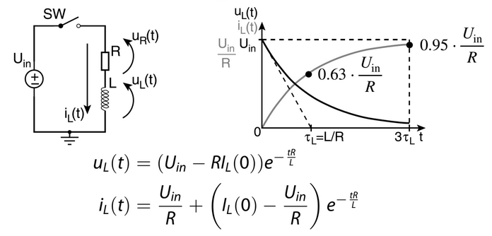

# Recap of questions per chapter

## S&H

| Q     | page | Q     | page |
| :---- | ---: | :---- | :--- |
| **1** |   19 | **2** | 31   |
| **3** |   44 |       |      |

## DAC

| Q     |  page | Q     | page |
| :---- | ----: | :---- | :--- |
| **4** | 16-17 | **5** | 28   |
| **6** |    36 |       |      |

## ADC

| Q      |  page | Q      | page |
| :----- | ----: | :----- | :--- |
| **7**  |  9-11 | **8**  | 38   |
| **9**  | 40-41 | **10** | 56   |
| **11** |    63 | **12** | 71   |
| **13** |    89 |        |      |

## $\Sigma - \Delta$

| Q      |     page | Q      | page  |
| :----- | -------: | :----- | :---- |
| **14** | 35,42,45 | **15** | 53    |
| **16** | 11,37,46 | **17** | 46-48 |
| **18** |    64-65 | **19** | 11,37 |
| **20** |       XX |        |       |

## Voltage ref

| Q      | page | Q      | page |
| :----- | ---: | :----- | :--- |
| **21** |   18 | **22** | 29   |

## Oscillator

| Q      |  page | Q      | page |
| :----- | ----: | :----- | :--- |
| **23** | 41-43 | **24** | 43   |
| **25** |    62 | **26** | 81   |
| **27** |    80 | **28** | 45   |

## Tuned Amplifiers

| Q      | page | Q      | page |
| :----- | ---: | :----- | :--- |
| **29** |   XX | **30** | 27   |
| **31** |   38 | **32** | XX   |

## DCDC

| Q      | page | Q      | page |
| :----- | ---: | :----- | :--- |
| **33** | 1:23 | **34** | 1:29 |
| **35** | 1:48 | **36** | 2:14 |
| **37** | 2:34 |        |      |

## Wireline

| Q      | page | Q      | page |
| :----- | ---: | :----- | :--- |
| **38** |   XX | **39** | 16   |
| **40** |   XX | **41** | XX   |
| **42** |   27 |        |      |

## Optical

| Q      |  page | Q      | page |
| :----- | ----: | :----- | :--- |
| **43** | 30-39 | **44** | XX   |
| **45** |    XX |        |      |

This section is based on the previous work of *Robin Geens* and *Sander Crols*. Sjouke and I added new questions and answered them partially. I used notebook LM on top of already answered questions to add more informations and verified its output.

# H05E3A - Exam Questions

Here is a comprehensive response to your query, drawing on the provided sources:

## Describe the pedestal step and a possible solution for the problem.

* **Pedestal Step and Solution:**
The **pedestal step** is a non-ideality observed in Sample and Hold (S&H) circuits, appearing as an **abrupt change in the output voltage ($V_{out}$)** during the transition from the sampling phase to the hold phase. This effect is visually represented as a sudden upward or downward jump in the $V_{out}$ waveform at the moment the input signal is sampled. It is primarily caused by **charge injection from the channel** and by **parasitic capacitance between the gate and output** from the switch as it turns off, specifically due to the switch's drain-capacitance and unintended coupling.

* A possible solution for pedestal step compensation involves using **half-sized dummy switches**. These dummy switches are designed to absorb the charge from the main switch, thereby reducing the unwanted pedestal step. For this method to work effectively, the charge must split approximately 50% between the main and dummy switches. However, the success of this compensation technique is critically dependent on the **careful timing of clock edges**. If there are unequal impedances on the left and right sides of the main switch, or if clock edges are too fast, it can lead to an unequal charge split, which will diminish the effectiveness of the compensation. Therefore, ensuring that the **impedances are as equal as possible** is crucial for optimal compensation.

## Discuss the need for bootstrapped switches in switched-capacitor circuits.

* The main issue is the fact that $R_{on} \propto 1/V_{gs}$. So by changing the input voltage we change the RC time constant and so it creates **DISTORTION** which is highly unwanted in TH circuits. Solution --> Keep it constant using **bootstrapping** aka keep a constant $V_{gs}$.
* So we need to keep $V_{gs}$ high to avoid any saturation. The higher the Vgs the smaller the R_on resistance. We first need to do a hold phase on the cap to charge it up to Vdd then in the track phase that input voltage is added on top of the cap.
* Challenges: make sure the body diodes do not open which will result in current to substrate, charge lost and latch-up !
* **Need for Bootstrapped Switches in Switched-Capacitor Circuits:**
Bootstrapped switches are important components in switched-capacitor (SC) circuits, particularly when **high accuracy** is required. In the context of Delta-Sigma converters, for example, they are specifically utilized **at high accuracies** to mitigate the effects of **clock feedthrough**. 

## Discuss offset and noise in the flip-around T/H circuit.

* With a regular T&H circuit, the signal transfer function should be 1. This means that the sampling capacitor should be equal to the feedback capacitor. This results in a feedback factor of 1/2, so a closed loop gain of two. 
* An alternative is the flip-around T&H, which uses no feedback capacitor. During both phases, the opamp is in unity gain feedback. The offset and low frequency noise are cancelled out, because they affect both the V_C_hold and the output voltage. The high frequency noise is amplified by a factor of two.
* The offset voltage cancels out because the opamp creates its own virtual ground in both phases. Noise transfer function from opamp input node to output. The sampled thermal noise on C_hold is still present.
* { width=75% }

##  Discuss the effect of the impedance variation in a resistor ladder in resistive DACs

* **Effect of Impedance Variation in Resistor Ladder DACs:**
In resistive Digital-to-Analog Converters (DACs) employing a resistor ladder, the output impedance exhibits a significant variation with the input code. This variation is characterized as a **parabolic function**. The equivalent resistance ($R_{eq}(m)$) can be calculated using the formula $R_{eq}(m) = \frac{m(2^N - m)}{2^{N+1}} R_{tot}$, where $m$ is the digital input code and $2^N$ is the total number of resistors. The maximum equivalent resistance, equal to $0.25 \cdot R_{tot}$, occurs at the midpoint of the digital range.

* This **parabolic variation of impedance** has several detrimental effects on the DAC's performance:
  *   It leads to **signal-dependent current delivery**, meaning the current supplied to the load changes non-linearly with the input signal. In other terms **DISTORTION**
  *   For a fixed capacitive load, the **time constant becomes signal-dependent**, which affects the settling behavior of the DAC output.
  *   Collectively, these signal-dependent characteristics introduce **distortion at high frequencies**, degrading the overall linearity and dynamic performance of the DAC.

##  Discuss the common-centroid layout in the framework of current-steering DACs.

* Current steering DAC can be unary or binary. Unary are preferred for MSB to avoid big current switch off and on and binary for LSB.
* Current steering DACs (unary) are very sensitive to mismatches. Instead of using matrix decoding, where all sources are placed sequentially (according to bit order) in a grid, issue:
  * Doping, oxide thickness not constant
  * PSS drop
  * Clock timing
  * Temperature
*  they can be placed according to a common-centroid layout. This layout is symmetrical in both dimensions. **Any linear gradient in the production process is cancelled** out by the fact that two opposing sources are used (vertical, horizontal and slant). The addressing of the sources is less straightforward than with matrix decoding. 
* To go even further, every current cell can be subdivided and distributed across the array with some $Q^2$ schemes which improve reliability against second order effect.

##  Describe the problem of stray capacitances in the design of capacitive DACs.

* **Problem of Stray Capacitances in Capacitive DACs:**
Stray capacitors are capacitance from the switches right next to the (binary scaled) capacitors. The stray capacitor at the left poses no problem (not added to output). The charge of the right one is added to the feedback capacitor, which means that the total charge transferred is no longer correct. The problem can be solved by using four switches per capacitor instead of two.
* In the charge phase, the first stray cap is charged but not the right one. The trick in the transfer phase is that the charged left cap will have both inputs connected to the same Vref- so it will discharge onto this. Thanks to the virtual ground of the opamp, the right cap will not be charged making the error 0.
* Right stray is never charged (thanks to virtual ground of the AMP) and left one will charge and discharge on itself

##  What limits the regeneration in a latch-based comparator, and how can it be improved?

* Comparators are difficult blocks as we need **High BW, high AMP, High Accuracy, Wide range, Low power** so latch helps with it thanks to a feedback loop but we need a David Goliath latch to still be able to change the value on it. Latch is better than cascade of amp as cascading amp is **SLOWWWWW** + Memory effect.
* 2 phase latch with first pre-amp and then latch behavior.
* **Limits to Regeneration in Latch-Based Comparators and Improvements:**
In a latch-based comparator, the regeneration process, where a small input difference is amplified to a full digital output, is characterized by an exponential growth of the differential voltage $V(t)$ across the latch outputs, given by $V(t) = \alpha V_{LSB} e^{+t/\tau}$. The regeneration speed is fundamentally determined by the **time constant $\tau = C/g_{m,l}$**, where $C$ is the parasitic capacitance at the output nodes and $g_{m,l}$ is the transconductance of the latch's gain stage. Pre amp --> $A_{pre} = \frac{g_{min}}{C} T_{pre}$

* The regeneration in a latch-based comparator is limited by three regimes based on the input differential voltage ($\Delta V_{in}$):
  *   **High $\Delta V_{in}$**: The regeneration time is limited by the inherent **propagation delay** of the latch circuit. --> Tech constant max speed
  *   **Medium $\Delta V_{in}$**: The comparator operates within the **exponential regime**, where the signal grows exponentially. --> Take a bit of time to get the result $\tau \approx 10 ps$.
  *   **Small $\Delta V_{in}$**: In this critical regime, **noise dominates the input**, leading to potential errors in the decision-making process. This is closely related to the phenomenon of **metastability**, where the comparator fails to produce a stable output within the required time, resulting in an ambiguous output. Metastability can lead to conversion errors in Analog-to-Digital Converters (ADCs).

* To improve regeneration performance and mitigate metastability errors:
  *   One can **reduce the effective number of bits (N)** in the converter, or conversely, **increase the sampling period ($T_s$)**, which effectively reduces the operating speed. --> longer Pre-amp stage to avoid the small $\Delta V_{in}$.
  *   Another approach is to **reduce the time constant $\tau$**. This can be achieved by decreasing the parasitic capacitance $C$ or increasing the transconductance $g_{m,l}$ of the latch (so higher power consumption, wider NMOS, weak inversion).
  *   While metastability is a critical issue for general comparators, in Delta-Sigma ($\Delta\Sigma$) converters, it is considered **"not an issue"** for the comparator itself because any comparator error will be shaped and subsequently filtered. However, it is essential to ensure that the digital bit fed to the decimation filter is the same as the one fed to the DAC, which typically requires placing a **synchronization latch**.

##  How can averaging improve the performance of a flash ADC?
    
* A flash Analog-to-Digital Converter (ADC) utilizes $2^N-1$ comparators to convert an analog input into an N-bit digital word. A major non-ideality in flash ADCs is **comparator offset**, which results in non-ideal thresholds and contributes to differential non-linearity (DNL) errors.

* While direct "averaging" of multiple comparator outputs for improved resolution or linearity is not explicitly described, the following related techniques are mentioned that contribute to better performance:
  *   **Auto-zeroing schemes**: These techniques are employed to **cancel comparator offset** and suppress both offset and low-frequency noise within individual comparators. This can be seen as a form of "temporal averaging" or correction within each comparator.
  *   **Comparator with Offset Cancellation**: An approach for open-loop comparator offset cancellation involves selecting a subset (e.g., "four-out-of-eight minimally sized input pairs") from multiple input pairs. While not explicitly stated as averaging their outputs, this selection process aims to achieve a more ideal performance by potentially averaging out random offsets across a pool of devices.
  *   **Majority voting**: In the context of Successive Approximation Register (SAR) ADCs, it's mentioned that **majority voting** can be used to mitigate **comparator noise**. While stated for SAR ADCs, the principle of using multiple decisions to reduce noise and errors could conceptually be applied to other ADC architectures like flash ADCs if multiple comparator outputs are available and processed.

* Offset of the comparators in a flash ADC can cause linearity problems and lead to DNL/INL. The effect of offset can be reduced by coupling the comparators so that multiple input pairs are used for every decision. This is done with resistive coupling, so that neighboring decisions influence each other. This helps because the signals at the outputs op the comparators add up linearly, but the offsets will add up with root mean square. The overall signal-to-offset ratio will thus increase. The comparator will ‘appear much larger’.
* More area needed, more power consumption.

##  Discuss the folding technique, its advantages, and challenges.
    
* In a folding circuit, multiple input pairs are cross coupled to ‘fold’ the linear input voltage of a regular comparator. This reduces the range, so less comparators are needed to convert the output of the folding circuit to bits. The conversion is divided into a coarse part (the folding itself, pre-processing) and a fine part (flash conversion of the folding output). This reduces the amount of input pairs: $2^3 + 2^5$ instead of $2^8$. One input pair of the folding circuit will be active (other ones saturated) and which pair will determine the MSB’s.
* The desired transfer curve of the folding circuit contains non-linearities in the peaks (**distortion at crossover points**). It is not possible to realize this in practice, so when the input voltage is in this range, it will be distorted. A solution to this is by using double the amount of input pairs in two folding circuits. Then we either **interpolate** those two folding circuits or take the one that is working in its **linear** region.
* There is some delay, and we need some good amplifier to realize the fine conversion.
* { width=75% }

## Advantages and Disadvantages of a 1.5-bit Pipeline Converter Compared to a 1-bit Pipeline Converter:

Pipeline converters break down the analog-to-digital conversion into multiple stages, each processing a certain number of bits. The comparison between 1-bit and 1.5-bit stages primarily revolves around trade-offs in speed, complexity, and accuracy.

**1-bit Pipeline Converter:**
* Straight forward, check if value is above or below $V_{ref}/2$, multiply by 2, next stage, repeat. If an error before, will ripple through the chain.
*   **Advantages:**
    *   **Maximum speed**: With its subrange limited to a single bit, it typically uses an amplifier with a 2x gain, which can achieve high conversion speeds.
    *   **Intrinsic linearity**: The 1-bit DAC in its feedback loop is inherently linear, contributing to the overall intrinsic N-bit precision of the converter. A 1-bit DAC is always perfectly linear, and time-domain converters leverage this for excellent linearity.
    *   **Simplicity**: Requires only a single comparator for its analog-to-digital conversion within each stage.
    *   The basic building block is a Multiplying Digital-to-Analog Converter (MDAC).
*   **Disadvantages:**
    *   **Delay**: The full digital value is available after N+3 clock periods, as each stage processes one bit sequentially. This delay, while exchanged for speed, can be problematic in feedback loops.
    *   Potentially more stages required for a given resolution compared to multi-bit stages, which could increase overall complexity and power (though per-stage power is low).
    *   **Good and accurate settling in all the stages**

**1.5-bit Pipeline Converter (a type of Multi-Bit MDAC Pipeline Converter):**
* Will have $\pm V_{ref}/4$ if 2 positive decision, subtract $V_{ref}$, 2 negative add $V_{ref}$ else do nothing.
* { width=75% }
* { width=75% }
*   **Advantages:**
    *   **More aggressive stage-scaling**: By processing more than one bit per stage (e.g., 1.5 bits, 2.5-4 bits), these converters allow for a reduction in the total number of stages required for a given resolution. This can lead to more compact designs.
    *   **Error Correction Margin**: Having more levels per stage (e.g., six segments for 2.5 bits) provides a margin to correct errors that might occur in the comparators.
    *   **Higher Overall Performance**: Can achieve higher effective number of bits (ENOB) at comparable or higher sample rates compared to purely 1-bit per stage designs, as seen in examples where 2.5-bit stages are used at the front-end followed by 1.5-bit stages.
*   **Disadvantages/Challenges:**
    *   **Slower amplifier settling**: Due to the higher gain required in multi-bit stages (e.g., 4x or 8x gain), the amplifiers need more time to settle accurately.
    *   **More complex DACs**: The first stage requires a multi-level DAC (e.g., a five-level DAC for a 2.5-bit stage) that must maintain the **full accuracy of the entire converter**. This multi-bit DAC is a critical component and its non-linearity due to mismatch can be a significant problem.
    *   **Increased Complexity for DAC Linearity**: Mismatch in multi-bit DACs can generate non-linearity errors. Techniques like **Data Weighted Averaging (DWA)** are used to make these errors noise-like so they can be filtered by oversampling, resulting in much lower harmonic distortion. This adds complexity to the digital processing.
    *   Offset is not removed and we hope that the redundancy will help. Or high-freq noise amplified
  
## Opamp Sharing Technique in Pipeline Converters

The opamp sharing technique in pipeline converters allows a single operational amplifier (opamp) to be used in two subsequent stages of the converter. This approach is implemented by adapting the Multiply-Digital-to-Analog Converter (MDAC) structure to share the opamp between channels.

The main advantage of this technique is a **significant reduction in power consumption, often by a factor of 2x**. However, this comes with certain trade-offs:
*   **Offset voltage is not compensated**. No auto-zeroing technique
*   It can introduce a **memory effect between subsequent samples**.
*   It is only feasible if the opamp is not required to create a virtual ground during its operation.

## Differences Between Top-Plate and Bottom-Plate Sampling

In the context of charge-redistribution converters, sampling involves connecting the input signal to a capacitor bank. The sources describe two primary methods:

**Top-Plate Sampling:**
*   **No attenuation of the sampled voltage** occurs.
*   However, it causes an **attenuation of the reference voltage**.
*   The Most Significant Bit (MSB) can be determined directly after sampling.

Problematic for high accuracy as not same attenuation between ref and input but faster.

**Bottom-Plate Sampling:**
*   This method results in **the same attenuation for both the input and reference voltages**.
*   A key advantage is that the **input voltage range can be made equal to the reference voltage range**.
*   A common-mode voltage (VCM) is employed to maintain the comparator input at the desired level.

Trickier setup with the common mode, will be slower but really good for high accuracy ADC. We have a precharge phase.

## Comparison of Dual-Slope Converter with a Straightforward Slope Converter

Both dual-slope converters and straightforward slope (or linear approximation/counting) converters belong to the category of linear search converters. They differ significantly in their operation and characteristics:

**Straightforward Slope (Linear Approximation/Counting) Converter:**
*   **Operation Principle:** The converter uses a counter to linearly increase the output of a Digital-to-Analog Converter (DAC). A comparator continuously compares this increasing DAC output (V_DAC) with the sampled input signal (V_signal). Once V_DAC exceeds V_signal, the comparator toggles, and the current counter value is stored as the digital output; the counter is then reset.
*   **Conversion Time:** The output is ready after **$2^N$ clock cycles**, where N is the number of bits. This is considerably slower compared to flash (1 clock cycle) or pipeline (N clock cycles) converters.
*   **Input Handling:** An input Sample & Hold (S/H) circuit is required to keep the input signal constant during the conversion period.
*   **Offset:** The comparator offset can be added to the digital output code. Usually we first convert known ref signal then measure actual signal and subtract both of them.
*   **Applications:** Often used in applications like image sensor readouts, where one ADC per column shares a DAC and counter. Small transistors in comparators in such applications can lead to offset and 1/f noise, necessitating correlated double sampling to measure a known reference and the signal, then digitally subtract the values. Can be used as a tracking converter with minimum changes.

**Dual-Slope Converter:**
*   **Operation Principle:** This converter operates in two distinct phases:
    1.  **Integration Phase:** The input signal is integrated for a fixed sample period.
    2.  **Discharge Phase:** The integrated capacitor is then discharged by a fixed reference current. The time taken for discharge is proportional to the integrated input signal, and this time is measured to determine the digital output.
*   **Conversion Time:** The conversion time is typically **$(2 \cdot 2^N)/f_s$**, making it suitable for slowly varying input signals.
*   **Offset Cancellation:** A significant advantage is that **offsets are cancelled** due to the two-phase operation, as the same integrator and comparator are used for both the input signal and the reference current. This is an example of a "zero-crossing method" where linearity is primarily required around the zero level.
*   **Linearity:** Linearity is only required around the zero level for the comparison, as the unknown signal is determined by comparing it to an equivalent signal from the DAC.

## Why are 1st order or higher-order single-loop sigma-delta topologies not advised?

Higher order loops are not inherently stable. Every low pass filter adds a ninety-degree phase shift which means that anything above second order can become unstable. Need a precise $b_1$ to counter balance and stabilize the loop.

{ width=75% }

Stability can be shown with the limit cycle and we see that it shouldn't spiral out. If it spirals out, it will get limited by PSS and so create **distortion**.

In the derivation of the sigma delta converter, we assumed a white noise distribution. This assumption is not correct for first order $\Sigma - \Delta$ converters. There is a lot of clicking and **pattern noise** because of deterministic quantization noise. This creates a **dead zone** in the DC function that spans 2 - 3 bits. Noise shaping doesn't work anymore

In higher order topologies, the intermediate signals must become smaller to limit signal swing after the next integrator. This means that the SNR ratio is inherently reduced. (not a problem in feedforward topologies) Furthermore, higher order topologies are unstable for certain combinations of filter coefficients. This makes the implementation very difficult. Truly dependent of the implementation and precision of the weights.

If there is an interest in increasing the order of a $\Sigma - \Delta$ converter, MASH converters are advised that cascade multiple lower order modulators and will decorrelate noise from its signal without becoming more unstable(n 1st order loops, instead of 1 n^th order loop)

## Explain the principle of data-weighted averaging.

**Data-Weighted Averaging (DWA)** is a noise shaping technique used in oversampling applications. Its main idea is to **modulate the error**. In a multi-bit Digital-to-Analog Converter (DAC) within the feedback path of a Delta-Sigma converter, mismatch between DAC elements can generate non-linearity errors.

While simple offset errors can be easily "chopped" (a modulation technique) and filtered by the zeros in the decimation filter, the errors caused by mismatch in multi-bit DACs are signal-dependent, leading to distortion. DWA addresses this problem by making these signal-dependent errors **noise-like**, allowing the oversampling process to filter them off.

DWA will cycle through the cells and so will smooth out the error, it will transform the distortion into an equivalent white noise pattern. It is the same idea as for SD

## Discuss the advantages and disadvantages of single-bit and multi-bit sigma-delta converters.

Using a higher order (stability problems with classical topology so use cascade) or using multi-bit DACs in the feedback path. 

**Single-bit Sigma-Delta Converters:**
*   **Advantage:** A 1-bit DAC (Digital-to-Analog Converter) is **inherently linear**. This eliminates non-linearity errors that can arise from element mismatch in multi-bit DACs in the feedback path.

**Multi-bit Sigma-Delta Converters:**
*   **Advantages:**  indicating high performance in these areas, especially compared to "Single Loop" and "Cascade". Multi-bit converters, particularly Delta-Sigma converters with low Over-Sampling Ratio (OSR), are considered suitable for "High-Resolution High-Speed AD converters".
*   **Disadvantage:** The main problem with multi-bit Delta-Sigma converters is the **linearity of the multi-bit DAC in the feedback path**. Mismatch between the individual DAC elements will generate non-linearity errors. Techniques like Data-Weighted Averaging (DWA) are employed to mitigate this issue by making the signal-dependent error noise-like so it can be filtered out by oversampling. Typically we need a DAC in the return which was not needed in 1-bit ADC !
*   **Solutions:** can use chopping, dynamic element matching. Offset is okay if we can one time add it then remove it so on average it is null and can be seen as a noise that the OSR nature of SD will take care of.

## Explain limit cycles in delta-sigma converters. Why do we need them but why do we want them to be random?

*   **The problem:** If there is **no noise** and the input signal to a Delta-Sigma converter is a "static" or near-DC signal, the "white noise approximation" for quantization does not hold up, and oversampling alone does not help in noise reduction. In such cases, the quantization error might become correlated with the input, leading to **predictable, undesired tones or patterns in the output spectrum** instead of spread-out noise. This is what is typically referred to as **limit cycles or idle tones**. Also they should be stable and non-repetitive to avoid distortion.

*   **The solution/why we want them random:** If they are not random, they will lead to a 2-3 bits LSB blindness. To overcome this limitation, the system needs to "store the error and add it to the previous sample". More broadly, the idea is to ensure that the quantization error is random and wideband, so it can be shaped and filtered.

## Describe CIC decimation filters and their latency when used in an incremental converter.

A CIC (Cascaded Integrator-Comb) filter is a simple (only additions/subtractions!) and efficient decimation filter used in SD converters. It consists of integrator stages followed by comb (differentiator) stages and acts like a low-pass sinc filter to remove out-of-band quantization noise while reducing the sample rate.
$$T_{\text{avg}} = \left( \frac{1}{M} \frac{1 - z^{-M}}{1 - z^{-1}} \right)^{n} \\ = \frac{1}{M} \left( \frac{1}{1 - z^{-1}} \right)^{n} \left( \frac{1 - z^{-M}}{1} \right)^{n}$$

{ width=75% }

In incremental sigma-delta converters, which operate over short measurement windows, CIC filters are still used for decimation, but their latency matters. The output becomes valid only after the full integration and comb operation is complete, resulting in a latency of roughly
$$ (n+2) \cdot OSR \cdot 2\cdot  T_s=latency \quad [time]$$

Where n is the number of stages. The factor 2 comes from one cycle for integration, and one cycle for differentiation. Per sample an integration and decimation is needed. It is based on the sinc function which in frequency domain is an ideal brick wall filter. The idea is to combinate integrator and differentiator.

##  What is the advantage of oversampling sigma-delta techniques for the design of the anti-alias filters? What is the difference between discrete and continuous time DS converters?

* **Advantage of oversampling for anti-alias filters:** In Delta-Sigma converters, **oversampling** is a fundamental principle that allows the quantization noise to be spread over a wider frequency band. This noise is then shaped, meaning it's pushed out of the desired signal band. The "loop filter" within the Delta-Sigma modulator helps in this noise shaping. As a result, the demanding requirements on the **anti-alias filter** are relaxed. For example, a **continuous-time Delta-Sigma converter itself can function as an anti-alias filter**, which also helps in saving power. This is because the oversampling and noise shaping inherently provide significant attenuation for out-of-band signals, reducing the need for a steep, high-order external analog anti-alias filter.

    When no oversampling is used, the input signal should not have frequencies larger than $f_s/2$. Otherwise, the higher frequency components will be folded on top of the lower ones when the signal is sampled, which results in aliasing. This LPF should ideally be a perfect brick-wall filter with a cutoff frequency of $f_s/2$. This is not possible to realize in practice. 

    With an oversampling converter, the sampling happens at a higher frequency than the Nyquist frequency. Frequency components (a bit) higher than Nyquist frequency will not result in aliasing. This relaxes the requirements of the analog low-pass filter while spreading out the noise quantity. The converted digital signal will be down sampled to return to the Nyquist frequency, and this might result in aliasing if the signal is not properly filtered first. But this filtering operation can be done in the digital domain, which is easier.

    In continuous-time converters, the loop filter runs continuously using resistors, capacitors, and amplifiers. This gives a natural anti-aliasing effect without extra filtering stages and saves power, but comes with drawbacks: it’s more sensitive to clock jitter, component variation (like resistor mismatch), and offers less flexibility for tuning or reconfiguration.

    *   **Difference between discrete and continuous time DS converters:**
        *   The sources implicitly differentiate between discrete and continuous-time Delta-Sigma (DS) converters.
        *   A **continuous-time Delta-Sigma converter** has the advantage that its loop filter **can also function as an anti-alias filter**, potentially saving power. However, it is susceptible to clock jitter, which can add noise, and the use of resistors for feedback (to combat jitter) can lead to wide variations over different process corners and a less **flexible architecture**.
        * **CHECK LECTURE CAUSE I AM PRETTY SURE HE SAID SOMETHING**

## What happens if, instead of a lowpass filter, a bandpass filter is used as noise shaping filter in a sigma-delta ADC?
    
If a **bandpass filter** is used as the noise shaping filter (also referred to as the "loop filter") in a Delta-Sigma ADC, the system becomes a **bandpass delta-sigma converter**. This means that instead of pushing the quantization noise to high frequencies (as a low-pass noise shaping filter does), the noise is shaped and moved away from a specific central frequency band, concentrating the signal within that band. An advantage of this approach is that **demodulation can be done directly on the bitstream in the digital domain** using simple operations like multiplication by +1 or -1. This implies that a bandpass Delta-Sigma ADC is suitable for signals that are already modulated around a carrier frequency, removing the need for a separate mixer.

{ width=75% }

## Schematic of a Low Voltage Bandgap with Folded Resistors

{ width=75% }

The sources present a schematic for a low voltage bandgap reference which incorporates "folded resistors" and sums proportional to absolute temperature (PTAT) and complementary to absolute temperature (CTAT) components in the current domain. This design addresses the challenge of implementing a 1.2V silicon bandgap in a 1.2V technology, such as 65nm.

The circuit shown (identified as a "Static Start-up circuit" but also appearing as the core bandgap circuit) consists of:
*   **Bipolar Junction Transistors (BJTs) Q1 and Q2:** These generate the temperature-dependent voltages. Q1 has a scaling factor of `<1>` and Q2 has a factor of `<1: N>`, indicating that Q2 is N times larger than Q1, or that N unit transistors are used for Q2. The difference in their base-emitter voltages, $\Delta V_{BE}$, is proportional to absolute temperature (PTAT).
*   **Resistors R1 and R2:** R1 is used to generate the PTAT current. R2 generates a current that is complementary to absolute temperature (CTAT), as it is connected in series with Q1, whose $V_{BE}$ exhibits a negative temperature coefficient.
*   **Operational Amplifier (OpAmp):** The OpAmp forces the voltage at its two input terminals to be equal. In this circuit, one input is connected to the collector of MP1 and the other to a node between R1 and the emitter of Q2.
*   **PMOS Transistors MP1 and MP2:** These act as current mirrors. MP1 mirrors a current derived from Q1 and R2, while MP2 receives current from the node where R1, Q2, and the OpAmp's negative input connect.

**Current Generation and Summation:**
The circuit operates by generating two primary currents:
*   **$I_{CTAT}$ (Complementary To Absolute Temperature):** This current is defined as $I_{CTAT} = \frac{V_{BE1}}{R_2}$. Since $V_{BE}$ decreases with increasing temperature, $I_{CTAT}$ will also decrease with increasing temperature.
*   **$I_{PTAT}$ (Proportional To Absolute Temperature):** This current is defined as $I_{PTAT} = \frac{\Delta V_{BE}}{R_1}$. The difference in base-emitter voltages ($\Delta V_{BE}$) between Q1 and Q2, due to their emitter area ratio, is proportional to absolute temperature. Thus, $I_{PTAT}$ increases with increasing temperature.

The design "is adding ptat and ctat in the current domain". The total output current, $I_{OUT}$, is the sum of these two currents: $I_{OUT} = \frac{V_{BE1}}{R_2} + \frac{\Delta V_{BE}}{R_1}$. By appropriately sizing R1, R2, and the BJT area ratio (N), these two temperature-dependent currents can be made to cancel each other's temperature dependency, resulting in a temperature-independent output current.

The "folding of resistors" is mentioned as a technique similar to that used in folded cascode operational transconductance amplifiers (OTAs). This technique can allow the circuit to operate with a lower supply voltage (e.g., $V_{DD} < 1V$ for CMOS bandgaps), as it reduces the required voltage headroom by allowing different parts of the circuit to operate at different voltage levels without stacking them directly.

Finally, a temperature-independent reference voltage, $V_{ref}$, is generated by passing the stable $I_{OUT}$ through an additional resistor R3: $V_{ref} = R_3 I_{OUT}$. If R2 and R3 are designed as multiples of R1 (i.e., $R_2 = n_2 R_1$ and $R_3 = n_3 R_1$), the reference voltage can be expressed as 
$$V_{ref} = V_{BE1} \frac{n_3}{n_2} + \Delta V_{BE} n_3$$

## Why are Voltage References More Accurate than Current References?

*   **Voltage References (Vref):** Bandgap voltage references are described as being based on a "physical constant," which contributes to their high accuracy. The silicon bandgap voltage is approximately 1.2V. This inherent physical property provides a robust and predictable reference. While factors like matching, ratio accuracy, and curvature correction (to linearize temperature dependence) are important design considerations, the core reference relies on a fundamental material constant. We can match the CTAT with the PTAT making it reliable. Moreover, the resistance do not really matter, we keep them unit and enhance the matching like this.

*   **Current References (Iref):** In contrast, current references are stated to be "Based on Vref and R". The crucial distinction is that they have "No physical parameter" directly underlying their value, leading to "limited accuracy". While current references also involve considerations such as matching, ratio accuracy, and curvature correction, their ultimate stability and accuracy are inherently tied to the stability and accuracy of the voltage reference they are derived from, as well as the precision of the resistor used. Resistive elements can have variations in their sheet resistance (e.g., Poly, p+, p-well resistors have absolute tolerances of 30%, 22%, and 66% respectively) and temperature coefficients (e.g., 0.2, 0.4, and 2 for the temperature exponent $\alpha$ in $R=R_{300}(T/300)^\alpha$). These variations can directly impact the accuracy of a current reference that relies on them. Accuracy of current source can be as low as $\pm 35 \%$.

In summary, bandgap voltage references leverage a fundamental and stable physical property of silicon, making them inherently more accurate. Current references, however, are typically *derived* from a voltage reference and a resistor, introducing additional dependencies and potential inaccuracies from the resistor's characteristics.

## Why do we need an amplitude control loop in the design of a Xtal oscillator?

An amplitude control loop is crucial in the design of a Crystal (Xtal) oscillator due to significant variations that can occur during the production process. When designing a Xtal oscillator under nominal conditions, there can be **huge variations in production**, specifically:
*   +/- 20% in capacitance.
*   +/- 20% in transconductance (gm).

These production variations can lead to several problematic conditions for the oscillator:
*   The oscillator may **fail to start up**.
*   The **drive power might exceed the rated limits of the crystal**, potentially causing lifetime issues for the crystal.

To mitigate these issues, especially when considering performance variations "over corners" (referring to different operating conditions and manufacturing variations), an amplitude control loop must be implemented. This ensures that the **amplitude is regulated**, preventing excessive power consumption and crystal damage while guaranteeing reliable startup. Without it, if the transconductance (gm) is too high (gm > gm_opt), more power is consumed to compensate for Rs, and if gm exceeds a certain critical value (gm > gmA), the amplitude will grow until the average gm drops back to gmA, which can lead to **distortion due to non-linear behavior**.

## Describe the design of a Pierce oscillator.

The sources outline key considerations for designing a **Crystal (Xtal) oscillator**, which commonly refers to a Pierce oscillator configuration, as indicated by the typical circuit diagram. The design process involves balancing several factors to ensure stable oscillation and desired performance.

A Pierce oscillator, unlike a Colpitts or Santos oscillator, has its reference compared to GND. One great advantage of a Pierce oscillator is that its easily replaceable in case of defect. 

**Key design parameters and considerations:**
*   **Crystal parameters:** Start with the specific parameters of the crystal, including its series resonance frequency (fs), parallel resonance frequency (fp), series resistance (Rs), and parallel capacitance (Cp).
*   **Capacitor selection:**
    *   **C3:** This capacitor should be chosen to be greater than the crystal's parallel capacitance (Cp), approximately 1 pF higher, to accommodate parasitic capacitances.
    *   **C1 and C2:** These capacitors should be larger than C3 (C1, C2 > C3) to achieve a **low pulling factor**. The pulling factor determines how much the oscillation frequency can be shifted by varying the load capacitance. However, there's a trade-off: larger C1 and C2 also lead to higher drive power, so their values must be limited. It's also important to account for parasitic capacitances from external pins, which can be at least 10 pF.
*   **Resonance type:** The goal is to achieve **series resonance**.
*   **Transconductance (gm):**
    *   Calculate the **minimum required gm (gmA), also referred to as gm_crit**, to ensure oscillation. If gm is less than gmA, no oscillation will occur.
    *   For reliable startup margin, it is recommended to use a gm value that is **10 times gmA**. It will make the Xtal start at the left side up of the circle.
*   **Bias and Amplitude:**
    *   **Vgs-VT:** This voltage is determined based on the acceptable distortion, phase noise (lower swing typically increases phase noise due to the post-amplifier but less distortion), and the desired drive level.
    *   **Ibias:** Calculate the bias current based on the chosen Vgs-VT.
    *   **Amplitude Control Loop:** add it if missing specs in one of the corners.

## How to create a ring oscillator with a quadrature output?

A standard ring oscillator typically consists of an odd number of inverters connected in a loop, which produces a single oscillating output. To create a ring oscillator with a **quadrature output (90-degree phase difference)**, use **differential amplifiers** instead of simple inverters.

Here's how it works:
*   Instead of standard inverters, use **differential inverting amplifiers** as the stages of the ring oscillator.
*   By **cross-coupling** the outputs from one stage to the inputs of a subsequent stage in a specific way, it becomes possible to use an **even number of amplifier stages**. This setup inherently allows for the generation of signals that are 90 degrees out of phase, thus providing quadrature outputs.
*   Differential inverting amplifiers also offer advantages such as **high Power Supply Rejection Ratio (PSRR)** and **high Common Mode Rejection Ratio (CMRR)**. Using amplifiers with **low gain can help to smoothen the edges of the output signal, leading to lower distortion**. We must use the **Maneatis cell** with $A= \frac{g_{m,n}}{g_{m,p}}$.

{ width=50% }

## Why doesn’t the noise of the VCO contribute to the output phase noise at low offset? Can you make a connection with other parts of the course?

In a Phase-Locked Loop (PLL) system, the Voltage Controlled Oscillator (VCO) noise does not significantly contribute to the output phase noise at low offset frequencies *within the loop bandwidth* because of the **filtering action of the PLL's loop filter**.

A PLL typically consists of a Phase Detector, a Charge Pump, a Loop Filter, and a VCO. The loop filter, often incorporating a charge pump and a capacitor, provides an integrating function (1/s). When combined with the integrating characteristic of the VCO itself (which translates a control voltage into a frequency, and thus integrates frequency deviations to produce phase, leading to another 1/s in the phase domain), the overall open-loop transfer function can have an s-squared term (1/s^2), which is important for stability.

The **loop bandwidth** (e.g., 35 kHz for an integrated loop filter) defines the range of frequencies over which the PLL effectively tracks the reference signal. Inside this bandwidth, the loop acts as a **low-pass filter for the reference noise** and a **high-pass filter for the VCO's intrinsic noise**. Therefore, at low offset frequencies (i.e., within the loop bandwidth), the **phase noise of the reference signal** dominates the output phase noise, while the **VCO's own noise is suppressed** by the feedback action. Conversely, outside the loop bandwidth, the VCO's noise contributions become more significant because the loop can no longer track and suppress them effectively.

Inside a PLL’s loop bandwidth, any VCO phase jitter is fed back and corrected against the clean reference, so it never makes it to the output at small offsets. It’s exactly the same concept as in a sigma-delta converter’s feedback loop: the loop filter suppresses (or “shapes away”) the VCO’s low-frequency noise, just as a $\Sigma - \Delta$ loop pushes quantization noise out of the signal band. In both cases, the feedback action thwarts the oscillator’s own noise where it matters most

## Explain the operating principle of a fractional-N PLL.

The prescaler is a digital building block, which makes it very accurate. The prescaler divides the frequency of the VCO, which means that the PLL can work at a higher frequency while being able to generate low frequencies needed for the application (eg the GSM spacing of 200kHz). This way, the LPF does not need to have an extremely low 3dB-point. A simple register is a prescaler that divides everything by 2. But, we can make some modulus pre-scaler that can also divide by 3 or 2 depending on a selection signal.

fractional-N
The fractional-N prescaler can generate a continuous spectrum of frequencies between (f_in / N) and (f_in / (N+1)) **Dual modulus pre-scaler** by switching between the two frequency divisions (by changing the duty cycle).  The problem in this approach is that the output contains low-frequency spurious tones, which are not filtered out by the LPF. As a result, the output of the phase detector is not constant.

Solution 1: gain adjustment
Make the output of the phase detector constant by adding the difference. This is predetermined, since the states of the fractional-N divider are known. The gain is frequency dependent and is sensitive to variations in the frequency of the supply. 

Solution2: sigma-delta
Randomize which frequency (N or N+1) is chosen instead of a fixed duty cycle. This can be done using a sigma delta converter. This approach shifts the spurious tones to higher frequencies, so they can be filtered out by the LPF.
Implementation
Using TSPC logic so only one clock phase is needed.

## Discuss the sizing of the biasing transistors in a relaxation oscillator. Explain why a capacitor at the drain of the bias transistor can degrade the duty cycle.

{ width=50% }

$$f = \frac{1}{RC + \tau_{comp}}$$

Here the noise will create jitter as a small noise may trigger the discharge a bit too soon or too late.

R is set majoritarily by the R of the NMOS transistor. If the bias is constant, the R should also remain constant making the operation running at a constant frequency. $\tau_{comp}$ appears du to process variation and temperature stability issues that can offset our values. Can do n plus and p plus poly to compensate for temperature but uncorrelated process rip so process variation.

Need a small R switch for a fast discharging! Add hysterisis to avoid a small variation around $V_{ref}$ would be problematic otherwise. Make circuit differential to help it. Steeper is the curve less noise so less jitter sensitive it is.

Where R is set by the transistor. If the current in the transistor remains very constant, the frequency will stay constant. The parasitic $C_{drain}$ will prolong the loading time of the relaxation oscillator when in parallel with $C_{osc}$. This will cause a longer waiting period in a differential topology and therefore will either increase or decrease the duty cycle in a constant manner.

## What is a conduction angle? Make a connection between efficiency and distortion for all classes of power amplifiers seen in the course.

A **conduction angle** is a metric that describes the fraction of a period during which an active device in a power amplifier conducts current. It is expressed as an angle, where a full period of conduction corresponds to a 360° conduction angle.

| Class | Conduction Angle                                                                                                                 | Efficiency                                                                                                                                                                                                                                                                                          | Distortion                                                                                                                                                                                                                                                                                                                                                                                                      |
| :-------------------- | :------------------------------------------------------------------------------------------------------------------------------- | :-------------------------------------------------------------------------------------------------------------------------------------------------------------------------------------------------------------------------------------------------------------------------------------------------- | :-------------------------------------------------------------------------------------------------------------------------------------------------------------------------------------------------------------------------------------------------------------------------------------------------------------------------------------------------------------------------------------------------------------- |
| **A**           | Conducts for a **full period**, equating to a **360°** conduction angle.                                                         | Efficiency is theoretically limited to $\le$ **50%**, with normal operating efficiency typically $\le$ **25%**. This is due to its linear topology. A characteristic is that the bias current ($I_B$) is often much greater than the maximum load current ($I_{max}$), leading to lower efficiency. | **Can** exhibit **distortion** when the MOSFET is pushed into different operating regions, especially with limited gain. The continuous conduction (as seen in its output voltage (V) and current (uA) waveforms) does not inherently prevent distortion if the operating point is not carefully managed. On average, has **low distortion**.                                                                   |
| **B**           | Conducts for **half of the period**, specifically a **180°** conduction angle. Ideally, there is no DC bias current ($I_B = 0$). | Has a maximum theoretical efficiency of **$\pi/4$**, which is approximately **78%**. This class often uses push-pull topologies to increase output power ($P_{out}$).                                                                                                                               | Is prone to **cross-over distortion**, also known as a "dead zone". This distortion occurs because each active device only conducts for half of the signal cycle, resulting in a *brief period where neither device is fully active during the signal transition*. A transient response plot for Class B clearly illustrates this dead zone in the current waveforms, causing distortion in the output voltage. |
| **AB**          | The conduction angle is set **between 180° and 360°**.                                                                           | Represents a **trade-off** between efficiency and distortion. The efficiency will be less than Class B but greater than Class A.                                                                                                                                                                    | It is designed to **reduce or eliminate cross-over distortion** present in Class B amplifiers. This is achieved by allowing a small amount of current to flow even in the absence of an input signal (quiescent current), which keeps both output devices slightly "on" during the signal transitions.                                                                                                          |
| **C**           | The conduction angle is **less than 180°**.                                                                                      | Higher efficiency, voltage can swing up to **twice the supply voltage** thanks to the energy stored in the LC tank                                                                                                                                                                                  | **Higher distortion**                                                                                                                                                                                                                                                                                                                                                                                           |

Table: Comparing Tuned Amplifiers Class

## Discuss the impedance at resonance, the gain of the amplifier at resonance, and the bandwidth of an amplifier loaded with a parallel RLC network.

{ width=60% }

The output admittance has three terms: $Y_r, Y_L$ and $Y_C$. At resonance, $Y_L$ and $Y_C$ cancel each other out, meaning that $Y_{tot}$ is minimal, so $Z_{tot}$ is maximal and equal to $Z_r$. This way, a high gain can be achieved at high frequencies.
Low selectivity: when $Y_r  >$ crossing point. The $Z_{tot}$ curve is flat

$$\begin{aligned}
    Y_{out} &= \frac{1}{j \omega L_1} + j\omega C_1 + \frac{1}{r_{ds}}\\
    &= j\left( \frac{\omega^2 L_1 C_1 - 1}{\omega L_1} \right) + \frac{1}{r_{ds}}
\end{aligned}$$

$$f_0 = \frac{1}{2 \pi \sqrt{L_1 C_1}}$$ 

Gain will be maximal since $Y$ is minimal at $A_v = -g_m r_{ds}$. Reducing this $r_{ds}$ will result to higher selectivity. 

Critically damped: when $Y_r =$ crossing point

High selectivity: $Y_r <$ crossing point. 
The bandwidth is a measure of selectivity and is characterized by $Q$-factor (depends on resonance frequency). This has an importance in telecom applications, where high selectivity is required to select the proper channel. A low Q factor will result into a large BW.
$$Q = R \sqrt{\frac{C}{L}}$$

## Explain how a high gain can be obtained with a class-A amplifier with a series RLC network as a load.

At DC, the amplifier behaves as a regular class-A amplifier since L and C are open. At high frequencies, L and C are shorted. At resonance, $Z_L$ will cancel out $Z_C$. The gain at resonance frequency equals $-g_m*R*Q$ which can be higher than the DC gain, due to the resonance peaking. 
This amplifier is a good candidate for low noise amplifiers because C and L are noiseless components.
$$Q = \frac{1}{R \sqrt{ \frac{C}{L} }}$$

{ width=60% }

## Discuss two ways staggering of tuned amplifiers can be used.

{ width=60% }

Staggering tuned amplifiers can be used to either **increase selectivity** by placing the resonance peaks close together or to **widen the overall bandwidth** by spreading those peaks further apart. It’s actually not hard to position these peaks precisely: while a single capacitor might have around 20% tolerance, capacitors on the same chip typically match within about 1%, making it feasible to reliably place resonance peaks right next to each other.

## Charging Efficiency of a Capacitor

{ width=70% }

Charging and discharging a capacitor using a voltage source is **inherently lossy** (but not with a current source only with a voltage source). The charging efficiency of a capacitor, $\eta_{C\_charge}$, is defined as the ratio of the energy stored in the capacitor, $E_{U_{in}\rightarrow C}$, to the total energy supplied from the input, $E_{U_{in}\rightarrow RC}$. This efficiency is **dependent on both the initial voltage across the capacitor ($U_C(0)$) and the charging time ($t$)**. The equation for charging efficiency is given by:

$$\eta_{C\_charge}(t) = \frac{E_{U_{in}\rightarrow C}(t)}{E_{U_{in}\rightarrow RC}(t)} = \frac{U_C(0) + U_{in} + (U_C(0) - U_{in})e^{-\frac{t}{RC}}}{2U_{in}}$$

Regarding energy flows during capacitor charging:

When the capacitor starts with zero voltage ($U_C(0) = 0 \text{ V}$) and is charged for a finite time ($t < \infty$), **more energy is consumed in the series resistance (R) than is stored in the capacitor (C)**.
*   However, if charged for an infinite time ($t = \infty$) from zero initial voltage, **as much energy is stored in the capacitor as is consumed in the resistor**. This implies a theoretical maximum efficiency of 50% for charging an uncharged capacitor to a new voltage level through a resistor in steady-state.

If the capacitor has an initial positive voltage ($U_C(0) > 0 \text{ V}$) and is charged for a finite time ($t < \infty$), the energy consumed in the resistor can be **either higher or lower** than the energy stored in the capacitor.
*   If charged from an initial positive voltage for an infinite time ($t = \infty$), **more energy can be stored in the capacitor than is consumed in the resistor**.

To **maximise the charging efficiency** of a capacitor:
*   It is crucial to **provide sufficient settling time** ($t \gg RC$) for the capacitor to fully charge.
*   Ensure that the **initial voltage on the capacitor ($U_C(0)$) is close to the input voltage ($U_{in}$)**, as this reduces the amount of energy that needs to be transferred, thereby minimising losses.
*   The charging efficiency ($\eta_{C\_charge}$) **can only approach 100% in a steady-state condition**. This highlights the inherent challenge of achieving high efficiency when quickly changing capacitor voltages.

## Charging Efficiency of an Inductor

{ width=70% }

In contrast to capacitors, charging and discharging an inductor with a voltage source is **NOT intrinsically lossy**. The charging efficiency of an inductor, $\eta_{L\_charge}$, depends on the **initial current through the inductor ($I_L(0)$) and the charging time ($t$)**. The equations are **complex** it doesn't saturate nicely as it did for the cap !

Regarding energy flows during inductor charging:
*   When the charging time is relatively short ($t < 1.15 \cdot \tau_L$, where $\tau_L = L/R$ is the inductive time constant), **more energy is stored in the inductor (L) than is consumed in the series resistance (R)**.
*   Conversely, if the charging time is long ($t > 1.15 \cdot \tau_L$), **more energy is consumed in the resistor than is stored in the inductor**. This is because the energy consumed in the resistor continuously increases with time, while the energy stored in the inductor eventually saturates.

$$\lim_{\frac{tR}{L} \rightarrow \infty} E_{U_{in} \rightarrow L} (t) = \frac{L}{2} \left( \left( \frac{U_{in}}{R} \right)^2 - I_L (0) \right)$$

To **maximise the charging efficiency** of an inductor:
*   **Minimise the charge time** ($t \ll L/R$) to ensure less energy is stored per cycle, which helps reduce resistive losses.
*   Ensure that the **initial current ($I_L(0)$) is minimal**.
*   For an ideal inductor (where the series resistance $R = 0$), the charging efficiency ($\eta_{L\_charge}$) is **100% for all times ($t$)**, especially when $t \ll L/R$.

A key comparison highlights that **inductive DC-DC converters are theoretically more efficient than capacitive DC-DC converters, provided a high-quality inductor (one with low series resistance) is available**.

## Equivalent Model of an SC DC-DC Converter

{ width=70% }

Based on transfer function analysis, the behaviour of a simple two-phase SC DC-DC converter can be represented by an **equivalent circuit model**. This model consists of:
*   An **ideal transformer**: For the two-phase converter example, the **ideal Voltage Conversion Ratio (iVCR) is $\frac{1}{2}$**. This means it effectively functions as a 2:1 step-down transformer when the load resistance ($R_{load}$) is infinite. The voltage conversion ratio is given by $\frac{U_{out}}{U_{in}} = \frac{1}{2}$ when $R_{load} = \infty$.
*   A **series resistor** connected to the load resistance ($R_{load}$). For the two-phase converter, this equivalent series resistance is calculated as $\frac{1}{4 \cdot C_{fly} \cdot f_{sw}}$.

Therefore, the complete equivalent model is essentially an **ideal transformer followed by a resistive divider**. This model allows for the determination of the load-dependent gain factor of the converter. The output voltage ($U_{out}$) to input voltage ($U_{in}$) ratio for a non-infinite load is given by:
$\frac{U_{out}}{U_{in}} = \frac{1}{2} \cdot \frac{R_{load}}{R_{load} + \frac{1}{4 \cdot C_{fly} \cdot f_{sw}}}$.

The total output impedance ($R_{out}$) of the SC converter, which directly contributes to intrinsic losses, can be approximated using two primary components derived from branch analysis:
*   **Slow-switching approximation (RSSL)**: This component accounts for the switched-capacitor behaviour and is inversely proportional to the switching frequency ($f_{sw}$) and the flying capacitance ($C_{fly}$). In this region, $R_{out}$ decreases as $f_{sw}$ or $C_{fly}$ increases.
*   **Fast-switching approximation (RFSL)**: This component primarily considers resistive behaviour (e.g., the on-resistance of the switches) and is largely independent of the switching frequency. In this region, $R_{out}$ decreases with increased switch size.

The overall output impedance can be approximated as $R_{out} = \sqrt{R_{SSL}^2 + R_{FSL}^2}$. The internal power loss of the converter due to this output impedance is $P_{loss,internal} = R_{out} \cdot I_{load}^2$. To achieve a balance between reasonable regulation and minimal intrinsic losses, the switching frequency ($f_{sw}$) should be optimised to be approximately equal to $f_z$, the frequency where $R_{SSL}$ and $R_{FSL}$ intersect.

## Describe how a folding Dickson converter can be used as a wide input range converter.

{ width=70% }

A folding Dickson converter can be utilised as a wide input range converter primarily by changing the phase of its internal switches
. This modification results in different intrinsic Voltage Conversion Ratios (iVCRs). For example, a wide-range folding Dickson converter is shown to achieve iVCRs such as $1/5$ and $1/3$. This ability to alter its conversion ratio by reconfiguring its switch phases makes it a good candidate for wide-range conversion applications.

## Describe a control technique of an SC DC-DC converter.

{ width=70% }

Capacitance modulation:

This only works in SSL. In FSL, the charge transfer is not limited by the size of the flying capacitors. The principle is the following: fragment the flying capacitors in smaller pieces. This has no influence on V_out whatsoever, but it allows the circuit to switch off certain capacitors. In an integrated circuit, fragmentation is not a problem since the area stays the same (discrete components: a lot of capacitors). By switching capacitors off, the amount of charge transferred each phase is changed. This technique is not continuous however: there is no in-between between turning a cap on/off. The switching happens when V_out crosses a certain threshold. There is less resolution (accuracy) than with continuous PWM for example. It’s easier to filter out the output voltage since f_sw is constant, so the noise spectrum is known. Switching will result in a transient ripple.

Topology reconfiguration allows for a high-level slow control of the iVCR. It does not allow fine tuning the output voltage so it should be used in combination with another modulation technique. 

Big changes can be solved by using the gearboxing technique with a couple of capacitors, small changes will be covered by the second modulation technique.

This technique allows to maintain a high efficiency for a broad range of VCR by always keeping the iVCR close to the VCR.

Not the best for regulation range and efficiency over load variation but good for noise and transient response.

## What is the difference between insertion and return loss, and how are they determined?

**Insertion loss (IL)** and **return loss (RL)** are two key metrics used to characterise signal transmission over a channel.

* **Definition:** Insertion loss quantifies the attenuation of the transmitted signal as it passes through a conductive medium or channel. It indicates how much of the signal power is lost or absorbed by the channel.
* **Causes:** This loss is primarily due to the channel's low-pass behaviour, which includes:
    * **Skin effect**, where losses are proportional to $f^{-1/2}$.
    * **Dielectric losses**, where losses are proportional to $f^{-1}$.
* **Effect:** The transmitted signal is attenuated, and the frequency-dependent response of the channel results in **inter-symbol interference (ISI)**, where symbols smear into adjacent time slots.
* **Determination:** Insertion loss is calculated as $IL = 10 \cdot \log_{10} (P_{transmitted} / P_{received})$, where $P_{transmitted}$ is the power transmitted and $P_{received}$ is the power received. A lower (more negative) value in decibels (dB) indicates less loss and is considered "better". The $|Insertion \ loss| \ (dB)$ is typically plotted against frequency.

Return Loss (RL)

* **Definition:** Return loss measures the portion of the signal that is reflected back towards the transmitter at the receiver end due to non-ideal impedance matching.
* **Cause:** This reflection occurs when the input impedance of the receiver ($Z_{in}$) does not perfectly match the characteristic impedance of the channel ($Z_L$), meaning the reflection coefficient ($\Gamma_R$) is not zero. Parasitic inductance and capacitance at the receiver input can significantly impact return loss, especially at high frequencies.
* **Effect:** Reflections can lead to signal degradation, standing waves, and reduced signal power reaching the receiver.
* **Determination:** Return loss is calculated as $RL \ (dB) = 20 \cdot \log_{10} (|\Gamma_R|)$, where the reflection coefficient $\Gamma_R$ is given by $(Z_{in} - Z_L) / (Z_{in} + Z_L)$. A lower (more negative) value in decibels (dB) indicates less reflection and is considered "better". The $|Return \ loss| \ (dB)$ is typically plotted against frequency.

In essence, insertion loss is about the signal going forward and losing strength, while return loss is about the signal being reflected backward due to impedance mismatches.

## Describe the challenge to broadband termination in a wireline receiver.

The primary challenge to achieving **broadband termination** in a wireline receiver lies in effectively managing parasitic elements that cause frequency-dependent impedance mismatches.

* **Goal of Termination:** The termination resistor ($R_T$) is an integral part of receiver designs. Its purpose is to achieve broadband matching ($R_T = Z_L$) to minimise signal reflection and maximise power transfer from the channel to the receiver. Ideally, $R_T$ is a tunable component integrated on-chip.
* **Challenge with Off-Chip Termination:** If the termination resistor is implemented off-chip, the **package parasitics** (such as inductance $L_p$ and capacitance $C_p$, as depicted in the sources) become a significant issue. These parasitics act as an unterminated stub, which introduces reflections. This makes it difficult to maintain a constant impedance match across a wide range of frequencies, compromising broadband performance.
* **Impact of Receiver Input Parasitics:** Specifically, the sources mention that "parasitic inductance and capacitance at receiver input impact RL [Return Loss] at high frequencies". This means that even with an on-chip termination resistor, the inherent parasitic elements associated with the receiver's input structure can cause the overall input impedance ($Z_{in}$) to deviate from the channel's characteristic impedance ($Z_L$) as frequency increases. This deviation results in an increased reflection coefficient ($\Gamma_R$) and, consequently, degraded return loss at higher frequencies, making true broadband matching difficult to achieve.
* **Benefit of On-Chip Termination (Mitigation):** While challenging, implementing termination on-chip offers an advantage because package parasitics can be incorporated into the termination network. This allows for a more integrated design approach that can potentially compensate for some of these parasitic effects, leading to better broadband matching compared to off-chip solutions.

## Discuss a technique to extend the bandwidth at the output of a transmitter.

A common technique to extend the bandwidth at the output of a transmitter (TX) is **shunt peaking**.

* **The Bandwidth Limitation Problem:** The TX output has a finite bandwidth, which leads to a finite settling error ($e_{TX}$) by the end of the bit interval. This finite settling causes inter-symbol interference (ISI), meaning that the current high and low signal levels are influenced by previous bits. This bandwidth limitation is primarily due to an output pole at $1/(2\pi R_T C_{tot})$, where $C_{tot}$ represents the total capacitance at the output. $C_{tot}$ comprises various contributions, including the TX output and routing capacitance ($C_{p,TX}$), IO pad capacitance ($C_{pad}$), ESD capacitance ($C_{ESD}$), and package parasitics like bond wire capacitance. For instance, a 56 Gb/s system with $R_T = 50 \ \Omega$ needs $C_{tot}$ to be $\le 80 \ fF$ to achieve a $f_{-3dB}$ of $0.7R_b$.
* **Shunt Peaking Technique:**
    * **Mechanism:** Shunt peaking involves adding an additional inductor ($L_T$) in series with the termination resistor ($R_T$) at the TX output. This inductor is used to "charge load capacitance" by making "more current... available for a longer time".
    * **Effect on Impedance:** This inductor introduces an additional zero ($z_1 = - R_T /L_T$) and a pole ($p_2 = - (1/(R_T C_{tot}) + R_T /L_T)$) in the output impedance function $Z_0(s)$. By carefully selecting the inductance value, these poles and zeros can be manipulated to extend the frequency response.
    * **Damping Factor ($\zeta$):** To avoid resonance and achieve desired frequency characteristics, the damping factor $\zeta = L_T /(R_T^2 C_{tot})$ needs to be less than 1 ($p_1 < z_1$).
    * **Bandwidth Improvement:** Shunt peaking can significantly increase the -3dB bandwidth. For example, with $R_T=50\Omega$ and $C_{tot}=80fF$, the bandwidth without shunt peaking might be 39 GHz. With shunt peaking, it can be extended to:
        * 67 GHz for a "maximum flat response" (where $L_T /(R_T^2 C_{tot}) = 1/(1 + \sqrt{2}) \approx 1/2.828$).
        * 72 GHz for "maximum BW" (where $L_T /(R_T^2 C_{tot}) = 2/\sqrt{2} \approx 0.707$), achieving a maximum bandwidth extension of $1.84x$.
* **Advanced Variation: Bridged T-Coil:** An even more effective method is the bridged T-coil. This configuration, which involves two inductors and a capacitor, can provide an "effective output impedance" of $R_T$ and achieves a "maximum bandwidth extension of $2.83x$" for $\zeta = \sqrt{2} / 2$.

In summary, shunt peaking, by strategically adding an inductor to counteract the capacitive loading at the transmitter output, effectively extends the bandwidth, thereby reducing ISI and improving signal integrity.

## What is the challenge of designing a current-mode driver in low-voltage technologies?

The primary challenge of designing a **current-mode driver** in low-voltage technologies is ensuring that the transistors within the driver, particularly the current sources and switches, remain in **saturation** to maintain high output impedance and prevent signal distortion, given the limited voltage headroom.

* **Requirement for Saturation:** In a high-impedance current-mode driver, it is critical to keep the main transistor ($M_1$) in saturation. This means the voltage at the receiver ($V_{RX}$) must be greater than the saturation voltage ($V_{DSsat,M1}$) of the transistor. Furthermore, the driver transistor ($M_1$) needs to have a high output impedance ($r_{DS} \gg R_T$), which often necessitates using cascode configurations.
* **Voltage Headroom Limitation:** Current-mode drivers, especially those utilising cascode current sources for improved output impedance and linearity (e.g., N-bit cascoded current-mode DACs), require sufficient voltage headroom for all transistors in the current path to operate in their saturation region. In low-voltage technologies, the available power supply voltage ($V_{DD}$) is reduced. This reduced $V_{DD}$ limits the voltage across the series-connected transistors (e.g., the current source $M_{CS}$, cascode $M_{cas}$, and switches $M_{sw}$ and $M_{cas2}$).
* **Impact of Insufficient Headroom:** If transistors fall out of saturation due to insufficient voltage headroom:
    * Their output conductance ($g_{ds}$) increases, meaning their output impedance decreases ($r_{DAC}$ is no longer high).
    * This leads to input-dependent effective output impedance variation ($R_{T,eff} < R_T$).
    * This variation ultimately results in DAC non-linearity and signal distortion, such as **third-order harmonic distortion (HD3)**.
* **Common Mode Voltage:** For Current-Mode Logic (CML) drivers, a "high output common mode" is necessary to keep the current source in saturation. In low-voltage systems, maintaining this high common mode voltage while still allowing for adequate differential signal swing can be problematic.
* **Linearisation Techniques:** While techniques like applying a small, code-independent current ($I_{Bias}$) can linearise cascode transistors by keeping them in saturation, these also contribute to the overall voltage drop and complicate the design under strict voltage headroom constraints.

In essence, low-voltage technologies squeeze the available voltage budget, making it difficult to satisfy the saturation requirements of multiple stacked transistors in a current-mode driver, leading to linearity degradation and signal distortion.

## Why is the power efficiency of a voltage-mode driver better than that of a current-mode driver?

The power efficiency of a **voltage-mode driver** is generally better than that of a **current-mode driver**, particularly for differential configurations, due to the way current is drawn from the power supply and how the signal swing is generated relative to that current.

* In a typical **Current-Mode Logic (CML)** driver, a constant current ($I$) is drawn from the power supply ($V_{DD}$), regardless of the input data. This current is steered between the two differential output paths to create the signal.
* The TX power consumption ($P_{diss}$) is equal to $V_{DD} \cdot I$. Even when no signal transition is occurring or when data is '00' or '11' in a PAM-4 DAC, this constant current $I$ is still dissipated.
* The differential received signal swing for a CML driver with double termination is $\pm I \cdot R_T /2$, or a peak-to-peak swing of $I \cdot R_T$.
* When normalised for the received signal swing ($V_{in,RX,pp}/Z_L$), the current-mode drivers consume $1x$ the normalised current for both single-ended and differential configurations.

* Voltage-mode drivers generate the output signal by switching between different voltage levels. The current drawn from the supply in these drivers is typically data-dependent, often peaking at mid-code transitions in multi-level DACs (e.g., a 4-bit voltage-mode DAC can show a $\sim2x$ variation in supply current, with maximum current at mid-code). However, the average current can be significantly lower.
* The key advantage in terms of power efficiency is evident when comparing the "Normalized current" across different driver types:
    * Single-ended voltage-mode drivers consume $0.5x$ the normalised current ($V_{in,RX,pp}/(2 \cdot Z_L)$).
    * Differential voltage-mode drivers achieve the best efficiency, consuming only $0.25x$ the normalised current ($V_{in,RX,pp}/(4 \cdot Z_L)$).

The sources explicitly state that a "Differential voltage-mode driver has potential to reduce power with $4x$" compared to current-mode drivers. This significant power reduction comes from the more efficient conversion of supply current into signal swing. While the actual driver power can also depend on factors like output impedance control, pre-driver power, and equalization implementation, the inherent current efficiency of voltage-mode drivers is superior.

In essence, current-mode drivers draw a continuous current regardless of the signal state, leading to constant power dissipation, whereas voltage-mode drivers can modulate their current consumption more effectively, resulting in lower average power consumption for the same signal swing.