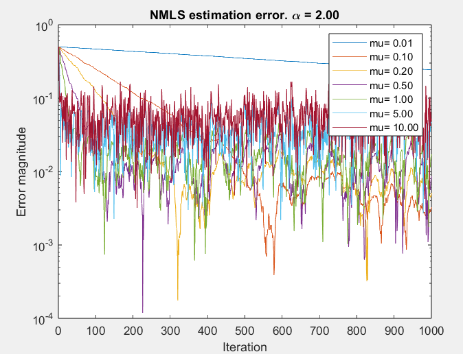

# January 11 2024

## Question 1 

1. Chapter-2 p36 (“Example: HP anti-aliasing…”): Explain the relevance of the presented operations in the filter bank context (=Chapters 12-13-14). 

> This demonstrates how that we can, after downsampling and upconverting, obtain the same signal back at the condition that we apply a HP Anti-Aliasing filter first. 
>
> This HP AA is important as demonstrated in the formula page 33 where we can have aliasing after downconverting leading to *aliased* signal that cannot be reconstructed back. Right now, this result can be seen as stupid or useless, but the fact we can downsample and upsample and get the same signal is a sign of promising efficiency. Indeed, after downsampling, we can run a filter at a much lower frequency (the goal of downsampling) which is much more efficient (lower clock !). In other terms, we can perform an operation at lower speed which could be equivalent to a more power-hungry high speed operation.
> 
> This equivalence is key for filter banks and is the motivation of their study.

2. Chapter-3 p.29 (“At the Rx, throw away L samples corresponding…”). Rewrite the formula for the case where the order of the FIR channel is larger than the cyclic prefix length. 

> L should be adequately chosen to represent the FIR of the channel. Ideally L should be equal than the actual filter order and then the rest of the OFDM theory can be done.
>
> With L the cyclic prefix length and $\lambda = \text{actual order} - L$ we can find the following: 

$$
\begin{bmatrix}
y_k \\
y_{k+1} \\
y_{k+2} \\
y_{k+3} \\
y_{k+4} \\
\vdots \\
y_{k+N-1}
\end{bmatrix}
=
\begin{bmatrix}
h_L & h_{L-1} & \cdots & h_0 & 0 & \cdots & 0 \\
h_{L+1} & h_L & \cdots & h_1 & h_0 & \cdots & 0 \\
h_{L+2} & h_{L+1} & \cdots & h_2 & h_1 & \cdots & 0 \\
\vdots & \vdots & \ddots & \vdots & \vdots & \ddots & \vdots \\
0 & h_{L+\lambda} & \cdots & h_{L+1} & h_L & \cdots & h_0 \\
\end{bmatrix}
\begin{bmatrix}
x_{k+N-L} \\
x_{k+N-L+1} \\
\vdots \\
x_{k-1} \\
x_k \\
x_{k+1} \\
\vdots \\
x_{k+N-1}
\end{bmatrix}
$$

> In short, the matrix is **no longer** be made circulant which will void the OFDM principle. In practice, higher order h coefficient are near zero and thus they can be seen as 0 compared to $h_0$ and other low order coefficient. So the OFDM technique doesn't just implode if you mispredict, just the math doesn't really hold up and you may find some surprising excessive noise in your filter coefficient estimation.

3. Chapter-4 (“Filter Design”): Explain how the filter phase response is controlled in IIR filter design, and compare this to linear-phase FIR filter design. 

> The phase response of a filter $H(z)$ is simply $\angle H(e^{j\omega})$. Moreover, we now that a z-transform is nothing else than $H(z) = \sum_{k= -\infty}^{\infty} h_k z^{-k} \Longrightarrow H(e^{j\omega}) = \sum_{k= -\infty}^{\infty} h_k e^{-j\omega k}$. Then it is just a matter to cancel out the complex part which can only be done in **non-causal** filter. The only causal filter will be **linear phase** one with an added $e^{-j\omega L_0}$ where $L_0 = L/2$ or $L_0 = L-1/2$ depending on a symmetric or anti-symmetric filter. So the phase response is controlled through 1. Real value symmetric anti-symmetric filters 2. Length of the filter. 1. ensures linear phase response and 2. the *steepness* of the linear phase function.
>
> The phase response of IIR filters is tougher to control. Having a linear phase is impossible in IIR or we will lead into stability issues. To control it we could think of tweaking the optimization problem and make larger weight on the frequency we want to avoid ripple, but this is really not straightforward and is not part of standard quadratic problems.
>
> A simpler way is to simply use filters designed for such response such as Bessel filter.
>
> In short, for FIR, by design we can choose a specific family through its coefficient (reducing flexibility by a factor 2) and then we use a common quadratic optimization problem that is easily solvable. For IIR, we can't have linear phase by design, controlling the phase is hard and we will use some higher order optimization problem, solver do exists but will never be perfect, rely on well studied filters such as Bessel to simplify IIR filter deisgn with well controlled phase reponse.

4. Chapter-5 p.30 (“Derivation similar to p.22...”): Explain why the highlighted element in the first formula has to be a zero (unlike in p.21 and p.22). 

> In the first formula on p.22, we are interested in block processing and to ultimately use cheap algorithm such as the DFT. The basic principle is to compute K samples at once and thus we will have a $Y=HU$ of dimension $L:1 = (L:2*L)(2*L:1)$ where the $H$ matrix is filled with all the filter coefficient in a Toeplitz fashion, then we can make it circulant which allow us to introduce DFT, ... The size of the matrixes are directly linked with the length of the filter order as we need to create a square circulant matrix to use the theorem otherwise we will have a possible rank deficient matrix.
>
> The first algorithm can have extensive delay for high order filter, another approach is to use *poly-phase decomposition*. Important to remember that when we talk about a filter order L there is actually L+1 components in it. So this is why our polyphase decomposition $D$ will have terms up to $L_D = (L+1)/D$ order for each polyphase component. So this makes sense that our matrix won't be "*filled anymore up until the bottom*". So if we took back our first example with order L=4, we will have $L_D = 1$ with a 5-fold decomposition. And we have to remember that to transform our matrix into a square one with our trick, we need $2 D$ columns in this case and so we **must virtually add** this void column at the end. This can be seen as weird but makes sense from a mathematical point of view.

5. Chapter-6: Draw a “parallel realization” of $H(z)=(1+az^{-1})^{-1} + (1+bz^{-1})^{-1}$. Insert all relevant quantization noise sources and compute the corresponding noise transfer functions. Can some of these noise sources be lumped into an equivalent noise source? Why (not)? 

{ width=35% }

> For this, I chose a Transposed direct form and already lumped the components that could be lumped according to p.34. But if we take a closer look, the magnitude TF of e1 is simply 1 and same for e2, so we could also theoretically lump e1 and e2 to eout as they all share the same transfer function.
>
> Of course this is assuming that quantization noise can be a stochastic process.


## Question 2

1. Chapter-7 p.24 ("MMSE cost function can be expanded as..."): How does the Wiener filter formula ($w_{WF}=(X_{uu})^{-1}X_{du}$) and/or its components (Xuu and Xdu) change in the case of a multi-channel FIR problem (as on p.19)? 

> In the case of the multi-channel FIR filter, each one takes a different but the we compare it against the same desired signal as indicated on p.19. So we can write a new notation like $y_{k|i} = u_{k|i}^T w_i$ where the $i$ index indicates the channel specific result. The error is then expressed as $e_k = d_k - \sum_{i} y_{k|i}$. To simplify notation let's denote $\sum_{i} y_{k|i} = y_k$, $\sum_{i} u_{k|i} = u_k$ and $\sum_{i} w_{i} = w$ By re-using the same MMSE criterion we can find that:

$$
J_{mse}(w)
= \mathbb{E}\{e_k^2\} = \varepsilon\{d_k^2\} + w^T  \varepsilon\{u_k u_k^T\} w - 2 w^T \varepsilon\{u_k d_k\} 
$$

> So, the optimal $w_{wf}$ stays the same but what's behind $\mathbb{X}_{uu}$ and $\mathbb{X}_{du}$ changes. This is now the cross-correlation between each inputs, it now sums up everything together and the input signal is a sort of big soup of the various inputs. This makes sense as the desired output is compared with the results of all the filters.


2. Chapter-8: Explain how the LMS algorithm can be viewed as an RLS algorithm with a specific substitution for the input signal correlation matrix. Based on this link with RLS, provide an intuitive explanation for the statement that the convergence of the LMS depends on the correlation matrix eigenvalue spread. 

> The idea of the LMS algorithm is based on Wiener filter theory, but made practical. Typically, we don't have the statical informations about the signals so we average them out over time and this kinda behave as the expectancy $\mathbb{E}$. This gives $w_k = w_{k-1} + \mu u_k (d_k -u_k^T w_{k-1})$.
>
> The LS is also in the same vein but we have a more direct memory idea, we average out the past k samples which should represents the observed correlation and cross-correlation matrices. This gives, after a few algebric tricks, the following results $w_k = w_{k-1} + \mathbb{X}_{uu}^{-1} u_k (d_k -u_k^Tw_{k-1})$
>
> Those two formulas are the same besides for the $\mu$ and $\mathbb{X}_{uu}^{-1}= (U_k^TU_k)^{-1}$, input signal correlation matrix. So if we swap them, we can obtain the other algorithm. So if the correlation matrix is the identity it's the same. Meaning that for a noiseless input signal we have actually the same results !
>
> Those are some recursive algorithm so we must ensure stability by making sure the eigenvalues are not superior to 1 or we may run into some troubles. Ideally, as explained, we should have an unit matrix and thus no spread in the eigenvalues and the idea stable eigenvalues of 1. A bad spread of eingenvalues will be problematic for inverting the matrix. So good spread = good power correlation which is expected and is physical. Same idea can be derived for the stepsize selection in LMS algorithm. A bad spread is problematic and is symptomatic of a noisy, fast-changing environment that will lead to poor convergence as the algorithm can't lock into the actual input signal.

3. Chapter-9 p.38 (“Residual extraction…”): Consider the case where uk is an all-zero vector and dk is non-zero (and R[k] is full-rank). What would be the corresponding rotation angles and epsilon, and hence the a posteriori and a priori residual. 

> We know from slide p.33, that $R[k-1]$ is a upper triangular matrix as expected. To update our matrix, we append horizontally the new input and desired output. If the inputs are zeros, this means our matrix is already upper triangular and thus $\tilde{x_i} = x_i$ which means that $\theta = 0^\circ$ based on notation from p.32
>
> Taking back the notation from slide p.38, knowing that $u_k$ is a zero-filled vector and that all $cos(\theta_i) = 1$, we can simplify this equation with $d_k = \epsilon$. The a posteriori residual is the desired output itself. This represents the error.

4. Chapter-10 p.20 (“The main trick...”): Redraw the signal flow graph when the "main trick" is used to remove the column with R15, R25, ... Define the relevant epsilon-signals in the signal flow graph (with subscripts & superscripts). 

> Same as the figure presented in p.20, but we need to add one more cell below the column of $u(k+1)$ and the move our 3 cells connections one row down and deleting all the cells above the last celle from the row $u(k-4)$. Add back all the cells in the column $u(k-3)$ and connect its $\theta$ to the output.

5. In Chapter-11 p.25 (“Recursive Square-Root…”): Could residual extraction (cfr. Chapter 9) be added to this algorithm (would it also require only the “lower-right/lower part” as stated on p.23)? What exactly would be the meaning of the extracted residuals? 

> The residual signal should take the following form when using Givens transform to make a matrix triangular superior $\varepsilon = \frac{d_k - u_k^T w_{k,LS}}{\Pi_{i=1}^{L+1} cos(\theta_i)}$. This should be possible as RLS is simply a specific case of Kalman filtering as explained on slide p.17. So we could rewrite the **measurement noise** linked with Kalman as the actual residual extraction with $\varepsilon = \frac{d_k - C_k x_{k} - D_k u_k}{\Pi_{i=1}^{L+1} cos(\theta_i)}$ to generalize this concept.
>
> Here we are getting the measurement noise that is also measuring the statespace model error with the residual noise from the inputs. But, this will not just be one element of the matrix as we are doing more than a rank-1 update in comparison with RLS. This would thus correspond to the vector ... at the bottom right which won't be a simple value anymore.

## Question 3

1. Chapter-12 p.12 (“Noise reduction…”): If D=4 (instead of D=3) and if the Gi’s are not all equal to 1, what would be a condition for alias-free operation (a general formula is sufficient here) and what would be the resulting (linear) “distortion function”? 

> If D=4, we will be having a *maximally decimated* FB which is more prone to possible alias. If we are looking at slide p.37 that is based on chapter 2 p.33, we can see we could have some potential aliasing but if we can guarantee that the $A_n(z)$ (alias function) is 0 then we can have an alias-free results. Adapting from those results give the following formula

$$
Y(z) = \underbrace{1/N \sum_{n=0}^{N-1} G_n H_n(z)F(z)}_{T(z)}  \cdot U(z) + 1/N \underbrace{ \sum_{n=0}^{N-1} G_n \sum_{\bar{n}=0}^{N-1} H_{\bar{n}} (zW^n)F_{\bar{n}}(z)}_{A_n(z) = 0} \cdot U(zW^n)
$$

> Where $T(z)$ is the distortion function.

2. Chapter-13 p.11 (“This can be verified...”). Provide an equivalent verification where in the first step R(z)E(z) is swapped with the upsampling (instead of the downsampling). 

> So if we move the $R(z)E(z)$ to the right instead of the left we will find thanks to the noble identities that we again get $R(z^4)E(z^4)$. But this makes our life a tad harder as down converting can cause alias, the new formula is thus:

$$
\mathbf{R}(z^{4}) \cdot \mathbf{E}(z^{4}) \cdot
1/4 \sum_{d=0}^{D-1}\cdot
\begin{bmatrix}
1 \\
z^{-1} e^{2\pi jd} \\
z^{-2} e^{4\pi jd}\\
z^{-3} e^{6\pi jd}
\end{bmatrix}
U(z e^{-2\pi jd})
=
\mathbf{R}(z^{4}) \cdot \mathbf{E}(z^{4}) \cdot
1/4
\begin{bmatrix}
4 \\
z^{-1} 4 \\
z^{-2} 4\\
z^{-3} 4
\end{bmatrix}
\cdot
U(z )
$$

$$
= ... =\begin{bmatrix}
1 \\
z^{-1} \\
z^{-2} \\
z^{-3}
\end{bmatrix}
\underbrace{
\left( p_0(z^{-1}) + z^{-1}p_1(z^{-1}) + z^{-2}p_2(z^{-1}) + z^{-3}p_3(z^{-1}) \right)
}_{T(z)}
U(z)
$$

3. Chapter-13 p.31 (“Given E(z)...”). Consider the case with N=4, D=1 and LE=3. Construct a (simple) example with transfer functions Hi(z) and Fi(z) that provide perfect reconstruction. 

> To make sure this problem is solvable, we must ensure we are not in a contrived case. $L_R$ is not given but can be selected such that we are in an open case $L_R\geqslant \frac{1}{4-1} 3 -1$ so $L_R \geqslant 0$. To respect this property and to make our life easier we can select $E(z) = 1/4 z^{-4}$ which is indeed a 4th order filter and then choose a zero order H filter:

$$
\begin{bmatrix}
    1/4 z^{-4} & 1/4z^{-4} & 1/4 z^{-4} & 1/4 z^{-4} 
\end{bmatrix} \cdot 
\begin{bmatrix}
    1 \\ 1 \\ 1 \\ 1 
\end{bmatrix} = z^{- 4}
$$

4. Chapter-14 p.27 (“Example-1: Define B(z4)…”):

a) Specify B(z) for the case where N=7 and D=4. 

> Knowing that $N' = ND/gcd(N,D) = 4*7/1 = 28$ this means that we will fill up our matrix

$$
B(z^4) = \begin{pmatrix}
    E_0 (z^{28}) & z^{-20}E_{21}(z^{28}) & z^{-12}E_{14}(z^{28}) & z^{-4}E_7(z^{28})\\
    z^{-8}E_{8}(z^{28}) & E_1(z^{28}) & z^{-20}E_{22}(z^{28}) & z^{-12}E_{15}(z^{28})\\
    z^{-16}E_{16}(z^{28}) & z^{-8}E_{9}(z^{28}) & E_2(z^{28}) & z^{-20}E_{23}(z^{28}) \\
    z^{-24}E_{24}(z^{28}) & z^{-16}E_{17}(z^{28}) & z^{-8}E_{10}(z^{28}) & E_3(z^{28})\\
    z^{-4}E_4(z^{28}) & z^{-24}E_{25}(z^{28}) & z^{-16}E_{18}(z^{28}) & z^{-8}E_{11}(z^{28})\\
    z^{-12}E_{12}(z^{28}) & z^{-4}E_5(z^{28}) & z^{-24}E_{26}(z^{28}) & z^{-16}E_{19}(z^{28})\\
    z^{-20}E_{20}(z^{28}) & z^{-12}E_{13}(z^{28}) & z^{-4} E_6(z^{28}) & z^{-24}E_{27}(z^{28})
\end{pmatrix}
$$

b) Provide the corresponding proof (similar to the proof on p.27) (with explanation in words for non-trivial steps) that a 7-channel DFT-modulated filter bank is indeed obtained with this B(z). 

> Here, we just started from a 28 poly-phase decomposition and referring from slide p.27 we have $F^{-1} B(z^4) \begin{bmatrix}
    1\\ z^{-1} \\ z^{-2} \\ z^{-3}
\end{bmatrix} U(z)$ The third vector represents the delay elements present in the signal flow graph. We will focus on the part in the middle first which yield the following result: 

$$
B(z^4) \begin{bmatrix}
    1\\ z^{-1} \\ z^{-2} \\ z^{-3}
\end{bmatrix}  = \begin{pmatrix}
    E_0 (z^{28}) + z^{-21}E_{21}(z^{28}) + z^{-14}E_{14}(z^{28}) + z^{-7}E_7(z^{28})\\
    z^{-8}E_{8}(z^{28}) + z^{-1}E_1(z^{28}) + z^{-22}E_{22}(z^{28}) + z^{-15}E_{15}(z^{28})\\
    z^{-16}E_{16}(z^{28}) + z^{-9}E_{9}(z^{28}) + z^{-2}E_2(z^{28}) + z^{-23}E_{23}(z^{28}) \\
    z^{-24}E_{24}(z^{28}) + z^{-17}E_{17}(z^{28}) + z^{-10}E_{10}(z^{28}) + z^{-3}E_3(z^{28})\\
    z^{-4}E_4(z^{28}) + z^{-25}E_{25}(z^{28}) + z^{-18}E_{18}(z^{28}) + z^{-11}E_{11}(z^{28})\\
    z^{-12}E_{12}(z^{28}) + z^{-5}E_5(z^{28}) + z^{-26}E_{26}(z^{28}) + z^{-19}E_{19}(z^{28})\\
    z^{-20}E_{20}(z^{28}) + z^{-13}E_{13}(z^{28}) + z^{-6} E_6(z^{28}) + z^{-27}E_{27}(z^{28})
\end{pmatrix}
$$

> Already, we can feel something special when looking at the matrix, the $z^{-\delta}$ is "aligned" with its polyphase decomposition ! Something even more spectacular, is that they are evenly spaced by 7 the channel decomposition value ! So we can see that actually, each rows is a lower rate polyphase decomposition namely:

$$
E_0 (z^{28}) + z^{-21}E_{21}(z^{28}) + z^{-14}E_{14}(z^{28}) + z^{-7}E_7(z^{28}) = E_0({z^7})
$$

> If we remember, a polyphase decomposition is selecting the elements spaced by D, If we divide our polyphase in 28 pieces and we select the zeors, the seventh, ... this becomes the same as a lower rate decomposition. This idea can be repeated for the second line, but we must remove the $z^{-1}$ factor as it is relative to the lower order factor.

$$
B(z^4) \begin{bmatrix}
    1\\ z^{-1} \\ z^{-2} \\ z^{-3}
\end{bmatrix}  = \begin{pmatrix}
    E_0 (z^{7})\\
    z^{-1}E_{1}(z^{28}) \\
    z^{-2}E_{2}(z^{28})\\
    z^{-3}E_{3}(z^{28}) \\
    z^{-4}E_4(z^{28}) \\
    z^{-5}E_{5}(z^{28}) \\
    z^{-6}E_{6}(z^{28}) 
\end{pmatrix}
$$

# Questions

## Chapter 3

### Why the $\tilde{k}$ notation ?

> Cause in the OFDM each symbol is being modulated by a **full** period of the carrier, we can't just stop earlier. This is needed to make the DFT matrix appear

## Chapter 4

### Why the PS ? Phase response is zero everywhere if amplitude response is allowed to be negative (otherwise phase is 0 or $\pi$ everywhere)

> Here, it is not really a fact but more an explanation of a relaxed notation. Usually, phase response is $\angle H(e^{j \omega})$ and the amplitude response is $|H(e^{j \omega})|$. So basically, we never allow the amplitude response to be negative and the $-$ is translated into $\pi$ in the phase response. So to relax the notation and to make sure that a "*zero-phase*" filter is an actual thing, we need to transfer that - to the amplitude to make the phase really 0 everywhere.

## Chapter 5

### Why do we add downsampling in the signal flow graph where does it come from ?

> The downsampling is linked with the fact that we are doing block processing. We are only actually doing the calculations once in every 4 time, so we add this downsampling factor to underline this method. It is not really required but in actual implementation we will want to add this at the gate to reduce loading the wires etc.

### Why the extra 0 at the corner p.30 ?

> It was one of the questions of the exam I did so hopefully I will get an answer from the professor.

### p.37 do the Direct form check

> We know that $Y(z)=U(z) \frac{b_0 + b_1 z^{-1}}{1+ a_1z^{-1}}$, by introducing an intermediate signal symbol we can then proof this equal to the same as the given formula

## Chapter 6

### p.14 redo the check of stability

> Check it in my book

### p.34-35 Lumping of the components how can this be proven

> Idea is to find the transfer function, check quantization error source one by one. Remove $u$ as it doesn't play a role here. Simply see how the noise sources are adding up linearly **up to a delay**, this is key to be able to lump. Sadly, we can't bypass the delay operator and so we assume ideal information about the noise. 
>
> So a simple way to see it, is that if the noise is not added up linearly and gets multiplied by a factor, then we can't lump it anymore and we need to form a separate sort of island.

### p.39 why is true ?

> Just accept it I think and I think saying that it absorbs power is already enough 

## Chapter 7

### p.9-11 How does it know when someone is speaking or not ? 

> If we look at p.37, it indicates that whatever the user is doing, it will work well and the we will always have an irreducible error that will correspond to the near-end signal if we assume a certain orthogonality between the far and near end signal which is possible since they come from different sources so shouldn't be the same. So since the near end is so much different that the far-end we can't do anything and that's good news.

### p.25 why does it take this form ?

> 1. Start with the expanded form of the MMSE cost function: As discussed, the MSE cost function $J_{MSE}(w)$ is defined as $E{e_k^2} = E{|d_k - y_k|^2} = E{|d_k - w^T u_k|^2}$. This can be expanded as: $J_{MSE}(w) = E{d_k^2} + w^T E{u_k u_k^T} w - 2w^T E{u_k d_k}$. Using the standard notation, where $\bar{X}_{uu} = E{u_k u_k^T}$ is the correlation matrix of the input signal and $\bar{X}_{du} = E{u_k d_k}$ is the cross-correlation vector between the input and desired signal, this becomes: $J_{MSE}(w) = E{d_k^2} + w^T \bar{X}_{uu} w - 2w^T \bar{X}_{du}$ (Equation 1).
> 
> 2. Incorporate the Wiener-Hopf equations: The optimal Wiener filter weight vector $w_{WF}$ is found by setting the gradient of $J_{MSE}(w)$ with respect to $w$ to zero
> . This yields the Wiener-Hopf equations: $\bar{X}_{uu} w{WF} = \bar{X}_{du}$ (Equation 2). From this, it also follows that $\bar{X}_{du}^T = ( \bar{X}_{uu} w_{WF} )^T = w_{WF}^T \bar{X}_{uu}^T = w{WF}^T \bar{X}_{uu}$, given that $\bar{X}_{uu}$ is a symmetric matrix [conversation history].
> 
> 3. Substitute Equation 2 into Equation 1: Substitute $\bar{X}_{du} = \bar{X}_{uu} w_{WF}$ into Equation 1: $J_{MSE}(w) = E{d_k^2} + w^T \bar{X}_{uu} w - 2w^T (\bar{X}_{uu} w_{WF})$ $J_{MSE}(w) = E{d_k^2} + w^T \bar{X}_{uu} w - 2w^T \bar{X}_{uu} w_{WF}$ (Equation 3)
> 
> 4. Express the minimum mean-square error, $J_{MSE}(w_{WF})$: To find the minimum error, substitute $w = w_{WF}$ into Equation 1: $J_{MSE}(w_{WF}) = E{d_k^2} + w_{WF}^T \bar{X}_{uu} w{WF} - 2w_{WF}^T \bar{X}_{du}$Again using Equation 2 ($\bar{X}_{du} = \bar{X}_{uu} w{WF}$): $J_{MSE}(w_{WF}) = E{d_k^2} + w_{WF}^T \bar{X}_{uu} w{WF} - 2w_{WF}^T (\bar{X}_{uu} w{WF})$ $J_{MSE}(w_{WF}) = E{d_k^2} + w_{WF}^T \bar{X}_{uu} w{WF} - 2w_{WF}^T \bar{X}_{uu} w{WF}$ $J_{MSE}(w_{WF}) = E{d_k^2} - w_{WF}^T \bar{X}_{uu} w{WF}$ (Equation 4)
> 
> 5. Expand the quadratic error term: Now, let's expand the excess error term: $(w - w_{WF})^T \bar{X}_{uu} (w - w{WF}) = (w^T - w_{WF}^T) \bar{X}_{uu} (w - w{WF})$ $= w^T \bar{X}_{uu} w - w^T \bar{X}_{uu} w_{WF} - w_{WF}^T \bar{X}_{uu} w + w{WF}^T \bar{X}_{uu} w{WF}$ Since $\bar{X}_{uu}$ is symmetric, the term $w{WF}^T \bar{X}_{uu} w$ is a scalar and is equal to its transpose, $(w{WF}^T \bar{X}_{uu} w)^T = w^T \bar{X}_{uu}^T w_{WF} = w^T \bar{X}_{uu} w{WF}$. So, the two middle terms can be combined: $(w - w_{WF})^T \bar{X}_{uu} (w - w{WF}) = w^T \bar{X}_{uu} w - 2w^T \bar{X}_{uu} w_{WF} + w_{WF}^T \bar{X}_{uu} w{WF}$ (Equation 5)
> 
> 6. Substitute Equation 5 into Equation 3: Rearrange Equation 5 to isolate the first two terms on the right side: $w^T \bar{X}_{uu} w - 2w^T \bar{X}_{uu} w_{WF} = (w - w_{WF})^T \bar{X}_{uu} (w - w{WF}) - w_{WF}^T \bar{X}_{uu} w{WF}$ (Equation 6) Now substitute Equation 6 into Equation 3: $J_{MSE}(w) = E{d_k^2} + [(w - w_{WF})^T \bar{X}_{uu} (w - w{WF}) - w_{WF}^T \bar{X}_{uu} w{WF}]$ $J_{MSE}(w) = E{d_k^2} - w_{WF}^T \bar{X}_{uu} w{WF} + (w - w_{WF})^T \bar{X}_{uu} (w - w{WF})$
> 
> 7. Final step using Equation 4: Recognize that the first two terms in the above expression are precisely $J_{MSE}(w_{WF})$ from Equation 4. Therefore, we arrive at the desired equation: $J_{MSE}(w) = J_{MSE}(w_{WF}) + (w - w_{WF})^T \bar{X}_{uu} (w - w{WF})$

### p.35 meaning behind this slide

> Here we are dealing with vectors and no longer matrices hence the fact we can do polynomial divisions. It is no longer a *power spectral density* but a *cross-correlation vector*.

### p.36 why the reference to chapter 4?

>  In Chapter 7, the discussion revolves around optimal filters, specifically Wiener filters, which aim to minimise the mean-square error (MSE)
>
> This concept establishes a lower bound on the attainable MSE, referred to as the 'irreducible error' – the portion of the desired signal $d_k$ that no Wiener filter can entirely eliminate.
>
> This closely relates with chapter 4 where we have seen design procedures for FIR filter. This equations merges the idea of a irreducible error and an added error due to the finite length of the FIR filter.
>
>  This latter component arises when the unrealisable Wiener filter is approximated by a causal L-th order filter. The key part is that this approximation error includes the input power spectrum as a weighting function

### p.36 why is the input power spectrum used as a weight function in the filter design ? Why is it a sensible choice ?

> The primary goal of Wiener filters is to minimise the overall MSE between the filter's output and a desired signal [7, p. 21].
> 
> If the input signal has varying power across different frequencies (i.e., it's a "coloured" signal), errors in frequency bands with higher input power will contribute more significantly to the total energy of the error signal.
>
> By weighting the least squares error with the input power spectrum, the filter design process naturally prioritises accurate filtering in the frequency bands where the input signal is strongest

# Summary of chapter and rough sketch

Used notebooklm with this prompt

```
Give me a summary about chapter XX and what it is all about. Explain the key concepts and formulas. Be short and concise, you can look in other chapters if needed and if you need to base yourself on prior knowledge. You can also make link with next chapters to demonstrate the importance of this chapter. Write equations using inline Latex
```

## Chapter 3

Chapter 3, titled "Acoustic Modem Project," serves as a practical introduction to Digital Signal Processing (DSP) applications by outlining the **design of an efficient Orthogonal Frequency Division Multiplexing (OFDM)-based modem for transmission over an acoustic channel**. This project is structured into several weeks, each focusing on a key aspect of modem development.

Key concepts and formulas discussed include:

*   **Acoustic Channel Modelling**: The physical acoustic path between a loudspeaker and a microphone is modelled as a **linear discrete-time transfer function**, specifically a **Finite Impulse Response (FIR) filter**. The transfer function is represented as $H(z) = h_0 + h_1 z^{-1} + h_2 z^{-2} + \dots + h_L z^{-L}$, where $L$ is the filter order. The output signal $y_k$ at the receiver is related to the transmit signal $x_k$ by **convolution**: $y_k = \sum_{l=0}^L h_l x_{k-l}$.
*   **Channel Estimation**: To determine the channel coefficients ($h_0, \dots, h_L$), a **Least Squares (LS) estimation problem** is formulated. By transmitting a known signal $x_k$ and recording the corresponding output $y_k$, the objective is to find the coefficients that minimise the squared error between the observed output and the output predicted by the model. This is expressed as:

$$\min_{h_0, \dots, h_L} \left\| \begin{pmatrix} y_k \\ y_{k+1} \\ \vdots \\ y_{k+K} \end{pmatrix} - \begin{pmatrix} x_k & x_{k-1} & \dots & x_{k-L} \\ x_{k+1} & x_k & \dots & x_{k+1-L} \\ \vdots & \vdots & \ddots & \vdots \\ x_{k+K} & x_{k+K-1} & \dots & x_{k+K-L} \end{pmatrix} \begin{pmatrix} h_0 \\ h_1 \\ \vdots \\ h_L \end{pmatrix} \right\|^2_2$$

This is highlighted as a simple, often "one line of Matlab code," solution.

*   **OFDM Modulation**: OFDM is a **multi-carrier modulation format** that heavily relies on DSP functionalities like **Fast Fourier Transform (FFT) and Inverse Fast Fourier Transform (IFFT)**.
    *   At the transmitter, a high-rate bit stream is converted into multiple low-rate bit streams, which modulate different complex exponential carriers. This sum of modulated carriers for a block of $N$ samples is achieved using an **N-point IFFT**.
    *   **Cyclic Prefix (CP)**: A critical technique in OFDM for mitigating channel effects. By prepending the last $L$ samples of an $N$-sample data segment (where $L$ is the channel order), the **linear convolution** with the channel impulse response is transformed into a **circular convolution**.
    *   **Frequency Domain Channel Effect**: Due to the properties of circulant matrices (which represent circular convolution), the circular convolution translates to **component-wise multiplication in the frequency domain**. This means that at the receiver, after removing the CP and performing an FFT, the received frequency-domain symbols ($\tilde{Y}_{\tilde{k}}^{(n)}$) are simply the transmitted symbols ($\tilde{X}_{\tilde{k}}^{(n)}$) scaled by the channel's frequency response ($H_n$) at each carrier: $\tilde{Y}_{\tilde{k}}^{(n)} = H_n \cdot \tilde{X}_{\tilde{k}}^{(n)}$. Here, $H_n = H(z)|_{z=e^{j2\pi n/N}}$.
    *   **Frequency-domain Equalization (FEQ)**: This property enables straightforward channel equalization in the frequency domain by simply dividing by $H_n$ for each carrier.

This chapter lays the groundwork for understanding several subsequent topics:

*   **Chapter 7 (Optimal Filters - Wiener Filters)**: The **Least Squares (LS) estimation** introduced in Chapter 3 is a direct application of the principles discussed in optimal filter design and is an alternative to the statistical Wiener filter approach.
*   **Chapter 8 (LMS Algorithms)**: The channel estimation problem sets the stage for **adaptive equalisation**, where algorithms like Least Mean Squares (LMS) are used to continuously update filter coefficients based on the error signal. This is particularly relevant for the "OFDM with adaptive equalization" task in Week 7-8 of the project. The frequency-domain adaptive filters (FDAF) and partitioned block FDAF (PB-FDAF) discussed in Chapter 8 directly leverage the FFT/IFFT operations central to OFDM.
*   **Chapter 9 (RLS Algorithms)**: Explores Recursive Least Squares (RLS) algorithms, which are more computationally intensive than LMS but offer faster convergence. The **QRD-based LS estimation** and **QRD-RLS** methods introduced there are numerically stable ways to solve the underlying LS problems presented in Chapter 3.
*   **Chapter 10 (Fast RLS Algorithms)**: Builds on the RLS concepts by introducing "Fast RLS" algorithms, which offer improved computational complexity (from $O(L^2)$ to $O(L)$) for real-time applications, critical for practical channel estimation and equalisation in an OFDM system.
*   **Chapter 11 (Kalman Filters)**: Further generalizes parameter estimation, with RLS algorithms being special cases of Kalman Filters, providing a broader theoretical context for the estimation challenges in Chapter 3.
*   **Chapter 5 (Filter Realization)**: The efficient frequency-domain filter realizations (overlap-save and overlap-add) explained in Chapter 5 are directly applicable to the FFT/IFFT-based processing in OFDM, demonstrating how these theoretical concepts underpin practical DSP systems.

## Chapter 4

Chapter 4, "Filter Design," is dedicated to the fundamental process of **designing digital filters to meet specific performance requirements**. This involves defining filter specifications and deriving their optimal transfer functions.

Key concepts and formulas include:

*   **Filter Design Process**: Chapter 4 focuses on the first two steps of the overall filter design and implementation process:
    1.  **Defining filter specifications**: Such as passband, stopband, and optimisation criteria (e.g., passband ripple, stopband attenuation, cutoff frequencies).
    2.  **Deriving the optimal transfer function**: This involves choosing between FIR or IIR filters and applying specific design methodologies.

*   **FIR (Finite Impulse Response) Filters**: These are "all-zero" filters with a **finite impulse response**. A key advantage is their **guaranteed stability** (poles are at the origin, $z=0$). They can also be designed to have a **linear phase response**, which is crucial for applications where phase distortion is undesirable. A linear phase FIR filter can be represented by its transfer function. It is a linear phase if we allow the mangitude response to be negative or we may experienced sudden jump in phase which is due to $\pi$ rotation of a negative number:
    $H(z) = b_0 + b_1 z^{-1} + \dots + b_L z^{-L}$.
    For a causal linear-phase FIR filter of even length $L=2L_o$, its frequency response can be expressed as:
    $H(e^{j\omega}) = e^{-j\omega L/2} \sum_{k=0}^{L_o} d_k \cos(\omega k)$.

*   **FIR Design Methods**:
    *   **Weighted Least Squares Design**: This method seeks to minimise the squared difference between the desired and actual frequency response, weighted by a function $W(\omega)$. The optimisation criterion is:
        $\min_{d_0, \dots, d_{L_o}} \int_{-\pi}^{\pi} W(\omega) |G(\omega) - G_d(\omega)|^2 d\omega$.
        This is a quadratic optimisation problem.
    *   **Minmax Design (Equiripple Design)**: This approach minimises the maximum weighted approximation error, resulting in filters where the ripple in the passband and stopband is uniform (equiripple). Algorithms like the Remez exchange (Parks-McClellan) are used for this.
    *   **Design using 'Windows'**: A simpler, ad-hoc procedure where an ideal filter's (e.g., low-pass) infinite impulse response is truncated by multiplying it with a finite-length "window" function (e.g., rectangular, Hann, Hamming). While straightforward, this can lead to the "Gibbs effect," causing significant ripples in the frequency response.

*   **IIR (Infinite Impulse Response) Filters**: These filters have **rational transfer functions** with both poles and zeros. Unlike FIR filters, they can achieve sharp frequency responses with a **lower filter order**. However, their design is more complex as **stability must be explicitly checked** (poles must lie inside the unit circle), and their phase response is not easily controlled (no linear-phase IIR filters). The IIR transfer function is:
    $H(z) = \frac{B(z)}{A(z)} = \frac{b_0 + b_1 z^{-1} + \dots + b_L z^{-L}}{1 + a_1 z^{-1} + \dots + a_L z^{-L}}$.
    IIR design by optimisation (weighted least squares, minmax) involves **non-linear problems** due to the denominator polynomial and complex stability constraints. In practice, IIR filters are often designed by transforming analog filter prototypes (e.g., Butterworth, Chebyshev, elliptic) into digital filters.

This chapter is foundational for several subsequent topics:

*   **Chapter 3 (Acoustic Modem Project)**: The practical acoustic modem project requires understanding how to **model the acoustic channel as an FIR filter**. The principles of filter design are essential to defining the characteristics of such a channel model or any filtering components within the modem.
*   **Chapter 5 (Filter Realization)**: Once a filter's optimal transfer function is derived in Chapter 4, Chapter 5 details how to **realise it as a block scheme** using basic DSP building blocks like delay elements, adders, and multipliers. The choice of realization, explained in Chapter 5, directly impacts the practical implementation.
*   **Chapter 6 (Filter Implementation)**: This chapter addresses the **practical challenges of implementing filters** (designed in Chapter 4 and realised in Chapter 5) using finite-precision arithmetic. It highlights how the realisation choice (from Chapter 5) affects robustness against issues like coefficient quantization, signal scaling, and limit cycle oscillations.
*   **Chapter 7 (Optimal Filters - Wiener Filters)**: Chapter 4's "classical" filter design is presented as distinct from "optimal" filter design (Wiener filters), which relies on statistical information rather than specific frequency-domain characteristics. However, the least-squares optimisation methods introduced in Chapter 4 share a conceptual link with the data-based least-squares estimation discussed in Chapter 9, which is an alternative to the statistical Wiener filter approach.
*   **Chapter 12, 13, and 14 (Filter Banks)**: The core components of filter banks are collections of analysis and synthesis filters. Chapter 4's principles of filter design are **directly applied to design these individual filters**. Chapters 13 and 14 delve into ensuring "perfect reconstruction" in filter banks while also meeting the filter specifications (as defined in Chapter 4). Modulated filter banks (Chapter 14) further streamline this by allowing the design of an entire bank from a single prototype filter, simplifying the process of meeting filter specifications.

## Chapter 5

Chapter 5, "Filter Realization," focuses on the **third step in the digital filter design and implementation process: constructing practical block schemes or flow graphs for filters**. After the filter's specifications are defined and its optimal transfer function derived (Chapter 4), Chapter 5 explains how to transform these mathematical descriptions into concrete structures using fundamental DSP building blocks such as **delay elements, adders, and multipliers**. The chapter highlights that different realisations, despite having identical input/output (I/O) behaviour, can have vastly different practical implications for implementation (addressed in Chapter 6).

Key concepts and realisations discussed include:

*   **FIR (Finite Impulse Response) Filter Realisation**: These filters, represented by the difference equation $y[k]= b_0 u[k] + b_1 u[k-1] + \dots + b_L u[k-L]$, are discussed through:
    *   **Direct Form**: A straightforward cascade of delay elements feeding parallel multipliers whose outputs are summed.
    *   **Transposed Direct Form**: Achieved by "retiming" the direct form, providing different internal signal paths and pipeline delays while preserving the same I/O behaviour.
    *   **Lattice Realisation (LPC Lattice)**: A recursive structure involving "reflection coefficients" ($K_i$) derived from the filter coefficients. This realisation is particularly noted for its connection to the **Schur-Cohn stability test**: a polynomial (e.g., in IIR filters) has all its roots inside the unit circle if and only if all corresponding reflection coefficients satisfy $|K_i|<1$.
    *   **Lossless Lattice Realisation**: A specialised form where the filter and a "flipped" version are **"power complementary"**, meaning they form a **1-input/2-output lossless system** where the sum of their squared magnitude responses on the unit circle equals one: $|H(e^{j\omega})|^2 + |\tilde{\tilde{H}}(e^{j\omega})|^2 = 1$. This structure is also referred to as a "paraunitary lattice".
    *   **Frequency-Domain Realisation (Overlap-Save / Overlap-Add)**: These methods offer **significant computational efficiency** for large filter orders ($L$) by leveraging the Fast Fourier Transform (FFT) and Inverse Fast Fourier Transform (IFFT). They operate by processing input signals in blocks ($L_B$) and converting **linear convolution into component-wise multiplication in the frequency domain**. While reducing complexity from $O(L)$ to $O(\log(L))$ multiplications per sample, they introduce a processing delay or latency proportional to the block size. A more general form uses **polyphase decomposition** to choose the block size ($D$) independently of $L$, allowing for a trade-off between complexity reduction and latency.

*   **IIR (Infinite Impulse Response) Filter Realisation**: These filters have a rational transfer function $H(z) = B(z)/A(z)$:
    *   **Direct Form and Transposed Direct Form**: Similar to FIR, these directly implement the difference equation, combining the Moving Average (MA) (numerator $B(z)$) and Autoregressive (AR) (denominator $A(z)$) parts.
    *   **Parallel and Cascade Realisations**: These decompose the IIR filter into multiple lower-order sections. Parallel realisations use partial fraction decomposition, while cascade realisations factorise the transfer function into biquadratic sections. These can improve numerical properties during implementation (Chapter 6).
    *   **Lattice-Ladder Realisation**: This structure extends the FIR lattice concept to IIR filters, separating the realisation into an "all-pass" (lattice) part for the poles (denominator $A(z)$) and a "ladder" part for the zeros (numerator $B(z)$). Like the FIR lattice, the stability of the IIR filter can be checked via reflection coefficients in the lattice part.
    *   **Lossless Lattice Realisation**: An extension of the lossless lattice concept to IIR filters, resulting in a system where both the filter and its "complement" are power complementary.

This chapter is crucial for understanding the practical aspects of DSP systems and links directly to:

*   **Chapter 4 (Filter Design)**: The transfer functions derived in Chapter 4 are the *designs* that are then *realised* using the methods presented in Chapter 5.
*   **Chapter 6 (Filter Implementation)**: The choice of filter realisation from Chapter 5 has a profound impact on practical implementation issues such as **finite word-length effects**, coefficient quantization sensitivity, signal scaling, and the occurrence of **limit cycle oscillations** (especially in IIR filters with feedback). Chapter 6 explicitly addresses "why bother about many different realisations," reinforcing this link.
*   **Chapter 3 (Acoustic Modem Project)**: The **OFDM** (Orthogonal Frequency Division Multiplexing) modulation scheme used in the Acoustic Modem project relies heavily on **FFT/IFFT** operations, which are the cornerstone of the **frequency-domain filter realisations (Overlap-Save/Overlap-Add)** presented in Chapter 5. The acoustic channel itself is modelled as an FIR filter, directly relating to FIR filter realisations.
*   **Chapter 7 (Optimal Filters - Wiener Filters)**: The **LPC (Linear Predictive Coding) lattice** form, introduced in Chapter 5, is fundamental to concepts in linear prediction which are explored in optimal and adaptive filtering contexts in Chapter 7 and beyond (e.g., Levinson-Durbin algorithm for solving Wiener-Hopf equations has connections to lattice structures).
*   **Chapters 12, 13, and 14 (Filter Banks)**: The generalized concepts of **lossless lattices** and **paraunitary matrix transfer functions** introduced in Chapter 5 are directly extended and applied in the design of **perfect reconstruction (PR) filter banks**. The use of **polyphase decomposition** for efficient filter bank structures is a core theme in these later chapters, building on its introduction for frequency-domain realisations in Chapter 5.

## Chapter 6

Chapter 6, "Filter Implementation," marks the **fourth and final step in the digital filter design and implementation process**, following filter specification (Chapter 4), transfer function derivation (Chapter 4), and filter realization (Chapter 5). The chapter's central theme addresses the crucial question: **"Why bother about many different realizations for one and the same filter?"**. It explains that while different realisations may have identical input/output behaviour in theory, their practical implementation in digital systems reveals significant differences due to **finite word-length effects**. The goal of Chapter 6 is to understand how these practical constraints impact the filter's performance and how to mitigate them.

The **key concepts** and associated issues/mitigations are:

*   **Finite Word-Length Problem**: In practice, numbers (filter coefficients, signals, and results of arithmetic operations) are represented with a **finite number of bits**, leading to inevitable **quantization errors**. This is particularly critical in fixed-point implementations with short word-lengths.

*   **Quantization of Filter Coefficients**:
    *   **Problem**: Filter coefficients, designed with high precision, must be quantized for hardware/software implementation. Small changes in coefficient values, especially in high-order polynomials (like the denominator of IIR filters), can lead to **high sensitivity of pole locations** and potentially render a filter unstable or degrade its performance. Tightly spaced poles, common in narrow-band filters, exacerbate this sensitivity.
    *   **Example**: For a 2nd-order IIR filter, coefficients must lie within a "triangle of stability" for the poles to remain inside the unit circle. Quantizing these coefficients restricts the possible pole locations, which can be problematic for filters (e.g., narrow-band low-pass or high-pass) that require poles close to $z=1$ or $z=-1$.
    *   **Mitigation**: Using **low-order sections** (e.g., cascade or parallel realisations from Chapter 5) can reduce sensitivity. **Lossless lattice realisations** (from Chapter 5) are also advantageous because their coefficients (sines and cosines, typically represented between -1 and 1) offer better control over dynamic range and quantization error, resulting in more robust implementations.

*   **Quantization of Signals & Scaling**:
    *   **Problem**: Digital signals are represented by a finite number of bits. If an output or internal signal exceeds the maximum representable value, **overflow** occurs. In two's-complement arithmetic, overflow can lead to a sign reversal, which is highly detrimental.
    *   **Solution**: **Signal scaling** involves multiplying signals by appropriate factors ($2^c$) to prevent overflow. While deterministic methods (time-domain, frequency-domain scaling) guarantee no overflow, they can be over-conservative. Probabilistic L2-scaling aims for a balance between overflow risk and signal range.
    *   **Insight**: In certain filter realisations, internal overflow can cancel out. For a **direct form IIR filter**, only two internal signals need explicit scaling consideration. For a **transposed direct form IIR filter**, only one internal signal requires scaling consideration.

*   **Quantization of Arithmetic Operations**:
    *   **Problem**: Arithmetic operations (addition, multiplication) can increase the required number of bits for representation. This necessitates re-quantization (rounding, truncation, magnitude truncation), which introduces **quantization noise**.
    *   **Formulas**: The mean and variance of this noise can be statistically analysed, considering its propagation through "noise transfer functions" $G(z)$ to the filter output. The noise variance at the output is $\sigma_e^2 ||g||_2^2$, where $||g||_2^2 = \frac{1}{2\pi} \int_{-\pi}^{\pi} |G(e^{j\omega})|^2 d\omega$.
    *   **Limit Cycle Oscillations**: A critical **deterministic non-linear effect** that can appear in IIR filters with feedback when the input is zero, causing unwanted, self-sustaining oscillations. **FIR filters cannot have limit cycle oscillations** as they lack feedback.
    *   **Mitigation for Limit Cycles**: This is where filter realisations from Chapter 5 prove vital. **Lossless lattice** and **lattice-ladder realisations** of IIR filters, when specifically implemented with **magnitude truncation**, are mathematically guaranteed to be free of limit cycles. This is because these structures use orthogonal transformations that preserve energy, preventing the accumulation of energy that feeds limit cycles.

This chapter is **fundamental** because it bridges the gap between theoretical filter design (Chapter 4) and practical digital system implementation. The choice of filter **realisation** (Chapter 5) directly impacts the severity of finite word-length effects. The benefits of **lattice and lossless lattice realisations**, initially presented in Chapter 5, become clear in Chapter 6 due to their superior numerical properties and stability against limit cycles. Furthermore, the concepts of **linear prediction** (Chapter 7) and **adaptive filtering algorithms** (Chapters 8, 9, 10, 11) often employ lattice structures due to their desirable numerical stability in adaptive contexts. The advanced **filter bank design** in Part IV (Chapters 12, 13, 14) heavily relies on "paraunitary" filter banks, which are direct extensions of the "lossless lattice" concept from Chapter 5, leveraging their perfect reconstruction properties and robust implementation characteristics.

## Chapter 7

Chapter 7, "Optimal Filters - Wiener Filters," initiates **Part III: Optimal & Adaptive Filters**, distinguishing itself from "classical" filter design covered in Part II. The core aim of this chapter is to design filters where **signals are treated as stochastic processes**, and the optimisation is statistical, relying on **a priori statistical information**.

The fundamental "Optimal Filtering Set-Up" involves designing a filter such that its output signal is **"optimally close"** to a given desired output signal for a specific input signal, assuming statistical information about these signals is available.

Two key decisions define the Wiener filter:

*   **Filter Structure**: **FIR filters** (Finite Impulse Response) are chosen as a pragmatic structure, also known as "tapped-delay line filters" or "transversal filters". The output $y_k$ of an FIR filter with coefficients $\mathbf{w}$ and input vector $\mathbf{u}_k$ (containing current and past input samples) is expressed as:
    $y_k = \sum_{l=0}^{L} w_l \cdot u_{k-l} = \mathbf{w}^T \cdot \mathbf{u}_k$.
    While IIR (Infinite Impulse Response) generalisation is noted as non-trivial due to convergence and stability issues, the FIR choice simplifies the problem. FIR filters can also be conceptualised as a "linear combiner" or multi-channel FIR filters.
*   **Cost Function**: The **Minimum Mean-Square Error (MMSE) criterion** is adopted as the quadratic cost function. It aims to minimise the expected value of the squared error between the desired signal $d_k$ and the filter output $y_k$:
    $J_{MSE}(\mathbf{w}) = E\{e_k^2\} = E\{|d_k - y_k|^2\} = E\{|d_k - \mathbf{w}^T\mathbf{u}_k|^2\}$.

The MMSE cost function is convex, and its unique minimum is found by setting its gradient to zero. This leads to the fundamental **Wiener-Hopf equations**:

$\mathbf{\bar{X}}_{uu} \cdot \mathbf{w}_{WF} = \mathbf{\bar{X}}_{du}$.
The **Wiener Filter solution** is then given by:
$\mathbf{w}_{WF} = \mathbf{\bar{X}}_{uu}^{-1} \mathbf{\bar{X}}_{du}$.
Here, $\mathbf{\bar{X}}_{uu}$ represents the **autocorrelation matrix** of the input signal $\mathbf{u}_k$, which is a symmetric, Toeplitz, and non-negative definite matrix. $\mathbf{\bar{X}}_{du}$ is the **cross-correlation vector** between the input signal $\mathbf{u}_k$ and the desired signal $d_k$.

Solving the Wiener-Hopf equations directly typically requires $O(L^3)$ arithmetic operations. However, due to the Toeplitz structure of $\mathbf{\bar{X}}_{uu}$, more efficient algorithms like **Schur or Levinson-Durbin** can reduce the computational complexity to $O(L^2)$. The Levinson-Durbin algorithm is noted for its intensive use in applications like speech codecs.

A key concept arising from the Wiener filter solution is the **Orthogonality Principle**. This states that the error signal ($e_k$) for the optimal filter is orthogonal (uncorrelated) to the input signals ($\mathbf{u}_k$) used for the estimation. As a corollary, the error signal is also orthogonal to the optimal filter's output ($y_k$).

**Links to other chapters**:

*   This chapter represents a transition from the "classical filter design" of **Chapter 4 (Filter Design)**, which focuses on fixed filter specifications like pass-band and stop-band ripples, to filters optimised based on stochastic signal properties.
*   The filter **realisations** discussed in **Chapter 5 (Filter Realization)**, such as lattice forms, become particularly relevant when considering the Levinson-Durbin algorithm for solving the Wiener-Hopf equations, as it explicitly involves "reflection coefficients" (e.g., $\kappa_i$) associated with lattice structures.
*   The Wiener filter serves as the **theoretical optimum** that **adaptive filtering algorithms** aim to approximate when *a priori* statistical information is unavailable. This leads directly into the subsequent chapters:
    *   **Chapter 8 (Least Mean Squares (LMS) Algorithms)** introduces an iterative, cheaper, but slower-converging adaptive algorithm that attempts to find the Wiener filter solution.
    *   **Chapter 9 (Recursive Least Squares (RLS) Algorithms)** presents another class of adaptive algorithms that recursively update the Least Squares (LS) solution, which asymptotically converges to the Wiener filter solution when statistical quantities are estimated from observed data.
    *   **Chapter 10 (Fast RLS Algorithms)** then builds on this by introducing algorithms that achieve $O(L)$ computational complexity for RLS, making them more efficient for practical applications.
    *   **Chapter 11 (Kalman Filters)** extends the concept of parameter estimation to dynamic systems where the parameters (state vector) change over time, relating back to LS estimation and building upon the QRD-RLS presented in Chapter 9.
*   An application example highlighted in the chapter is **linear prediction**, where the filter predicts the next sample of a signal from its previous samples. This concept is fundamental to various signal processing tasks, including speech codecs.

## Chapter 8

Chapter 8, titled "Least Mean Squares (LMS) Algorithms," is part of "Part-III: Optimal & Adaptive Filters". It focuses on adaptive filtering, building upon the theoretical foundations of optimal filters, specifically Wiener filters, introduced in Chapter 7.

Here's a breakdown of the key concepts and their significance:

### 1. Context: From Optimal Filters to Adaptive Filters

*   **Optimal Filter Design (Wiener Filters - Chapter 7):** The course first introduces "optimal" filter design, where filters are designed to be "optimally close" to a desired output signal based on **a priori statistical information** (e.g., statistical properties of input and desired signals). This often involves minimising a **quadratic cost function**, typically the **Minimum Mean-Square Error (MMSE) criterion**.
    *   The solution to this optimisation problem for an FIR filter leads to the **Wiener-Hopf equations** ($\bar{X}_{uu} \cdot w_{WF} = \bar{X}_{du}$), where $\bar{X}_{uu}$ is the correlation matrix of the input and $\bar{X}_{du}$ is the cross-correlation vector between input and desired signals. Solving these equations provides the optimal filter coefficients ($w_{WF}$).
    *   The correlation matrix $\bar{X}_{uu}$ is notably **symmetric, Toeplitz, and non-negative definite**, a structure often exploited in algorithms like the Levinson-Durbin algorithm to achieve $O(L^2)$ computational complexity for an L-order filter.
*   **The Need for Adaptive Filters:** In many real-world scenarios, the necessary *a priori* statistical information is **not available**, or the environment (and thus the optimal filter parameters) is **time-varying**. This is where **adaptive filters** come in. They are "self-designing" and employ an "adaptation process" to continuously adjust their parameters based on an "error signal," often for time-varying environments.

### 2. Least Mean Squares (LMS) Basics

LMS is a widely used adaptive filtering algorithm due to its **simplicity and low computational cost**.

*   **Wiener Filter & Steepest-Descent:**
    *   The steepest descent algorithm is an iterative procedure to find the minimum of the MMSE criterion. It updates the filter coefficients by moving in the **negative direction of the gradient** of the cost function: $w(n) = w(n-1) - \mu \cdot \nabla J_{MSE}(w(n-1))$. Here, $\mu$ is the "stepsize," a crucial parameter that needs tuning.
    *   The **convergence speed** of steepest descent is influenced by the **eigenvalue spread** ($\lambda_{max} / \lambda_{min}$) of the input signal's autocorrelation matrix ($\bar{X}_{uu}$). A large eigenvalue spread (i.e., a very "coloured" input signal) can lead to **very slow convergence**.

*   **LMS & Stochastic Gradient:**
    *   LMS is derived from the steepest descent algorithm by replacing the *expected values* in the gradient computation with their *instantaneous estimates*. This approximation results in a "stochastic gradient".
    *   The core LMS update formula is: **$w_{LMS}[k] = w_{LMS}[k-1] + \mu \cdot u_k \cdot (d_k - u_k^T \cdot w_{LMS}[k-1])$**.
        *   $w_{LMS}[k]$ represents the filter coefficients at time $k$.
        *   $\mu$ is the step size.
        *   $u_k$ is the input signal vector at time $k$.
        *   $(d_k - u_k^T \cdot w_{LMS}[k-1])$ is the "a priori error".
    *   The **computational complexity** of LMS is approximately **$2L$ multiplications per time update** (i.e., per sampling period), which is considered very cheap.

*   **LMS Analysis ("Noisy Gradients"):**
    *   A significant characteristic of LMS is the presence of "noisy gradients". Even when the filter coefficients are at the optimal Wiener solution, the instantaneous estimated gradient (the term $u_k \cdot (d_k - u_k^T \cdot w_{LMS}[k-1])$) is generally non-zero due to its stochastic nature. This causes LMS to continuously "move away" from the optimal solution, even after convergence, resulting in a residual "misadjustment" or "excess MSE".
    *   To ensure stability and convergence, the step size $\mu$ must be chosen carefully, typically much smaller than for deterministic steepest descent algorithms.

### 3. LMS Algorithm Variants

Many variants of LMS have been developed to address its limitations (like slow convergence for colored inputs or processing delay) or to improve efficiency.

*   **Normalized LMS (NLMS):**
    *   NLMS addresses the step size tuning issue by **normalising the step size** by the squared norm of the input vector ($u_k^T u_k$): **$w_{NLMS}(k+1) = w_{NLMS}(k) + \frac{\mu}{\alpha + u_k^T u_k} \cdot u_k \cdot (d_k - u_k^T w_{NLMS}(k))$**.
    *   This normalisation makes step size tuning **much easier** and improves convergence for varying input signal powers. It essentially adjusts the step size inversely proportional to the input power, leading to more consistent adaptation.

*   **Block LMS:**
    *   Instead of updating coefficients every sample, Block LMS uses **averaged estimates of the gradient over a block of $L_B$ samples** (a "block length").
    *   While its overall complexity is comparable to standard LMS, the use of averaged gradients can lead to different convergence characteristics (sometimes faster, sometimes slower, which is "unpredictable").
    *   A key advantage is that the filtering and correlation operations in Block LMS can be performed **cheaply in the frequency domain**, paving the way for more advanced frequency-domain adaptive filters.

*   **Frequency-Domain Adaptive Filter (FDAF):**
    *   FDAF leverages frequency-domain processing (using FFT/IFFT) to compute the filtering and coefficient updates.
    *   For **large filter orders (L)**, FDAF is **highly computationally efficient**, achieving **$O(\log(L))$ multiplications per output sample** (compared to $O(L)$ for standard LMS).
    *   However, a major drawback of FDAF is the **significant processing delay/latency**, which is $O(L)$. For instance, a filter with $L+1=1024$ taps at an 8 kHz sampling rate would introduce a delay of 256 ms, which might be unacceptable in real-time applications like acoustic echo cancellation.

*   **Partitioned Block FDAF (PB-FDAF):**
    *   PB-FDAF is introduced to **mitigate the large latency** of FDAF while retaining its computational advantages.
    *   It uses a **polyphase decomposition** of the adaptive filter. This allows for choosing a block length $D$ (where $D < L+1$), which provides a **trade-off between complexity reduction and latency**.
    *   For example, if $L+1=1024$ and $D=128$ (at 8 kHz sampling rate), the delay is reduced to 32 ms, making it suitable for applications like commercial acoustic echo cancellers.

### 4. Connections to Other Chapters and Importance

Chapter 8 is crucial because it introduces practical adaptive algorithms that build upon earlier concepts and are fundamental for various signal processing applications.

*   **Chapter 7 (Optimal Filters - Wiener Filters):** As highlighted above, LMS is an adaptive approximation of the Wiener filter. Chapter 7 lays the theoretical groundwork that Chapter 8 makes practical.
*   **Chapter 9 (Recursive Least Squares (RLS) Algorithms):** Chapter 9 introduces RLS algorithms, which are another class of adaptive filters. While RLS typically offers **faster convergence** than LMS (especially for coloured inputs), its standard form has a **higher computational complexity of $O(L^2)$** per update compared to LMS's $O(L)$. This sets the stage for Chapter 10.
*   **Chapter 10 (Fast RLS Algorithms):** This chapter is a direct follow-up to Chapter 8 and 9. It focuses on developing **"Fast RLS" algorithms** that achieve **$O(L)$ computational complexity**, similar to LMS, *without compromising convergence properties*. This demonstrates the ongoing drive to find adaptive algorithms that are both fast and efficient.
*   **Chapter 5 (Filter Realization):** The frequency-domain LMS algorithms (FDAF and PB-FDAF) directly apply concepts of **frequency-domain filter realization** and **polyphase decomposition** discussed in Chapter 5. Understanding these realizations is essential for implementing computationally efficient adaptive filters.
*   **Chapter 3 (Acoustic Modem Project):** The "Acoustic Modem Project" explicitly mentions the use of **adaptive equalization** for OFDM in Weeks 7-8. LMS (or RLS) algorithms are the primary tools for such tasks, enabling **channel estimation and equalisation** in real-time communication systems. This project serves as a practical application where the theoretical knowledge from Chapter 8 (and Chapter 9) becomes directly applicable, showing how to deal with channel impairments in mobile communications.
*   **Chapter 6 (Filter Implementation):** When implementing LMS algorithms, especially in **fixed-point arithmetic**, attention must be paid to **finite word-length issues**. This includes **quantization of filter coefficients** (which can affect filter stability and performance) and **quantization of signals and arithmetic operations** (which can lead to overflow or limit cycles). Chapter 6 provides the necessary background to ensure that the "implemented filter" behaves as closely as possible to the "designed filter".

In summary, Chapter 8 on LMS algorithms is a cornerstone, transforming theoretical optimal filter design into practical adaptive solutions. It highlights the compromises (like noisy gradients) and innovations (like frequency-domain processing and polyphase decomposition) necessary to deploy these algorithms effectively, setting the stage for more advanced RLS algorithms and real-world applications in communications and other fields.

## Chapter 9 

Chapter 9, "Recursive Least Squares (RLS) Algorithms," initiates a shift in focus within **Part III: Optimal & Adaptive Filters**, moving from the purely statistical optimal filter design (Chapter 7) to methods that function when **a priori statistical information is unavailable**. The core purpose of this chapter is to introduce and develop **recursive algorithms for finding the Least Squares (LS) solution** for filter coefficients, which serves as a data-driven alternative to the statistically optimal Wiener filter.

The chapter begins by revisiting the **Least Squares (LS) Estimation** concept:

*   **Cost Function**: Unlike the Wiener filter's Minimum Mean-Square Error (MMSE) criterion, the LS criterion minimizes the sum of squared errors ($e_k$) over a finite set of data samples. For an FIR filter with coefficients $\mathbf{w}$ and input $\mathbf{u}_k$, the cost function is:
    $J_{LS}(\mathbf{w}) = \sum_{k=1}^{L} e_k^2 = \sum_{k=1}^{L} |d_k - \mathbf{w}^T\mathbf{u}_k|^2 = ||\mathbf{d} - \mathbf{U}\mathbf{w}||_2^2$.
    Here, $\mathbf{U}$ is the input data matrix and $\mathbf{d}$ is the desired response vector.
*   **LS Solution (Normal Equations)**: Minimising this quadratic cost function leads to the "normal equations":
    $\mathbf{X}_{uu} \cdot \mathbf{w}_{LS} = \mathbf{X}_{du}$
    where $\mathbf{X}_{uu} = \mathbf{U}^T\mathbf{U}$ (an empirical autocorrelation matrix) and $\mathbf{X}_{du} = \mathbf{U}^T\mathbf{d}$ (an empirical cross-correlation vector). The direct solution is $\mathbf{w}_{LS} = \mathbf{X}_{uu}^{-1} \mathbf{X}_{du}$.

The primary contribution of this chapter is the **Recursive Least Squares (RLS) algorithm**:

*   **Motivation**: While the batch LS solution works for a fixed dataset, recalculating the filter coefficients (and inverting $\mathbf{X}_{uu}$) from scratch with every new data sample is computationally expensive. RLS provides an **iterative and efficient way to update the filter coefficients** at each time step without full re-computation.
*   **Standard RLS Algorithm**: This algorithm recursively updates the inverse of the input correlation matrix and the filter coefficients. A key mathematical tool for its derivation is the **matrix inversion lemma**. The update equation for the filter coefficients is:
    $\mathbf{w}_{LS}(k) = \mathbf{w}_{LS}(k-1) + \mathbf{K}(k)(d_k - \mathbf{u}_k^T\mathbf{w}_{LS}(k-1))$
    where $\mathbf{K}(k)$ is the **Kalman gain vector**, and $(d_k - \mathbf{u}_k^T\mathbf{w}_{LS}(k-1))$ is the "a priori residual".
*   **Computational Complexity**: Standard RLS has a complexity of **$O(L^2)$ arithmetic operations per time update**, which is generally higher than LMS ($O(L)$) but typically offers **faster convergence**.
*   **Exponentially Weighted RLS**: To handle non-stationary signals or to give more importance to recent data, an **exponential weighting factor** $\lambda$ ($0 < \lambda < 1$) is introduced into the LS cost function. This "forget factor" effectively discounts older data, allowing the algorithm to track changes in the signal statistics.

The chapter also delves into **Square-Root RLS Algorithms**:

*   **Numerical Stability**: Standard RLS can exhibit **numerical instability** in finite-precision (e.g., fixed-point) implementations, especially when directly updating the inverse of the correlation matrix.
*   **QR Decomposition (QRD)**: Square-root algorithms mitigate this by working with the **QR decomposition** of the data matrix, where $\mathbf{U} = \mathbf{Q}\mathbf{R}$ (orthogonal $\mathbf{Q}$, upper triangular $\mathbf{R}$). The LS solution can be computed more robustly using $\mathbf{w}_{LS} = \mathbf{R}^{-1}\mathbf{z}$ via "triangular back-substitution".
*   **QRD-RLS**: This is the recursive updating of the QR decomposition. As new data samples arrive, **Givens rotations** are applied to maintain the upper-triangular structure of the $\mathbf{R}$ matrix. The update typically takes the form:
    $\begin{bmatrix} \mathbf{R}(k+1) & \mathbf{z}(k+1) \\ \mathbf{0} & \epsilon \end{bmatrix} \leftarrow \mathbf{Q}(k+1)^T \cdot \begin{bmatrix} \lambda\mathbf{R}(k) & \lambda\mathbf{z}(k) \\ \mathbf{u}_{k+1}^T & d_{k+1} \end{bmatrix}$ (with weighting $\lambda$).
*   **Residual Extraction**: A significant advantage of QRD-RLS is that the "star" term ($\epsilon$) resulting from the Givens rotations can be directly used to compute the least squares residuals, for example, $d_{k+1} - \mathbf{u}_{k+1}^T\mathbf{w}_{LS}(k) = \epsilon / \prod_{i=1}^{L+1} \cos(\theta_i)$. This means the error signal can be obtained **without explicitly computing the filter coefficients**, which is crucial in applications like acoustic echo cancellation where the error signal is the primary output of interest.

**Links to other chapters**:

*   **Chapter 7 (Wiener Filters)**: RLS builds directly on the concepts of optimal filtering from Chapter 7, providing a *data-driven* approach to achieve a solution that asymptotically approaches the Wiener filter when statistical information is unavailable.
*   **Chapter 8 (Least Mean Squares (LMS) Algorithms)**: RLS is presented as an alternative to LMS. While LMS is computationally cheaper ($O(L)$), RLS offers significantly **faster convergence**.
*   **Chapter 6 (Filter Implementation)**: The discussion of numerical stability in QRD-RLS directly relates to the importance of filter realisations and finite word-length effects explored in Chapter 6.
*   **Chapter 3 (Acoustic Modem Project)**: The Least Squares estimation technique is introduced in Chapter 3 for tasks like channel identification in the acoustic modem project. RLS then provides a **recursive and adaptive solution** to track time-varying channels, which is a key requirement for practical modems.
*   **Chapter 10 (Fast RLS Algorithms)**: Chapter 9 sets the stage for Chapter 10, which introduces **"Fast RLS" algorithms**. These algorithms are designed to reduce the computational complexity of RLS from $O(L^2)$ to **$O(L)$**, making them as efficient as LMS but with superior convergence properties. The QRD-RLS signal flow graph from Chapter 9 forms the basis for deriving these faster algorithms.
*   **Chapter 11 (Kalman Filters)**: Chapter 11 expands on these concepts by showing how **Kalman filters** generalise RLS to problems involving dynamic state estimation, where the parameters themselves are changing over time. Notably, **QRD-RLS is a special case of the Square-Root Information Kalman Filter**, and standard RLS is a special case of the Standard Kalman Filter.

## Chapter 10

Chapter 10, titled "Fast RLS Algorithms," marks a crucial progression within **Part III: Optimal & Adaptive Filters**, directly building upon the Recursive Least Squares (RLS) algorithms introduced in Chapter 9. The fundamental purpose of this chapter is to address a key limitation of the standard RLS and QRD-RLS algorithms: their computational complexity.

### Main Focus and Key Concepts

The chapter is primarily **about reducing the computational complexity of RLS algorithms from $O(L^2)$ to $O(L)$**, without compromising their superior convergence properties compared to Least Mean Squares (LMS) algorithms. This makes RLS-based adaptive filtering more practically viable for higher-order filters.

Key concepts and algorithms explored include:

*   **Motivation for "Fast RLS"**: While standard RLS and QRD-RLS offer faster convergence than LMS, they come with a higher computational burden of $O(L^2)$ operations per time update, compared to LMS's $O(L)$. Fast RLS algorithms aim to achieve the speed of convergence of RLS with the computational efficiency of LMS.
*   **Least Squares (LS) Estimation Recap**: The chapter briefly reiterates the LS estimation, which forms the foundation. The LS criterion minimizes the sum of squared errors:
    $J_{LS}(\mathbf{w}) = \sum_{k=1}^{L} e_k^2 = \sum_{k=1}^{L} |d_k - \mathbf{w}^T\mathbf{u}_k|^2 = ||\mathbf{d} - \mathbf{U}\mathbf{w}||_2^2$.
    The direct LS solution, also known as the "normal equations," is given by $\mathbf{w}_{LS} = (\mathbf{U}^T\mathbf{U})^{-1} \mathbf{U}^T\mathbf{d}$.
*   **QRD Least Squares Lattice (QRD-LSL) Algorithm**: This is one of the main "fast" algorithms presented, with its graphical derivation highlighted.
    *   It is specifically designed to achieve $O(L)$ computational complexity.
    *   The algorithm typically involves a number of "layers" equal to the filter order ($L+1$).
    *   Each layer performs computations, often involving **Givens rotations** (implied by the QRD context and QRD-RLS discussions in Chapter 9), requiring approximately 6 rotations and 4 multiplications per rotation, leading to an overall complexity of approximately $24(L+1)$ operations.
    *   The `epsilon` values (residuals) are directly extracted, corresponding to forward and backward prediction problems. True residuals are obtained by multiplying these epsilon values with cosine-products.
*   **Other Fast Algorithms**: The chapter lists other types of fast RLS algorithms, including the 'Standard' LSL Algorithm (noted as cheaper than QRD-LSL but with worse numerical properties), the Fast QR Algorithm, and the Fast Transversal Filter (FTF) Algorithm.

### Links to Other Chapters and Importance

Chapter 10 is integral to the broader understanding of optimal and adaptive filters:

*   **Chapter 7 (Wiener Filters)**: Fast RLS, like its standard counterpart, is an adaptive algorithm that asymptotically approaches the statistically optimal Wiener filter solution when statistical information is unavailable.
*   **Chapter 8 (Least Mean Squares (LMS) Algorithms)**: Chapter 10 directly positions itself as an advancement over LMS. While LMS is computationally cheap ($O(L)$), its convergence is slow and dependent on the input signal's eigenvalue spread. Standard RLS offers faster convergence but is computationally expensive ($O(L^2)$). Fast RLS algorithms bridge this gap by offering **$O(L)$ complexity with the superior convergence of RLS**, addressing a critical trade-off in adaptive filter design.
*   **Chapter 9 (Recursive Least Squares (RLS) Algorithms)**: Chapter 10 is a direct continuation, specifically tackling the computational burden of the RLS and QRD-RLS algorithms introduced in Chapter 9. The graphical derivation of QRD-LSL in Chapter 10 builds upon the QRD-RLS concepts from Chapter 9, which focuses on numerical stability.
*   **Chapter 3 (Acoustic Modem Project)**: The project involves channel estimation for mobile communications, where the channel is often time-varying. Adaptive filters are crucial for tracking these changes. Fast RLS algorithms are highly relevant for the "OFDM with adaptive equalization" week, as they can provide robust and efficient real-time channel tracking, which is essential for mobile communication systems.
*   **Chapter 5 (Filter Realization)**: The discussion of $O(L)$ complexity for fast RLS algorithms, particularly those in the frequency domain, aligns with the efficient frequency-domain filter realizations (e.g., Overlap-Save, Overlap-Add) discussed in Chapter 5, which also leverage FFT/IFFT for reduced complexity. The lattice structures common in fast algorithms like QRD-LSL also relate to the lattice filter realizations from Chapter 5.
*   **Chapter 11 (Kalman Filters)**: Chapter 11 reveals that Kalman filters are a generalisation of RLS algorithms. Specifically, the Square-Root Information Kalman Filter has QRD-RLS as a special case, and the Standard Kalman Filter has Standard RLS as a special case. Therefore, understanding the mechanics and improvements of RLS in Chapter 9 and 10 is foundational for comprehending Kalman filters, which deal with dynamic parameter estimation. The $O(L)$ complexity achieved in Chapter 10 makes these adaptive filters more feasible for real-world applications that might otherwise require more complex Kalman filter implementations.

## Chapter 11

Chapter 11, "Kalman Filters," concludes **Part III: Optimal & Adaptive Filters**. The chapter's central theme is to extend the principles of optimal and adaptive filtering, particularly Recursive Least Squares (RLS) algorithms from Chapter 9, to scenarios where the **filter parameters are not static but dynamic, changing over time**.

### Key Concepts and Purpose

The primary purpose of Kalman Filters is to **estimate a dynamic parameter vector** by continuously updating its estimate based on incoming observations, within a statistically rigorous framework.

Key concepts include:

*   **Foundation in Least Squares (LS) Estimation**: Kalman filters build upon the Least Squares parameter estimation problem, which was introduced as an alternative to the statistical Wiener filter approach when statistical information is unavailable. The normal equations solution for LS is $\mathbf{w}_{LS} = (\mathbf{U}^T\mathbf{U})^{-1} \mathbf{U}^T\mathbf{d}$.
*   **Dynamic Parameter Vector**: Unlike the fixed parameter vector assumed in standard RLS, Kalman filters explicitly model the time-evolution of the parameters.
*   **State-Space Model**: This model is central to Kalman filtering, describing the system's dynamics and observations. It consists of two main equations:
    *   **State Equation (or Process Model)**: Describes how the system's internal state (parameter vector, $\mathbf{x}_k$) evolves over time, including process noise ($\mathbf{v}_k$).
        $\mathbf{x}_{k+1} = \mathbf{A}_k \mathbf{x}_k + \mathbf{B}_k \mathbf{u}_k + \mathbf{v}_k$.
    *   **Output Equation (or Measurement Model)**: Relates the system's output (measurement, $\mathbf{y}_k$) to its internal state, including measurement noise ($\mathbf{w}_k$).
        $\mathbf{y}_k = \mathbf{C}_k \mathbf{x}_k + \mathbf{D}_k \mathbf{u}_k + \mathbf{w}_k$.
    Both $\mathbf{v}_k$ and $\mathbf{w}_k$ are typically assumed to be mutually uncorrelated, zero-mean, white noises with corresponding covariance matrices $\mathbf{V}_k$ and $\mathbf{W}_k$.
*   **Recursive Estimation**: Kalman filters provide **recursive solutions** for estimating the state vector $\mathbf{x}_k$ based on available inputs and outputs.
*   **Kalman Filter Algorithms**:
    *   **Square-Root Information Kalman Filter**: This algorithm is discussed for its numerical stability. A crucial link is that the **QRD-RLS algorithm (from Chapter 9) is a special case** of this filter when applied to fixed parameter estimation.
    *   **Standard Kalman Filter**: This is the 'conventional' form often found in textbooks. Similarly, the **Standard RLS algorithm (from Chapter 9) is a special case** of the Standard Kalman Filter, again for fixed parameter estimation.

### Links to Other Chapters and Importance

Chapter 11 is pivotal in demonstrating the hierarchy and generalization within adaptive filtering:

*   **Chapter 7 (Wiener Filters)**: While Wiener filters provide an optimal solution for static systems based on statistical information, Kalman filters extend this optimality to **dynamic systems**, where parameters evolve over time.
*   **Chapter 9 (RLS Algorithms)**: Chapter 11 provides a theoretical underpinning for RLS, demonstrating that **RLS algorithms are specific instances of the more general Kalman filter** when the underlying parameters are assumed to be time-invariant (or slowly varying).
*   **Chapter 10 (Fast RLS Algorithms)**: The advancements in computational efficiency achieved by Fast RLS algorithms (reducing complexity from $O(L^2)$ to $O(L)$) in Chapter 10 are highly relevant for the practical implementation of Kalman filters. By demonstrating that RLS is a special case of Kalman filters, the computational gains from Chapter 10 become applicable to simpler Kalman filter scenarios, making real-time dynamic estimation more feasible.
*   **Chapter 3 (Acoustic Modem Project)**: The project involves channel estimation in mobile communications, where the **channel is often time-varying**. Kalman filters are ideal for **tracking these dynamically changing channel coefficients** due to their ability to estimate parameters in a time-varying environment. This capability is crucial for adaptive equalization and maintaining communication quality in real-world scenarios.
*   **Chapter 5 (Filter Realization)**: The discussion of numerically stable filter realizations, such as lossless lattice structures and the preference for square-root methods, aligns with the emphasis on the Square-Root Information Kalman Filter's numerical robustness compared to standard forms. This highlights the practical importance of stable algorithms when dealing with finite-precision implementations.

## Chapter 12

Chapter 12, "Filter Bank Preliminaries," serves as the introductory chapter for **Part IV: Filter Banks & Time-Frequency Transforms**. It lays the fundamental groundwork for understanding how signals can be decomposed into multiple frequency channels, processed, and then reconstructed.

### Main Purpose and Key Concepts

The core purpose of filter banks is to **split a signal into frequency channels or subbands**. This allows for **per-channel or per-subband processing**, which can be more efficient or effective for certain applications, before the processed subbands are synthesised back into a fullband signal.

Key concepts introduced include:

*   **Filter Bank Set-Up**:
    *   **Analysis Filter Bank**: This initial stage consists of a collection of $N$ filters, $H_n(z)$, known as 'analysis filters' or 'decimation filters', with a common input signal. These are ideally designed as bandpass filters.
    *   **Downsamplers/Decimators**: To enhance efficiency, the sampling rate of each subband signal is reduced by a factor $D$ using downsamplers. This is done to achieve higher efficiency, particularly in maximally decimated filter banks where the number of subband samples equals the number of fullband samples.
    *   **Subband Processing**: This refers to operations performed on the individual subband signals, such as coding, compression, or gain application.
    *   **Upsamplers/Expanders**: These restore the original fullband sampling rate by D-fold upsampling.
    *   **Synthesis Filter Bank**: This final stage comprises $N$ filters, $F_n(z)$, called 'synthesis' or 'interpolation' filters, which combine the upsampled subband signals to produce the final output.

*   **Maximally Decimated vs. Oversampled Filter Banks**:
    *   A **maximally decimated filter bank** has a decimation factor $D$ equal to the number of channels $N$ ($D=N$). This provides maximum efficiency but introduces aliasing.
    *   **Oversampled filter banks** have $D < N$, meaning the number of subband samples is greater than the number of fullband samples.

*   **Perfect Reconstruction (PR)**: A crucial concept, PR aims to ensure that if the subband processing does not modify the signals (e.g., lossless coding), the **overall output signal $y[k]$ is equal to the input signal $u[k]$ (up to a delay)** ($y[k]=u[k-d]$). This is challenging because downsampling inherently introduces aliasing. Remarkably, PR can be achieved even with non-ideal filters by specifically designing the synthesis bank to remove aliasing effects.

### Key Applications

Filter banks have wide-ranging applications:

*   **Noise Reduction**: Applying frequency-dependent gains to subbands (e.g., 'spectral subtraction' for speech enhancement).
*   **Subband Coding**: Used for efficient compression of audio (e.g., MP3, MPEG) and image signals (e.g., wavelet filter banks), by allocating bits based on subband energy and perceptual properties.
*   **Subband Adaptive Filtering**: Decomposing complex fullband adaptive filtering problems (like acoustic echo cancellation) into multiple simpler subband problems.

### Formulas and Structure

While Chapter 12 primarily introduces concepts, it sets the stage for the mathematical formulations detailed in later chapters. The general structure of a filter bank is illustrated as:

**Input $\rightarrow$ Analysis Filters ($H_n(z)$) + Downsamplers $\rightarrow$ Subband Processing $\rightarrow$ Upsamplers + Synthesis Filters ($F_n(z)$) $\rightarrow$ Output**

The chapter highlights that a **polyphase decomposition** approach will lead to **"beautifully simple"** perfect reconstruction conditions. This simpler formulation, involving polyphase matrices $E(z)$ for the analysis bank and $R(z)$ for the synthesis bank, is shown to simplify the complex aliasing and distortion equations into a more manageable form, which will be further elaborated in Chapter 13. For instance, a basic PR-FB example (DFT/IDFT filter bank) is presented where alias cancellation is achieved.

### Links to Other Chapters and Importance

Chapter 12 is foundational for the entire Part IV and builds on concepts from earlier parts of the course:

*   **Chapter 2 (Signals & Systems Review)**: Concepts such as sampling, Z-transforms, discrete-time Fourier transforms, and especially **multi-rate systems** (decimation, interpolation, and the crucial 'noble identities') are prerequisites for understanding filter bank operations and their efficient implementation. The problem of **aliasing** due to downsampling is directly addressed by PR filter banks.
*   **Chapter 5 (Filter Realization)**: The concept of **polyphase decomposition** for efficient FIR filter realization is directly applied in filter bank design for efficient multi-rate implementations. Furthermore, discussions on **lossless lattice realizations** prefigure the 'paraunitary' filter banks that achieve PR with desirable properties.
*   **Chapter 13 (Filter Bank Design)**: This chapter directly follows and provides the specific design methodologies for filter banks, leveraging the PR conditions set up in Chapter 12. It explicitly uses the polyphase formulation discussed in Chapter 12 to derive necessary and sufficient conditions for alias cancellation and perfect reconstruction.
*   **Chapter 14 (Modulated Filter Banks)**: The design complexity of filter banks is further reduced in Chapter 14 by focusing on 'uniform' and 'modulated' filter banks, building directly on the design principles established in Chapter 12 and 13.
*   **Chapter 3 (Acoustic Modem Project)**: The project involves digital communication over an acoustic channel, where the channel is typically time-varying. Filter banks, particularly in the context of **Orthogonal Frequency Division Multiplexing (OFDM)**, are highly relevant for efficient channelisation and adaptive equalisation. The idea of separating the signal into frequency subbands for easier processing is central to OFDM, and filter banks provide the theoretical framework for this.
*   **Chapter 7 (Wiener Filters)** and **Chapter 8 (LMS Algorithms)**: The application of 'subband adaptive filtering' implies the use of optimal and adaptive filtering techniques within the filter bank framework, demonstrating how these concepts from Part III are integrated into real-world systems.

## Chapter 13

Chapter 13, "Filter Bank Design," is the core chapter for **Part IV: Filter Banks & Time-Frequency Transforms**, focusing on the **practical design methodologies** for filter banks to achieve **Perfect Reconstruction (PR)**. It builds directly on the conceptual framework established in Chapter 12 ("Filter Bank Preliminaries"), which introduced the set-up, applications, and the notion of PR. The main purpose of this chapter is to provide the necessary and sufficient conditions for PR and to outline design procedures for both maximally decimated and oversampled filter banks.

### Key Concepts and Purpose

The central challenge addressed in Chapter 13 is how to **design the analysis and synthesis filters** in a filter bank such that the overall output signal is a perfect replica of the input signal (possibly with a delay), even when downsampling introduces aliasing.

Key concepts include:

*   **Perfect Reconstruction (PR)**: This is the overarching goal of the design. If the subband processing layers (e.g., coding/decoding) are transparent, the filter bank should reproduce the input signal $u[k]$ as the output signal $y[k]$ (i.e., $y[k]=u[k-d]$ for some delay $d$). Chapter 12 demonstrated that PR is achievable even with non-ideal filters that introduce aliasing. Chapter 13 provides the conditions to *design* such systems.
*   **Polyphase Decomposition**: This mathematical tool, previously encountered in Chapter 2 for efficient FIR filter realisation and mentioned in Chapter 12 as simplifying PR conditions, becomes **fundamental for filter bank design** in Chapter 13. It transforms the complex time-domain and Z-domain equations of filter banks into simpler matrix equations involving polyphase matrices $\mathbf{E}(z)$ for the analysis bank and $\mathbf{R}(z)$ for the synthesis bank.
*   **PR Conditions**: The elegance of polyphase decomposition lies in yielding a **"beautifully simple"** necessary and sufficient condition for perfect reconstruction. This condition is expressed as a matrix product:
    $\mathbf{R}(z)\mathbf{E}(z) = z^{-\delta}\mathbf{I}_D$
    where $\mathbf{I}_D$ is a $D \times D$ identity matrix, and $\delta$ is an integer delay. This formula implies that aliasing is cancelled and distortion is minimised.

### Types of Filter Bank Design

Chapter 13 explores design for two main types of filter banks:

1.  **Maximally Decimated PR Filter Banks (D=N)**:
    *   In this case, the decimation factor $D$ equals the number of channels $N$. Both $\mathbf{E}(z)$ and $\mathbf{R}(z)$ are $N \times N$ square matrices.
    *   For perfect reconstruction, the analysis polyphase matrix $\mathbf{E}(z)$ must be **unimodular**, meaning its determinant is of the form $\text{scalar} \cdot z^{-\delta}$.
    *   A special and important case is **paraunitary filter banks**. These are related to **FIR lossless lattice realisations** from Chapter 5. For paraunitary $\mathbf{E}(z)$, the synthesis matrix is simply $\mathbf{R}(z) = z^{-\delta}\tilde{\mathbf{E}}(z)$, where $\tilde{\mathbf{E}}(z)$ is the paraconjugate of $\mathbf{E}(z)$. Paraunitary filter banks are desirable because their analysis filters are **power complementary**, meaning their squared magnitude responses sum to a constant across frequencies ($\sum_{n=0}^{N-1} |H_n(e^{j\omega})|^2 = \text{constant}$).
    *   Designing such systems involves optimising internal parameters (e.g., rotation angles in lossless lattices) to meet filter specifications.

2.  **Oversampled PR Filter Banks (D<N)**:
    *   Here, the decimation factor $D$ is less than the number of channels $N$. This means there are more samples in the subbands than in the fullband, providing **additional design flexibility**.
    *   In this case, $\mathbf{E}(z)$ is an $N \times D$ "tall-thin" matrix, and $\mathbf{R}(z)$ is a $D \times N$ "short-fat" matrix.
    *   Given an analysis bank $\mathbf{E}(z)$, a synthesis bank $\mathbf{R}(z)$ can often be found to satisfy the PR condition. A particularly interesting solution is the **"minimum-norm solution"** for $\mathbf{R}(z)$. This solution corresponds to a **least squares estimator** (as discussed in Chapter 11 and Chapter 9).
    *   The minimum-norm synthesis filter bank output corresponds to an **orthogonal projection** of the processed subband signals onto the original signal's subspace.

### Links to Other Chapters and Importance

Chapter 13 is crucial for its practical implications and its integration of various DSP concepts:

*   **Chapter 12 (Filter Bank Preliminaries)**: It directly continues the discussion from Chapter 12, transforming the theoretical possibility of PR into concrete design methods.
*   **Chapter 2 (Signals & Systems Review)**: Concepts of **polyphase decomposition** and **multi-rate systems** (decimation and interpolation, and the "noble identities") are foundational to the efficient formulation and design of filter banks presented here.
*   **Chapter 5 (Filter Realization)**: The design of paraunitary filter banks is directly linked to the **lossless lattice filter realisations** covered in Chapter 5, especially their property of power complementarity.
*   **Chapter 9 (RLS Algorithms) & Chapter 11 (Kalman Filters)**: The concept of the **minimum-norm solution** for oversampled filter banks ties directly into the principles of **Least Squares (LS) estimation** and the use of the **pseudo-inverse**, which are extensively covered in Chapter 9 (RLS Algorithms) and Chapter 11 (Kalman Filters).
*   **Chapter 14 (Modulated Filter Banks)**: Chapter 13 provides the general framework for PR filter bank design. Building on this, Chapter 14 introduces **modulated filter banks** (like DFT-modulated FBs) as a way to **reduce design complexity** by relating all analysis and synthesis filters to a single prototype filter. The PR conditions from Chapter 13 are directly applied and simplified in this more structured context.
*   **Chapter 3 (Acoustic Modem Project)**: Filter banks, particularly in the context of **OFDM** (Orthogonal Frequency Division Multiplexing), are highly relevant for communication systems. The ability to achieve perfect reconstruction as detailed in Chapter 13 is essential for ensuring that the transmitted signal can be accurately recovered at the receiver, even in the presence of channel impairments and the inherent aliasing introduced by filter bank processing.

## Chapter 14

Chapter 14, "Modulated Filter Banks," delves into specific, **structured designs of filter banks** that build upon the general Perfect Reconstruction (PR) theory established in Chapter 13. Its primary aim is to **reduce the complexity of designing** and implementing filter banks by imposing a specific relationship between their individual filters.

### Key Concepts

The core idea revolves around **uniform filter banks**, where all analysis and synthesis filters are **frequency-shifted versions of a single prototype filter**. This "modulation" significantly simplifies the design process:

*   **Uniform Filter Bank (DFT-Modulated Filter Banks)**: Instead of designing $N$ individual filters ($H_0(z), H_1(z), \dots, H_{N-1}(z)$), you only need to design a single "prototype" filter, $H_0(z)$. The other analysis filters are obtained by uniformly shifting $H_0(z)$'s frequency response:
    $H_n(z) = H_0(z \cdot e^{-j2\pi n/N})$
    In the time domain, this translates to $h_n[k] = h_0[k] \cdot e^{j2\pi k \cdot n/N}$. The term "DFT-modulated" arises because this relationship allows for efficient realisation using Polyphase Decomposition and the Discrete Fourier Transform (DFT) or its fast algorithm, the Fast Fourier Transform (FFT).

### Types of Modulated Filter Banks

Chapter 14 specifically considers DFT-modulated filter banks for two cases:

1.  **Maximally Decimated DFT-Modulated FBs (D=N)**:
    *   Here, the decimation factor $D$ equals the number of channels $N$.
    *   The analysis filter bank can be efficiently realised by processing the input signal through the polyphase components of the prototype filter and then applying an Inverse DFT (IDFT).
    *   The **Perfect Reconstruction (PR) condition** for such filter banks is related to the polyphase components $E_n(z)$ of the prototype filter $H_0(z)$. To achieve PR, the polyphase components of the synthesis bank prototype filter $R_n(z)$ are obtained by inverting the polyphase components of the analysis bank prototype filter:
        $R_n(z) = z^{-\delta} \cdot E_{N-1-n}^{-1}(z)$
    *   A significant limitation is that this structure generally offers **limited design flexibility** for achieving FIR (Finite Impulse Response) filters for both analysis and synthesis, often leading to IIR (Infinite Impulse Response) synthesis filters, which may have stability concerns. For FIR PR, it often only allows for trivial modifications of the DFT/IDFT filter bank.

2.  **Oversampled DFT-Modulated FBs (D<N)**:
    *   When the decimation factor $D$ is less than the number of channels $N$, it provides **additional design flexibility**.
    *   The overall PR condition from Chapter 13, $\mathbf{R}(z)\mathbf{E}(z) = z^{-\delta}\mathbf{I}_D$, still applies. However, with oversampling, the polyphase matrices $\mathbf{E}(z)$ (N-by-D) and $\mathbf{R}(z)$ (D-by-N) are no longer square.
    *   Given the analysis polyphase matrix $\mathbf{E}(z)$, the synthesis polyphase matrix $\mathbf{R}(z)$ can typically be found to satisfy the PR condition, even if it leads to an underdetermined set of equations with infinitely many solutions.
    *   A common approach is to find the **"minimum-norm solution"** for $\mathbf{R}(z)$, which corresponds to a least squares estimator and provides a desirable synthesis filter bank output. This flexibility allows for an "easy design procedure".

### Links to Other Chapters and Importance

Chapter 14 is a practical application and extension of prior knowledge:

*   **Chapter 12 (Filter Bank Preliminaries)**: Establishes the fundamental concepts of filter banks and Perfect Reconstruction (PR). Chapter 14 directly applies and simplifies the PR conditions for a structured class of filter banks.
*   **Chapter 13 (Filter Bank Design)**: Provides the general necessary and sufficient PR conditions in terms of polyphase matrices. Chapter 14 specifically works with these matrix conditions, showing how they simplify for modulated filter banks.
*   **Chapter 2 (Signals & Systems Review)**: The concepts of **Polyphase Decomposition** and **DFT/FFT** are fundamental to the efficient realisation and design principles discussed.
*   **Chapter 4 (Filter Design)**: The design of the single "prototype filter" $H_0(z)$ relies on the filter design techniques (e.g., FIR filter design) covered in Chapter 4.
*   **Chapter 5 (Filter Realization)**: The efficient implementation of modulated filter banks heavily leverages the frequency-domain filter realisations (overlap-save/overlap-add) and polyphase decompositions presented in Chapter 5.
*   **Chapter 3 (Acoustic Modem Project)**: The principles of **OFDM** (Orthogonal Frequency Division Multiplexing), used in the acoustic modem project, inherently rely on DFT-modulated filter bank concepts for efficient modulation and demodulation in multi-carrier communication systems. The ability to design PR systems with reduced complexity is crucial for such applications.

In essence, Chapter 14 demonstrates how imposing a specific structure (modulation) on filter banks, combined with the power of polyphase decomposition, leads to **highly efficient design and implementation procedures** for systems that can achieve **Perfect Reconstruction**, especially beneficial in oversampled scenarios.

# Lab prep

## First Lab

1-2

*[- PSD and spectrogram \@400 Hz, How can you get rid of harmonics in
the PSD?]{.underline}*

We don't get harmonics, you can get rid of them by scaling the input
signal and/or lowering the volume.

*[- What is the difference between these two methods,]{.underline}*

*[and how does their result differ from the actual PSD? Also
calculate]{.underline}*

*[the PSD by squaring the the frequency magnitude spectrum
without]{.underline}*

*[averaging. Why are Welch's method and Bartlett's method
preferred]{.underline}*

*[over squaring the magnitude frequency spectrum?]{.underline}*

Welch has no overlap. Barlett has overlap equal to Noverlap.

The biggest difference between those methods and simply squqring is the
sort of noise that appears in the graphic making it harder to see
everything and making it less precise to estimate the psd of the white
noise.

*[- What is the influence of the DFT size?]{.underline}*

*[-Compare spectrogram/PSD of the transmitted signal to the recorded
signal]{.underline}*

There is a lot more noise than expected with some unequal power at
certain frequencies

*[-Repeat the experiment, but add a DC component]{.underline}*

There's no difference with the DC, air can't transmit a DC signal. We
see a peak on the PSD for in but actually there is no peak on the output
signal since it will not transmit anything.

*[-What is the influence of clipping in the spectrum?]{.underline}*

Clipping leads to harmonics in the spectrum.

*[-Difference between transmitted and recorded signal in the
PSD/spectrogram with a sum of sines?]{.underline}*

We see more harmonics and interference, for instance with a 400 and 600
Hz signal we are seeing another peak around 1000 Hz and 1700 Hz. We can
see those also on the spectrogram.

The frequencies of 100 Hz and 200 Hz are submerged by noise.

*[-Execute the file with white noise as input, what relevant information
can we get from the spectrogram of the recorded signal?]{.underline}*

It is a way to try every frequency and see which will be amplified due
to the current state of the room. It helps us see which frequencies are
the most susceptible to harmonic. White noise is also a way to have an
almost average and fair distribution of frequencies.

*[-Does the spectrogram with white noise change in time? Why is this
question relevant?]{.underline}*

Yes, if we rerun the experiment some other frequencies will be peaking
due to various reasons (temperature, noise of an electronics, car
passing by, \...).

*[-Redo the white noise experiment but move the microphone around, what
do you observe in the spectrogram?]{.underline}*

The noise gets higher values in the PSD and spectrogram

1.3

*[- What is the useful frequencies range?]{.underline}*

16-bit Stereo full-duplex CODEC with 48KHz sampling rate for the Realtek
ALC655 which is often integrated with laptops and Desk computers. So it
is best to go from 0 to 24 kHz to respect Shannon.

*[- How does this number (channel capacity) need to be interpreted,
i.e., what does it mean?]{.underline}*

The capacity of the channel indicates how many bits we can carry in the
channel. This tackes into account issues with decoding bits that may be
too damaged by the noise hence the relation with the SNR.

Also, the usual formula for Shannon Capacity is C = B log2(1 + SNR) but
in our case it is C = fs/N sum_1\^K log2(1+ SNR(k)). The sum will
generate a sort of K log(1+ SNR_av) which needs to be divided hence the
N = 2K. The remaining 2 are there to divide the fs into 2 to respect
Shannon. So indeed, we have the same formula as the classical one.

*[- Do the same for fs = 44100 Hz. How does the capacity change and
why?]{.underline}*

It seems to lower down. Maybe because the fs is bigger but not the power
ratio. We can't use the full range of frequency.

## Second Lab

2.1

*[- What do you observe?]{.underline}*

We see a nice bump and then a slow decreasing effect until it returns to
simple noise.

*[-How long is the estimated IR?]{.underline}*

Pretty short around 150 samples, but we can fine tune the cutoff as a
percentage of the max power.

*[-How would the IR change in a Cathedral?]{.underline}*

In a Cathedral the multi-channel model would be longer, there is more
echo so the Impulse response would be longer.

*[-Is the acoustical environment the only factor that determines the
IR?]{.underline}*

No, other factors are volume, frequency \...

*[- this should yield an output signal with similar characteristics as
the recorded signal (why?). Compare the spectrograms and PSDs of the
recorded signal and the convolved signal. Do they look more or less the
same?]{.underline}*

Yes, indeed our estimation of the noise and the actual recorded noise is
really similar. Why does this work? Because our white noise signal is
stronger than the environmental noise, so it covers all of the noise
present in the channel since it uses all possible frequencies. Also, a
delta contains all the frequencies so it is already an estimate of how
everything will respond to the channel.

2.2

*[-How do the transmitted signal, the channel IR-vector and the recorded
signal relate to each other?]{.underline}*

y\[k\]=h\[k\]\*u\[k\]

*[-What dimension should you choose for h? Why is white noise a suitable
input in this experiment?]{.underline}*

h is around 200 samples long. White noise is suitable for this
experiment because it contains all frequencies with equal amplitude. So,
the calculated h will be averaged over the frequencies.

*[- Note that a positive delay can be easily taken into account in a
causal system in the vector h, but a negative delay cannot. Why is this
the case?]{.underline}*

Because we are designing a causal system a positive delay will just
create a system that will hold the values a little longer before
outputting it. On the other hand, to have a non-causal system will
generate bigger issues since we cannot model a non-causal system, it
will just be random and trying to overfit the input that it was trained
on.

*[- Compare the time-domain IR and frequency response obtained with
IR2.m with what you obtained with IR1.m. Do they resemble each other?
Why (not)?]{.underline}*

It is better and slightly more precise since we are training on a larger
set of data, so the overdetermined system has more data to fit and be
precise with.

*[- Can you observe a correspondence between the PSD of the recorded
signal, and the estimated frequency response? Why (not)?]{.underline}*

*[-Predict what will happen to the IR if you use a stereo speaker
setup?]{.underline}*

A second IR will be added to the IR of the first speaker. The IR will be
longer if the second speaker is placed further than the first.

2.3

## Third Lab

3-1

*[Compare the QAM symbol sequences for different constellation sizes.
What are their average signal powers? Make sure that the constellations
yielded by qam mod.m are normalized to unit signal power. What are the
normalization factors for the different constellation
sizes?]{.underline}*

They are all around the same power of 1 and the normalization factor can
be sqrt(2), \... To normalize we just first lay down all the bits at
integer x and y and finally we reduce the size to make sure it fits
inside the \[-1:1\]x\[-1:1\] square. In short, we just make a comparison
of the area of the two squares.

*[What are the tradeoffs of using different constellation
sizes?]{.underline}*

A bigger constellation means a higher bitrate but more sensible to SNR
and we need higher SNR to have a correct bit rate.

3-2

*[Explain the necessity of the 'mirror operation' in each frame from a
signal processing point of view]{.underline}*

We can only transmit real value signals! So, the idea of using the
complex conjugate is there to cancel out the bi part of the QAM
modulation. The specific placement in the series Xk is there to make
sure that the e\^2pi j n k /N and e\^2 pi j n N-k/N is there to cancel
out and produces a e \^ pi j n which is just +/- 1. So, in short just to
make sure the signal is real.

*[Why are the X0 and X N/2 forced to be 0 in this acoustic
setup?]{.underline}*

X0 is 0 to have a 0 DC component and by the idea of symmetry explained
earlier we also need to enforce X N/2 at 0 or it will never cancel out
with any other component since X0 is already 0.

## Fourth Lab

4-1

*[Can you explain where the name orthogonal frequency division
multiplexing (OFDM) comes from?]{.underline}*

Because the lobes are in frequencies where the other one are zero so it
is orthogonal since in a specific frequency you will never see the other
bin.

*[Make sure you have added the cyclic prefix after the OFDM frames with
a length longer than the length of the channel impulse response (Why
?)]{.underline}*

It is to prevent the Inter-symbol interference since, especially for
acoustic channel, there is multiple paths and so delay replicas that may
arrive at the receiver. This will leave a bit of time between each
sequence being transmitted and not having interferences from past
symbols.

*[Set h0 = 2, h1 = 0, h2 = 0. Again compare the two constellations. How
are they different?]{.underline}*

We have more power at the arrival! It's like the channel amplified the
signal. Not really realistic.

*[Set h0 = 2, h1 = 0, h2 = 0. Again compare the two constellations. How
are they different?]{.underline}*

We are seeing an error that is not gaussian ! The error seems to be
biased in one specific direction that can be due to a bad channel
estimation. It is spreading as a circle ! The delay it introduces will
change the way the multiple frequencies of the OFDM. It will change
their amplitude and the delay will add a phase shift.

*[This channel impulse response imposes a delay, why? Again compare the
two constellations. Can you justify what you see in the QAM
constellation of the receiver?]{.underline}*

It will add a delay because

*[Redo the experiments with multiple symbols]{.underline}*

It is now impossible to decipher anything, we need to compensate for the
channel, or we can't read anything and our BER is under 50 % We need to
compensate for the channel or the predictions are totally off.

4-2

The idea is to use the FFT of the h coefficient padded with 0 to have
the same size as the OFDM frame, so we reapply a FFT just on those
coefficients and it will give us the complex numbers to use to resize
and rotate correctly the data. Here below is the example with the X_1
showing how it was crooked and now straightened. We had a BER of 45.3 %
(almost as good as a random algorithm) and with our Frequency
equalization we have a flawless 0 % BER.

{width="6.5in" height="2.361111111111111in"}

*[Now use the acoustic channel impulse response as measured in Session
2. How long do you take the cyclic prefix now? Check the
BER]{.underline}*

For this I guess we will take a 200 cyclic prefix to add some guard
rails but so we need to increase the OFDM frame otherwise we will lose a
lot of bit rate

*[Add AWGN noise again and check the BER for different channel transfer
functions H(z) (including the channel impulse response measured in
Session 2) and different SNRs.]{.underline}*

With 20 dB SNR we are hitting a 49.23% BER for the OFDM demod without
equalization and 30.35 % BER with the equalization. This is inline with
the fact we are using a 6 bits QAM modulation even though we had just
about .76 % BER when using a 20 dB SNR just with a QAM modulation. So in
conclusion, OFDM is more sensitive to noise than QAM modulation alone.

4-3

{width="2.223611111111111in"
height="2.5833333333333335in"}*[For the measured acoustic channel
impulse response and a small SNR, you can see a lot of errors in the
received image. Can you observe any structure in the location of the
errors and explain your findings?]{.underline}*

It seems like the issue appears at some specific spots. It feels like
they are in a sort of line and slightly diagonal {width="2.259027777777778in"
height="2.457638888888889in"}(maybe due to the frame size) We can also
increase the frame size to a thousand

{width="3.2395833333333335in"
height="2.4375207786526683in"}Here is a plot of the comparison between
the actual and decoded sequence with a moving average. We see some peak
(so correct values) at 6 spots, and we have 10200 x 6 QAM matrix. 6 like
the 6 peaks which are located at the smallest frequencies of the
convolution not the highest!

## Fifth Lab

5-1

No questions

[aj06smartbook.pdf](https://sps.ewi.tudelft.nl/pubs/aj06smartbook.pdf)

5-2

*[Also add as many zeros as the length of the IR after the pulse to
avoid its response mixing up with the signal (Why?).]{.underline}*

We need to add the same number of samples as the IR as it is in some
ways the number of samples any signal will have replica. So, if the IR
is 600 samples long, we can assume that for any frequencies, they will
bounce on the walls and come for at maximum 600 times and then it will
stop.

This alignment is important to make sure we all start at the same bits,
and we are not reading everything with an offset.

*[An alternative for estimating the delay is to detect the
synchronization pulse, based on a user-defined threshold. In this case
the function becomes \[outaligned\] = alignIO(out,fs,threshold). What
could be the disadvantage of this approach?]{.underline}*

Using a threshold, we could not find the actual start of the signal and
this method is less robust especially for lousy environments or when the
speaker is far away from the microphone. Moreover, the correlation is a
linear correlation so it will show first order correlation and will get
rid of any higher order phenomenon.

*[Make a pragmatic choice for the DFT-size, the CP length, and the QAM
constellation. Can you explain them?]{.underline}*

For the CP length, it is easy, we just make it the same length as the
channel impulse response. In our case we estimated it to be around 600
samples (actually it is closer to 250 samples but to be extra sure we
added some buffer samples). We decided to go with 1024 samples to have a
positive ratio between buffer and data.

For the QAM constellation we tried various sizes with the 2 QAM being
the best with a small BER of 2.95% but it was a long signal. The best
trade-off is an 8 QAM constellation based on empirical tests.

So, we need a trade-off between speed and precision. The speed formula
can be derived as
$s\, = \,\frac{\left( L_{t} + L_{d} \right)\left( L_{cp} + N \right)\left( \frac{bits}{N_{q}} \right)}{f_{s}}$
with N_q being the size of the constellation, bits being the number of
bits to be sent. Speed also helps with the channel estimation for later
as the channel is quasi-stationary but over a long span will change.

*[Run the ofdm channelest.m, and check the channel impulse response and
frequency response. Does it look ok?]{.underline}*

It is everything but okay, we have terrible result since we don't
account for jitter and our signal is not properly aligned as we should.
So, the data are all shifted and are just a random suite of garbage
making any least square procedure completely useless.

*[Which method do you prefer for channel estimation: the one used in
this exercise (frequency domain), or the time-domain estimation with the
Toeplitz matrix (in terms of memory usage, computational complexity, and
performance).]{.underline}*

It is easier to estimate the channel in the frequency domain than with a
Toeplitz matrix in the time domain.

*[What happens if you put your hand in front of the microphone? How does
this affect the channel response? How does this affect the
BER?]{.underline}*

Theory: as answered in the first milestone, covering the microphone will
change the channel response. Indeed, the lower frequency will pass
through any object easily as for the higher frequency it is harder
(think about wave experiments with a slit and for different
frequencies.) So, we can expect the BER to go down as the end of each
OFDM frame may be too much altered and more sensitive to noise.

In practice: Indeed, we have a worse BER and really bad higher
frequencies response. The higher frequencies are all harsh and the worse
in our channel estimation.

*[How does the sampling frequency affect the performance of your
modem?]{.underline}*

With a higher Frequency (44 kHz which is supported for the speaker) we
are seeing a worse BER. The bottleneck is the microphone! It only
supports a frequency around 100 - 12.000 Hz (according to the
manufacturer [Trust PDF
View](https://dezlwerqy1h00.cloudfront.net/Media/Datasheets/21674-Trust-Primo-Datasheet_en.pdf)).
With smaller frequency we are seeing better results. Something odd is
that the best part of the picture is always the middle one for some
reason.

## Sixth Lab

6.1

* *Find a good value for Lt and Ld. What is the trade-off here (in terms
of noise, bitrate and channel tracking performance)? ?*

* *When running visualize demod.m, look at the time variation, and the
shape of the channel. What can you conclude?*

6.2

* *Can you observe that the quality of the received image has improved?
What is the drawback of using ON-OFF bitloading?*

6.3

* *What is the advantage of such an approach? If you would move your microphone around while transmitting the image (assuming the channel impulse response remains shorter than the CP length), what is the best training scheme: training packets or pilot tones? Why?*

## Seventh Lab

7.1

*[Does the adaptive filter converge? Experiment with different values
for the stepsize parameters $\alpha$ and $\mu$]{.underline}*

Yes, it does converge. The best results were obtained with alpha = 2.
The goal of the alpha is to add some shaking and to escape potential
local optima. Other more advanced techniques such as simulated annealing
could have been used but they rely on metaheuristic processes. With
alpha too large we may diverge too much from the global optimum. Also,
the step size is key for quickly finding the right optimum but also to
not diverge too much from it. High step-size means a quick convergence
but a lot of variation in the error. So, we would restrict mu up to 2
(see course slides) and a smart choice would be to adapt the step size
to how fast the channel is varying. Fast variation? Big mu!

{width="2.841963035870516in"
height="2.177016622922135in"}{width="2.828451443569554in"
height="2.1666666666666665in"}{width="2.7324846894138233in"
height="2.0625in"}

*[What happens when the channel changes (slow and fast)? What does this
mean for the OFDM transmission?]{.underline}*

As hinted in the previous answer, a fast-varying channel would degrade
the performance of our adaptive filter if we don't appropriately pick
the right factor.

7.2

7.3

*[Are these a good model for the acoustic channels? Why
(not)?]{.underline}*

We used some randomly generated channel impulse and also tried with some
given one. Both works flawlessly. Our generated one may tend to have a
bias towards a specific channel response, but the results are
acceptable. Moreover, we have generated some similar channel responses
since the stereo speaker will have approximately the same impulse
response.

*[What can you conclude about the combined channel transfer function H
1+2 k ?]{.underline}*

It is a real channel impulse response not like H1 and H2 so it should
lead to no phase shift.

*[Do you need to change a lot in this function?]{.underline}*

We barely had to change anything since Tx will already be the sum of the
signal from both speakers.

*[Do you see an advantage of using two loudspeakers?]{.underline}*

Test factors: SNR = 30 dB, Lt = 10, Ld = 30, M = 16, N = 1024, Lcp = Lh
= 300

For both speakers, we had a BER of 1.8% for 30 dB SNR without any
technique of bit loading which is quite impressive.

We had a BER of 3% with only one speaker. So not the best.

In conclusion, for the same amount of power we have a BER that is almost
twice as much as with 2 speakers. Quite impressive and cheap.

*[Do you see an advantage of using two loudspeakers? In which scenario
do you think you get the biggest advantage from the transmitter-side
beamformer]{.underline}*

Yes, we have lower BER without using any bit loading technique, but it
can also degrade the performance of the transmission if the channel is
too fast changing. Since we adapt the scalar a and b to the first
version of the channel, it may not be the most optimal vector for
another channel.

*[Do you think it is possible to replace the channel estimation using
training frames by an adaptive filter in decision-directed
mode?]{.underline}*
