# 1 - Introduction

One of the main thing about this class is finding how to optimize the ratio of $Op/s / W = Op/J$. We want to enhance this ratio. Less and less foundry have smaller and smaller technology. We want to reduce it both for *plugged* and *battery* device. Either we don't have the requirements to pull out or the space to store the energy. 

This class is all about Gate and transistor. Low level is king.

## Transistor switch model

We can model a switch (MOSFET) with an ideal switch and a resistor : 

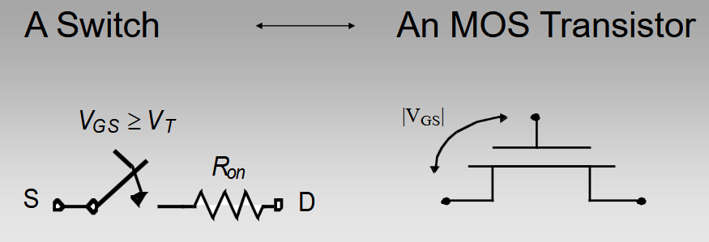{ width=50% }

By the transistor scaling, short channel are behaving differently due to the **velocity saturation**. The relation becomes linear and not quadratic like it used to be.

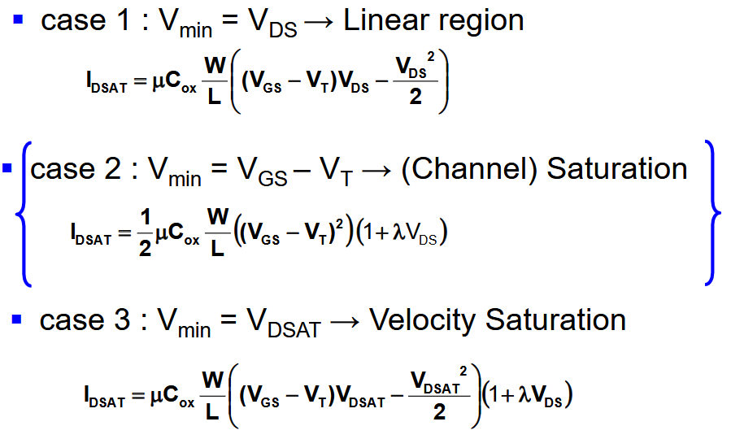{ width=50% }

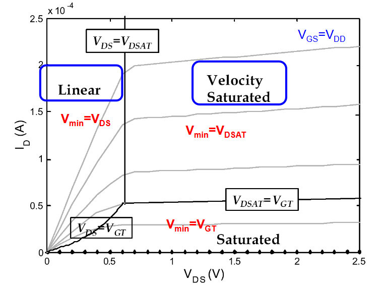{ width=50% }

# 2 - Logic Circuits

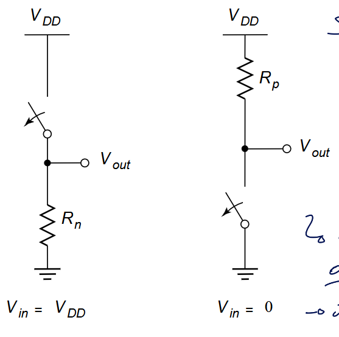{ width=50% }

The swing here is equal to $V_{dd}$ so we have a high noise margin. It is not a **ratioed** logic so we can't use tricks to minimize mismatch by taking advantage of ratios. We only have 1 resistor on so low output impedance but the input is the gate of MOS so we have a high input impedance. There is no static power consumption since no direct path from Vdd to ground. That's nice :)

In the dynamic model we need to add an output cap $C_L$. The load cap is simply the sum of all capacitance at the output node. Transition time is determined by the charging of this cap by a resistor. The sizing impacts the dynamic behavior of the gate.

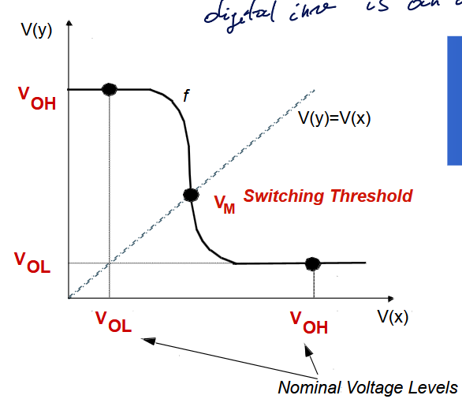{ width=50% }

Ideally we want $V_M$ to be at the middle of the other nominal voltage. We call the region in between the *undefined region*.

## Regeneration of the level

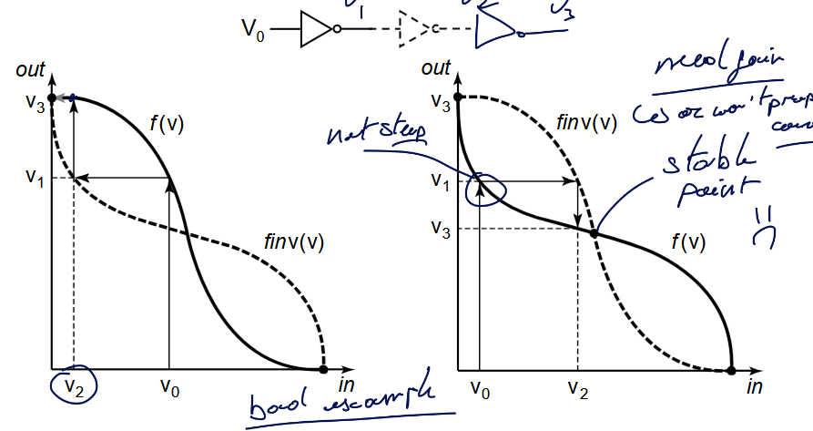{ width=50% }

With using this type of gate we have some regeneration level, it will amplify the signal and so we won't have undefined level and we will have the signal that will reach one defined state. If we have no regeneration, we will reach meta-stability. We have to meet some conditions : 

* The transient or undefined region in the VTC should have a gain |dVout/dVin| larger than 1
* In the “legal” or defined regions the VTC gain should be smaller than 1 in absolute value
* The boundary between the defined and undefined regions are $V_{IH}$ and $V_{IL}$ where the gain = -1

We need gain or the signal will be lost.

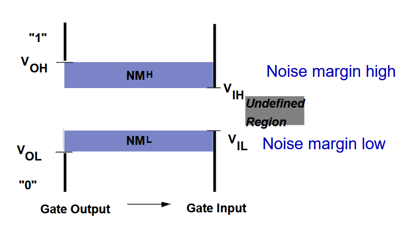{ width=50% }

We have 3 different types of noise : 

1. Inductive coupling
2. Capacitive coupling
3. Power and ground noise

The noise margin in CMOS is rather high which is a good thing seeing the low output impedance.

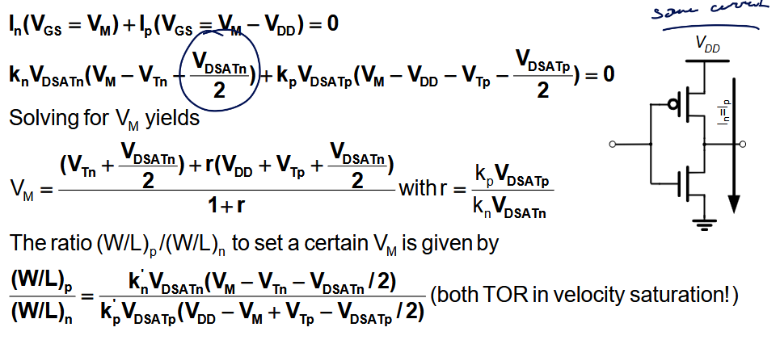{ width=50% }

We see that the ratio of PMOS and NMOS determine the $V_M$ voltages.

## Capacitance

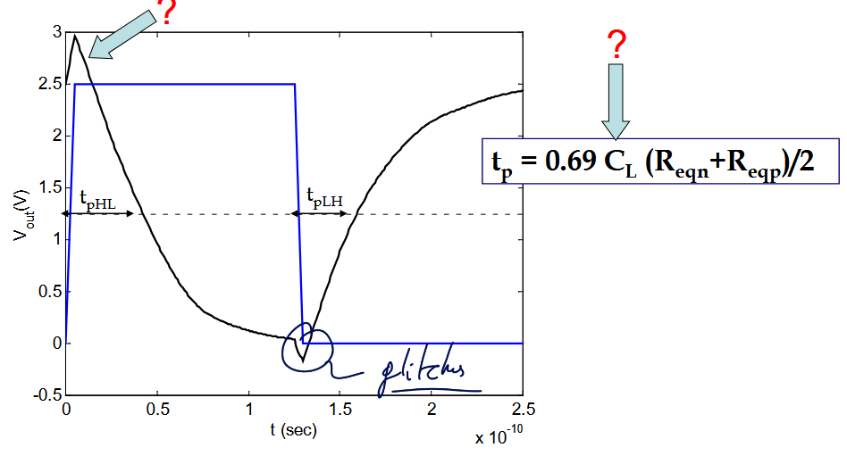{ width=50% }

We know that the delay of a switch is $t_{phl} = f(R_{on} C_L) = ln(1/2) R_{on} C_L = ln(1/2) (R_{eqn} + R_{eqp})/2 \cdot C_L$. We are still observing some glitches when we switch on and off. This **isn't** due to the miller effect. This **overshoot** is due to the gate drain capacitor. 

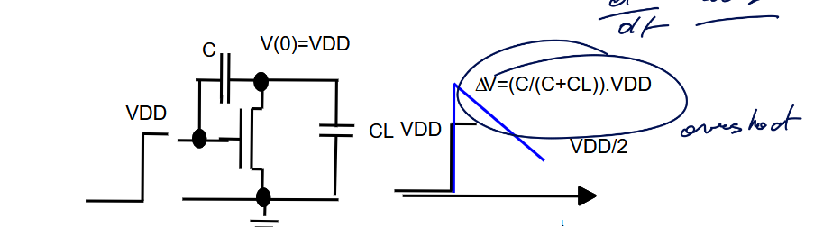{ width=50% }

This is due to charges and sudden and "infinite" steep step at the input which will create an extra unwanted voltage. Thankfully the input isn't as steep in reality and so the effect is less severe but still noticeable. We call it the *digital miller effect*:

$$
t_d = \frac{C_{total} \cdot (\Delta V+ V_{DD} /2)}{I_{max}} = \frac{(C+C_L)}{I_{max}} \left( \frac{C}{C+C_L} V_{DD} + \frac{V_{DD}}{2} \right) = \frac{(3C+C_L) \cdot V_{DD}}{2I_{max}}
$$

So it is like the cap becomes 3 times larger (similar to the miller effect) but in reality we are closer to 2 since we never have a perfect step at the input.

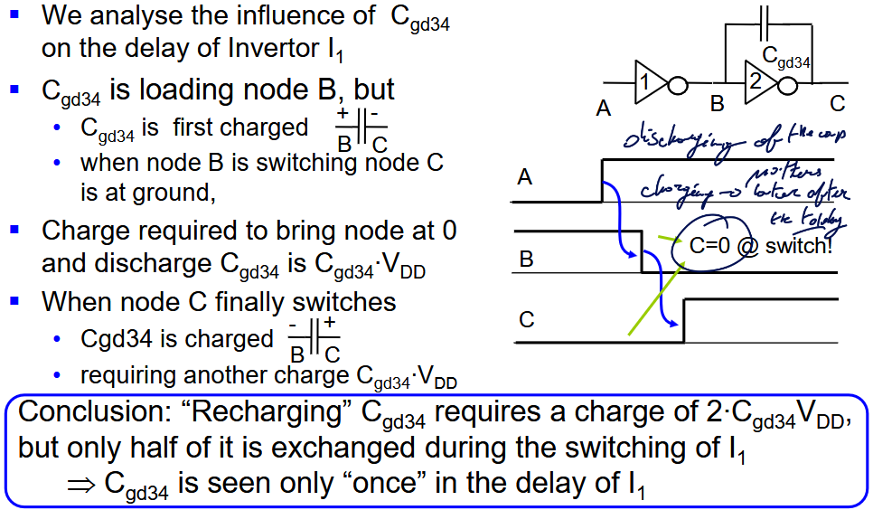{ width=50% }

We can move those $C_{gd}$ to the inside and see it as an impact on $C_L$. Again we can reuse the theory of DDP with the intrinsic and extrinsic load where $C_L = C_{int} + C_{ext}$ : 

$$
t_p = 0.69 R_{eq} (C_{int} + C_{ext}) = 0.69 R_{eq} C_{int} \left(1 + \frac{C_{ext}}{C_{int}}\right) = t_{p0} \left(1+\frac{C_{ext}}{C_{int}}\right)
$$

So the sizing can help up to a certain point where we have an *irreducible* delay.

### Effective fan-out

The input $C_g$ and intrinsic cap are always proportional to the sizing : $C_{int} = \gamma C_g$ where $\gamma$ is a technological constant. Same goes for the extrinsic load $C$ where it is the input $C$ of the next invertor proportional to the sizing $C_{ext} = fC_g$. So we can summarize the delay $t_p$ by :

$$
t_p = t_{p0} \left( 1+\frac{f}{\gamma} \right)
$$

The delay depends on the ratio between its external load capacitance and its input capacitance, te ratio is called the *effective fan-out*.

The newly introduced $\gamma$ is not valid for dynamic logic or more exotic technologies. If this $\gamma = 1$ then it means that $C_{int} = C_{in}$. It is an acceptable approximation in standard CMOS logic.

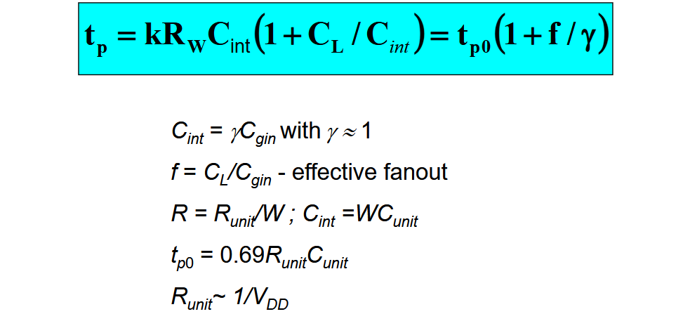{ width=50% }

For the ring oscillator where we assume equal size $f=1$ is independent of the size. In real technology we see only a weak dependency of timing on sizing.

### Signal in reality

We know that we can't have infinitely steep signal and even worse, a too slow rise and fall time could lead to metastability issues ! We could also have some actual short circuit for a brief amount of time leading to waste of energy. So in most of design software we will leave some headroom to avoid possible short-circuit and we will flag it with *max transition violation*.

#### Note on sizing

When we see the $a$ or $b$ next to a transistor it is its *relative sizing* compared to a classic $\frac{W_{min}}{L_{min}}$. For complex gate and due to the various sizing we can have, we will transform a little  bit our formula :

$$
t_p = t_{p0} \left( p+\frac{gf}{\gamma} \right) = t_{p0} d
$$

* $f$ : electrical effort
* $g$ : logical effort
  * due to the fact a logical gate is always slower than an invertor with equal current drive. Ratio of input cap to the cap of an inverter that delivers equal current.
* $p$ : ratio of intrinsic delay of the gate to the intrinsic delay of an invertor
* $d$ : gate delay
  * relative to  the intrinsic delay of the reference invertor

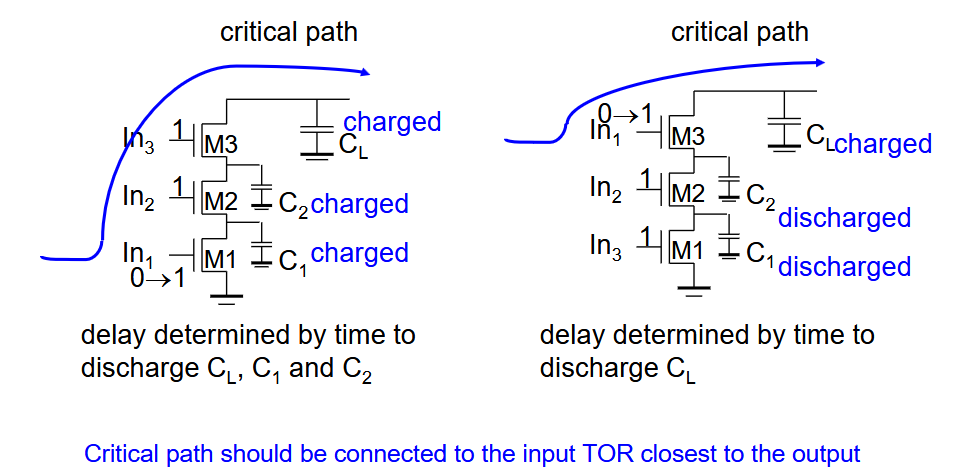{ width=50% }

## Pass gate logic

Another approach than PUN and PDN as seen previously is the pass gate logic where we will not only use the gate but also the source of a transistor to create some gate.

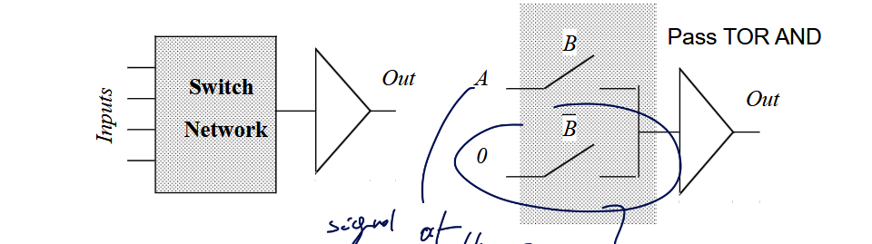{ width=50% } 

This technique uses less transistors. But the NMOS isn't a really good pull up transistor. It won't give a nice and crisp high voltage but rather a voltage with a $\Delta V = V_{Tloss}$. So to keep this signal crisp and nice we are obligated to add an INV to output a valid signal. This goes in the same idea as the *regeneration of the signal* logic.

So cascading of passes tor logic isn't a smart choice since the signal will rapidly deprecate.

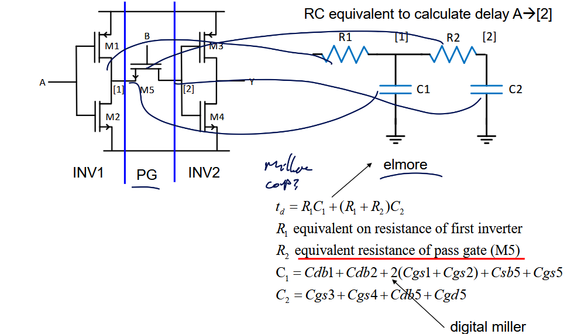{ width=50% }

### Level restoration

So we need to do what we call *level restoration*.

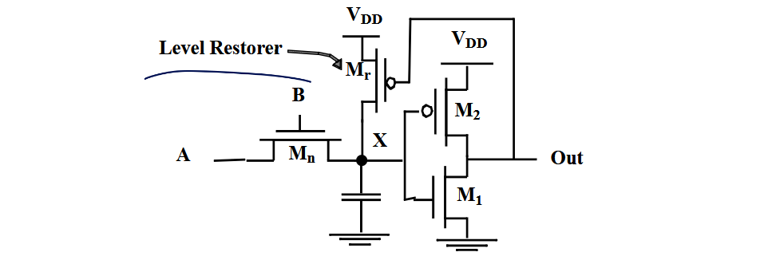{ width=50% }

It is compatible with the full swing and the static power consumption is gone. But we need a bleeder which will increases capacitance at node X and takes away the pull down current. Leads to speed degradation and needs proper sizing.

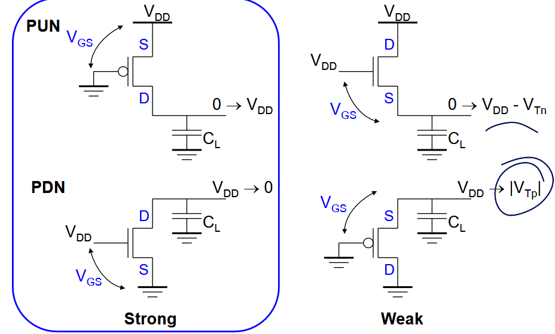{ width=50% }

#### Transmission gate

We can add a PMOS to the switch to create a **transmission gate**. This requires another transistor but also a complementary signal is needed so this will result in extra cost.

# 3 - Circuit Timing / Dynamic Logic

## Latch/Register Implementation

We know that having 2 INV back to back could lead to meta-stability so how can we reliably store data ? We want to remember the data *no triggering* but also sample and so stop looping the data *triggering*. In the second approach we simply *overpower the feedback loop* due to the asymmetry of the INV and so the input D will be more important than the output of the small INV (**David-Goliath latch**). Or we can cut the loop like in the second example.

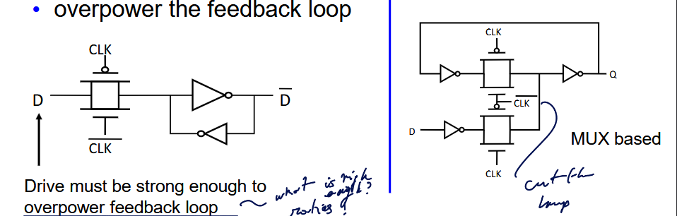{ width=50% }

| Specifications |     Positive Latch      |       Register        |
| :------------: | :---------------------: | :-------------------: |
|   Storage ?    | store when clock is low | Stores on rising edge |
| Transparent ?  | Yes when clock is high  |          No           |

For latches we can either go for positive or negative latches and a register is simply two latch back to back. We can do latches using MUX for example.

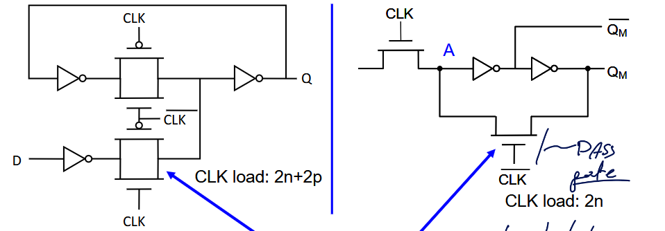{ width=50% }

The second option is more preferable because it will have less load on the CLK which reduce the energy waste. But we need to remember we have to *regenerate* the signal since we will have a $V_{Tloss}$.

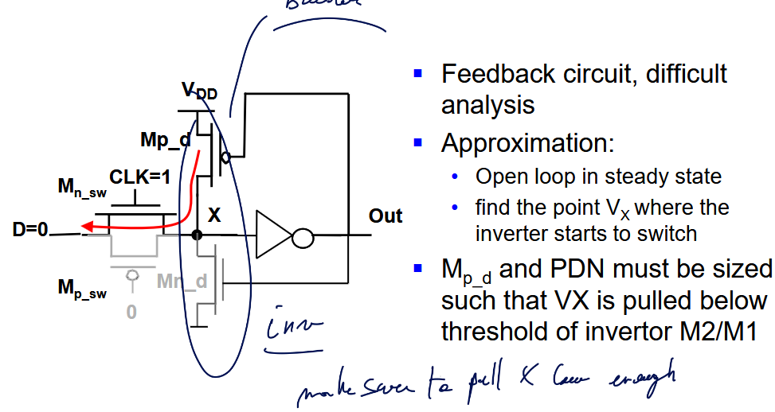{ width=50% }

The latch is pretty similar to the idea we have seen with pass gate. Here we can see again the bleeder on top and NMOS on the bottom which forms a basic INV.

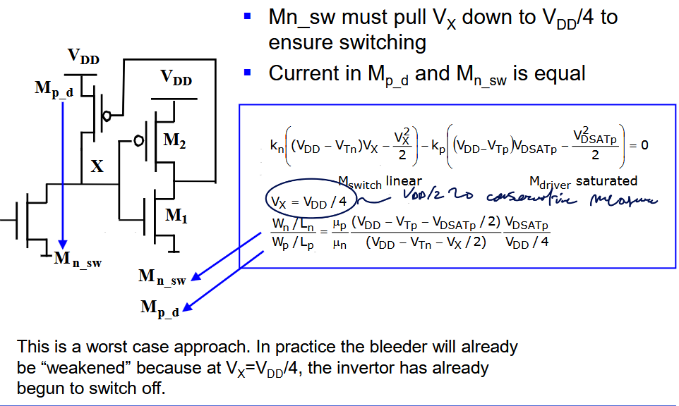{ width=50% }

**NEED TO READ THIS PART CAREFULLY**

**PAGE 15**

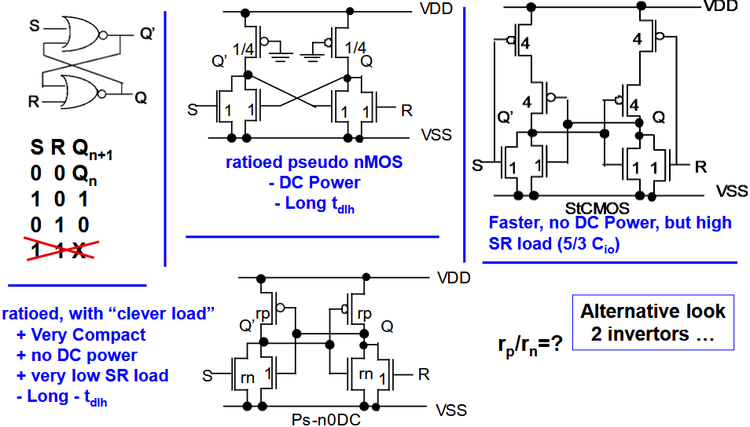{ width=50% }

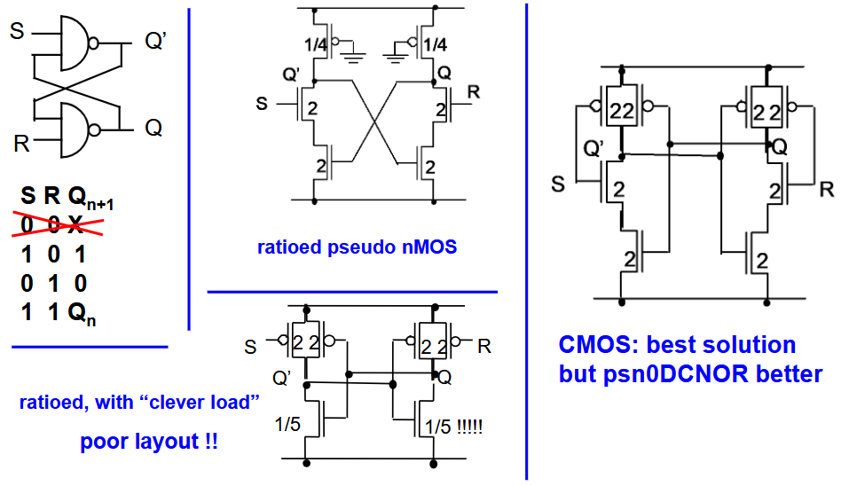{ width=50% }

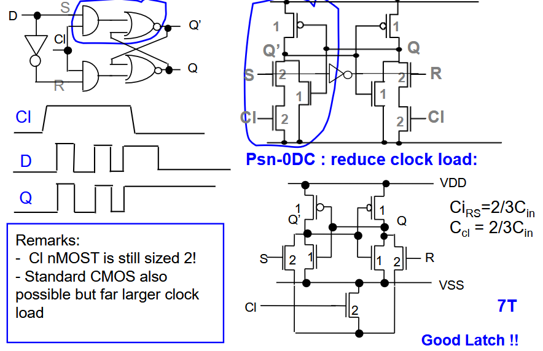{ width=50% }

## Sequencing, pipelining revisited

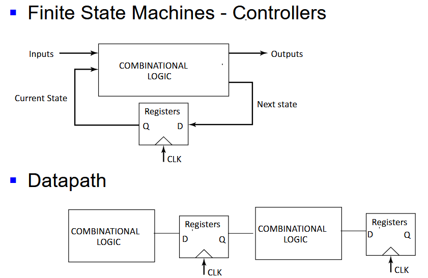{ width=50% }

We can also have a *latch based pipelines*, the sequencing is much more soft but we could have race condition if the clocks are overlapping.

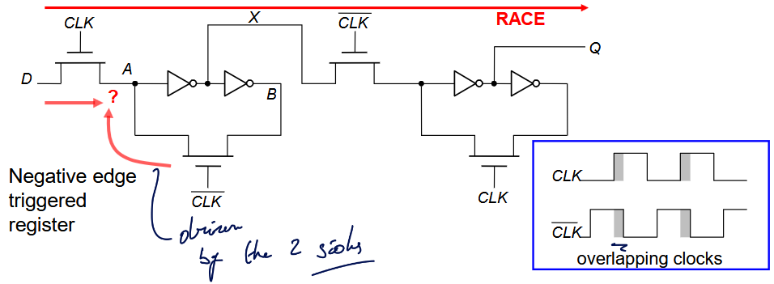{ width=50% }

Here we can have a 1-1 overlap on both latches are transparent. We can also have some undefined states where a node is driven by multiple nets. 

When we have a 0-0 overlap it is like a pseudo static latch since there is no change.

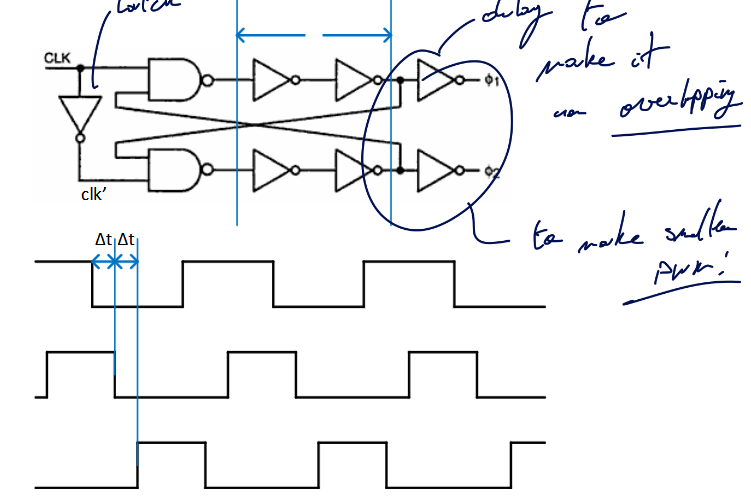{ width=50% }

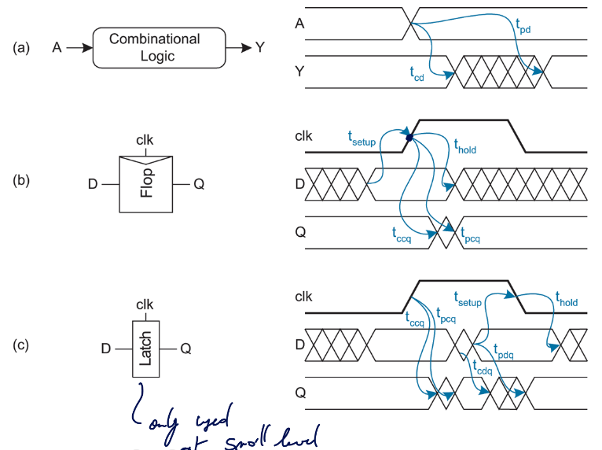{ width=50% }

| **Term**    | **Name**                                    |
| ----------- | ------------------------------------------- |
| $t_{pd}$    | Logic Propagation Delay                     |
| $t_{ad}$    | Logic Contamination Delay                   |
| $t_{pcq}$   | Latch/Flop Clock-to-*Q* Propagation Delay   |
| $t_{ccq}$   | Latch/Flop Clock-to-*Q* Contamination Delay |
| $t_{pdq}$   | Latch *D*-to-*Q* Propagation Delay          |
| $t_{cdq}$   | Latch *D*-to-*Q* Contamination Delay        |
| $t_{setup}$ | Latch/Flop Setup Time                       |
| $t_{hold}$  | Latch/Flop Hold Time                        |

For registers 

$$T_c > t_{pd} + \underbrace{t_{pcq} + t_{setup}}_{\text{sequencing overhead}}\qquad t_{cd} + t_{ccq} > t_{hold}$$

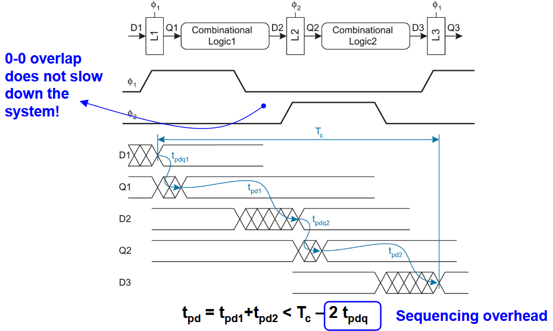{ width=50% }

$t_{cd} + t_{ccq} + t_{nonoverlap} > t_{hold}$

In the registers logic, we set the clock speed based on the slowest logic section. But in latch logic, we can do some **time borrowing** technique to take some time from the next cycle. We can't do this if we loop the data over in which case we will have some overlap of processing data.

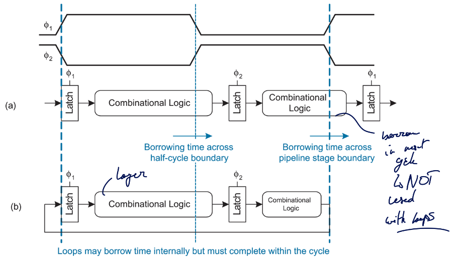{ width=50% }

To compute the maximum allowed borrow time is based also on the setup time :

$$t_{borrow} < T_c/2 - (t_{setup} + t_{non\_overlap})$$

### Clock skew

It is the fact the clock will have to propagate to gates and it can take less or more time depending on the travel distance. It is a deterministic phenomena. The statistical one is jitter which is not taken into account in this course.

We can use a **clock tree** structure to balance the clock and to make sure that the path taken for all the components is of the same length. It is not always feasible. It is also influenced by interconnect properties.

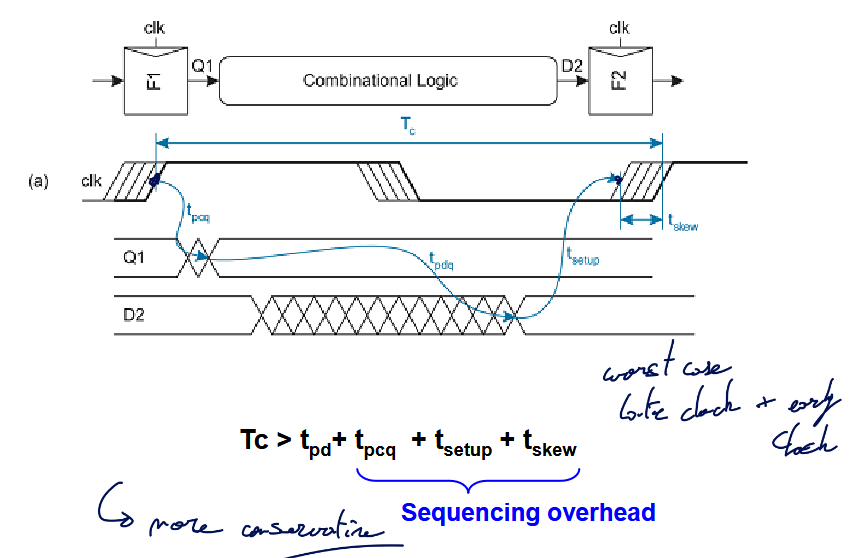{ width=50% }

If we do latch logic the timing is not impacted by $t_{skew}$ since the *signal has the whole transparent phase to arrive*.

$$t_{pd} = t_{pd1} + t_{pd2} < T_c - 2\cdot t_{pdq}$$

And for time borrowing we get :

$$t_{borrow} < T_c/2 - (t_{setup} + t_{non\_overloap} + t_{skew})$$

For the validity we have :

$$\text{FF: } t_{cd} + t_{ccq} - t_{skew} > t_{hold} \qquad \text{Latch: } t_{cd} + t_{ccq} + t_{non\_overlap} - t_{skew} > t_{hold}$$

|                                   | **Sequencing overhead** $(T_c - t_{pd})$ | **Minimum logic delay** $(t_{cd})$                                         | **Time borrowing** $(t_{borrow})$                                        |
| --------------------------------- | ---------------------------------------- | -------------------------------------------------------------------------- | ------------------------------------------------------------------------ |
| **Flip-Flops**                    | $t_{pcq} + t_{setup} + t_{skew}$         | $t_{hold} - t_{ccq} + t_{skew}$                                            | 0 (*doesn't exist*)                                                      |
| **Two-Phase Transparent Latches** | $2 \cdot t_{pdq}$                        | $t_{hold} - t_{ccq} - t_{non\_overlap} + t_{skew}$   in each half-cycle | $\frac{T_c}{2} - \left( t_{setup} + t_{non\_overlap} + t_{skew} \right)$ |

## Dynamic logic

The idea behind *dynamic logic* is to charge and discharge a node that has a high impedance. While in static logic the output is either connected to VDD or GND via a low resistive path.

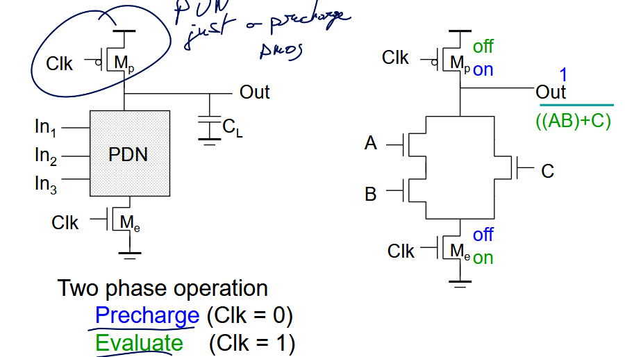{ width=50% }

We use the low CLK to charge and then evaluate when it is high. So if we discharge by mistake, we will have to wait the next clock cycle. There is 0 or 1 transition during evaluation. We can keep the node high before or after evaluation.

We only need to create a PDN which represent the function we are trying to produce only $N+2$ (so less transistor compared to static logic $2 \cdot N$). We have full swing outputs. No need to ratio size and we have a faster switching speed since the output and input line has less capacitance. Less logical effort.

But we have a higher power dissipation than static logic. The line is always active and for a continuous set of 0 we need to load and discharge all the time the cap. We have a low noise margin since the PDN will start working as soon as the input signal exceed $V_{thn}$ and so $V_M = V_{IH} = V_{IL} = V_{thn}$.

More over, there is some diode on the substrate that causes leakage (*junction leakage of diode in reverse bias*). We also have some *subthreshold leakage* which is dominant. 

I we don't compensate for the leakage, we force a higher clock frequency to avoid falling in the gray zone. We however compensates for this with using a bleeder or level restorer. This will induce some extra static power consumption.

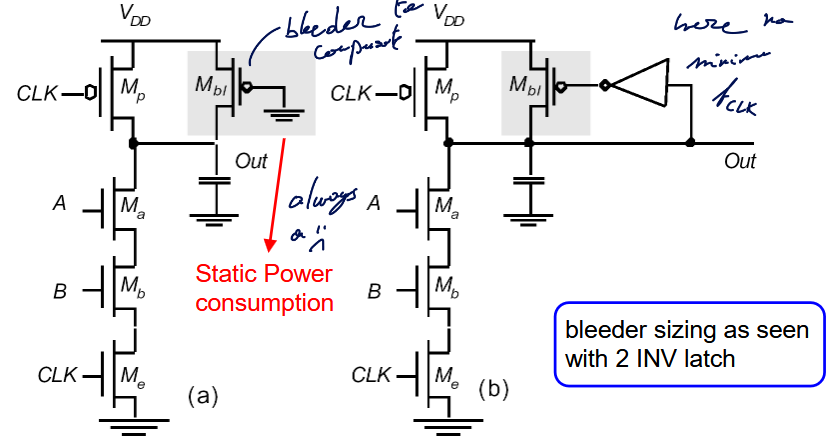{ width=50% }

#### Charge sharing

Something that can happen due to noise, is that the transistor A will discharge by mistake $C_{out}$ and the charge will go to the node between $A$ and $B$. The charges will split between those two cap reducing the output voltage and have a higher noise sensitivity. 

One way to avoid this is to precharge the internal nodes. But we need more transistor, more energy and it will increase the $C$ making the circuit slower.

### Charge coupling

It is also pretty sensitive to charge coupling. So any wire-to-wire crosstalk can be disastrous. There is also the backgate coupling or output to input coupling that can be problematic. We should also avoid clock feedthrough and overshoot.

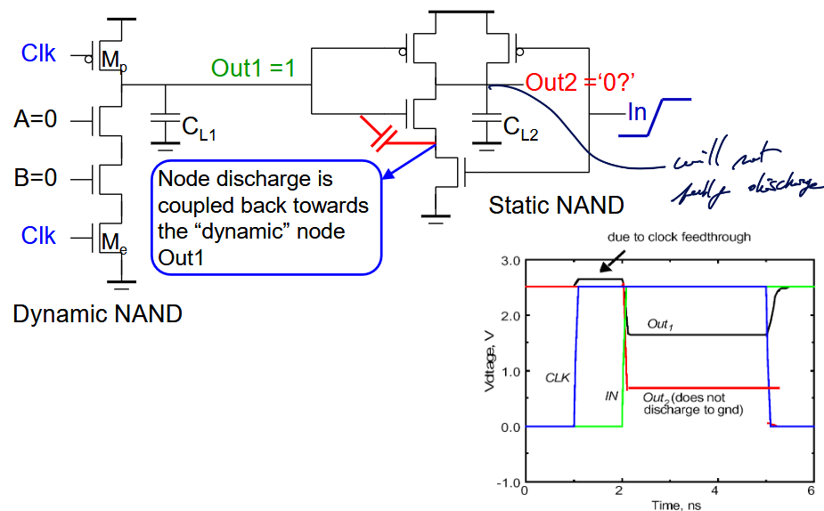{ width=50% }

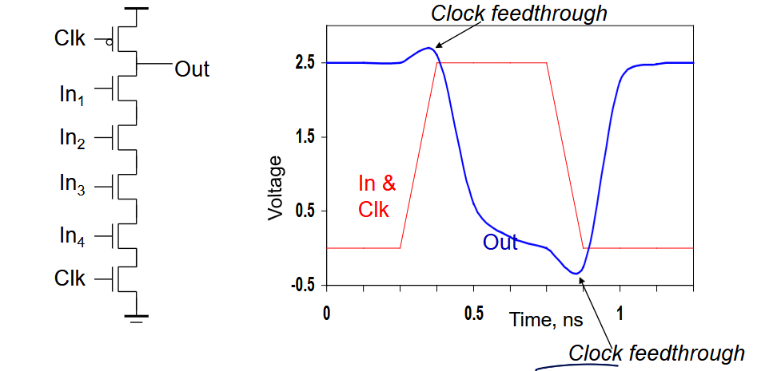{ width=50% }

Danger: charge injection in the substrate. Charge can be collected by HiZ node or lead to latch-up.

#### Latch-up

It is an annoying phenomena where the substrate of MOS transistors has a parasitic thyristor junction we can cause latch-up and put the transistor in an unwanted state. To reset, we need to cut-off the power of the circuit and start again. (*More info: Weste N., e.a. “Principles of CMOS VLSI design – a systems perspective. Second Edition”, Addison Wesley, 1993*)

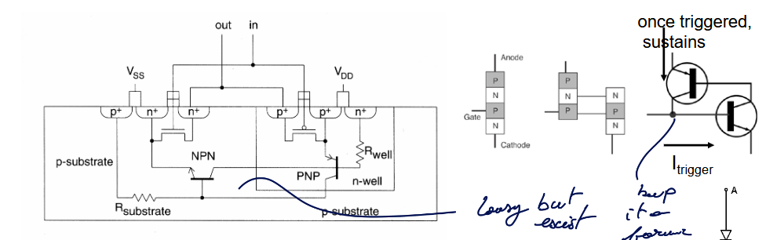{ width=50% }

### Cascading dynamic logic

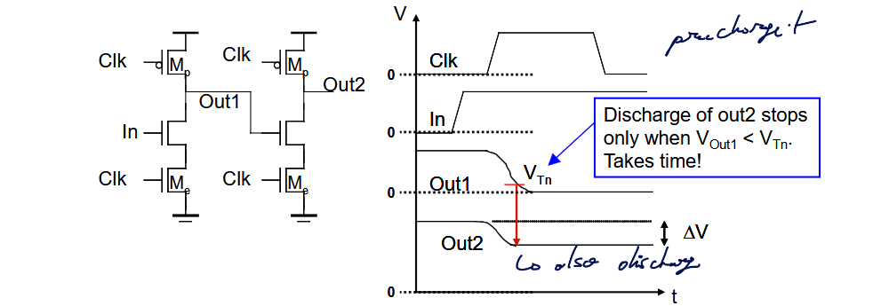{ width=50% }

The finite propagation delay from in to out1 will cause a partial discharge at out2 which can again makes the output 2 invalid resulting in unwanted behavior.

#### Domino logic

To avoid this we can add an inverted between the two stages. So any transition from charged to discharge or keep will result into a valid state. The static invertor is like a buffer and we need some extra logic to restore the correct output.

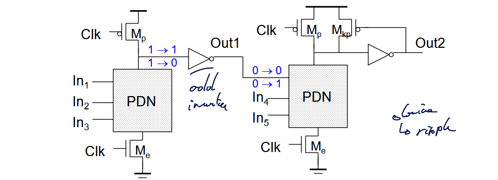{ width=50% }

We can add some skew to the inverter since the only critical transition is the $1\rightarrow 0$ one. We reduce the impact impedance. Only non-inverting logic can be implemented ! So we either need to do some logic transformation (not always possible) or use **dual rail domino**.

#### Dual rail domino logic

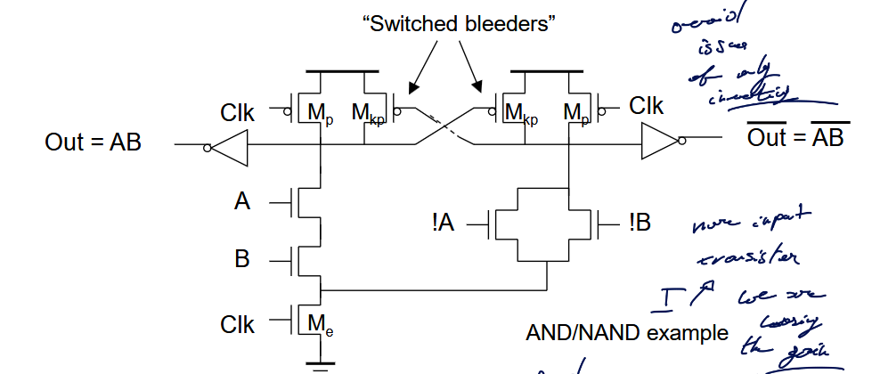{ width=50% }

We need to construct 2 PDN one where we do $F(A,B,C)=(A \& B)|C$ or any function and then its NOT version $\overline{F(A,B,C)}$ using *De Morgan*'s theorem. So only one branch will switch on and only one side will make a transition. But it comes at the expense of area and continuous switching no matter the result.

#### Alternative to cascade of dynamic logic

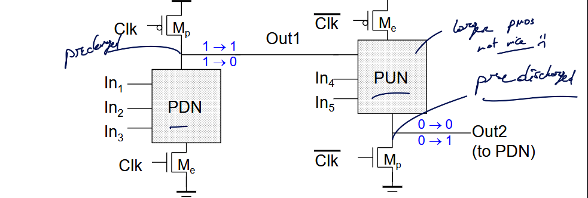{ width=50% }

A good alternative is to switch between PDN and PUN networks so the $0\rightarrow 1$ transition are allowed at inputs of PDN and $1\rightarrow 0$ transitions are allowed at inputs of PUN.

#### Dynamic edge triggered register

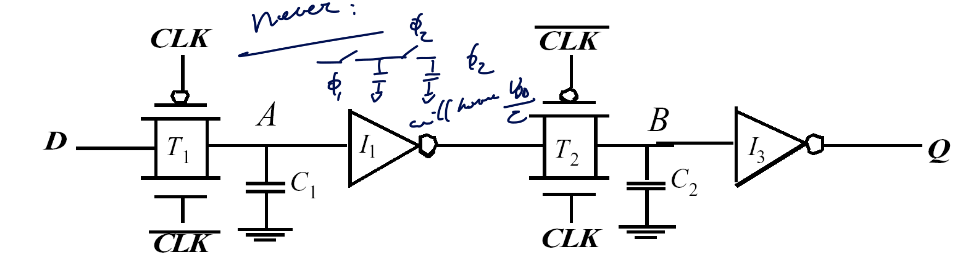{ width=50% }

We use a capacitor as a storage source that we need to refresh. We can't simply halt the clock. It is sensitive to $0\rightarrow 0$ and $1\rightarrow 1$ transition and to clock overlap. But we have good performance

### Clocked CMOS or $C^2$MOS

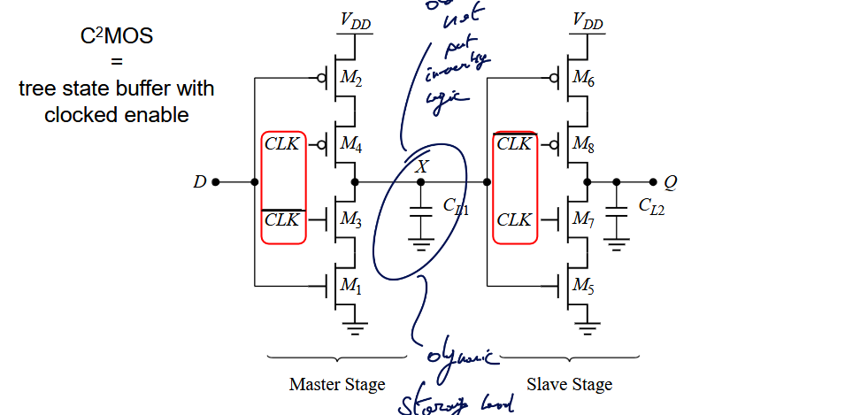{ width=50% }

Now it is no longer sensitive to clock overlap just need a fast enough rise and fall times.

#### True Single Phase Clock (TSPC) logic

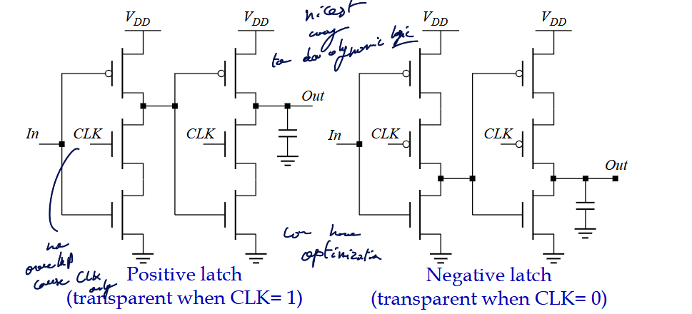{ width=50% }

Here we only have 1 clock phase so easy to distribute the clock and no overlap by construction. At first when $CLK=1$ we have like 2 invertors and so the latch is transparent. But when $CLK=0$, the charge can't be pulled down and if we have $In=0$, the output won't change since the inverter will stop the propagation of that value.

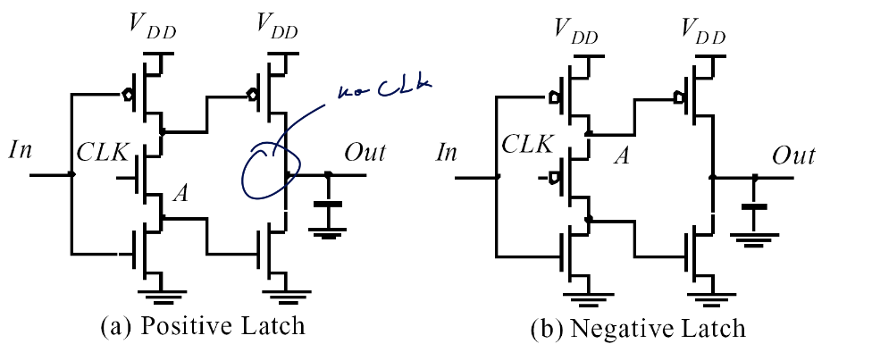{ width=50% }

It has less TOR and clock load but the split outputs don't have full swing. We have less drive, less VDD scaling possibility.

### Conclusion

- Due to its high impedance nature, design of dynamic circuits is tricky and requires extreme care at the circuit level.
- Hard to automate in a synthesis – P&R flow based on static CMOS standard cells
- Power consumption of dynamic logic is usually higher.
- Nothing is as easy as standard CMOS...

# 4 - Datapath block

## Adders

The key idea for this, is to view the addition not just as a mathematical operation but as a LUT that can have different states: delete, propagate, generate:

| $A$ | $B$ | $C_i$ | $S$ | $C_o$ | Carry status |
| --- | --- | ----- | --- | ----- | ------------ |
| 0   | 0   | 0     | 0   | 0     | delete       |
| 0   | 0   | 1     | 1   | 0     | delete       |
| 0   | 1   | 0     | 1   | 0     | propagate    |
| 0   | 1   | 1     | 0   | 1     | propagate    |
| 1   | 0   | 0     | 1   | 0     | propagate    |
| 1   | 0   | 1     | 0   | 1     | propagate    |
| 1   | 1   | 0     | 0   | 1     | generate     |
| 1   | 1   | 1     | 1   | 1     | generate     |

This logic can be represented as 

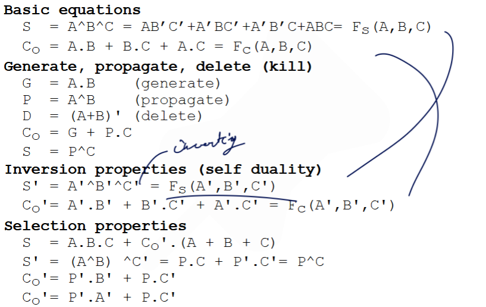{ width=50% }

We can optimize each and every operation to make the adder faster. The main bottleneck in adder is the carry propagation. Faster will always require more hardware, *conservation of misery* !

### Ripple Carry Adder

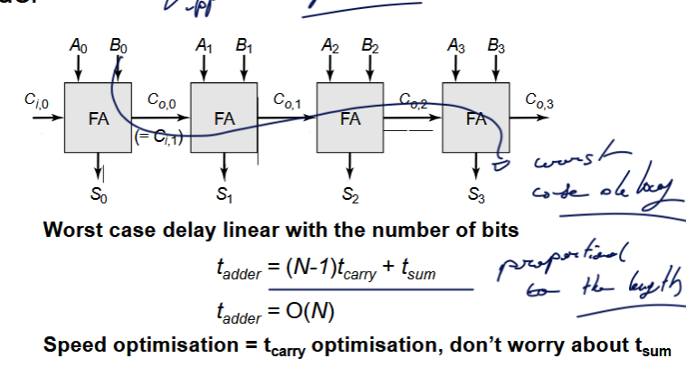{ width=50% }

It needs toooooo many transition to do simple operation.

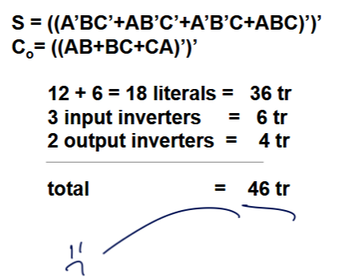{ width=50% }

#### Multilevel Optimisation

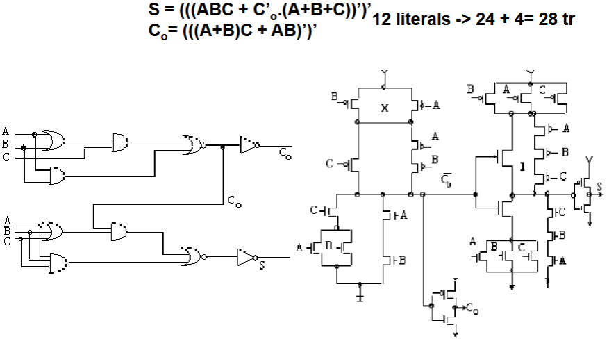{ width=50% }

#### Inversion Property

Multilevel logic is inverting so this can be problematic ? No remember the inversion property of the adder, so we can simply invert the values.

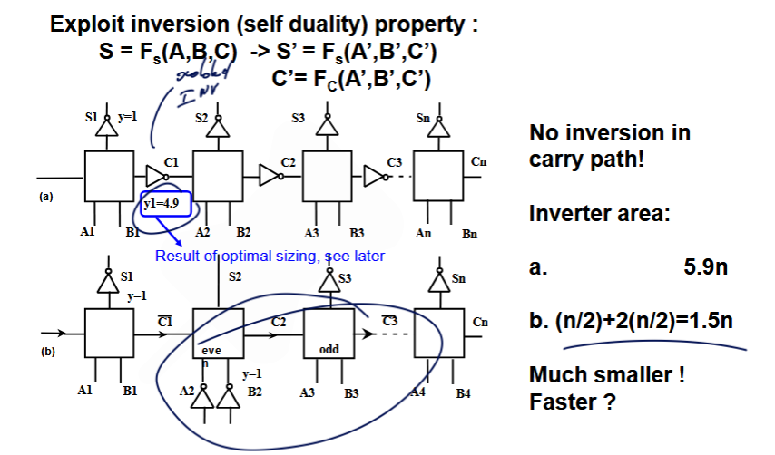{ width=50% }

### Mirror Adder

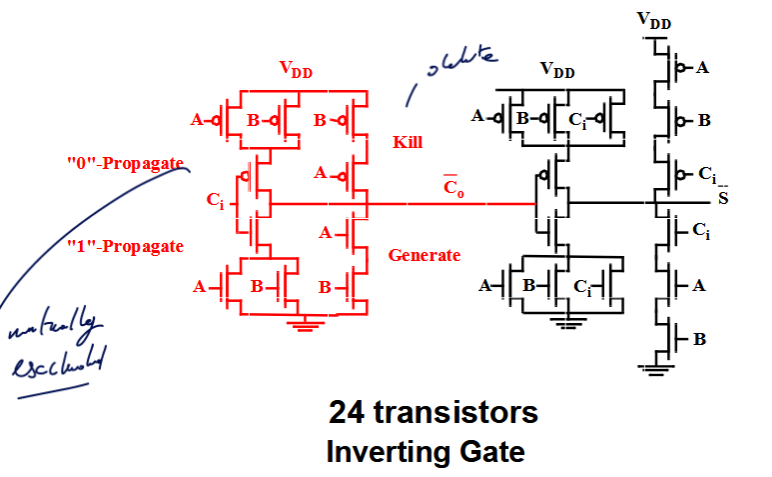{ width=50% }

The NMOS and PMOS chains are completely symmetrical and a maximum of 2 series transistors can be observed in the carry generation circuitry. To have good speed, we must reduce the capacitance on the $C_0$ node.

This node has 4 diffusion cap, 2 internal gate cap, 6 gate cap (through the connecting adder cell).

The transistors connected to $C_i$ are placed closest to the output. We must optimize the transistors in the carry stage only !

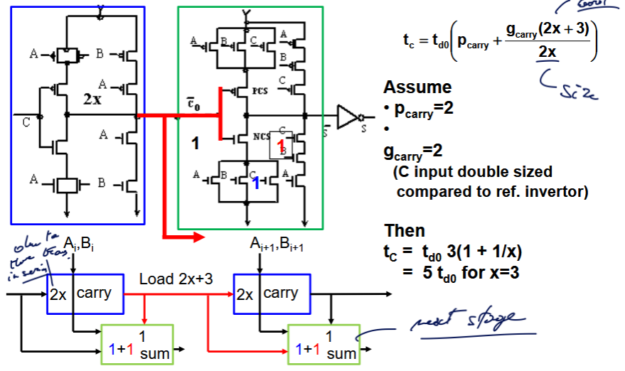{ width=50% }

It is also possible to do it with the invertor, SEE COURSE.

## Faster Adder

### Carry bypass (or carry skip)

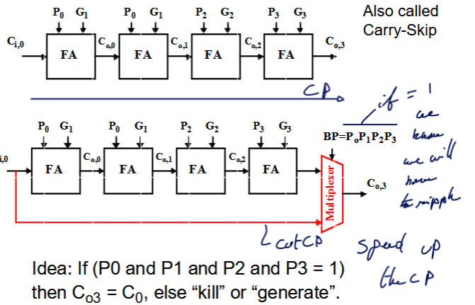{ width=50% }
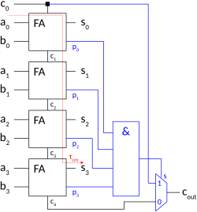{ width=50% }

#### Finding the critical path

It can often be quite tricky to find where is the local path without actual numbers. We need to build some model that will represent the critical path based on some sizing and other parameters.

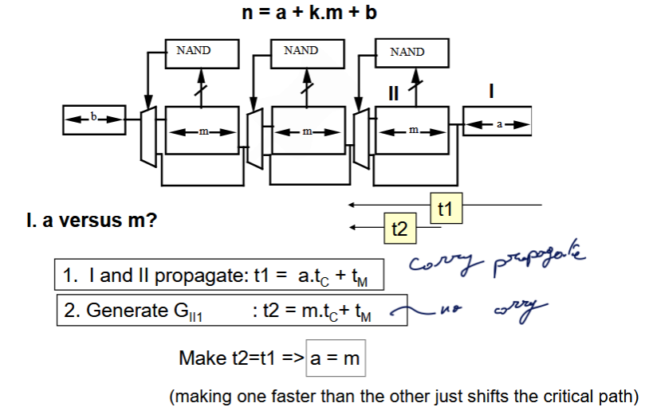{ width=50% }

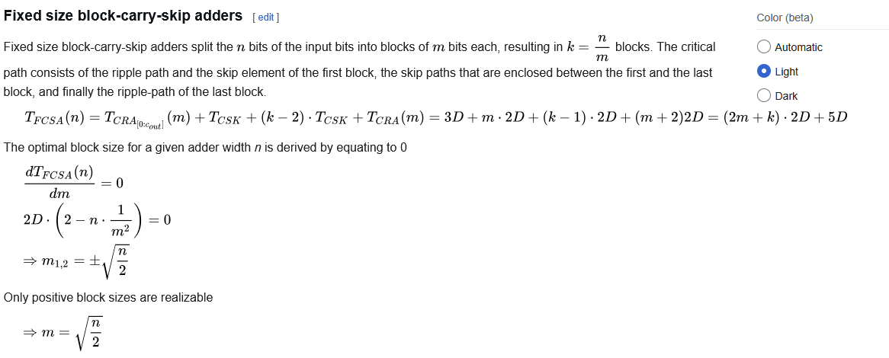{ width=50% }

See course about this

### Carry select
### Carry look ahead
### Logarithmic trees

# 5 - Production Test

We cannot build a working chip that is not testable, no one would buy our chip if we can't demonstrate that a specific die is working. This is why we need production test, to demonstrate that each of our sample is working as expected.

## Introduction: what’s the problem

Let's dive in.

### Ad hoc versus structured test

We have two type of cost:

- Non recurring cost: development cost, engineer salary
- Recurring cost: testing the chip, the time it takes us, the reduced throughput

We need to increase the *observability* and *controlability* but adding more pins is expensive for IC, so we need to use a **scanning technique** where we load in a buffer we can observe all the data. We can also add more controlability by using muxes that are driven by a test mode signal. This a **ad hoc method** of testing.

But we don't always have this available. We don't always know how everything works.

## Structured test

We could just enumerate all possible state, But with $n$ inputs and $m$ states, we have $2^{m+n}$ tests, which quickly explode and we can't just test all possible combinations.

### Structural testing

It is based on the fault models and knowledge of the circuit structure. We can predict or check for specific defect and use the **Automatic Test Pattern Generation (ATPG)**

## Design for testability

TOOD

## Summary

TODO

# 6 - Low Energy Design

We have some fundamental equations related to power and energy:

$$
E_{dyn} = QV_{dd} = CV_{dd}^2 \qquad P_{stat}= V_{dd}I_{leak} \qquad E_{stat} = V_{dd} I_{leak} t_d
$$

## Fight the battle at all levels

$$
P = \alpha CV_{dd}^2 f_{clk} + I_{subth} V_{dd}
$$

The most simple idea is to:

- Kill activity $\alpha$
- Reduce cap $C$
- Reduce $V_{dd}$
- Clock slower $f_{clk}$
- Less leakage $I_{subth}$

Activity factor is a software dependent value and analysis tools can use statistic to estimate the switching probability but it isn't perfect.

In this course we focus on circuit design and architecture. So we can play with $V_{DD}$, use more or less parallelism, do some signal and clock gating, ...

All this level of abstraction can sometimes obfuscate the fact that two circuits can have different power performance. It can be hard to locate and to monitor it with the complexity of modern tools.

## (micro)Architectural choices

Due to combination logic and the fact that we may go through multiple level of gates, we can have some glitches: so an unwanted, unnecessary transition that is synonym of wasted energy.

Typically, this glitch issue is present in Ripple Carry Adder (RC Adder). To avoid it, we can adopt a **tree structure** to balance the delay path and so to avoid unwanted transition. We can think of the *Log adder*.

The **logic depth** is the source of this glitch and so pipelining will help it.

### Signal Gating

To avoid such glitches or overall unwanted transition, we can do signal gating and avoid signal propagation. But we need more circuitry and power, so it is a trade-off and optimization problem.

Signal gating is only interesant if we toggle the gate less often than the signal that we block or let pass. Even better is sharing a control signal between multiple part of the circuit. We usually uses clock, data buses, ...

#### Guarded evaluation

One implementation of this idea is **guarded evaluation** where we will trigger the evaluation only if we know we want its result next clock cycle.

#### Precomputation

Here we check the if condition earlier and avoid propagating useless inputs.

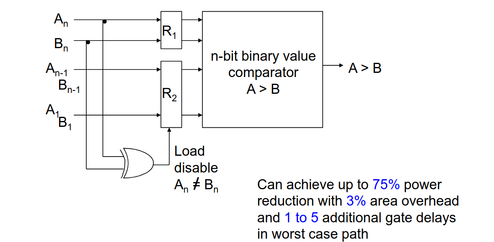{ width=50% }

#### Clock gating

Can be done automatically and efficiently but introduce *skew* and *testability problems*.

### Dilemma

The biggest dilemma here is the trade-off between more hardware and slower speed which is better for the *dynamic POV*. But more hardware means more leakage which is bad for *static leakage*.

If we lower the supply near $V_T$ we know that:

$$
I_D = I_0 e^{\frac{V_{dd}- V_T}{nkT/q}}
$$

So we will still have some current ... We can reduce the supply but we will have lower speed, less difference between $I_{on}$ and $I_{off}$ and more sensitive to variation. The speed isn't an issue for many application in reality and luckily enough, products that run at those frequency usually want low energy usage. Win-win situation for once. 

But let's not get overwhelmed and keep in mind the actual FoM is $E/op$ not who got the smallest supply. In fact, going to low will at some point increase the current consumption at some point.

Hard to quantify the *sign off* and it changes from one netlist to the other quite drastically.

## The plumber's manual

### Power gating

Usually, we want to cut-off the logic that is no longer in use. We will implement the logic in **Low VT** and the switch network in **High VT** because:

- **Low VT**: high leakage but good performance
- **High VT**: low leakage

But when turning off the logic, we still want to keep the results of our previous calculation. For this, we need a **keeper** that needs low leakage. 

Also, switching the network on and off is not a good thing and we will have a penalty due to the charging and discharging of the cap $C_p$ and $C_n$.

### Variable Threshold CMOS

$V_T$ isn't fixed as seen in DIAC, we can model it with:

$$
V_T = V_{T0} \pm \gamma \left( \sqrt{2|\varphi_F-v_{BS}|} - \sqrt{2|\varphi_F|} \right)
$$

So changing $v_{BS}$ will bias the $V_T$. We call this Reverse Body Bias.

#### Issues

- $\gamma$ becomes smaller with scaling
  - Need more negative PSS which is costly and not always reliable
- Substrate is a large cap, so pretty slow and costs energy
- $V_{T}$  has an impact on performance

FDSOI is one solution that is talked about in the next chapter.

#### Forward body bias

Used here to increaser performance but we can go up to a certain point or we won't reverse the junction properly. It is quite complicated to control and should only be used where performance is absolutely critical.

#### Multiple Threshold CMOS

The best thing to do is to mix technologies of CMOS and use sometimes low or high $V_T$ transistor.

### Long-Le transistors

Another technique is to have longer length of transistor by about $10\%$ compared to the nominal length. They are $10\%$ slower but have **3 times lower leakage**. So whenever we have a path that have some slacks we will replace the transistor by this type of transistor.

One common practice, is to start designing with long Le transistor and then when we want to reach timing, we will reduce its length for the critical path.

Such Le transistors are often more appreciated as they don't require multiple power supply and is more effective.

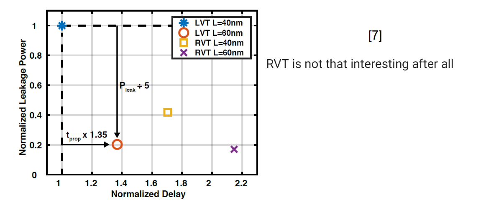{ width=50% }

### Stacking effect

> If one drain lets water out why not building another one a lil further down the river ?

That's what they thought when introducing this technique or something similar. It can drastically reduce leakage but will gives us less headroom for our design:

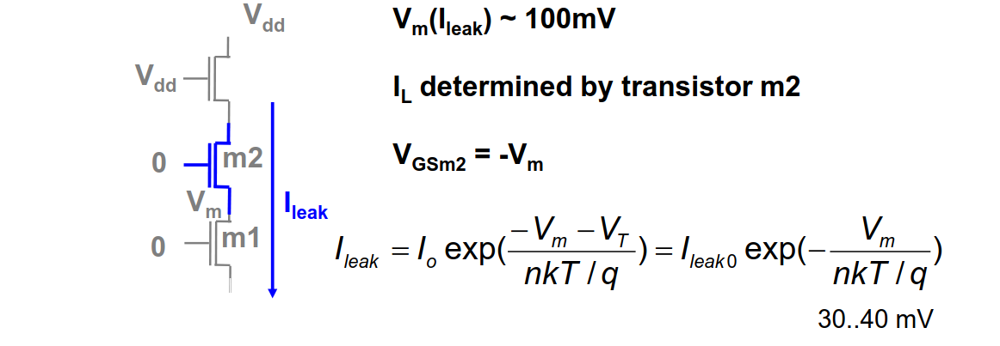{ width=50% }

We can have some natural stacking (because of the nature of the logic) or *forced stacking* where we will split one NMOS into two parts to reduce leakage.

### Standby vector

One last technique is to use *standby vector* that will force a 1 or 0 in standby mode.

## Sizing and multiple supply voltages

We saw in platforms how minimizing delay and energy is an optimization problem where we need to find the best tradeoff. On top of that, we need to stay between the rail, have a large enough transistor and respect $V_T$.

### Energy Delay Sensitivity

To compare various technology or implementation we can take a look at the sensitivity where:

$$
S_A = \frac{\partial E / \partial A}{\partial D / \partial A}\bigg|_{A=A_0}
$$

It is a powerful tool as it indicates the *effectiveness of changes* in design. With this, comes a lot of theory about optimality but one thing that is important here is the **pareto-optimality**.

#### Pareto-optimal

> the best that can be achieved without disadvantaging at least one metric

So basically, we can reduce one metric without raising another one. The two curves have various sensitivity.

$$
\Delta E = S_A \cdot (- \Delta D) + S_B \cdot \Delta D
$$

### Circuit analysis of Energy and Delay

When analyzing $i$ and $i+1$ logic gates we can find the delay to be (like in DDP):

$$
t_d = \frac{K_d V_{DD}}{(V_{DD} - V_T)^\alpha} \left( \frac{\gamma C_i + C_W + C_{i+1}}{\gamma C_i} \right) = \tau_{nom} : \left( 1 + \frac{C_{i+1}'}{\gamma C_i} \right)
$$

$$
E_{dyn} = (\gamma C_i + C_W + C_{i+1}) \cdot V_{DD,i}^2 = C_i (\gamma + f_i') \cdot V_{DD,i}^2
$$

Where $C_i = K_eS_i$, $f_i' = (C_W + C_{i+1})/C_i = S_{i+1}'/S_i$, giving us:

$$
E_i = K_e S_i (V_{DD,i-1}^2 + \gamma V_{DD,i}^2)
$$

We can then derivate the sensitivity to sizing:

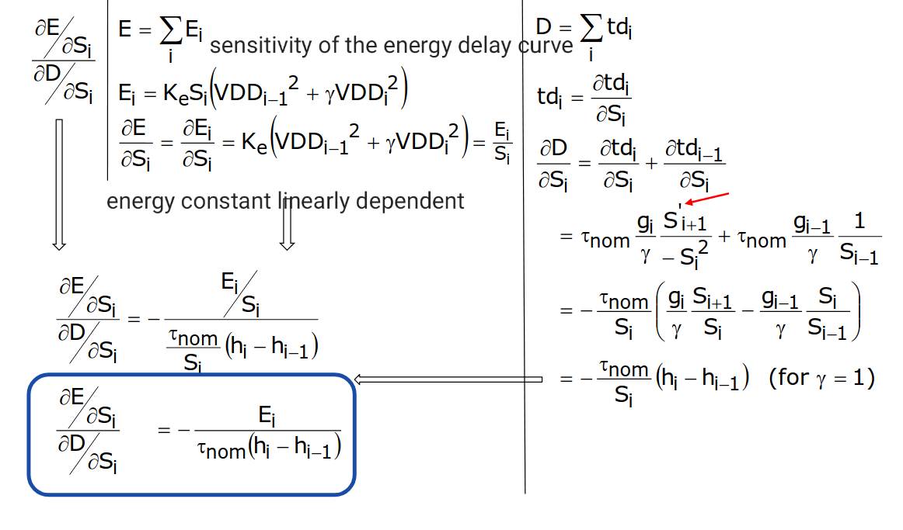{ width=50% }

So the more a gate consumes, the more sensitives it is to sizing. 

We can do the same thing for the sensitivity to the power supply:

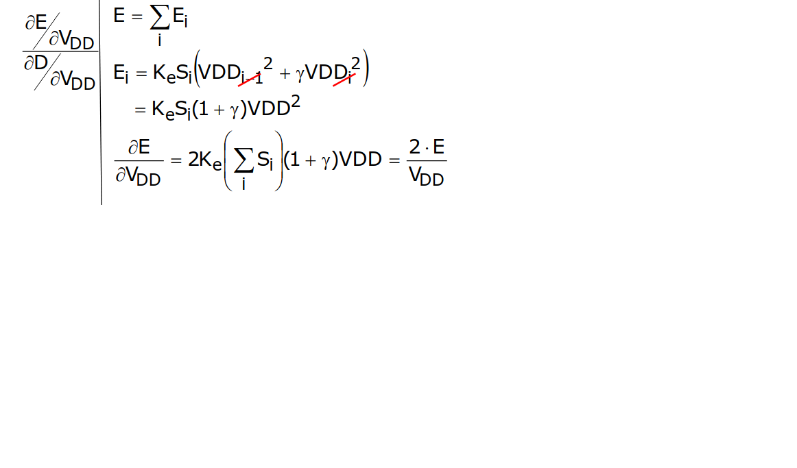{ width=50% }

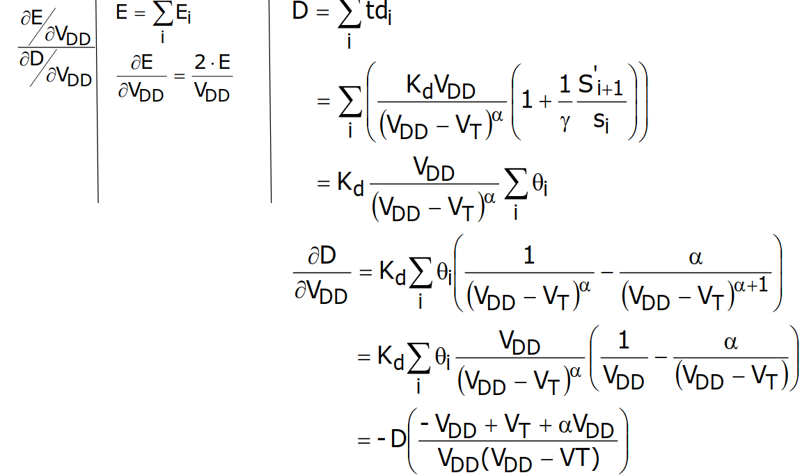{ width=50% }

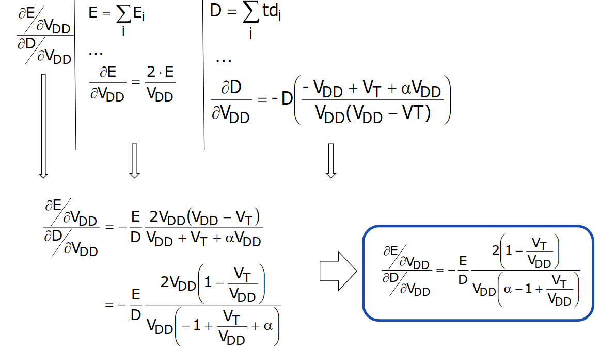{ width=50% }

Most sensitive to energy and fast gates. Maximal for $V_{DD, max}$

### Example Chain of inverter

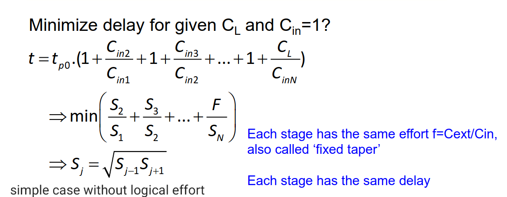{ width=50% }

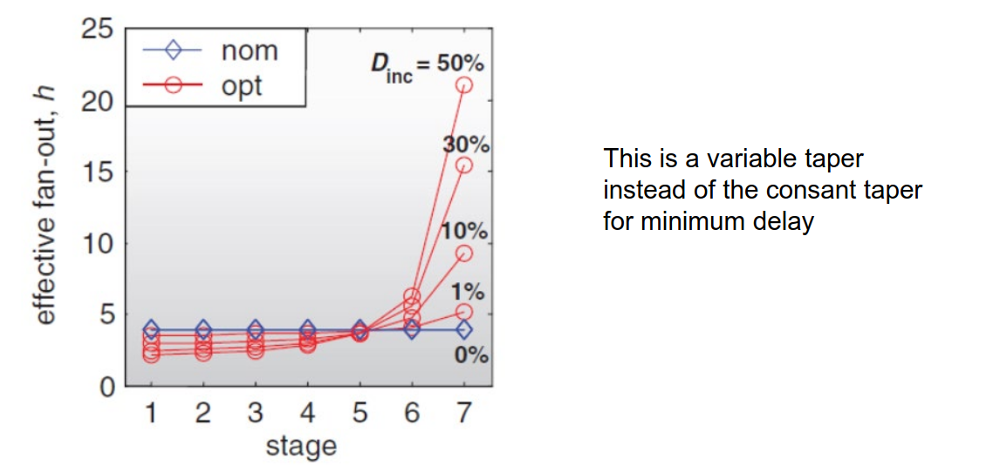{ width=50% }

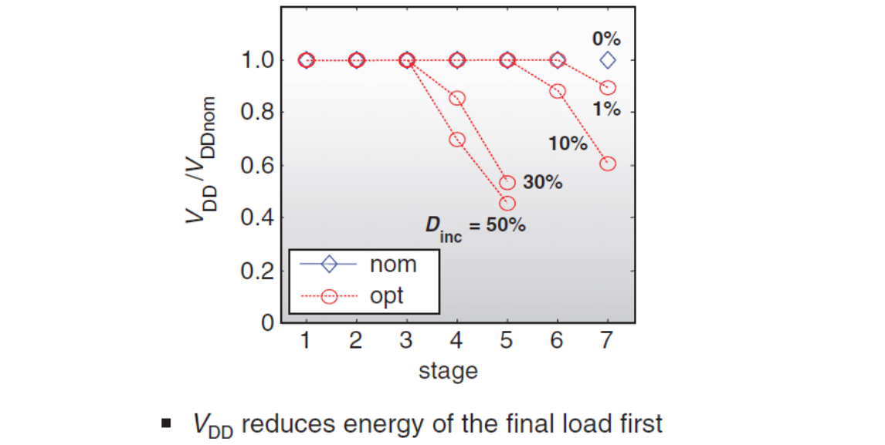{ width=50% }

> [!caution]
> I need to finish this bruh

## Ultra low voltage design examples

In this section, we will investigate some low voltage design:

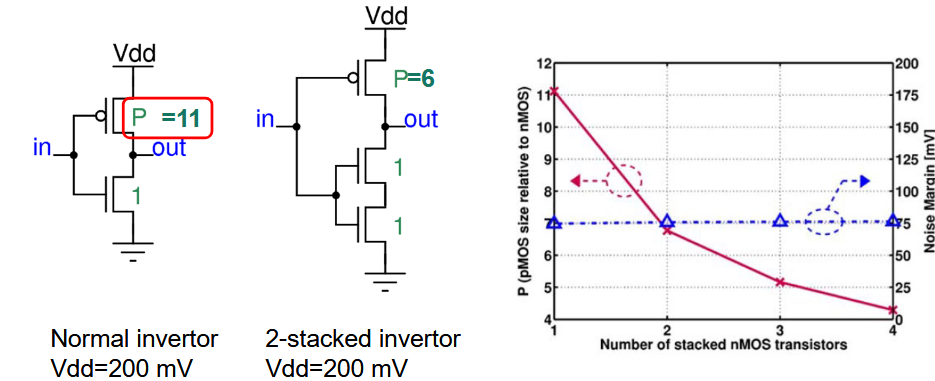{ width=50% }

It is a trade-off between the amount of stacking and the relative size and the noise margin. The more we stack the more sensitive it is to noise and a lil bleep could ruin the whole logical function. 

This has been proven to help with the *variability*.

> [!warning]
> Using this technique isn't ideal as the PMOS gets weak er and weaker, the excessive sizing of PMOS will result in higher area and capacitance !

This is where transmission gates really shine ! They are both on and they compensate each other. They take less area and they function in every corner and variability. Less leakage and good dynamic numbers.

But the NMOS in TG leaks too much and we have to increase this $I_{on,p}/I_{off,n}$ ratio. Stacking will reduce  $I_{off,n}$ by a **factor 5**. Degrades the speed slightly.

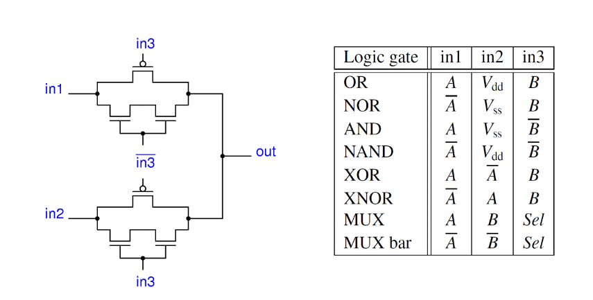{ width=50% }

* Good: low leakage, small area, low dynamic energy, 1 generic block, AND and OR possible
* Needs differential input, signal loss at output, lower speed, not well supported in modern library (need to create your own), delays go up **quadratically** with logic length.

### TG: Building pipelines

We need to re-generate the logic with inverter and construct our own special library for this. We need some differential master-slave architecture. It is possible to build some RISC-V CPU in academic, but the industry doesn't really want this. On top of this, the gap between the driving strength of PMOS and NMOS is closing. Variability is worse and worse and we prefer simply redesigning for Ultra low VT application.

# 7 - Variability 

## Variability causes, definitions and jargon

Going smaller and smaller hurts the variability. As everything gets smaller, it discretize the molecules and now one more or one less will have a massive impact on the actual doping.

Moreover, designing mask isn't as straight forward as it was. The UV light will bend and create some weird pattern we do not always expect:

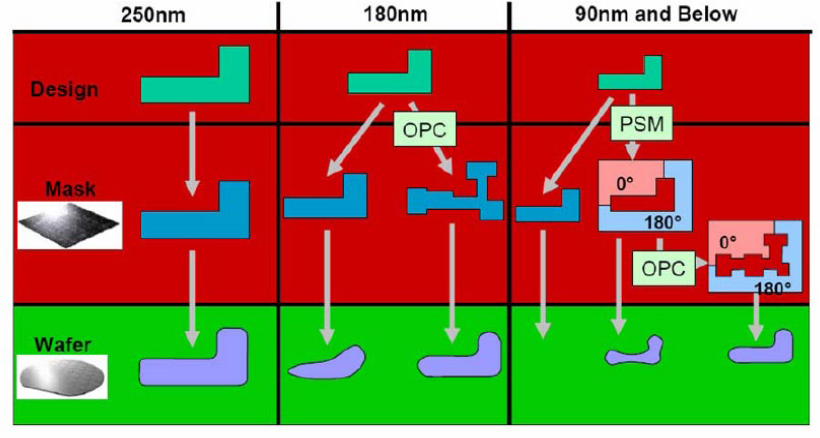{ width=50% }

It is also harder to make nice pattern as the photoresist is an **organic molecule** so naturally their molecules are bigger.

We have 2 types of process variation:

1. **Inter-die**: same wafer, different property between the die
2. **Intra-die**: same wafer, same chip but difference amongst the chip.

To model this, we typically use some corners in Cadence or other designing tools to prepare for known worst case scenarios. Those corners are usually different for PMOS and NMOS

- TT: Typical Typical
- FF: Fast Fast
- SS: Slow Slow
- SF+FS: combination of Fast and Slow

To model variability in *analog* there is the Pelgrom's model:

$$
\sigma_x = \frac{A_x}{\sqrt{WL}}
$$

With A the technological constant and X the variability of a given parameter. Sizing isn't this helpful as it helps with a factor $\sqrt{}$.

The worst corner is pretty pessimistic and will include up to $n$ $\sigma$ for global **and** local variation. We try to model it as accurate as possible by using some monte carlo analysis and building statistical model.

### Statical Static Timing Analysis

Instead of just preparing for the worst worst case (very unlikely that everything will be in the worst case status), we give each cell a distribution of delay $t_d(\mu,\sigma)$ (in the LVF lib format). It can take time to run all those simulations so sometimes we rely on backed-in values to speed up the process.

## How bad is it?

If we take the example of a *ring oscillator* running at minimum 1 GHz. We know control the frequency through the power supply voltage:

$$
t_d = K V_{dd}/(V_{dd} - V_t)^2 = 1ns\\
P = C V_{dd}^2/t_d = 100 \mu W\\
V_{dd} = 1V, V_t = 0.25 V
$$

If we have $\Delta V_t = \pm 0.05V \approx \sigma_{V_t}$

So to keep everything running at the right frequency:

| $V_t$ | Supply |   Power    |  Freq   |
| :---: | :----: | :--------: | :-----: |
|  0.3  |  1.08  | 116 $\mu$W |  1GHz   |
|  0.2  |   1    | 137 $\mu$W | 1.27GHz |

So we need to implement a feedback loop that will control the supply voltage accordingly (PLL). But we can't always do this for all circuits as we can always monitor it !
This is why we introduce **replica tuning**.

We duplicate the circuit (only the relevant part, critical path, ...) and we tune this circuit, the result of the tuning is also forwarded to the actual circuit. Usually we represent the original circuit through a **Ring Oscillator** that model the same performance of the original circuit. It helps for inter-die effect but not intra-die effect !

If we have 5 stage RO, $\sigma_{osc} = \sigma_{V_t}/ \sqrt{5}$ according to Pelgrom's model. With the usual spread of 3$\sigma$, we have $66mV$. If we try to compensate for worst case variation, we will end up with an excess of power consumption that will be more significant than the power we are trying to monitor !

We can then do some **in-situ** monitoring !

When talking about $\sigma$ we usually have $\pm 99.73\%$ for $3\sigma$ but we should only take one side of the curve as one part is detrimental so $0.135\%$ lost. But 3 sigma is not enough we need higher sigma to produce denser and denser chips.

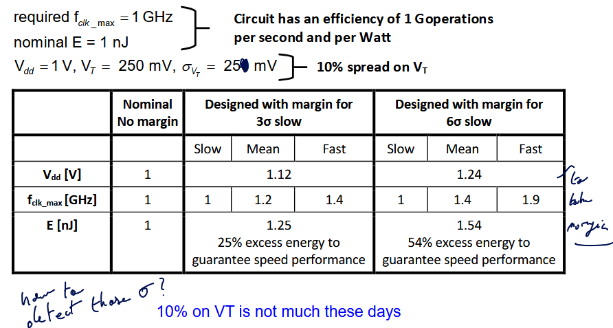{ width=50% }

- Process variation: compromises circuit power-performance trade-off
- Mismatch: compromises the use of circuit techniques to deal with process variations
  - Leads to functional and parametric yield problems

## Dealing with global variability: replica based techniques

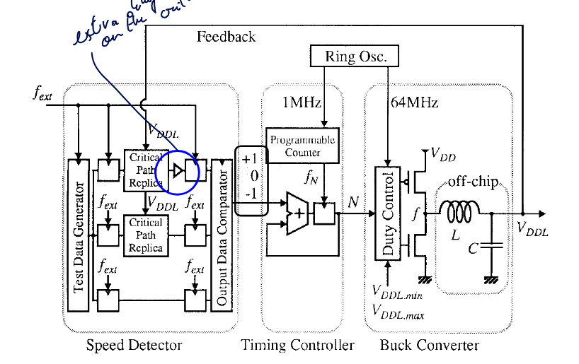{ width=50% }

The core principle of replica technique is using **Adaptive Voltage Scaling** or AVS, **Dynamic Frequency and Voltage Scaling** or DVFS is a mix of both. The infrastructure for those techniques are quite similar and can be shared.

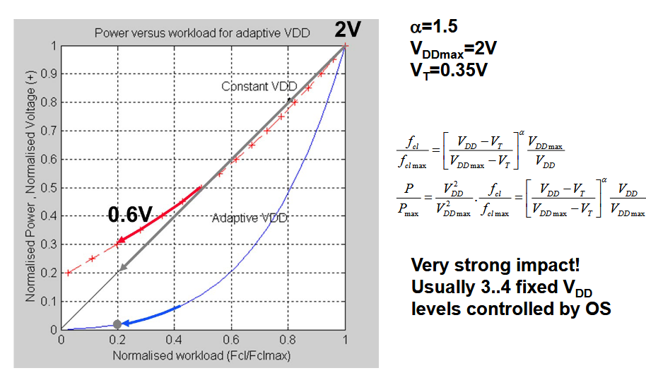{ width=50% }

## Dealing with local variability also: in-situ techniques

The basic idea is **EDAC** (Error Detection and Correction) where we monitor the critical path and adapt the voltage in adequation.

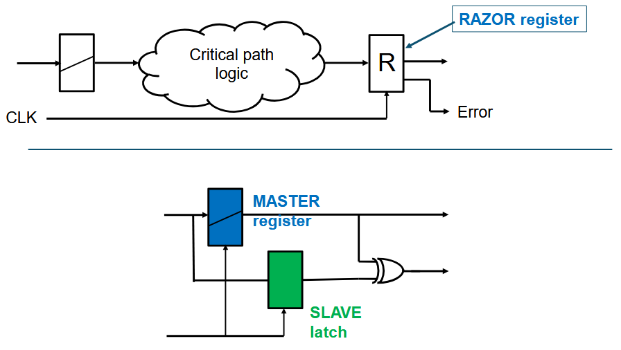{ width=50% }

The idea is that the Master register will save on the rising edge and the slave latch will save on the falling edge. So if their output changes it means that something new happened during the High of the clock. Then by combining with multiple RAZOR detection unit, we can tweak the power supply.

It is often used in X86 cpus where the RAZOR will simply push a bubble if it detects an error. It is way simpler, costs ore cycles but less critical.

### Iteration of RAZOR

- RAZOR 2: more efficient error detection, no correction in FF, architectural replay
- Bubble RAZOR: make automatic razor insertion in design, latch-based pipeline
  - Hard to do some timing

The simplest way to control the power supply is to use a loop filter and a DC/DC converter.

### Efficiency of RAZOR

Sometimes, we may notice some spur as RAZOR try to make things faster which can cause some trouble. RAZOR and the circuit will consume more current than without RAZOR obviously. But the actual gain is in the recovery, it can track and recover from an error to keep the instructions per cycle at an optimum.

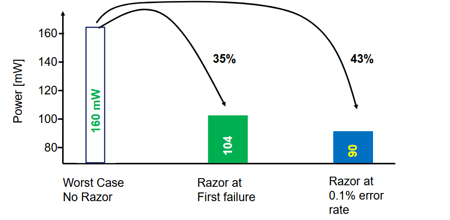{ width=50% }

### Razor Limitations

Take quite some space and not easy to insert and know how to control all of this. Can be sensitive to hold time issues as the positive clock phase width should be precisely controlled.

On paper it is interesting but what if nothing changes ? what if the delay is so late that both the register and latch don't capture this change ?

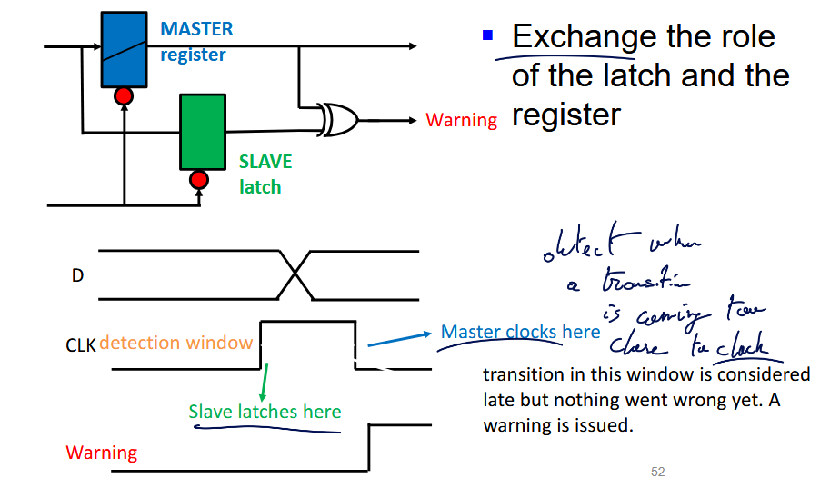{ width=50% }

This is less risky as we put less trust into our detection algorithm. Moreover, we can notice some warning patterns and omit certain warnings. With error detection, this simplification cannot be made as knowing the location is primordial.

#### Error masking 

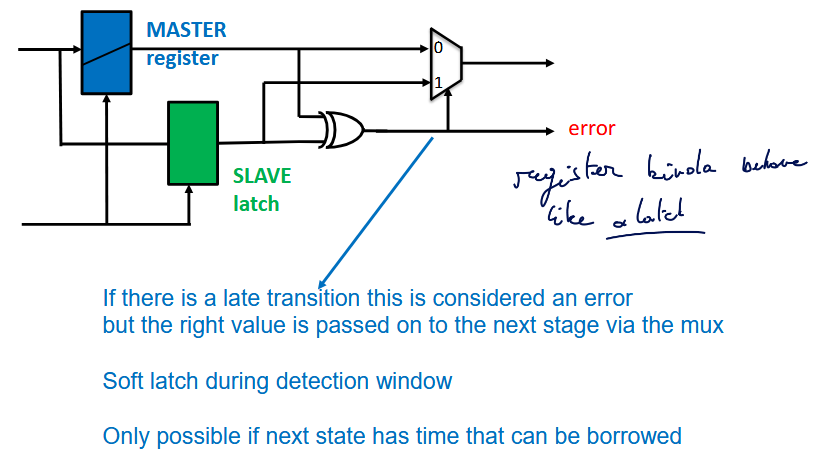{ width=50% }

It looks amazing as we don't have to add bubble or recover from this but in reality it makes the timing analysis for next stage quite difficult with this principle of "*time to borrow*". Usually, commercial tools are not made for this.

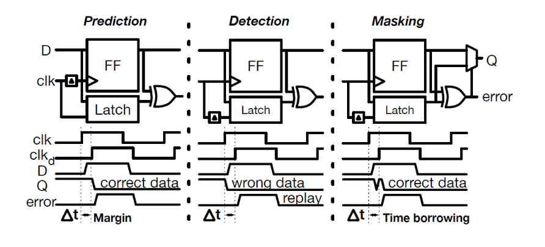{ width=50% }

### Where to put our EDAC ?

The most simple idea is to replace some registers located on path with the worst slack with our EDAC. Turned out to be okay. OFC, we could do some more advance statistics on the critical endpoints

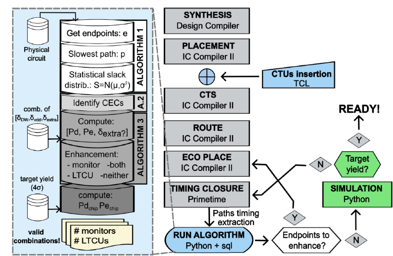{ width=50% }

It reduces the overhead linked with the insertion of all those EDAC and this methodology has the advantage to be compatible with existing flow !

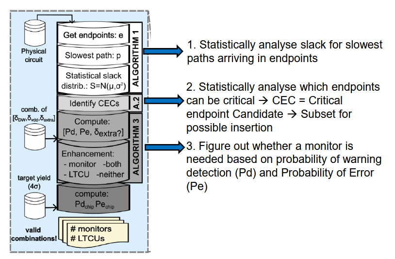{ width=50% }

We can run some monte carlo simulation on the critical path and inserts some EDAC to the endpoints that show up the most in our simulation.

Some endpoints have low probability to fail but if we do not detect it, our CDF shows that it would be quite mediocre performance (below 90%) so we better take them into account.

### Use Late clocking

On slow path we can clock at a time $\delta_{extra}$ later. It optimizes the slack diagram but we need to accommodate for this on the later logic path. It can be tricky with hold violations !

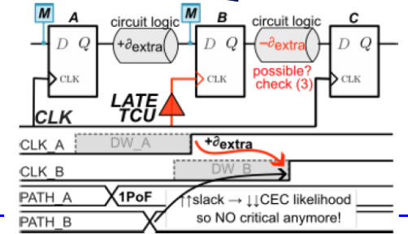{ width=50% } 

#### Monitor Insertion

We need to evaluate for all combinations of possible delay. We want to maximize the probability of detection in the EP (endpoint). So we can check and decide if we should add an EDAC and if extra delay should be added. 

Criterium: Pe_chip == Probability of timing error in chip without having detected a transition when scaling the voltage down. Only if Pe_chip is smaller than the yield criterium ($n_{\sigma}$) a [$\delta_{VDD},\delta_{dw},\delta_{extra}$] is kept and monitors are inserted accordingly.

We can automate this process and in-situ detection is very effective in terms of *demargining*. But we need to enhance the probability to detect a transition on the monitored nodes. Plus, we didn't talk yet about the clock tree !

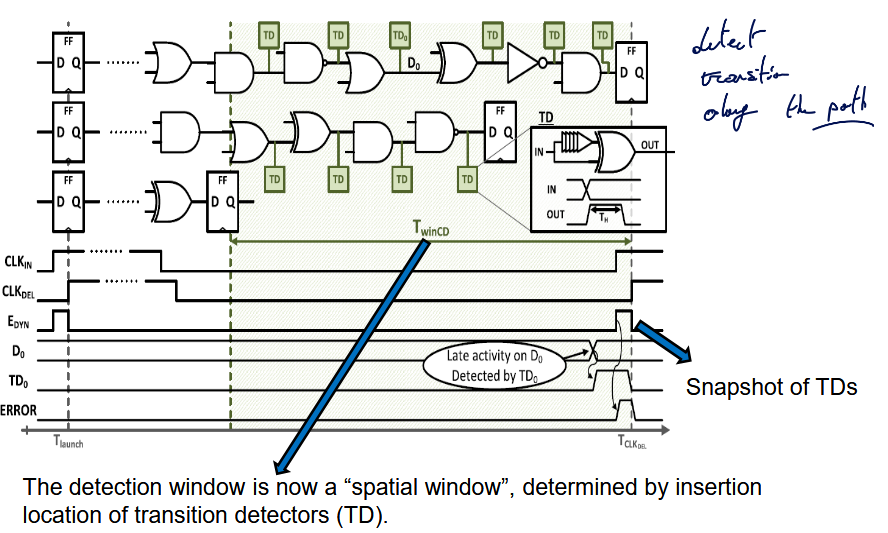{ width=50% } 

The error prediction comes too late and we are messing too much with the clock tree so not easy to replicate in other products.

## New devices to the rescue?

We are now using FinFets, and soon FDSOI, GAA transistors. But they all must be better than classical CMOS or it wouldn't be viable to use them, they must be cheap, good properties, easy to layout, ...

FinFET brings better gate control and allow more current for the same footprint as classic CMOS technology.

### Fully Depleted Silicon-On-Insulator

Is a Ultra Thin Body & Box technology where we shrink the source and drain and add a thin box and a back gate !

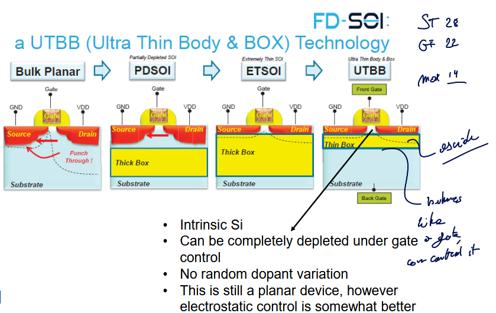{ width=50% } 

#### Body bias

But the issue is that it creates some unwanted diode, body bias. FDSOI is good for variability and performance and to control the energy. But body bias is driving large well, coarse granularity and to bias we will need some negative voltages !

FDSOI is good for low power design and allow really good control. Indeed, full depleting the channel allows to easily cut off the channel reducing the leakage current. We don't need to dope the substrate since the channel is so thin !

# 8 - Memory

As we all know, the current issue is the memory performance in modern computers. We call it the *memory wall*. The memory is denser and denser, the lines are so big it is hard to drive it.

The main issue lies in the power consumption and speed that are proportional to locality and inversely proportional to size. It is the largest *analog* circuits and then it is consolidated in generators to be used in digital design flow. 

### General structure

We reduce teh amount of line by using some decoder for the select signals; this reduces the circuitry and load. But usually the Height is larger than the width and so we need to reload a lot so we keep the width small but no so efficient to access memory.

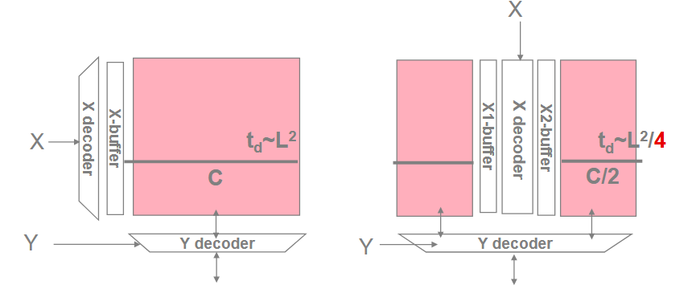{ width=50% } 

On top of this we add a level of hierarchy by using block and using block address to select the right block. 

There exists multiple type of bit cells, SRAM or DRAM and then some non volatile memories such as Flash, MRAM, FRAM, RRAM, ...

#### Non-volatile

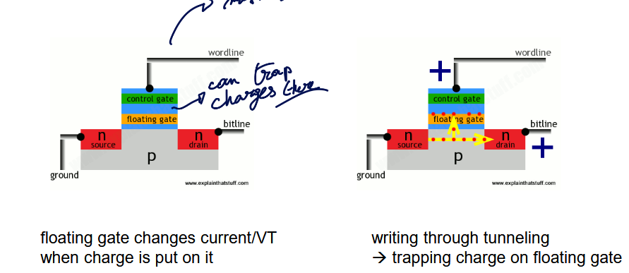{ width=50% } 

#### SRAM vs DRAM

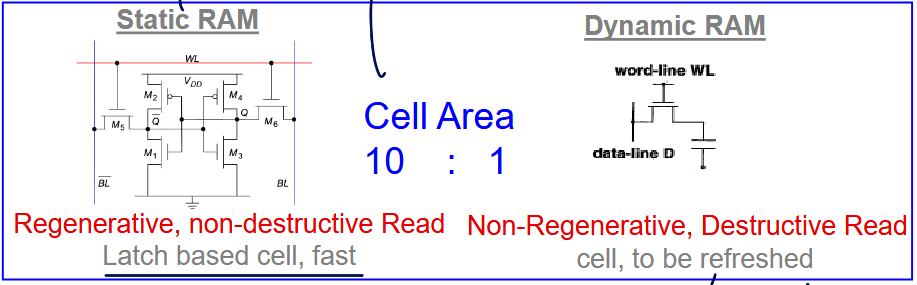{ width=50% } 

DRAM can be made extremely small if we can use some vertical caps that can store the energy. It is what is mostly use in RAM for computers while SRAM is use for on-chip memory.

## SRAM basics

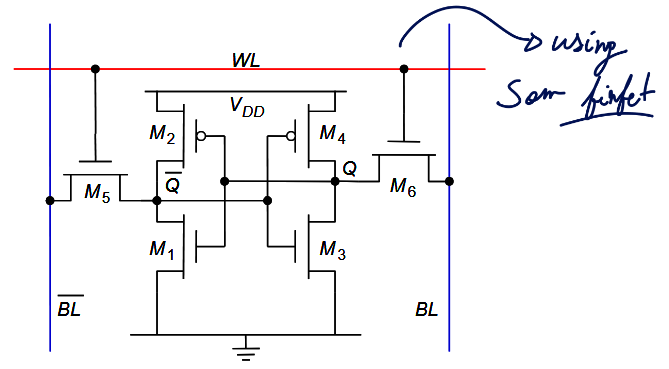{ width=50% } 

This it the 6T SRAM. We need two bit lines as inside the cell, it is a sort of inverting amplifier loop. We must overcome this loop of inverters and so a differential input is used. It is more robust.

It is not a *lithography friendly* circuits as we need polysilicon vertically and horizontally ! On top of this, the cell must be extremely small violating a lot of DRC check.

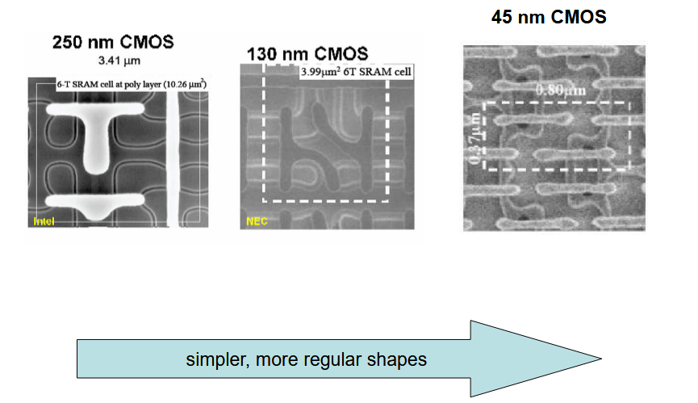{ width=50% } 

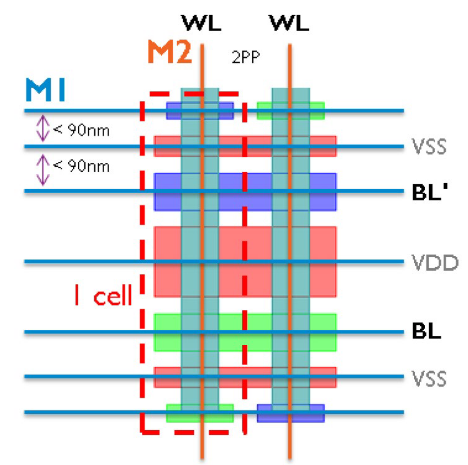{ width=50% }

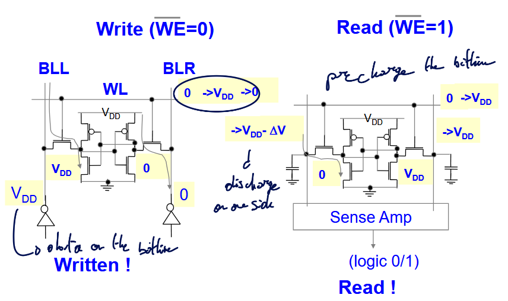{ width=50% }

### Read

To avoid a destructive read, we must have $\Delta V < V_{tn}$.

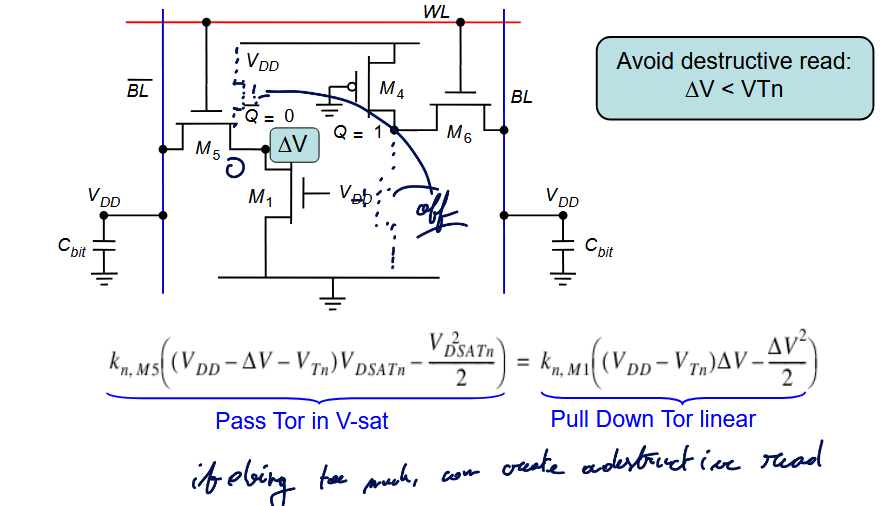{ width=50% }

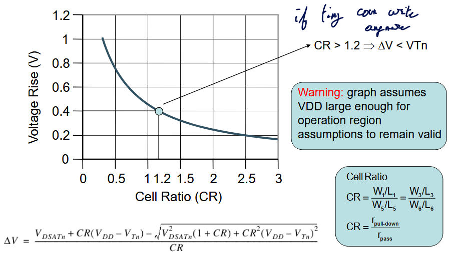{ width=50% }

### Write

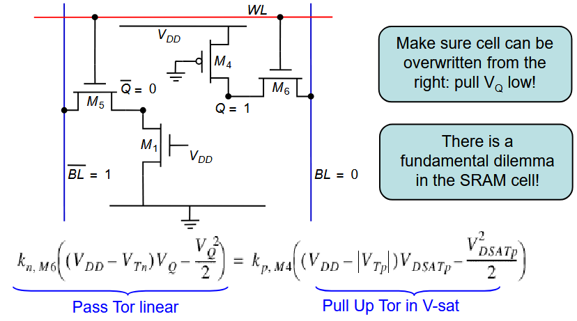{ width=50% }

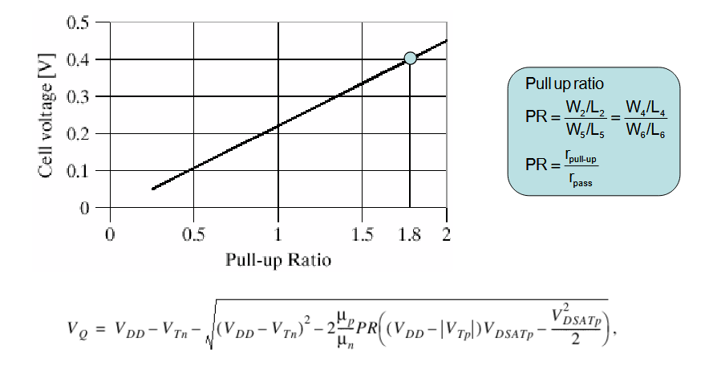{ width=50% }

### Trip Voltage

It is the maximum voltage allowed on bitline for which the 6T cell is still written. The write trip voltage represents the margin left for writeability.

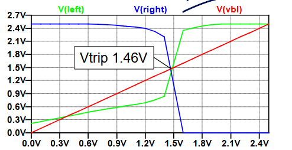{ width=50% }

It needs to be stable to avoid this undefined region where we enter the meta stability.

#### Seevinck squares

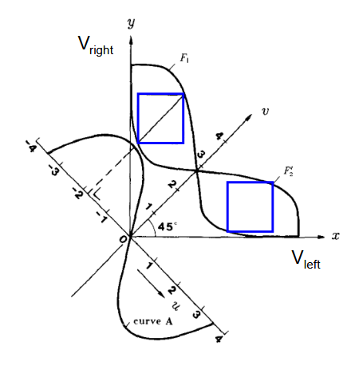{ width=50% }

It corresponds to the largest squares that can be drawn in the two eyes. The side of the smallest seevinck square is a measure for the $SNM  = f(CR,PR)$, better to simulation and draw it.

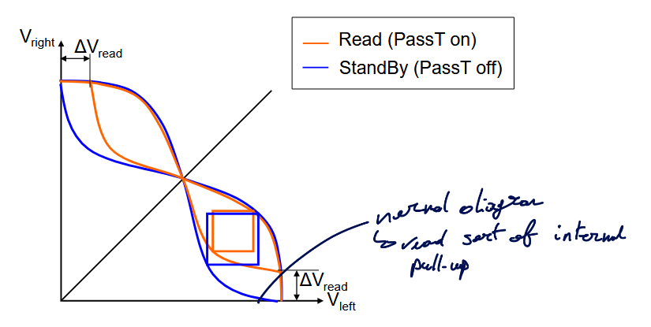{ width=50% }

We can see it will reduce the square when reading.

So SRAM design is all about:

1. Get cell ratio $CR > CR_{crit}$, pass tor should be small enough compared to pull down so no destructive read. Make the square large enough
2. Get pull down ratio $PR < PR_{crit}$, pass tor should be large enough compared to pull up so that the cell can be written from the bitline. Write trip voltage not too small
3. Stable cell, $SNM > SNM_{crit}$, good square dimension

### Sense amplifier

Bitlines are most of the times not fully discharged in read but so we need to restore the logic using a sense amplifier.

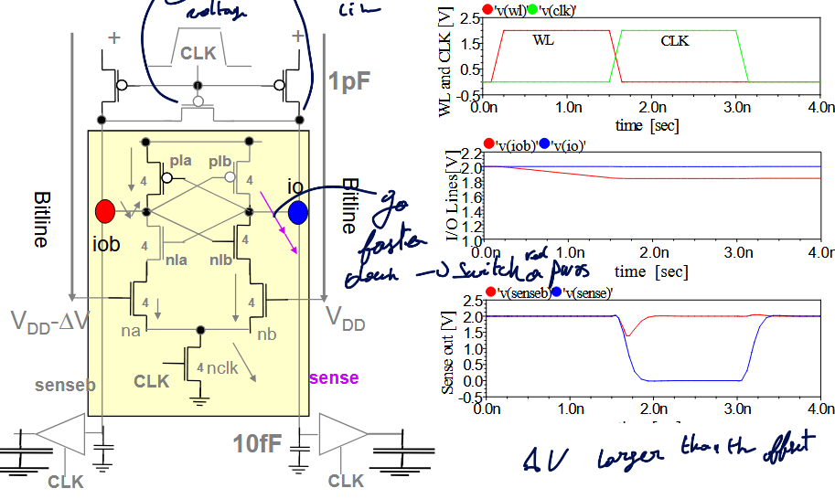{ width=50% }

Quite robust, reduce power consumption and has some enhanced stability. Larger area though.

### 8T cell

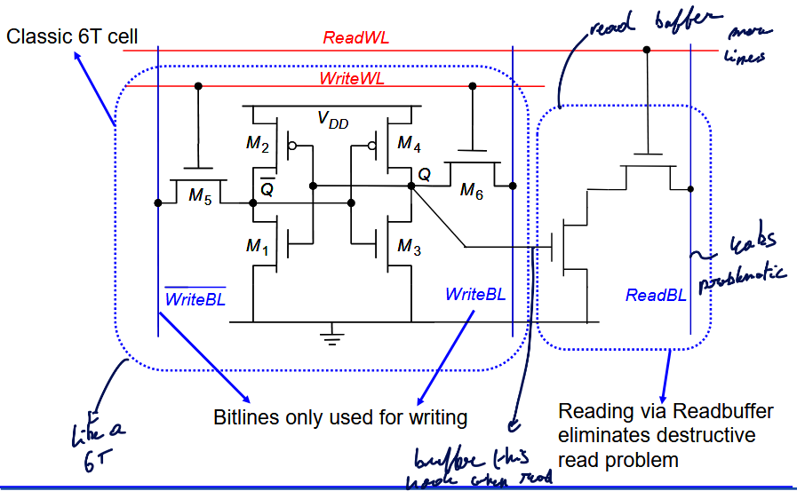{ width=50% }

## DRAM in a nutshell

It is a capacitive and on-regenerative technology with high density. But data leaks away so we must usually do some periodic refresh.

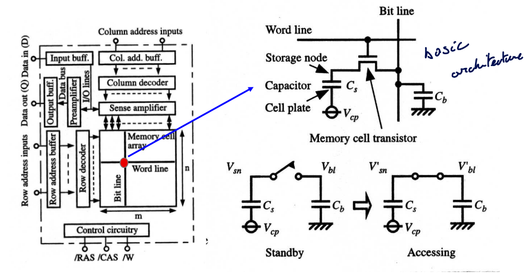{ width=50% }

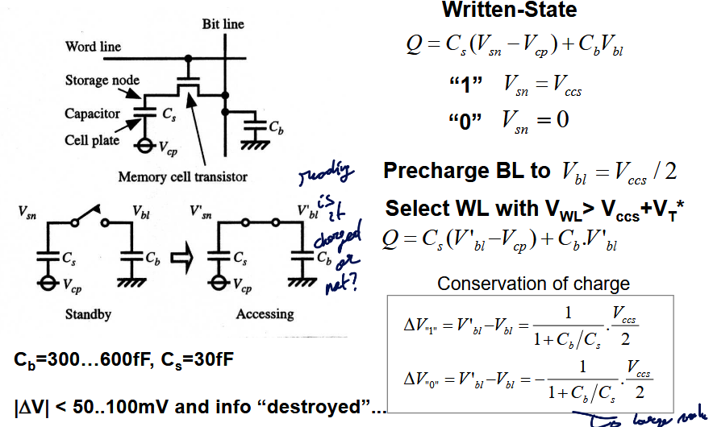{ width=50% }

Again, we need some sense amplifiers to restore the level.

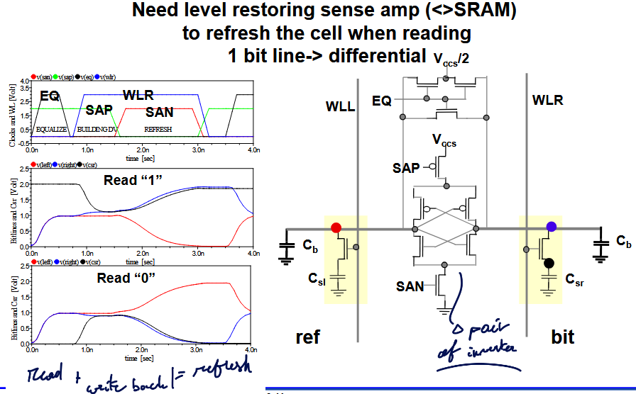{ width=50% }

If we have too large capacitance on the bitline, it will be hard to charge  by small sense FF. So we make the cap smaller by using some backbias, junction cap, smaller blocksize, triple well, ... We need another voltage generator on chip. We need larger oxide to reduce the subthreshold loss. So we can see that the process used for RAM and logic differs. We reduce the footprint of the cap by making them vertical.

We always need to refresh the full selected row !

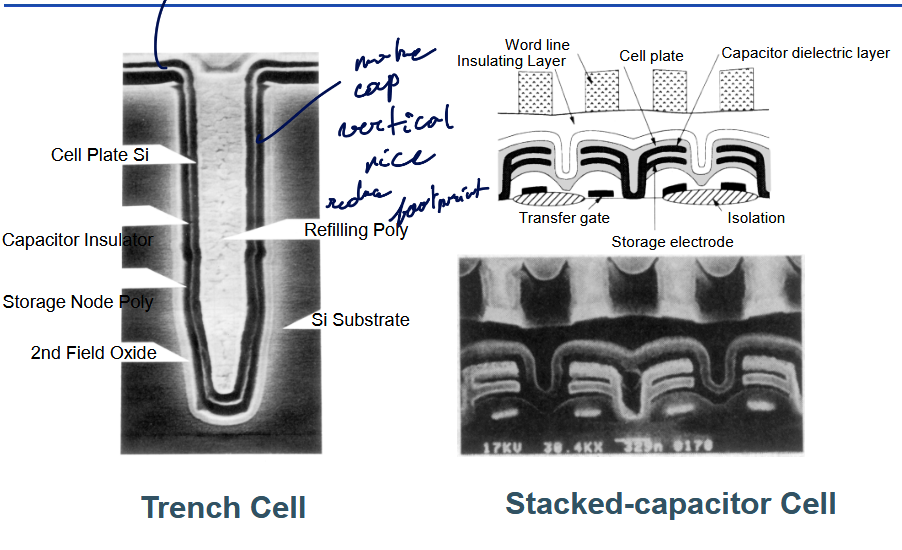{ width=50% }

## SRAM energy

Now we will analyze the leakage of a 6T SRAM cell:

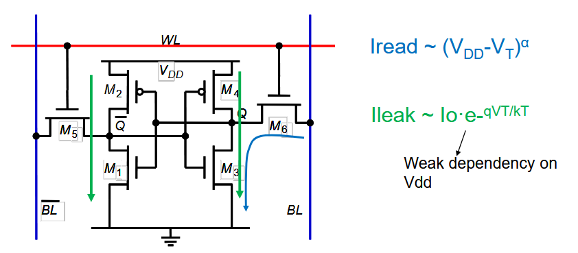{ width=50% }

By raising Vt and VDD we keep the amount of current of a read pretty much constant while reducing the leakage current.

To reduce the active energy, we use some low voltage swing on wordlines and bitlines.

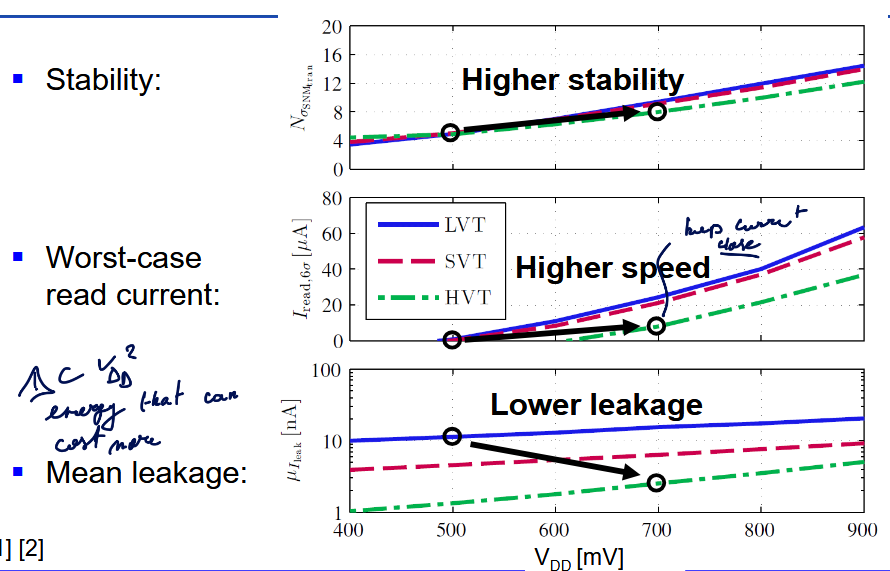{ width=50% }

The issue is that we will need some extra hardware to interface with energy efficient logic so we will need level shifters.

### Level Shifter

Level shifting is quite tough as we need a wide level shifting range, it needs to be fast and consume 0 static current.

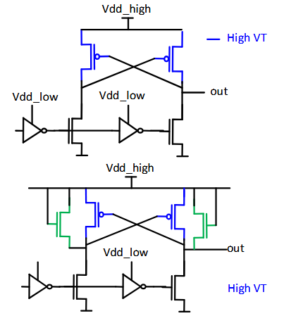{ width=50% }

No static current, High VT pmos to reduce leakage but slow down operation. Driver NMOS will leak and the green NMOS is speed boost (auto switch off). Not so easy to design.

## SRAM and variability

Area is the major tradeoff in memory and due to pelgrom's law, we will have a high variability on cell, high spread on SNM, speed !

To avoid slow operation, we will use some small swing on the bitline and then amplify this to logic level.

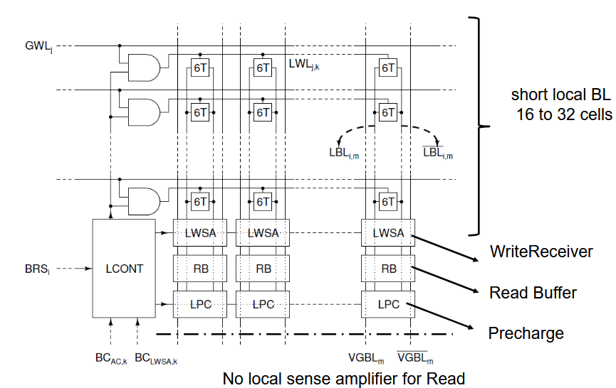{ width=50% }

We can also use some distributed decoder:

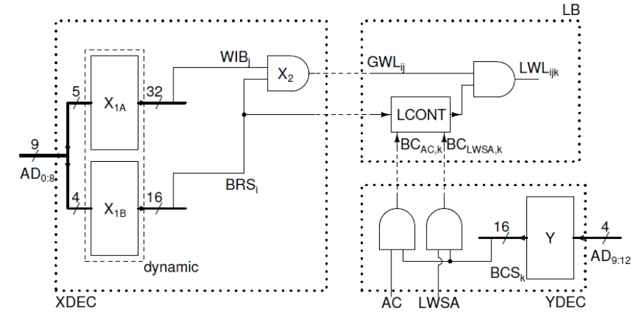{ width=50% }

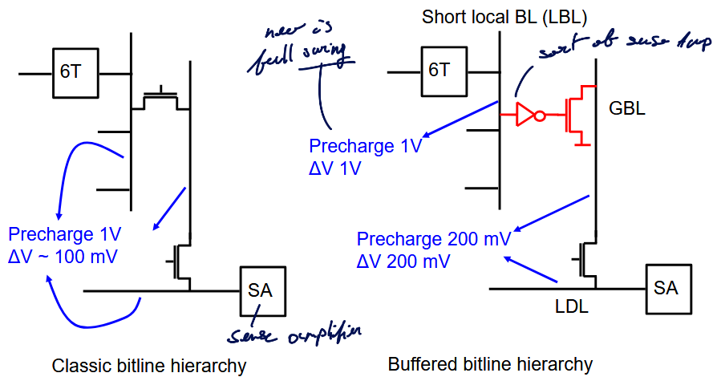{ width=50% }

### Bitline energy considerations

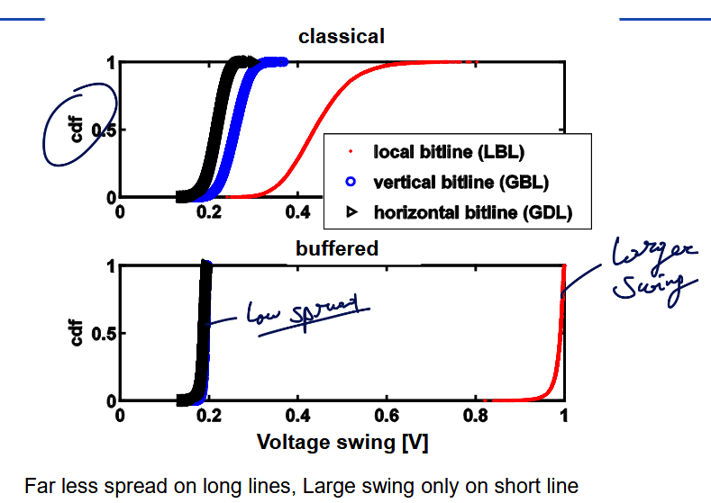{ width=50% }

In the buffered version, less charge is drawn from the global lines, less delay variation, we have less delay variation and we precharge global lines to $200 mV$.

Locality of bitlines and wordlines allows to deal with variability. It creates more hardware but using sense amplifier is a good and efficient way to help with this issue.

## In Memory Compute

The ongoing big trends in LLM and AI where we want to bring the memory as close as possible to the compute unit and avoid unnecessary data transfer from memory to registers. Usually we want to store the weights of the multiply accumulate closer.

- Analog IMC: accumulation is simply adding current or charges
- Digital IMC: based on digital logic operation and need logic and bit cells

### Analog IMC

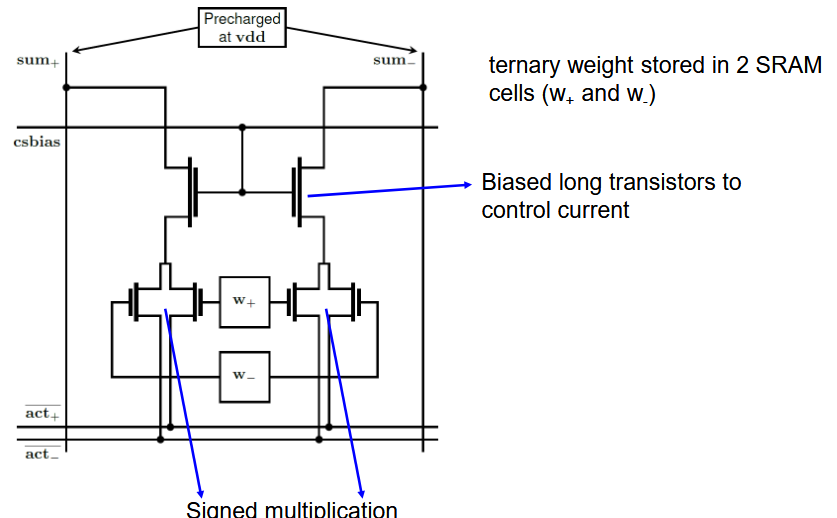{ width=50% }

How to bias it properly to make it robust ? Low flexibility and lots of ADC/DAC but no comparison with classic accelerators / DIMC.

### Digital IMC

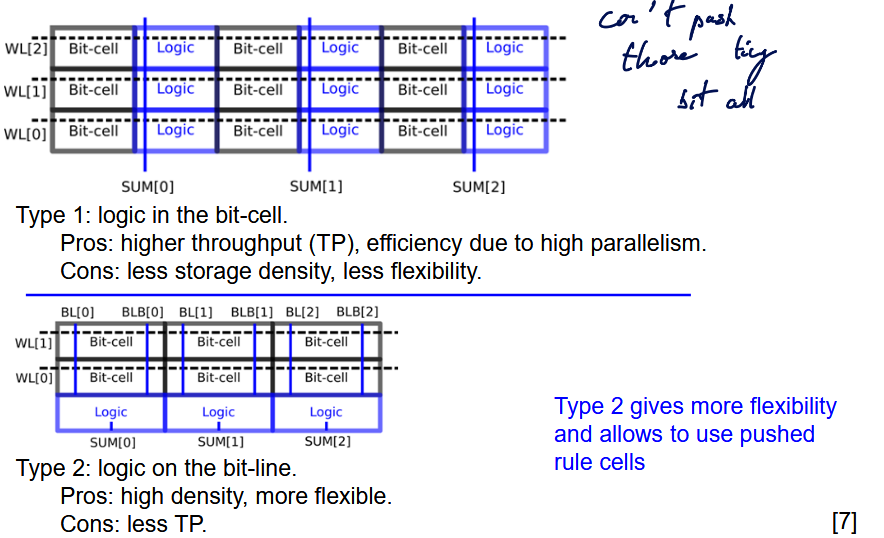{ width=50% }

Still pretty experimental and we have to design everything by hand.

It is an interesting paradigm for edge AI and for moderate size NN.