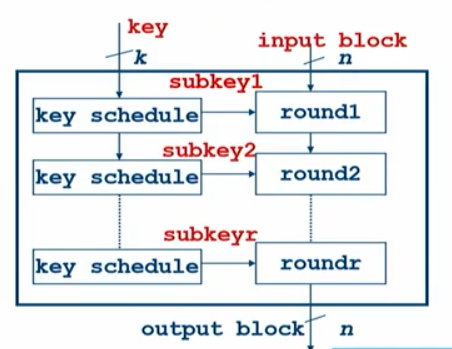

- [5 - Cryptographic Key](#5---cryptographic-key)
  - [Block cipher](#block-cipher)
  - [Data Encryption Standard (DES)](#data-encryption-standard-des)
    - [Triple Data Encryption Algorithm - TDEA](#triple-data-encryption-algorithm---tdea)
    - [DES Feistel  Structure](#des-feistel--structure)
    - [Software](#software)
  - [Mode of Operation](#mode-of-operation)
    - [Design method](#design-method)
    - [Cipher Block Chaining - CBC](#cipher-block-chaining---cbc)
- [Students Presentation](#students-presentation)
  - [2 - Low Cost and Precise Jitter Measurement Method for TRNG Entropy Assessment](#2---low-cost-and-precise-jitter-measurement-method-for-trng-entropy-assessment)
    - [Theoretical error](#theoretical-error)
    - [Qestions :](#qestions-)
  - [3 - Contactless Electromagnetic Active Attack on Ring Oscillator Based True Random Number Generator](#3---contactless-electromagnetic-active-attack-on-ring-oscillator-based-true-random-number-generator)
    - [Injection Platform](#injection-platform)
    - [Question](#question)

# 5 - Cryptographic Key

## Block cipher

Def : "A block cipher breaks up the plaintext into strings (called blocks) of a fixed length $t$ over an alphabet A and encrypts one bloc at a time."

It will repeat on it we call this rounds and each rounds has subkey derived by key schedule.

Often, one cycle per round for HW architecture to ensure speed and throughput. On the other side we can make low area which is slower.

## Data Encryption Standard (DES)

It is a *block cipher* with 64 bit I/O and 56 bit key with 8 parity  bits. The idea, it is iterated cipher with 16 rounds. It has influenced modern encryption even tough it is no longer considered secure as of 2004.

### Triple Data Encryption Algorithm - TDEA

We have 3 key options : 

1. K1, K2, K3 different
2. K1=K3, K2 different
3. K1=K2=K3 which makes it *backward compatible with DES*

The two-key triple DES is recommended until 2009 and three-key triple DES until 2030. Still used a lot in the payment industry.

In 2017, we limit the max b lock size to $2^{30}$ and disallows its usage for TLS, IPSEC, ...

### DES Feistel  Structure

It is still heavly used in reality.

The encryption and decrytpion is the same function so it is super hardware efficient !

In the 16 rounds we have an initial and final permutation.

Expansion will expand and reshuffle the bit. We then have 8 S-box with 6 inputs bit and 4 bits output. S_i non-linaear subsitution.

We have some needed linearity to have good and robust encryption. But too much non-linearity is costly on hardware.

We havec then the key schedule, with a 64 bits key input but we will only have 56 used

We rotate in those C and D register and it depends on the round we are in that decide how much we shift.

The key never really change so we prefer in SW to first compute them and store in memory to easily access it.

If we want to store the key in memory we have one 128  bit key which is 1208 bits round keys so 10 rounds and initial key. But half of internet packets are only 64 bytes in length (512 bits) it doesn't make any sense anymore. It had too much overhead to load and forget keys of every users.

DES was originally developed for efficiency in HW and is quite unefficient in SW.

### Software

We need to do many permutation of the plain text input. The issue is that it is **bit oriented** so it is annoying to use mask and move it. In ASM we don't have bit-wise operation. Cheap in HW (simple wire) expensive in SW.

The simple way takes around 300 instructions per block !

#### Bit slicing : alternative data representation

Each register contains 1 bit of eg 32 blocks. Block size is defined by algorithm for DES block is 64 bit. We are going to parellelize of n encryptions. Number of blocks in parallel n = width of register.

So in a register we have all the first or n bits of all the blocks etc. So now the CPU can be viewed as 16/32/54 one-bit parallel processors (depending of the size of the inputs). CPU is like a Single-Instruction Multiple-Data SIMD processor.

And now, for permutation we can easily copy the content of a register to another, it is no longer bit-wise operation. Easy !

## Mode of Operation

The mode of operation tells what to do when we have **multiple block of data**. If we are simply following the block in the normal way, we could actually reveal the data and not encrypt it correctly. The issue is if we encrypt "A" it will have the same encrypted version for any encrypted "A".

### Design method

Inclue modes of operation into hardware IP module or co-processor. It gives more hardware but more clean security partitioning, reduces communication overhead and traffic.

### Cipher Block Chaining - CBC

Error in Ci propagation over 2 blocks ! If we have a loss of block synchronization it is fatal. If we have an error in $P_i$ we will propagate it to the other blocks. It is mostly used with encryption only for Message Authentification Encryption (MAC) generation.

#### CBC-MAC

Feedback inhibits pipeline. But due to feedback we can't easily pipeline it. It gets even worse for triple DES. Worse for bit slicing and certain masking schemes.

#### Modes of operation counter

Add confidentiality and encryption.

The third column indicates how we encrypt or decrypt.

The counter mode, we don't have any pipelining anymore.

# Students Presentation

Here is the compilation of all students questions and prepared answer

## 2 - Low Cost and Precise Jitter Measurement Method for TRNG Entropy Assessment

We have issues of drift due to jitter, duty cycle can slightly change. It is pretty volatile cause the source of noise varies. To measure the jitter, we will avoid using probes etc since it can be worse. Use a counter:

New method proposed:

We most likely observes the k clock cycles as expected

### Theoretical error 

$F_k$ is the most probable outcome.

### Qestions :

**"Why is a short accumulation time a desirable property of a jitter measurement technique?”
**

## 3 - Contactless Electromagnetic Active Attack on Ring Oscillator Based True Random Number Generator

It is about TRNG that are  based on ring-oscillator. It generates a jittery clock. The paper will focus on attacking the source of attack, it is an active attack.

Inject EM harmonic signal to bias that source of entropy. They us a micro-probe for it. The TRNG is implement on a FPGA board.

### Injection Platform

- Power injection chain
  - Inject wave of different power, with a frequency close to the RO (300-325 MHz)
- Control chain
  - Check when shielded from EM. Try with and without EM injection. Store and compare TRNG output bitstream.
- data acquisition chain

They use some powermeter and oscilloscope.

They used DFTRi (discrete fourier transform ratio). They check the difference between the power at the injected frequency and the power of the output RO frequency. Higher DFTRi means higher effective attack.

OFC, the higher power we inject the more effective it is.

We can use some circuitry to make it dynamic attack.

### Question

"The attack demonstrates that ROs can be locked onto an injected frequency, leading to a biased TRNG output. How can mutual information be used to assess the effectiveness of this attack ?"