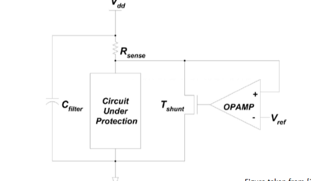

- [5 - Cryptographic Key](#5---cryptographic-key)
  - [Block cipher](#block-cipher)
  - [Data Encryption Standard (DES)](#data-encryption-standard-des)
    - [Triple Data Encryption Algorithm - TDEA](#triple-data-encryption-algorithm---tdea)
    - [DES Feistel  Structure](#des-feistel--structure)
    - [Software](#software)
  - [Mode of Operation](#mode-of-operation)
    - [Design method](#design-method)
    - [Cipher Block Chaining - CBC](#cipher-block-chaining---cbc)
- [6 - Countermeasures against physical attacks](#6---countermeasures-against-physical-attacks)
  - [The basis](#the-basis)
  - [Countermeasures](#countermeasures)
    - [1 - Re-keying](#1---re-keying)
    - [2 - Masking](#2---masking)
    - [3 - Hiding](#3---hiding)
  - [Analog circuits and noise generators](#analog-circuits-and-noise-generators)
    - [Decoupling](#decoupling)
    - [Detach](#detach)
    - [Active flattening](#active-flattening)
  - [Noise generators](#noise-generators)
  - [Masking](#masking)
    - [Boolean masking](#boolean-masking)
    - [Other types](#other-types)
- [7 - Trusted Computing](#7---trusted-computing)
  - [Theory](#theory)
    - [TCB and RoT](#tcb-and-rot)
  - [Techniques](#techniques)
    - [Secure boot goals](#secure-boot-goals)
    - [Measured boot goals](#measured-boot-goals)
    - [Trusted Platform Module](#trusted-platform-module)
    - [Trusted Execution Environment goals](#trusted-execution-environment-goals)
    - [SGX](#sgx)
    - [Remote Attestation](#remote-attestation)
  - [Conclusion](#conclusion)
- [8 - Micro-Architectural attacks and defense](#8---micro-architectural-attacks-and-defense)
  - [Caches](#caches)
    - [Set-associative cache](#set-associative-cache)
  - [Cache side channels](#cache-side-channels)
    - [Flush + Reload](#flush--reload)
    - [Evict + Reload](#evict--reload)
    - [Prime + probe](#prime--probe)
  - [Cache covert channels](#cache-covert-channels)
  - [Transient Execution Attacks](#transient-execution-attacks)
    - [Spectre](#spectre)
    - [Meltdown](#meltdown)
  - [Rowhammer](#rowhammer)
    - [Countermeasures - DDR4](#countermeasures---ddr4)
    - [Countermeasures - DDR5](#countermeasures---ddr5)
  - [Conclusions](#conclusions)
- [9 - Introduction to Software Security](#9---introduction-to-software-security)
  - [Introduction and Motivation](#introduction-and-motivation)
    - [Evolution of the cyberspace](#evolution-of-the-cyberspace)
    - [Cybersecurity](#cybersecurity)
    - [Past incidents](#past-incidents)
    - [Underlying causes](#underlying-causes)
  - [Low-Level Software security](#low-level-software-security)
    - [Threat model](#threat-model)
    - [System model](#system-model)
    - [Attack scenarios](#attack-scenarios)
    - [Mitigating Attacks](#mitigating-attacks)
  - [Conclusions](#conclusions-1)
- [Students Presentation](#students-presentation)
  - [2 - Low Cost and Precise Jitter Measurement Method for TRNG Entropy Assessment](#2---low-cost-and-precise-jitter-measurement-method-for-trng-entropy-assessment)
    - [Theoretical error](#theoretical-error)
    - [Qestions :](#qestions-)
  - [3 - Contactless Electromagnetic Active Attack on Ring Oscillator Based True Random Number Generator](#3---contactless-electromagnetic-active-attack-on-ring-oscillator-based-true-random-number-generator)
    - [Injection Platform](#injection-platform)
    - [Question](#question)


# 5 - Cryptographic Key

## Block cipher

Def : "A block cipher breaks up the plaintext into strings (called blocks) of a fixed length $t$ over an alphabet A and encrypts one bloc at a time."

It will repeat on it we call this rounds and each rounds has subkey derived by key schedule.

Often, one cycle per round for HW architecture to ensure speed and throughput. On the other side we can make low area which is slower.


## Data Encryption Standard (DES)

It is a *block cipher* with 64 bit I/O and 56 bit key with 8 parity  bits. The idea, it is iterated cipher with 16 rounds. It has influenced modern encryption even tough it is no longer considered secure as of 2004.

### Triple Data Encryption Algorithm - TDEA

We have 3 key options : 

1. K1, K2, K3 different
2. K1=K3, K2 different
3. K1=K2=K3 which makes it *backward compatible with DES*

The two-key triple DES is recommended until 2009 and three-key triple DES until 2030. Still used a lot in the payment industry.

In 2017, we limit the max b lock size to $2^{30}$ and disallows its usage for TLS, IPSEC, ...

### DES Feistel  Structure

It is still heavly used in reality.


The encryption and decrytpion is the same function so it is super hardware efficient !

In the 16 rounds we have an initial and final permutation.


Expansion will expand and reshuffle the bit. We then have 8 S-box with 6 inputs bit and 4 bits output. S_i non-linaear subsitution.


We have some needed linearity to have good and robust encryption. But too much non-linearity is costly on hardware.

We havec then the key schedule, with a 64 bits key input but we will only have 56 used


We rotate in those C and D register and it depends on the round we are in that decide how much we shift.


The key never really change so we prefer in SW to first compute them and store in memory to easily access it.

If we want to store the key in memory we have one 128  bit key which is 1208 bits round keys so 10 rounds and initial key. But half of internet packets are only 64 bytes in length (512 bits) it doesn't make any sense anymore. It had too much overhead to load and forget keys of every users.

DES was originally developed for efficiency in HW and is quite unefficient in SW.

### Software

We need to do many permutation of the plain text input. The issue is that it is **bit oriented** so it is annoying to use mask and move it. In ASM we don't have bit-wise operation. Cheap in HW (simple wire) expensive in SW.

The simple way takes around 300 instructions per block !

#### Bit slicing : alternative data representation

Each register contains 1 bit of eg 32 blocks. Block size is defined by algorithm for DES block is 64 bit. We are going to parellelize of n encryptions. Number of blocks in parallel n = width of register.


So in a register we have all the first or n bits of all the blocks etc. So now the CPU can be viewed as 16/32/54 one-bit parallel processors (depending of the size of the inputs). CPU is like a Single-Instruction Multiple-Data SIMD processor.

And now, for permutation we can easily copy the content of a register to another, it is no longer bit-wise operation. Easy !

## Mode of Operation

The mode of operation tells what to do when we have **multiple block of data**. If we are simply following the block in the normal way, we could actually reveal the data and not encrypt it correctly. The issue is if we encrypt "A" it will have the same encrypted version for any encrypted "A".

### Design method

Inclue modes of operation into hardware IP module or co-processor. It gives more hardware but more clean security partitioning, reduces communication overhead and traffic.

### Cipher Block Chaining - CBC


Error in Ci propagation over 2 blocks ! If we have a loss of block synchronization it is fatal. If we have an error in $P_i$ we will propagate it to the other blocks. It is mostly used with encryption only for Message Authentification Encryption (MAC) generation.

#### CBC-MAC


Feedback inhibits pipeline. But due to feedback we can't easily pipeline it. It gets even worse for triple DES. Worse for bit slicing and certain masking schemes.

#### Modes of operation counter


Add confidentiality and encryption.


The third column indicates how we encrypt or decrypt.

The counter mode, we don't have any pipelining anymore.

# 6 - Countermeasures against physical attacks

To develop good countermeasure, we can't just focus on one area and then think it is good enough. No we need to add many layers of protection at all levels to be more resilient against attacks, we are applying it to **all level of abstraction**.

There is 2 dominant philosophies:

1. **Bottom up**: if we protect a low level component then all the higher one are resilient and safe
2. **Top down**: if one component can tolerate side-channel leakage of lower components, then the lower components need no protection.

We are often limited by the "what" since we operate on input and output and also by the "how" aka the level we are working at. We can't simply change protocol and primitives as they are fixed.

## The basis

To know if something is vulnerable, we need to have:

1. Sensitive data
2. Processed values that uses the sensitive data
3. Physically observable operation (power, sidechannel, ...)

For this we have multiple ways to prevent ourselves:

- Masking: decorrelate the sensitive data and the data processed
- Hiding: we are using lower SNR to make the recovery harder for an attacker
- Provable secure countermeasure: usually rely on masking but hard to validate and easy to invalidate

To know if we are at risk, we need to see if some intermediate data depends on a secret and get be guessed with some secret found by the attacker. We have a leak of information.

## Countermeasures

We have 3 main CM

### 1 - Re-keying

We change the key every few often so the attacker doesn't have enough sample to find the key. We also need to make sure that the re-keying is protected and some protocols don't support this.

But it is not always enough as some protocols just need one sample to be broken.

### 2 - Masking

We make intermediate values independent of the secret. We are protecting ourselves to low-order attacks but it gets harder and harder for high-level one.

We only need to store masked sensitive data ! Masking make the data unpredictable. But can be quite challenging to implement it and not accidentally leak or have some glitches

### 3 - Hiding

We try to reduce the SNR. We can either reduce the signal using some encoding or decoupling technique or increase the noise using some additional circuity and doing some timing jitter that is controlled in software. Those effects shouldnt be undoable.

We can also make the operations always look the same or add dummy operation to not reveal the branch we are currently on.

We need to be prepared to fail as no CM is perfect.


## Analog circuits and noise generators

We want to hide the power consumption, the ideal scenario would be a power supply that is isolated and cannot be seen or measured by the attacker. But we can't ofc.

### Decoupling

We had a capacitor between $V_{DD}$ and ground to smooth out peaks in the power consumption. But we can't perfectly smooth things out and the cap cannot be infinitely large.

### Detach


The idea is to have one capacitor that charges while the other is supplying the current. Not perfect because we will see peaks in the toggling of the cap which also leak information.

So the best thing is to supply the current through a cap, discharge it completely and then charge it again so we have a constant power consumption.

### Active flattening

We add a sensor that measures the supply current and we have a sink that mhlps having a constant power and current consumption using this sink. But this means we will have maximum current consumption all the time.



It is never perfect and even GPIO pins leak information. We are not protected against EM side channel attacks with those techniques.

## Noise generators

The noise must come from an independent noise source. We gotta randomly charge and discharge a capacitor. We can also activate some unused co-processors. Both methods rely on using a source of randomness.

## Masking

We know that intermediate data will be a function of a key and a sensitive data:

$$
x = f(p,k)
$$

But with masking, we are creating $d$ shares which $d \geqslant 1$.

$$
v = m_1 \cdot m_2 \cdot ... \cdot m_d \cdot x
$$

Here, "$\cdot$" represents a type of masking. The most basic one is the **boolean masking**

### Boolean masking

It uses a xor operation $\oplus$, it is linear which makes linear operations easy to mask. Non-linear operations are harder to mask.

### Other types 

We can also have the multiplicative one where $\otimes (\text{mult in GF}(2^8))$. It is really used for S-box in AES, but we need to be careful cause we can't mask a 0 with this type of masking.

We can also use modulo addition where $+ (\text{addition mod } n)$. Used for the first versions of SHA and now in Post Quantum Cryptography.

With the $\oplus$ we can recover the secret after reapplying the mask. In general, we have a vector and mask pair.

We can't do masking before going into a S-box since they are non-linear. We have to create a new S-box $S'$. We have to recompute based on our S-box the new S'-box based on the new mask.

# 7 - Trusted Computing

It is the **assurance on running code**, we need to prove its identity, authenticity and secrecy. Making sure to keep sensitive data private. This is enable through **hardware support**.

Trusted Computing all rely on root of trust and chain of trust. TC solutions need to be tailored for every application.

## Theory

> *Trusted system or component is one whose failure can break the security policy, while a trustworthy system or component is one that won’t fail*

So a trusted device is a *dangerous* attack point. It is part of a potential attack surface. And as a hardware designer it is our task to prove security since we can't rely on further lower level supposition since we are the lowest level. That's why we are creating TPM or special operating mode TEE.

### TCB and RoT

- Trusted Computing Base: collection of everything in a system that is trusted
  - Often implemented in a hierarchical manner where A verifies B, ...
  - Root of Trust: the anchor of this chain

eg: when booting in windows 11, the boot ROM starts (RoT) and verifies the BIOS, then the bootloader gets verified and finally the OS. Then any untrusted applications can execute.

By using this kind of chain, we can verify authenticity and make sure no malicious actor tampered the software, ... 
 
But also good for Digital Right Management and make sure there is no fake copy or pirated copy that are being used.

| Technique          | Goal                                                              | Examples                     |
| ------------------ | ----------------------------------------------------------------- | ---------------------------- |
| Secure boot        | Ensure only signed software is running, encrypt software binaries | every game console and phone |
| Measured boot      | Unforgeable identity of running code                              | DICE                         |
| Trusted execution  | Shield away code and data from untrusted OS                       | SGX, TrustZone               |
| Remote attestation | Prove to other party which software stack you are running         | Apple App Attest             |

## Techniques

### Secure boot goals

We don't want to leak the code or secrets running on device and make sure we can only execute vendor-approved code. Good for **confidentiality** and **integrity & authenticity**.

*note:* Secure boot is the general term, Secure Boot is the windows implementation.

Here we have on the hardware a key written with fuses and it sends its public key to the TPM unit that make sure the BIOS is not corrupted. Here the RoT is the boot ROM and the engraved key.

### Measured boot goals

Know which code is being executed and can attest it. Good for **integrity**. Here, even if the code is not the right one, it is still allowed to run but we can check that it is not the correct one.


They grey box is done by a secured piece of code that is trusted by the boot ROM. The CDI will change at any data change in the code which creates new key making previous encrypted data unreadable.

### Trusted Platform Module

It uses cryptography and is a form of data storage that can realize attestation. Heavily used and now standardized by the TCP.


### Trusted Execution Environment goals

It hides secrets from other system parts **confidentiality** and isolate execution from untrusted parts (like OS too) **availability**. Can be broken through leakage and side channel at the microarchitectural level.

This can be implemented like an ARM TrustZone where on top of the privileged, unprivileged mode of execution, we have a secure and non-secure mode:


Also relies on code supplied by the boot firmware.

### SGX

It creates some *unprivileged secure* islands. In other words it creates enclave shielded from the OS and uses memory encryption. It also uses attestation to prove authenticity and is implemented using some CPU microcode.

### Remote Attestation

This is a mix of TEE and measured boot and is called **remote attestation**. We ask a server to verify some code that it is running. Then it will measure the code and will sign hash and challenge with a protected signing key.

But we need to protect some nonvolatile key storage and need a TEE implementation. We also need to be protected against some classic attack. How to anonymize prover, give keys, ...

## Conclusion

We will try to minimize the Trusted Computing Base and will move towards RoT with one single pont of failure. There isn't a one-fit-all solution, we need to create one for each threat we want to protect against.

# 8 - Micro-Architectural attacks and defense

Micro-architecture is something pretty subtle as it is not software nor really hardware. I sits right between the Software and ISA and the Hardware. It is something that differentiates each generation of processor between each other.

We have the Instruction Set Architecture that decodes and executes. The micro-architecture is like the secret sauce that makes everything works and that allows Hardware engineer to create and extend some functionality without redesigning ISA from the ground-up.

**Specific implementation of the ISA is called the micro-architecture**.

## Caches

In hardware, everything is a mirage and we tend to idealize everything. We want fast and wide memory. But this is a pure dream, so we have to create *cache-levels*. Each level is a bit bigger than the previous one but also slower.

Data that was recently accessed are often physically located close to a CPU core for quick access in the future. 


### Set-associative cache

If we understand the architecture and the algorithm behind caches, it can potentially indicates sensitive informations to an attacker.

Typically in set-associative caches, We use the something like:

```
[-----tag-----:---index---:offset]
```

Where the index is the row in our cache table, the tag is there to be sure that we are accessing the right data. The offset is usually 2 bits since we often work in 32 bits system so $4 \cdot 8$ bits (we rarely access data or instructions in the middle).

So if we fill up a cache line with garbage data, we can time how long a program will run and compare various executions. This is the principle of cache attack and such attacks can be extended to page-fault attacks.


## Cache side channels

To make those attacks feasible and plausible, we have to rule a set of constraint and access to make an attack count as is.

### Flush + Reload

* Victim and attacker run on the same CPU and shares micro-architectural elements
* Attacker cannot read victim secrets directly, they do share some memory (shared library)
* Attacker can directly manipulate cache state, eg flush a cache line from the cache

The idea is to flush all the data from a cache line, especially the victim's address. Then let the victim run his codes, finally we measure the time access. If it is slow, the victim didn't access this line, if it is fast then the victim did in fact access this.

We can apply this attack model on RSA where a clear bit will simply square as a set bit will square and multiply. The idea is to wipe the access address of the square and multiply functions. Then we let a loop run and check the time access for both functions. We can then determine if the victim accessed one or both functions.

There exists some countermeasures for this as:

* Constant-time programming
* Not allowing cache state manipulation
* ...

### Evict + Reload

* Victim and attacker run on the same CPU and shares micro-architectural elements
* Attacker cannot read victim secrets directly, they do share some memory (shared library)
* Attacker can directly manipulate cache state, eg evict so remove cache line by accessing others

We first access some garbage addresses to evict a potential victim's address. The we let the victim run his codes and finally we measure the speed.

### Prime + probe

* Victim and attacker run on the same CPU and shares micro-architectural elements
* Attacker cannot read victim secrets directly, they do share some memory (shared library). Prime cache with attacker-controlled addresses.
* Attacker can directly manipulate cache state, eg flush a cache line from the cache

Here, we will evict a cache line by using a set of addresses that map to the same cache set as the victim address. After, we will measure the speed of the cache set, if it has one or more slow access, we know the victim used this cache set.

Some counter-measures can involve:

* constant time programming
* Restricting access to timers
* Disabling cache
* Partitioning cache
* Cryptographically secure indexing function

## Cache covert channels

The idea is to communicate between a sender a receiver without using an official channel. But we use the cache to send those data since the two are running on the same cpu.

For example, we have a large buffer, we can flush all of the data from the cache and then the transmitter can do a dummy access to a specific offset in this array. Then the receiver scan the access time to every $a_i$.

## Transient Execution Attacks

Most modern CPUs implement some branch prediction and other type of algorithm to avoid stalls due to data dependency between different instructions. Most of those CPU's are what we call **out of order** meaning they can execute one or another instructions before another one. They will be called **transient instructions** where we have the result but we do not commit yet (no write back).

Those transient instructions will leave some micro-architectural side effects, it will change the cache state.

### Spectre

```c
buf_size = len(buf)
if (x < buf_size){
  s = buf[x]
  a = array[s*4096]
}
```

Typically we will iterate over the buffer, most of the time `x < buf_size` so it will avoid checking all the time and will execute the two instructions before. So we have some transient instructions and as seen before, the last line is a way to use covert channels.

We can access extra values without triggering a buffer overflow or we could also leak some data about the size of the buffer.

Some countermeasures can be the insertions of `lfence()` to stop speculative execution up until a certain point, making hte program slower. On the *hardware* level we can disable all speculation, prevent forwarding of transiently loaded data, roll back micro-architectural state, close cache covert channel, ...

### Meltdown

```c
s = load(kernel_address)
a = array[s*4096]
```

Result from faulting instruction may have already been forwarded. Executing the array access affects the cache and an attacker can infer value of s from cache state.

There exists some software and hardware countermeasures for it such as:

* Software: Kernel Page Table Isolation
  * Don't map kernel pages in userspace
* Hardware: Don't forward values from faulting instructions

## Rowhammer

This type of attacks is even more low-level as it is linked with the physical way that data is stored in RAM. In a RAM stick, each data is stored on a capacitance that is accessed through the word- and bitline. This cap needs to be charged and discharged quite often.

Reading in DRAM is destructive and requires to refresh the value. We use a *row buffer* to store the row that is being currently read.

BUT, reading all the time can disturb the neighboring rows. We can witness some bitflip.


Neighboring rows loose a tiny amount of charge which causes to flip.

### Countermeasures - DDR4

*Target Row Refresh* (TRR), we keep a counter for each row and if it exceeds a certain value we also refresh neighboring rows. But it is quite not feasible to implement such counter. So we have a limited number of counters per bank. So that makes DDR4 still vulnerable to rowhammer.

### Countermeasures - DDR5

We have on die ECC, less refresh intervals so less time to hammer the rows. But it as been proved on AMD processor that we can do some rowhammer.

## Conclusions

Correct execution doesn't mean it is safe. We have to often reduce performance to enhance security since performance can introduce vulnerabilities.


# 9 - Introduction to Software Security

## Introduction and Motivation

### Evolution of the cyberspace

We have more and more IoT devices so more and more edge devices connected to the internet. The code are becoming more and more sophisticated and we are running even more programs in parallel. This all involves billions of users who rely more and more on it. 

Raise the security risk from this increase.

### Cybersecurity

Study of the general problem of:

* Maintaining good properties of Internet-connected systems in the presence of intelligent adversaries trying to break those properties

It is still a pretty vague definition, we instead will accept the definition of "avoiding bad things to happen". So we have to recognize and respond to it.

### Past incidents

#### Malware

* Virus: piece of code that can infect other programs. It can then replicate through different medium.
* Worm: self-replicating virus

Now, most of the malware are developed by:

* Criminals for DDOS, botnet (rent them), crypto-mining, ...
* Nations for collecting intelligence and do some cyber-offensive operations

A common attack vector for Nations is to use some supply chain attacks where a third party compromise an entity.

#### Jail Breaking

To do some escalation of privileges on a closed device. To customize the device, to bypass the DRM, ...

#### Online scams

* Phishing: fake email that look legitimate
* Catfishing: impersonating someone (les brouteurs)

### Underlying causes

There is often 2 weak links:

1. People: easy to manipulate, forget password, reuse the same all the time, security configuration, ... We can even do some *spear-phishing* to target a specific person that can be at the foundation of the company's security, ...
2. Software: some vulnerability in the software, ... over 100 000 CVE registered.

#### 0 day vulnerability 

Vulnerability that the manufacturer is not aware of. Highly powerful vulnerability. Valuable to hackers, state, law enforcement, ...

All those vulnerabilities can be also researched and found. We can either report it as part of a bug bounty program or sell it as a weapon to various entity.

#### Legality ?

We can do some legal ethical hacking where it is not problematic. But we can still sell it which is like a weapon but seems well tolerated in the eu.


## Low-Level Software security

### Threat model

Before diving any further, we need to set the attacker and System model:

* **System:** software written in a C like language compiled to a modern processor
* **Attacker:** attacker can interact with the programs with input and sees the output. He also knows the source code and understand it and can execute it.

### System model

It will be system dependent so the attack may vary from system to system but the underlying attack remains the same. So we will build an abstract model of the machine

#### Abstract model

We have a memory part that is *byte-addressable* ranging from a minimum and maximum either with virtual or physical memory.

It also has a CPU that possess a Program Counter, stack pointer, register, ... with an ISA where the code is in byte in sequence. We also assume those data are **little-endian**.


We assume the code to be like a C program where we have int, char, ... and a table or vector is simply a pointer to the start of this table. We have some simple IO and other libraries and we have some private and global variable.


Quick reminder: 

* Local variable: grow on the stack, parameters, ...
* Global variable: in the data segment
* Dynamic variable: in the heap and is handled by malloc or free

We use pointers where pointers arithmetic is possible. The code for the function sits in the code and we compile the code separately. We also have some shared libraries that can be dynamically loaded.

#### Memory management vulnerabilities

C offers a lot of flexibility and let the programmer to allocate and re-allocate variable easily. But it needs to be well used and not using variables that have been de-allocated or accessing value outside of a buffer. Usually, programs don't do checks for speed and efficiency reason but the program will run in an undefined state.

### Attack scenarios

The main idea is to feed the program some wrong data that will take advantage of this undefined state of the program to execute or run other things. Or, since we know how is the program written we could simply trigger a specific part of the program without doing anything not permitted.

#### 1: Call stack smashing

The simplest type of attack where we will make a buffer overflow and overwrites the return pointer. We can re-write this return pointer with a shellcode.

So typically we will load in the buffer the shellcode we want, and we will put as the return address the address at the start of our malicious payload.

#### 2: Code reuse attacks

It is similar to the previous example but here we will replace the return pointer to a specific part of the program, for example forcing to execute a function we couldn't reach but has some secrets.

#### Return Oriented Programming or ROP

this is a more modern idea, instead of using some return into functions, we chain *gadgets*. A gadget is a small piece of machine code that ends with a return.


### Mitigating Attacks

The first defense line is the the hardware, system, compiler, ... But those protections are simply partial.

#### 1: Canaries

We can put a small value before the return pointer and we check before return that this value was not erased or modified. A modified value is an indicator of a modified return address pointer.

#### 2: Non-executable data

Make the stack and heap non-executable and mark the code part as non writable. This can be a good counter-measure but doesn't protect to data-only and code-reuse attack. But this could also break some legacy applications.

#### 3: Randomize address

Use some Address Space Layout Randomization (ASLR) is a good and simple counter-measures as it significantly raise the bar for attacker who relies on exact memory address.

#### Other mitigations

Those automatic countermeasures are simply efficient “mitigate-the-exploit” approaches are just stop-gap measures.


## Conclusions

It has been an attacker-defender infinite race against each other. Due to legacy and old codes, it has been hard to deploy solutions against the memory safety issue.

But there is some hope with some safe compilation of C but also other programming language to build system such as Rust.


# Students Presentation

Here is the compilation of all students questions and prepared answer

## 2 - Low Cost and Precise Jitter Measurement Method for TRNG Entropy Assessment

We have issues of drift due to jitter, duty cycle can slightly change. It is pretty volatile cause the source of noise varies. To measure the jitter, we will avoid using probes etc since it can be worse. Use a counter:


New method proposed:


We most likely observes the k clock cycles as expected

### Theoretical error 


$F_k$ is the most probable outcome.

### Qestions :

**"Why is a short accumulation time a desirable property of a jitter measurement technique?”
**

## 3 - Contactless Electromagnetic Active Attack on Ring Oscillator Based True Random Number Generator

It is about TRNG that are  based on ring-oscillator. It generates a jittery clock. The paper will focus on attacking the source of attack, it is an active attack.

Inject EM harmonic signal to bias that source of entropy. They us a micro-probe for it. The TRNG is implement on a FPGA board.

### Injection Platform

- Power injection chain
  - Inject wave of different power, with a frequency close to the RO (300-325 MHz)
- Control chain
  - Check when shielded from EM. Try with and without EM injection. Store and compare TRNG output bitstream.
- data acquisition chain

They use some powermeter and oscilloscope.

They used DFTRi (discrete fourier transform ratio). They check the difference between the power at the injected frequency and the power of the output RO frequency. Higher DFTRi means higher effective attack.

OFC, the higher power we inject the more effective it is.

We can use some circuitry to make it dynamic attack.

### Question

"The attack demonstrates that ROs can be locked onto an injected frequency, leading to a biased TRNG output. How can mutual information be used to assess the effectiveness of this attack ?"