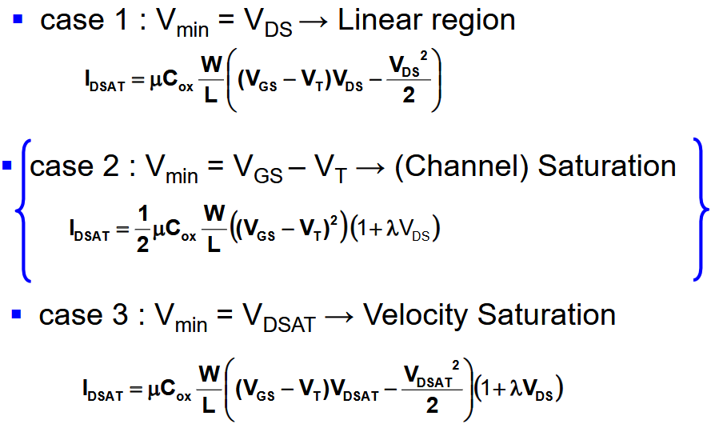
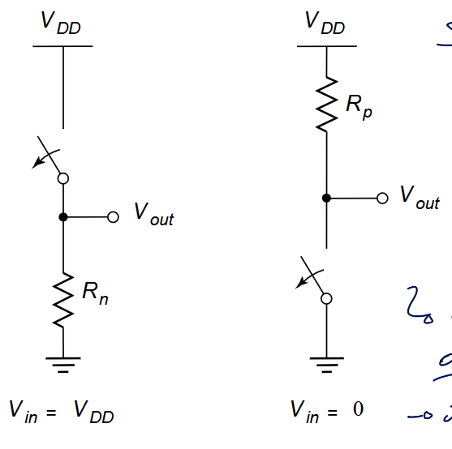

- [Introduction](#introduction)
  - [Transistor switch model](#transistor-switch-model)
- [Logic Circuits](#logic-circuits)
  - [Regeneration of the level](#regeneration-of-the-level)
  - [Capacitance](#capacitance)
    - [Effective fan-out](#effective-fan-out)
    - [Signal in reality](#signal-in-reality)
  - [Pass gate logic](#pass-gate-logic)
- [Circuit Timing / Dynamic Logic](#circuit-timing--dynamic-logic)

# Introduction

One of the main thing about this class is finding how to optimize the ratio of $Op/s / W = Op/J$. We want to enhance this ratio. Less and less foundry have smaller and smaller technology. We want to reduce it both for *plugged* and *battery* device. Either we don't have the requirements to pull out or the space to store the energy. 

This class is all about Gate and transistor. Low level is king.

## Transistor switch model

We can model a switch (MOSFET) with an ideal switch and a resistor : 

By the transistor scaling, short channel are behaving differently due to the **velocity saturation**. The relation becomes linear and not quadratic like it used to be.

# Logic Circuits

The swing here is equal to $V_{dd}$ so we have a high noise margin. It is not a **ratioed** logic so we can't use tricks to minimize mismatch by taking advantage of ratios. We only have 1 resistor on so low output impedance but the input is the gate of MOS so we have a high input impedance. There is no static power consumption since no direct path from Vdd to ground. That's nice :)

In the dynamic model we need to add an output cap $C_L$. The load cap is simply the sum of all capacitance at the output node. Transition time is determined by the charging of this cap by a resistor. The sizing impacts the dynamic behavior of the gate.

Ideally we want $V_M$ to be at the middle of the other nominal voltage. We call the region in between the *undefined region*.

## Regeneration of the level

With using this type of gate we have some regeneration level, it will amplify the signal and so we won't have undefined level and we will have the signal that will reach one defined state. If we have no regeneration, we will reach meta-stability. We have to meet some conditions : 

* The transient or undefined region in the VTC should have a gain |dVout/dVin| larger than 1
* In the “legal” or defined regions the VTC gain should be smaller than 1 in absolute value
* The boundary between the defined and undefined regions are $V_{IH}$ and $V_{IL}$ where the gain = -1

We need gain or the signal will be lost.

We have 3 different types of noise : 

1. Inductive coupling
2. Capacitive coupling
3. Power and ground noise

The noise margin in CMOS is rather high which is a good thing seeing the low output impedance.

We see that the ratio of PMOS and NMOS determine the $V_M$ voltages.

## Capacitance

We know that the delay of a switch is $t_{phl} = f(R_{on} C_L) = ln(1/2) R_{on} C_L = ln(1/2) (R_{eqn} + R_{eqp})/2 \cdot C_L$. We are still observing some glitches when we switch on and off. This **isn't** due to the miller effect. This **overshoot** is due to the gate drain capacitor. 

This is due to charges and sudden and "infinite" steep step at the input which will create an extra unwanted voltage. Thankfully the input isn't as steep in reality and so the effect is less severe but still noticeable. We call it the *digital miller effect*:

$$
t_d = \frac{C_{total} \cdot (\Delta V+ V_{DD} /2)}{I_{max}} = \frac{(C+C_L)}{I_{max}} \left( \frac{C}{C+C_L} V_{DD} + \frac{V_{DD}}{2} \right) = \frac{(3C+C_L) \cdot V_{DD}}{2I_{max}}
$$

So it is like the cap becomes 3 times larger (similar to the miller effect) but in reality we are closer to 2 since we never have a perfect step at the input.

We can move those $C_{gd}$ to the inside and see it as an impact on $C_L$. Again we can reuse the theory of DDP with the intrinsic and extrinsic load where $C_L = C_{int} + C_{ext}$ : 

$$
t_p = 0.69 R_{eq} (C_{int} + C_{ext}) = 0.69 R_{eq} C_{int} \left(1 + \frac{C_{ext}}{C_{int}}\right) = t_{p0} \left(1+\frac{C_{ext}}{C_{int}}\right)
$$

So the sizing can help up to a certain point where we have an *irreducible* delay.

### Effective fan-out

The input $C_g$ and intrinsic cap are always proportional to the sizing : $C_{int} = \gamma C_g$ where $\gamma$ is a technological constant. Same goes for the extrinsic load $C$ where it is the input $C$ of the next invertor proportional to the sizing $C_{ext} = fC_g$. So we can summarize the delay $t_p$ by :

$$
t_p = t_{p0} \left( 1+\frac{f}{\gamma} \right)
$$

The delay depends on the ratio between its external load capacitance and its input capacitance, te ratio is called the *effective fan-out*.

The newly introduced $\gamma$ is not valid for dynamic logic or more exotic technologies. If this $\gamma = 1$ then it means that $C_{int} = C_{in}$. It is an acceptable approximation in standard CMOS logic.

For the ring oscillator where we assume equal size $f=1$ is independent of the size. In real technology we see only a weak dependency of timing on sizing.

### Signal in reality

We know that we can't have infinitely steep signal and even worse, a too slow rise and fall time could lead to metastability issues ! We could also have some actual short circuit for a brief amount of time leading to waste of energy. So in most of design software we will leave some headroom to avoid possible short-circuit and we will flag it with *max transition violation*.

#### Note on sizing

When we see the $a$ or $b$ next to a transistor it is its *relative sizing* compared to a classic $\frac{W_{min}}{L_{min}}$. For complex gate and due to the various sizing we can have, we will transform a little  bit our formula :

$$
t_p = t_{p0} \left( p+\frac{gf}{\gamma} \right) = t_{p0} d
$$

* $f$ : electrical effort
* $g$ : logical effort
  * due to the fact a logical gate is always slower than an invertor with equal current drive. Ratio of input cap to the cap of an inverter that delivers equal current.
* $p$ : ratio of intrinsic delay of the gate to the intrinsic delay of an invertor
* $d$ : gate delay
  * relative to  the intrinsic delay of the reference invertor

## Pass gate logic

# Circuit Timing / Dynamic Logic