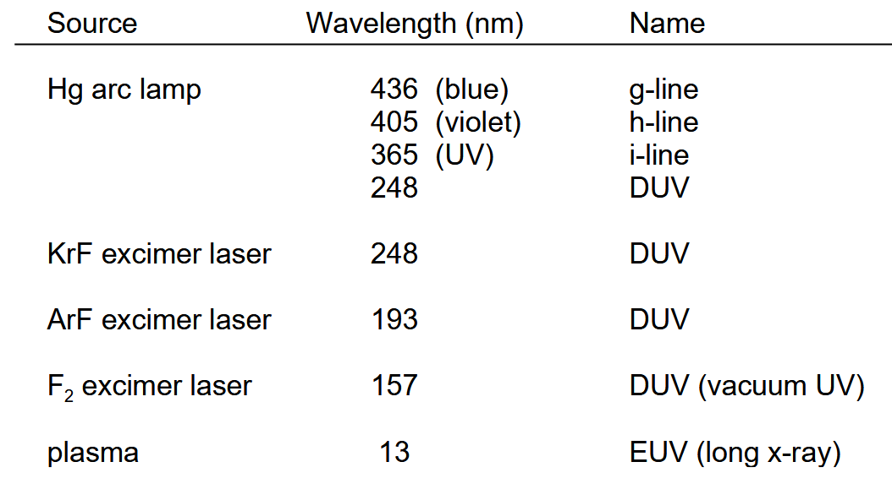

- [First Chapter](#first-chapter)
  - [Silicon properties](#silicon-properties)
  - [Boule making](#boule-making)
- [2 Lithography](#2-lithography)
  - [Resist spinning](#resist-spinning)
  - [Optic](#optic)
  - [Mask and formulas](#mask-and-formulas)
  - [Lights](#lights)
  - [Double patterning](#double-patterning)
  - [EUV](#euv)
- [4 Oxidation, wet, dry](#4-oxidation-wet-dry)
  - [Thermal oxidation](#thermal-oxidation)
  - [LOCOS](#locos)
  - [STI](#sti)
  - [Doping](#doping)
  - [Ion Implantation](#ion-implantation)
- [5 Etching, wet, dry, plasma, DRIE](#5-etching-wet-dry-plasma-drie)

## First Chapter

Positive etch mask = exposed area will be removed. Negative vice versa.

| Wafer Size |  Thickness  |
| :--------: | :---------: |
|     4"     | 400 $\mu m$ |
|   8-12"    |   1.2 mm    |

### Silicon properties

Cheap and strong, fragile. Resistivity 0.001 - 20 $k\Omega /cm$. Can be SCS, poly or amorphous. Can deform without cracking for quite some time.

{.width=50%}

In a Si cube we have 8 atoms inside the cell. with:

$$
Volume = (.543nm)^3 \qquad \frac{8}{Volume} = 5\cdot 10^{22} atoms/cm^3
$$

SCS has a purity up to 11 nines ! and is 2 FCC lattices displaced by .25, .25, .25.

### Boule making

To create a Boule we can use a Czochralski pulling at 1420C. The pull rate is around **mm/min**. 30 hours for 2m + 30 hours for cooling!

#### Wafer treatment

First we have to cut then to get a perfect wafer we will have:

1. Lapping: $20 \mu m$/side
2. Edge profiling: makes edge cleaner
3. Etching (chemical): $20 \mu m$/side
4. Polishing (CMP): $25 \mu m$/side

{.width=50%}

A boat can contain between 12 to 24 wafer.

{.width=50%}

We drop some die on the chips that aren't good due to a defect. Lower defect ratio allows to put bigger transistor. But going smaller isn't always the best as the interconnect cost can quickly ramp up as we go too small. So optimization process between Packaging and reliability (yield).

{.width=50%}

{.width=50%}

Class ISO:

- 10.000: PCB, packaging
- 1.000: MEMS, packaging, HDD
- 100: MEMS, RF/Photonic ICs
- 10: IC

## 2 Lithography

{.width=50%}

{.width=50%}

After this we can apply some HMDS to remove the OH group at the top of the wafer to make the photoresist sticks better. We must also apply some anti-reflective coating to avoid the UV light to strike unwanted area.

### Resist spinning

We drop a little bit of the photoresist and then spin it faster to make it a nice and even coat:

$$
T = \frac{K C^\beta \eta^\gamma}{\omega^\alpha}
$$

The thickness is $0.05-100 \mu m$. The thickness varies due to step on the wafer (previously deposited material).

{.width=50%}

We can also use some *spray coating* to spray and rinse through a nozzle. The step coverage is better and more uniform. There is also dip coating and laminating while they are less used in this industry.

After this we usually do some soft baking to improve resolution. If too long we may decompose the resist watch out !

- few mins at 100C
- 30 mins in a convection oven

### Optic

PSM is a prime example to improve resolution. With ARC we also trap some lights in the resist creative some over exposed and ripple in the sidewalls.

So we usually bake PEB to improve the sidewalls ripple ! We use some OPC to correct and get the desired shape that may looks different on the mask. Usually we print on a metal on chrome mask using an e-beam. Either we use a master mask and directly use it to print on the wafer or we first use the master mask to create a larger mask with multiple master mask print on it. Reduction by **4 to 5** times reduction from mask to wafer !!!

3 types of printing

1. Contact printing: Mask is touching the wafer
   * Better resolution (less diffraction)
   * Mask wear and wafer damage
2. Proximity printing: not touching this time
   * Lower resolution
   * Better mask lifetime
3. Project printing: uses a set of lenses to focus on the mask and then on the wafer
    * Expensive technique but best of both

### Mask and formulas

The most important metrics are:

- **Critical Dimension**: $CD = k1 \frac{\lambda}{NA}$
- **Numerical Aperture**: $NA = n sin(\theta)$
- **Depth of Focus**: $DOF = k_2 \lambda/NA^2$ where $k_2 < 1$

{.width=50%}

So clearly, we can see why having a small wavelength matters to get better precision. To improve again we can use a wider $\theta$.

With the DOF, some part could be in focus while other not which is really problematic. We can't have a nice and uniform resolution accross multiple lengths.

### Lights

{.width=50%}

### Double patterning

We can use two mask to get virtually smaller features by combining those two together.

- LELE: reduces $k1$, double the cost since double patterning. Overlay issue :((
- SADP: self aligning. Simply use dummy fill then add THICKKK sidewalls, etch it a lil, remove dummy and boom 2 pattern for the price of 1.
- LFLE: based on a freezing process.
- SAQP: close to SADP but pitches less than $38 nm$

### EUV

We can't use lenses anymore. **7 mirrors with 70% reflection per mirror!** No pellicles that are EUV transparent yet.

To tune the linewidth we can change the exposure and development time.

For etching:

- wet etching: using acetone, IPA, water rinse. 2% NaOH for positive resists
- plasma etching: O2 plasma

## 4 Oxidation, wet, dry

SiO2 is forming a *tetrahedral arrangement*. Can create some amorphous structure too. The quality is determined based on the ratio of bridging to non-bridging elements.

In elec, we use some amorphous.

|               Spec               |       Value       |
| :------------------------------: | :---------------: |
|             density              |  $2-2.3 gm/cm^3$  |
|         $\varepsilon_r$          |        3.9        |
|        reflection index n        |        1.5        |
|         Breakdown field          |    $10^7 V/cm$    |
| Trap/defect density at interface | $10^{11} cm^{-2}$ |

### Thermal oxidation

Natural growth of a oxide exposed to air and enhanced by temperature. Useful for:

1) implant/diffusion mask
2) surface passivation
3) isolation between transistors
4) key component of MOS structures
5) dielectric for multilevel interconnect
6) cleaning

This grows in both way but slightly more outwards (**54/46**). SiO2 is 2.2 times larger than Si. Dry thermal is slower but better than wet oxidation. Dry has a higher breakdown voltage --> $5-10 MV/cm$ so really good for gate oxide (since they are getting smaller and smaller)!

For $.5\mu m$ @ 1200C :

- Dry: 6 hours
- Wet: 1 hour

We can have some interface issue as the step is not exactly the same and so the development won't be equal. Can use color to determine the thickness:

| Thickness ($\mu m$) |    Color     |
| :-----------------: | :----------: |
|        0.07         |    Brown     |
|        0.31         |     Blue     |
|        0.39         |    Yellow    |
|        0.41         | Light orange |
|        0.47         |    Violet    |

### LOCOS

To have some isolation between transistor. Reduces topography by 56%. use some Nitrite which has a higher thermal expansion than Si. Add padoxide as stress release.

- Si3N4: $100-200 nm$
- SiO2: padoxide: $20-30 nm$

Wet oxi creating bird beak and then removing those oxide.

### STI

Use CVD for the oxidation and CMP of the oxide avoids bird's beak and mechanical stress.

{.width=50%}

Better precision, the width drawn is the actual width. We also use some dry oxidation which makes it better for large drive current. 

### Doping

We use either:

- gas, coating or ion implementation
#### Diffusion Theory

We have a diffusion *flux* of *impurities* in one dimension. (We are
always using x as the vertical direction of diffusion).

$$\begin{aligned}
    F &= - D \frac{\partial C(x,t)}{\partial x} & D &= D_0 exp\left( \frac{-E_{\alpha}}{kT} \right)
\end{aligned}$$

We have $D$ that is the *diffusion coefficient* in $cm^2/s$. $C$ is the
dopant concentration per unit volume. We have $D_0$ that is the
diffusion coefficient in $cm^2/s$ at infinite temperature and $E_\alpha$
is the activation energy in $eV$.

At low concentrations of dopant in silicon ($10^{12} - 10^{16} cm^3$)
can be seen as constant. With this simplification, we can easily solve
the equation, we also see that gold, coper, \... have high diffusion
coefficient which is why we tend to avoid such metal in the clean room.

If we do not have a source or sink of the impurity, we know that the
*change in impurity concentration with time must equal the local
decrease of diffusion flux*:

$$\begin{aligned}
    \frac{\partial C}{\partial t} &= - \frac{\partial F}{\partial x} = \frac{\partial}{\partial x} \left( D\frac{\partial C(x,t)}{\partial x} \right) & \frac{\partial C}{\partial t} &=  D\frac{\partial^2 C(x,t)}{\partial x^2} \text{ if D cst}
\end{aligned}$$

There are 2 methods of diffusion:

1.  [Constant-surface-concentration:]{.underline} using vapor, we have a
    constant concentration of dopants at the surface.

2.  [Constant-total-dopant:]{.underline} thin layer, we have constant
    amount of impurity at the surface.

#### Constant-surface-concentration

$$\begin{aligned}
    \text{Init: } C(x,0) &= 0 & C(0,t) &= Cs & C(\infty, t) &=0\\
    C(x,t) &= C_S erfc\left( \frac{x}{2\sqrt{Dt}} \right) & erfc(z) &= 1-erf(z) & erf(z)&=\frac{2}{\sqrt{\pi}}\int_0^\pi e^{-y^2} dy
\end{aligned}$$

We have $\sqrt{Dt}$ that is called the *diffusion length* in $cm$. The
total number of dopant atoms per unit area that has diffused into the
semiconductor is given by:

$$Q(t) = \int_{0}^\infty C(x,t) dx = \frac{2}{\sqrt{\pi}} C_s \sqrt{Dt} \approx 1.13 C_s \sqrt{Dt}$$

#### Constant-total-dopant

$$\begin{aligned}
    C(x,0) &= 0 & \int_0^\infty C(x,t) dx &= \phi & C(\infty, t) &= 0\\
     & & C(x,t) &= \frac{\phi}{\sqrt{\pi D t}} exp \left( - \frac{x^2}{4 D t} \right)
\end{aligned}$$

Where $\phi$ is the *total amount of dopant* per unit area. So the
surface concentration ($x=0$) is $\phi / \sqrt{\pi Dt}$.

We usually use those two methods and we call this a *two step diffusion
process*. a pre-deposition diffused layer is first formed using
constant-surface-concentration condition. Then a drive-in (or
redistribution) diffusion is used using constant-total-dopant condition.

For most practical cases the diffusion length for the pre-deposition
stage is much smaller than the diffusion length of the drive-in
diffusion. This allows to make deep junctions, e.g. for wells for CMOS.

{.width=50%}

We also need a minimum mask width to be able to absorb all those ions in the doping process.

### Ion Implantation

The source is at around $25 kV$ and the high voltage accelerator goes above $> 5MeV$. There will be some undercut as the path traveled inside won't be straight and it will bounce. So th depth is a gaussian. Can have special behavior where the ion travels all the way through the lattice without bouncing.

$$N(x) = N_p exp \left( - \frac{(x-R_p)^2}{2 \Delta R_p^2} \right) \qquad N_p = \frac{\phi}{\sqrt{2 \pi} \Delta R_p}$$

$\Delta R_p$ being the *projected straggle* distance from the peak with concentration reduced by $40\%$.

Need some **rapid annealing** to repear the lattice after, will spread out the concentration sadly.

## 5 Etching, wet, dry, plasma, DRIE