# First part

It is important to remember that the difference between a NMOS and a
PMOS is the type of channel that appears between the drain and the
source. Namely in a NMOS we have the appearance of a n-channel
(electrons) among a P-type doped silicium.\
Most schematics of this course are not *up to scale* ! so it is
important to remember some typical values :

-   Wafer diameter & Thickness:

    -   4\" : 400 $\mu m$

    -   8\"-12\" : 1200 $\mu m$

-   Thickness of a layer : 1-3 $\mu m$

A good comparison for this scale is a single hair which is approximately
75 $\mu m$.

## Basic steps of IC fabrication

We always start from a wafer, either P-type or N-type. Here we will
discuss the fabrication of a NMOS type of transistor so we will need a
P-type Si wafer.

1.  [Oxidation :]{.underline} We deposit a layer of $SiO_2$ by either
    *growing* or *depositing* it at high temperature.

2.  [Deposition of poly-Silicon :]{.underline} we will deposit some
    poly-crystalline silicon using [cvd]{acronym-label="cvd"
    acronym-form="singular+short"}.

3.  [First photoresist :]{.underline} we use some organic
    photoresist and to evenly disperse it we will spin the wafer. This
    will help spreading evenly the photoresist and making it thinner.
    Many version and purity of this compound exists.

    -   *Lithography :* we will shine UV light through a mask (why UV ?
        shorter $\lambda$ so smaller features size possible). After this
        we will simply etched away the area that were exposed to UV
        light (so it gets smoother through UV exposure and stay harder
        otherwise)

4.  [Etching of Poly-Si :]{.underline} we will use some *dry* (plasma)
    or *wet* etching and then we remove the rest of photoresist.

5.  [Doping of Source and Drain region :]{.underline} we send ion at
    high speed on the wafer (ion implementation) and to repair the
    damage we \"*cook*\" it around $900^\circ$. It can easily traverse
    the thin $SiO_2$ layer but not the poly-Si.

6.  [Wrapping & Adding contact :]{.underline}

    -   *Deposit of Oxide :* again with some [cvd]{acronym-label="cvd"
        acronym-form="singular+short"} we put a layer of oxide. This
        result in unsmooth surface.

    -   *Add photoresist :* then use UV mask and etch at specific spot
        over the Source and Drain.

    -   *Remove photoresist*

    -   *Add metal :* we do some [pvd]{acronym-label="pvd"
        acronym-form="singular+short"}

    -   *Remove metal over the gate :* we don't want any layer of metal
        over the gate or we will create more unwanted capacitance. So we
        again use photoresist, UV mask, etch photoresist, etch metal and
        finally remove the remainder of photoresist.

An important distinction to be made is when we are talking about mask
they can be either :

-   *Photo mask :* use of a blocking and non blocking UV light mask to
    make a photoresist compound react or not.

-   *Etch mask :* the remaining photoresist (after etching of non
    hardened one) is used as a protective layer to not etch unexposed
    surfaces.

Mass producing and producing in batch is a key to bring down the costs
of IC. We can produce a lot quickly and efficiently and with good design
we can leave room for error and process variation meaning we can
increase yields.

## Silicon

:::: wrapfigure
r0.5

::: center
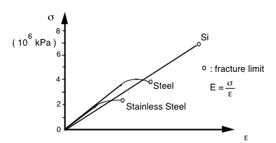{width="95%"}
:::
::::

Silicon is one of the favorite material since it is :

-   Cheap, strong (and fragile)

-   0.001 - 20 $k\Omega/cm$

-   Stable oxide ($SiO_2$) pretty inert (wow)

-   various flavors of lattice, Silicon-Crystalline-Silicon,
    poly-silicon, amorphous silicon (unordered)

We can also use some GaAs, Quartz (which is just $SiO_2$ with other
things), SiC, $Al_2O_3$. On the figure
[\[resistivity_Si\]](#resistivity_Si){reference-type="ref"
reference="resistivity_Si": we can see how the Silicium can deform
under pressure and come back to its original shape without breaking for
large values. We can even make some wafer flexible using special
processes to make it extra thin.\
We mostly use crystalline like Silicon even though non-crystalline have
become somewhat important in the industry. The doping plays a role
regarding the resistivity of the material.

{#fig:resistivity-Si-Ohms width="75%"}

::: wrapfigure
r0.5 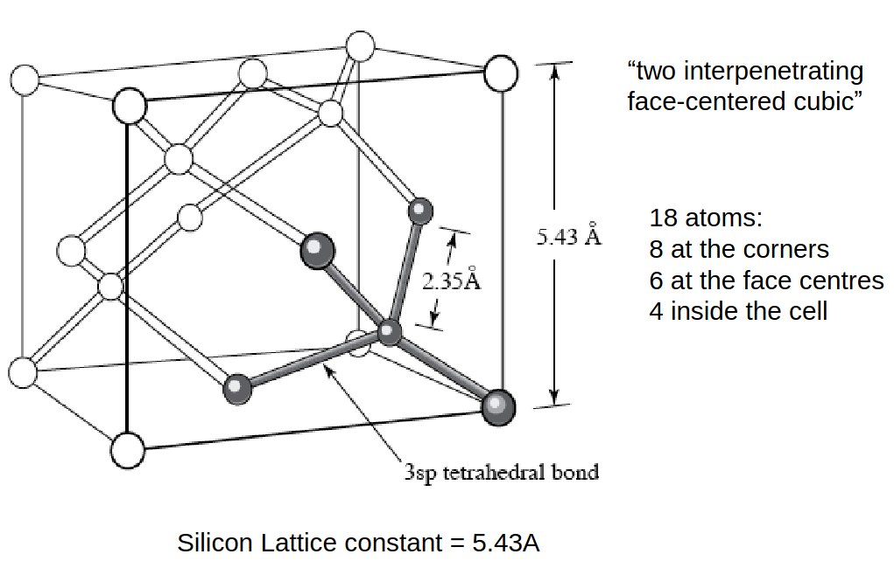{width="95%"}
:::

Silicon atoms have *4 valance electrons* and their *covalent bonds* are
in a *pyramid like structure* (**tetrahedron**). For doping we can use :

-   [N-type :]{.underline} use 5a group : Arsenic, Phosphorous, \...

-   [P-type :]{.underline} use 3a group : Boron, Gallium, Aluminum, \...

We have 4 atoms completely inside of a unit cell, the 8 ones on the
corner are shared with other cell (and count as 1 atom inside cell) and
the 6 remaining atoms on the faces are shared with 2 cells (count as 3
atoms inside cell). So we have $4+1+3=8$ atoms inside the cell and the
cell volume is $(.543 nm)^3 = 1.6 \cdot10^{-22} cm^3$ which leads to a
density of $\frac{8}{1.6 \cdot10^{-22} cm^3} = 5 \cdot 10^{22}$ atoms
$/cm^3$.\
To represent which angles we are viewing a cell, we are using the
**miller indices**. Different orientations of the lattice impact the
properties of the transistor due to different lattice form.

### Miller Indices

To find the miller indices, we need to first draw a plane and see where
it intercepts with any x,y,z axis. If we only intercept the x axis at
$a$ then we can write $[1 \quad 0 \quad 0]$ if we normalize $a$ as the
*cubic cell constant*.\
We have various notation each with its own rule:

-   [100 :]{.underline} **direction** in crystal coordinate

-   [\<100\> :]{.underline} set of *symmetrically equivalent*
    **direction** in crystal coordinate

-   [(100) :]{.underline} **plane** *perpendicular* to a direction

-   [\{100\} :]{.underline} set of *symmetrically equivalent*
    **plane** in crystal coordinate

To find the angle between two crystallographic directions we use the
equation with the two directions being $[h_1k_1l_1]$ and $[h_2k_2l_2]$ :
$$cos(\theta) = \frac{h_1 h_2+k_1k_2+l_1l_2}{\sqrt{(h_1^2+k_1^2+l_1^2)(h_2^2+k_2^2+l_2^2)}}$$

## Production of wafers

Single crystal silicon is one of the purest material made artificially
with a purity of $99.999999999$ %. We have a FCC lattices displaced by
$.25$ Å in the 3 directions.

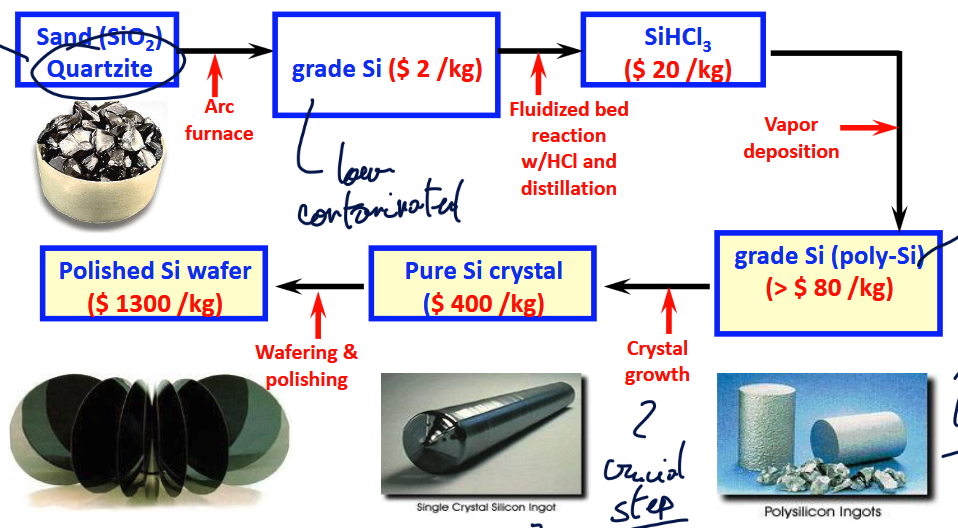{#fig:si-production-label
width="75%"}

We can have some defect and non-idealities in the boule. Typically we
want a mono-crystalline structure where everything is ordered in the
same direction. But we can have :

-   [Polycrystalline :]{.underline} multiple pockets named **grain** (or
    crystallites) where we find different direction of crystal

-   [Amorphous :]{.underline} unorganized structure and random

But first, we need to melt this *quartz sand* with carbon at over
$1900^\circ$C. We have a purity of over $98$ %.

### Wafer processing

#### Czochralski Pulling

To create the big boule we then use to slice into wafers, we need to use
a specific machine. Typically, we need to use a *seed crystal* with a
specific orientation which will make sure to give the same orientation
to the boule. We dip it and rotate in counter direction the pot and the
seed crystal. The rotation speed is important and the diameter is
*inversely proportional to the pull rate*. The pull rate is in $mm/min$
and it takes a lot of time to produce just one boule. We need 30 hours
to create a 2m boule and another 30 hours for heating and cooling.\

#### Slicing

To indicate the orientation, we used to add a flat perpendicular to the
$<110>$ direction but now we simply use a notch. We mostly use the
$<100>$ with a precision of $\pm 0.5^\circ$ and sometimes we use the
$<111>$ with $2^\circ-5^\circ$ off axis.\
The cutting is done with wires coated with diamond and we have one
feeder spool and another one that takes the used wires.

#### Wafer after treatment

1.  **Lapping** grind both sides, flatness around $2-3 \mu m$, removes
    $20\mu m$ per side.

2.  **Edge Profiling**

3.  **Etching** chemical etch to remove *surface damage*, removes
    $20\mu m$ per side.

4.  **Polishing** chemi-mechanical polish, using a slurry composed of
    $Si O_2$ and some $NaOH$, removes $25\mu m$ per side. Nice mirror
    finish.

5.  **Cleaning and Inspection**

#### Crystal Orientations

{#fig:crystal-orientation-label
width="75%"}

::: wrapfigure
r0.55 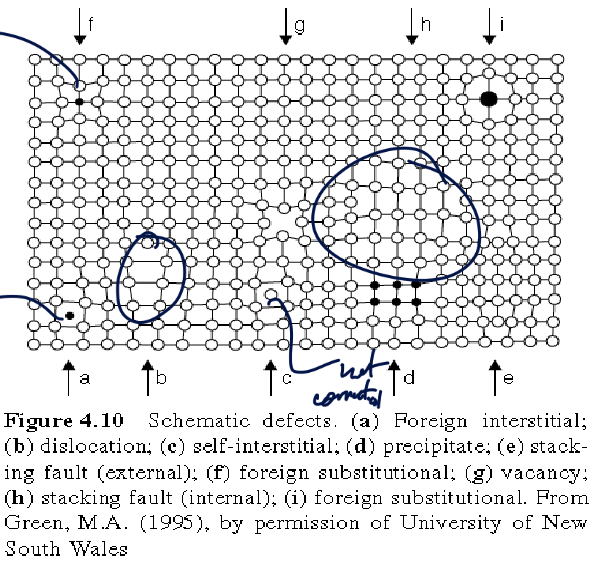{width="95%"}
:::

But nowadays, we are using notches and not really using fully doped
wafer. We are doping locally the wafer. A notch indicates a $<100>$
n-type wafer.\
We are processing the wafers in batches of 12 or 24 and they sit on a
glass tray (quartz boat) so the support doesn't melt. We will oxidize
the wafer to dope it which will tint the wafer. The color of the tint
can be used to see what type of doping it is and how doped it is using
some optics properties.\
All those issues will lead to non-functional dies. We usually put some
dye on those to clearly and visually indicate if they are good or not.
We can't use the dies that are too close to the edge (*edge exclusion* 6
mm for 100-mm diameter wafers).\
For this reason, we are wanting to use smaller chips to increase the
yield. There exists an ideal size that is related to the yield and
packaging cost. Now we have an optimum around $13 cm^2$.

#### Packaging

To do some packaging we need to dice the wafer, then use a pick and
place arm and finally add some wire (wire bonding) from the chip and its
pad to the housing of the chip.

## Cleanroom

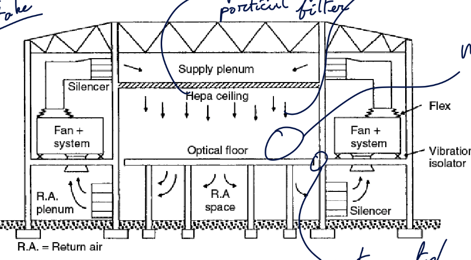{#fig:cleanroom-label width="70%"}

The purified air comes from the ceiling where it needs to go through
some *HEPA* (High efficiency particulate air) filter in the ceiling. We
will usually only put one under the arrival of the air and over the
crucial equipment to reduce cost.\
We have various class where each number indicates the amount of
particles $>0.5\mu m$ in a cubic foot of air :

-   Class 10000 : PCB, electronic packaging, medical devices

-   Class 1000 : MEMS, electronic packaging, hard disk drives

-   Class 100 : MEMS, RF/Photonic ICs

-   Class 10 : ICs

We also use the ISO standard :

::: {#tab:my_label}
   Class    FS209    0.1 $\mu m$   0.2 $\mu m$   0.3 $\mu m$   0.5 $\mu m$   1 $\mu m$   5 $\mu m$
  ------- --------- ------------- ------------- ------------- ------------- ----------- -----------
   ISO1                  10             2                                               
   ISO2                  100           24            10             4                   
   ISO3       1         1,000          237           102           35            8      
   ISO4      10        10,000         2,370         1,020          352          83      
   ISO5      100       100,000       23,700        10,200         3,520         832         29
   ISO6     1,000     1,000,000      237,000       102,000       35,200        8,320        293
   ISO7    10,000                                                352,000      83,200       2,930
   ISO8    100,000                                              3,520,000     832,000     29,300
   ISO9                                                        35,200,000    8,320,000    293,000

  : Comparison of ISO and FS209 standard
:::

The cost in chips is due to the lithography where one chip can go
through 10 cycles and the more cycle we have the more expensive it is.

# Lithography, photoresists, exposure, development

When we do the lift-off we can either use *positive* photo-resist or
*negative* photo-resist. In positive, it is like usual, the photo-mask
is used to protect area that shouldn't be etched away. But some
compounds are not easy to etch. So sometimes, it is better to use
negative process to first deposit the photo-resist and then do the
blanket deposition of the compound. Then the lift-off is easy. We need
some special trapeze shape that lays on the smaller side for this
process.

## Lithography: basic steps

The goal behind photolitography is to transfer a pattern into structure
in a thin layers. By repeating this operation multiple time we can
create some intricate and complex integrated circuits.

It mostly revolves around 3 major steps:

1.  [Resist coating:]{.underline} we deposit a light sensitive
    photoresist

2.  [Exposure:]{.underline} we expose some part of it through a
    structural mask

3.  [Development:]{.underline} we remove the photoresist

Photoresist can be used in many many ways. When we etch away compounds
we usually have some *undercut* which can be a structural problem.

### Clean wafer

We first remove the particle with some rinsing in isopropanol,
ultrasonic and megasonic baths. To remove the organic particle we can
use some Piranha solution. To remove the metal traces that could diffuse
into the wafer, we can do some classic RCA clean, this step is needed
before high-temperature steps. RCA also removes ions that may be in the
substrate.

#### RCA-clean

1.  Removal of the organic contaminants (organic + particle clean)

2.  Removal of thin oxide layer (oxide strip, optional)

3.  Removal of ionic contamination (ionic clean)

#### IMEC clean

The RCA-clean is quite an aggressive process and requires lot of
chemical products. The IMEC clean is a bit more nature friendly and uses
drying to force the particules to stay in the bath and not on the wafer.

### Anti-reflective coating and adhesion promoter

We use some Hexamethyldisilazane that will remove OH groups from the
surface making the wafer hydrophobic and thus photoresist-philic (since
photoresists are apolar).

1.  **TARC:** Top-side Anti Reflective Coating.

    -   Spin coated on top of photoresist

    -   Easier process

    -   Inferior performance

2.  **BARC:** Bottom side Anti-Reflective Coating.

    -   Deposited below photoresist layer

    -   Better performance

    -   Longer processing (plasma-etched)

### Coat with photoresist

We can have positive or negative photoresist where:

-   Positive: exposed area gets softer and easier to etch

-   Negative: exposed area gets harder and harder to etch

Spin coating is a process where we depose some droplets and spin the
wafer. Spinning it at a slow speed will spread the compound equally and
then we finish it off by spanning faster. It is a pretty good and
convenient way to coat a wafer's surface. But we can have some bumps
around the side of the wafer (edge bead) and the way steps are coated is
not always perfect.

#### Resist spinning

We have some empirical equations for the thickness, and we spin with a
force of around 5 NM.

$$T = \frac{K \cdot C^\beta \cdot \eta^\gamma}{\omega^\alpha}$$

Where $K$ is the calibration constant, $C$ polymer concentration in gram
per 100 mL, $\eta$ intrinsic viscosity, $\omega$ rotation per minute.
The exponents are empirically determined.

We can also remove those edge bead in the process. But this doesn't
solve the issue of uneven coating around steps of the wafer.

#### Spray coating

We have two nozzles where one will be used as the developer and the
other one is to rinse the wafer. It provides a smoother step coverage
and is widely used in MEMS devices.

#### Other methods

We can also think about dip coating, laminating dry films of
photoresist, \...

### Soft Bake

It is used to remove the solvents in the resist. It is non-sticky,
improves resolution, improves the strength of resist. But we shouldn't
bake too high too long or we would cause the embrittlement and make the
removal harder.

### Exposure

There exists 5 exposure methods:

#### Lithography

We expose the resist to UV light through a mask. We have to align the
mask precisely, it can be done manually for older technology. The
smaller we go the more expensive a mask is and we have more and more
layers.

#### Limits

The main issue is the diffraction effects. Indeed, we have effects where
we could have some destructive or constructive waves that can be
unforeseen. That's why some mask can have special patterns that will
result in the desired effect.

Those special patterns are Phase Shifting Mask where we will have some
special pattern to change the phase.

The process of making the wafer reflective can sometimes lead to create
some standing waves. Those standing waves can lead to uneven development
and rippled sidewalls. A solution for this is to use
[arc]{acronym-label="arc" acronym-form="singular+short"} or post
exposure bake. This can also lead to linewidth variations due to
reflection.

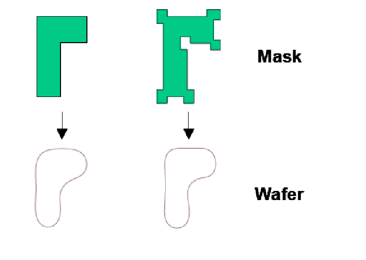{#fig:enter-label width="50%"}

### Different printing techniques

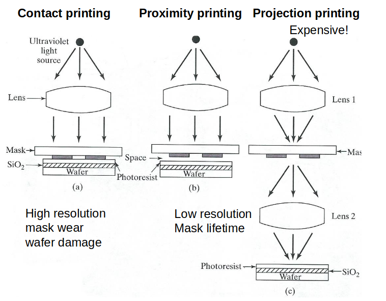{#fig:enter-label
width="65%"}

Usually we use stepper to print successively a pattern on the wafer.

#### Projection printing

We concentrate and project on the wafer, There is a few key metrics such
as:

-   [Numerical Aperture:]{.underline} $NA = n sin(\theta)$

-   [Critical Dimension:]{.underline} $CD = kl \frac{\lambda}{NA}$

-   [Depth of Focus:]{.underline} $DOF = k_2 < 1$

The depth of focus is an indicator to know when it is no longer good for
focus.

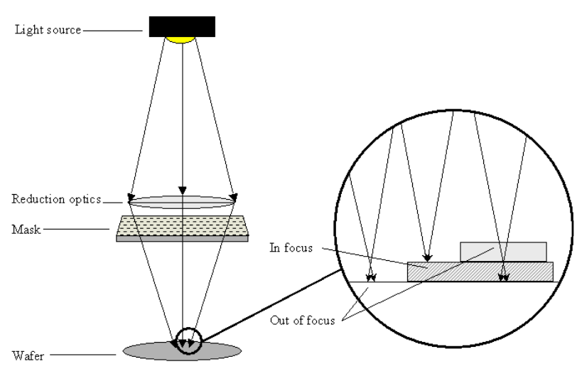{#fig:enter-label width="50%"}

### Light source

Another important parameter we can play is the light source. Back then,
we used mercury bulbs for most lithographic work. It was a good enough
and pretty cheap UV source. But it would produce various line of UV. So
we had to use some filter to get only a specific wavelength.

  **Source**           **Wavelength (nm)**   **Name**
  -------------------- --------------------- ------------------
  Hg arc lamp          436 (blue)            g-line
                       405 (violet)          h-line
                       365 (UV)              i-line
                       248                   DUV
  KrF excimer laser    248                   DUV
  ArF excimer laser    193                   DUV
  F~2~ excimer laser   157                   DUV (vacuum UV)
  plasma               13                    EUV (long x-ray)

  : Wavelengths of light sources used in photolithography

The main attract to use lower wavelength light source is to be able to
draw better and smaller features. A good way to circumvent this rat race
is to use multiple mask to produce one result. So we can use multiple
ask with more spaced out features which simplifies amd relax constraints
of the problem.

1.  Double patterning: Litho-Etch-Litho-Etch (LELE)

    -   First technique introduced, reduces $k_1$

    -   More costly as it doubles the amount of mask, need a hard mask,
        possible overlay issues

2.  Double patterning: Self-Aligned Double Patterning (SADP)

    -   Solution to the overlay issue of LELE's masks self aligning

    -   Single lithography step, need to use an additional block or cut
        mask to remove unwanted material

    -   Complicated to design masks, process intensive

3.  Double patterning: Litho-Freeze-Litho-Etch (LFLE)

    -   Less complicated process than LELE, increased throughput, no
        need for hard mask.

    -   Dependent on development of freezing process, freezing cam cause
        issues in the lines.

4.  Double patterning: self-aligned quadruple patterning (SAQP)

### EUV

This is the hot new trend in the industry (ASML has the technology but
maybe huawei who knows). There has been prototypes since 2017 that can
do $13.5$ nm and NA $0.33$. It doesn't not have lenses but only mirrors
as we can't focus EUV light like this.

#### Issues

We need to use some Bragg reflector that have an alternating thickness
of 2 nm of Mo and Si. It can only reflects $70\%$ per mirror, so we need
a quite intense light source or we won't have anything coming to the
wafer.

#### Photo vs E-beam lithography

With E-beam lithography, we can be really accurate and not use any mask,
it comes at the disadvantage to slower processes. So we use E-beam to
create the mask for photo-lithography.

An issue is the scattering of the electron inside the wafer, it can also
go further than expected and in a random pattern.

### Post exposure bake

It can help with wrinkles in the side wall. Baking can smooth things out
and is quite standard for positive resist. Can also enhance crosslinking
in negative resist.

### Develop - wet process

Development is a wet chemical process as the wafer is immersed in
developer and rinsed and dried afterwards. We can also spray the
developer on the wafer as it spins but can be used and then dried. We
can use the spraying nozzle techniques.

### Hard bake

Sometimes used to improve etch resistance of resist. But it can causes
the softer resists to reflow.

### Etching, metal deposition, ion implantation, \...

See next chapters

### Remove photoresist

To remove the pohotoresist, we can either go for wet etching with some
specialized solutions or acetone, NaOH, \...

We can also opt for O2 plasma etching.

# Deposition: [pvd]{acronym-label="pvd" acronym-form="singular+short": [cvd]{acronym-label="cvd" acronym-form="singular+short": Epitaxial growth, [ald]{acronym-label="ald" acronym-form="singular+short"}

To deposit a thin film layer we can use some [pvd]{acronym-label="pvd"
acronym-form="singular+short"} with evaporation or sputtering. Another
method is [cvd]{acronym-label="cvd" acronym-form="singular+short"} that
uses thermal, low pressure and plasma enhanced (electrons stripped away
from atoms).\
With evaporation (heat + vacuum) we can reach a growth rate of
$0.1-1 nm/s$. With sputtering (vacuum + plasma) we have a rate of
$1-10nm/s$.

## [pvd]{acronym-label="pvd" acronym-form="singular+short"}

### Vacuum

::: wrapfigure
r0.5 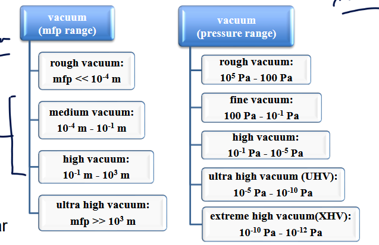{width="95%"}
:::

To realize deposition we need certain grade of vacuum. They are graded
based on their [mfp]{acronym-label="mfp" acronym-form="singular+short"}.
It indicates how far can a molecule travel before hitting an other one.
There is an equivalency between [mfp]{acronym-label="mfp"
acronym-form="singular+short"} and the pressure in the environment.

The roughing pumps are simple a valve that rotates and will take out the
air. But it is not the purest form of vacuum.\
High vacuum diffusion pump use some oil. The oil is heated up and will
vaporize, then when it gets cooled down it will take with them
molecules. The pressure at the bottom is higher and so we can simply use
a pump to take those extra molecules the oil vapor captured.

In a turbomolecular pump we are using some stator and rotor blades that
are inclined in such way that when a molecules strike the turbine blade
it will bounce and slowly travel to the bottom of the pump.

There is also cryogenic pump that is a mix of previously introduced
vacuum pumps.

![Typical system for [pvd]{acronym-label="pvd"
acronym-form="singular+short"}](Vacuum_PVD.png){#fig:PVD-label
width="75%"}

#### Pirani Gauge ($> 10^{-3}$ mbar)

It is based on a *weathstone bridge*. We will use a platinum wire that
is pretty linear and will get heat up, the way this heat transfer occur
depends on the pressure and is lower at lower pressure. So there is a
direct link with pressure, heat and finally resistor which is easy to
measure with such bridge.

#### Ion gauge ($< 10^{-2}$ mbar) 

The filaments will create a *space-charge* of free electrons. The
electrons are attached by the positive grid and the collisions with the
gas atoms will create Ion which can be measured.

### Evaporation

Now, we want to actually vaporize and create thin film on our wafer to
grow all sorts of oxide, metals, polysilicon, \... There is two ways to
do it :

1.  Resistance heating evaporation :

    -   We have the crucible (holder of the compound) and the target
        (wafer) that gets heated

    -   Only low melting temperature point metals (or it gets too hard)

2.  Electron beam evaporation :

    -   We use some electron beam to strike the material that will get
        *sublimate* (not a melting)

    -   We cool the crucible down and it doesn't need to be as pure as
        with heated method

    -   Good for high melting point metals

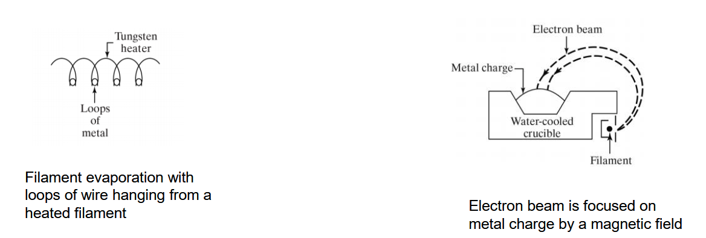{#fig:evap-label
width="85%"}

#### Coverage issues

Due to the radiating pattern from the crucible to the target, we will
have discontinuity on the wafer which is not acceptable for traces or
oxide. So we will gently spin the target to slightly change the momentum
and so atoms will strike the sidewall. We also heat up the substrate to
further help the step coverage.

![Configuration for [pvd]{acronym-label="pvd"
acronym-form="singular+short"}](config_PVD.png){#fig:pvd-conf-label
width="50%"}

### Plasma

Plasma is a low pressure gas where a high energy field is used for
ionization creating a large number of ions and free electrons. So we rip
electrons of the nuclei and this happens in a vacuum. Plasma contains an
equal concentrations of ions and electrons. Electric potential is
approximately constant inside the plasma. We are using weak plasma so
mostly neutral atoms/molecules.

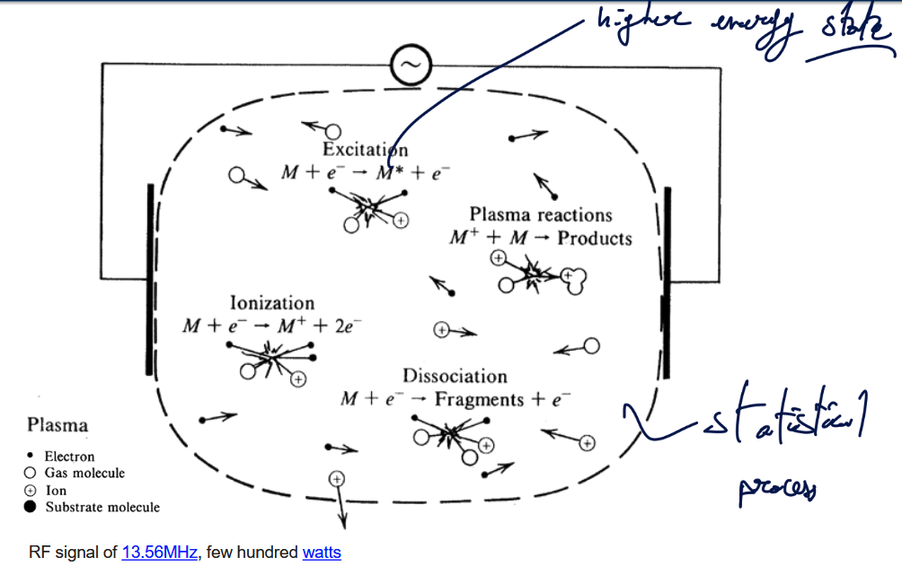{#fig:plasma-sputtering-label
width="51%"}

So the ions of the plasma will strike the target releasing them and
letting them go onto the wafer. We talk about a **sputtering yield**
which indicates
$S = \text{\# of ejected target atoms} / \text{incoming ions}$ and it is
usually $0.1<S<30$.\
For example we can use a plasma of $N_2$ and a $Ti$ target that will
create a thin film layer of the substrate of $TiN$.\
Using sputtering can be quite beneficial especially for multi-components
thin-films. It is also better for lateral thickness uniformity. We have
a superposition of multiple point sources.

## [cvd]{acronym-label="cvd" acronym-form="singular+short"}

The idea here is to use some chemical reaction to go from a gas phase to
a solid phase. Typically we will use a sort of boundary layer which will
trigger a reaction and deposit on the wafer. We need to remember that
*natural* chemical reaction are trigger when we mix different molecules
that will reach a higher state of energy and will tend to a lower state
of energy. If we want to reverse this reaction we need to give the same
amount of lost energy.

::: {#tab:deposition_methods}
  **Material/method**                                                        **Source gases**                                                      **Temperature**  **Stability**
  -------------------------------------------------------------------------- -------------------------------------------------------------------- ----------------- ---------------
  [lto]{acronym-label="lto" acronym-form="singular+short"}                   SiH$_4$ + O$_2$                                                        425$^\circ$C    Densifies
  [hto]{acronym-label="hto" acronym-form="singular+short"}                   SiCl$_2$H$_2$ + N$_2$O                                                 900$^\circ$C    Loses Cl
  [teos]{acronym-label="teos" acronym-form="singular+short"}                 [teos]{acronym-label="teos" acronym-form="singular+short"} + O$_2$     700$^\circ$C    Stable
  [pecvd]{acronym-label="pecvd" acronym-form="singular+short"} OX            SiH$_4$ + N$_2$O                                                       300$^\circ$C    Loses H
  [lpcvd]{acronym-label="lpcvd" acronym-form="singular+short"} poly          SiH$_4$                                                                620$^\circ$C    Grain growth
  [lpcvd]{acronym-label="lpcvd" acronym-form="singular+short"} a-Si          SiH$_4$                                                                570$^\circ$C    Crystallizes
  [lpcvd]{acronym-label="lpcvd" acronym-form="singular+short"} Si$_3$N$_4$   SiH$_2$Cl$_2$ + NH$_3$                                                 800$^\circ$C    Stable
  [pecvd]{acronym-label="pecvd" acronym-form="singular+short"} SiN$_x$       SiH$_4$ + NH$_3$                                                       300$^\circ$C    Loses H
  CVD-W                                                                      WF$_6$ + SiH$_4$                                                       400$^\circ$C    Grain growth

  : Deposition methods, source gases, temperature, and stability.
:::

There is many chemical reactions showed in the course so check out page
40-45. When we grow an oxide or anything, we can either be **mass
transport limited** (velocity of the molecules saturate) or **surface
reaction limited** (the surface isn't heated enough and the reaction
isn't going well).

### Reactor

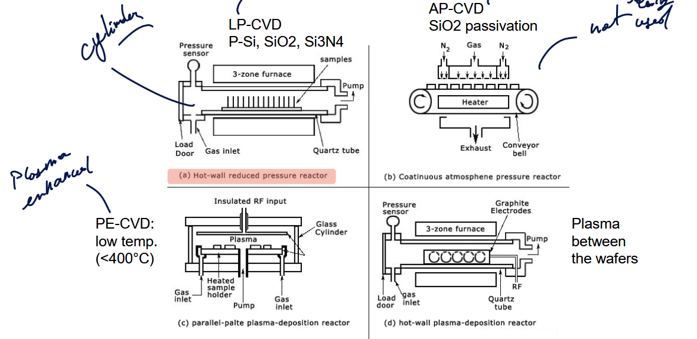{#fig:cvd-reactors-label width="85%"}

#### 1. APCVD - Atmospheric Pressure

It is pretty simple, we put the wafer on a conveyor belt that heats up
the wafer. We use some ozone and [teos]{acronym-label="teos"
acronym-form="singular+short"} gas.

#### 2. [lpcvd]{acronym-label="lpcvd" acronym-form="singular+short"} - Low Pressure

We can stack the wafer vertically so keep them in the boat as we insert
them in the furnace. It needs a pressure of $0.1-2$ Torr and it needs
high temperature and has a slow growth rate. It is ideal for batch
processing.

#### 3. [pecvd]{acronym-label="pecvd" acronym-form="singular+short"} - Plasma Enhanced

We induce plasma in the gas by using some RF. We need some inert and
process gas and the wafer needs to spin and be heated. This result in
better step coverage and needs relatively lower temperature while having
a high deposition rate.

<figure id="fig:pecvd-label">

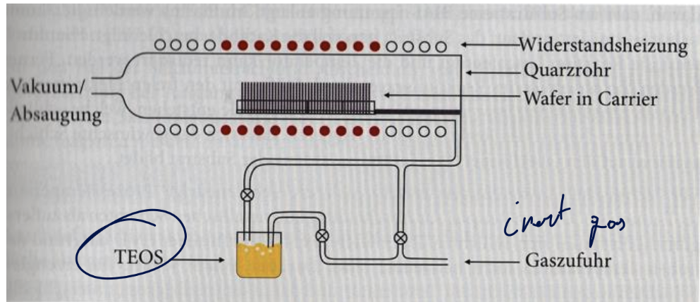 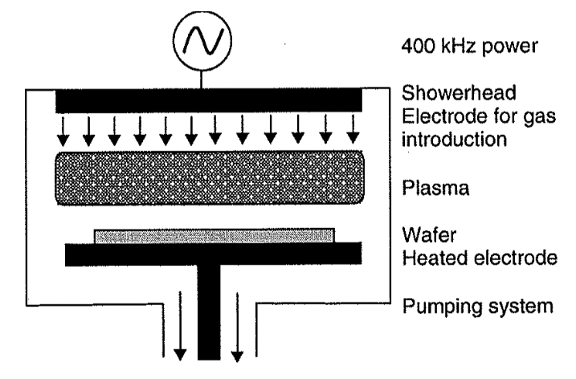

<figcaption>PECVD diagram</figcaption>
</figure>

At higher temperature the deposition pattern will create bigger
\"*blobs*\" compared to lower temperature deposition.

### Epitaxial growth

::: wrapfigure
r0.5 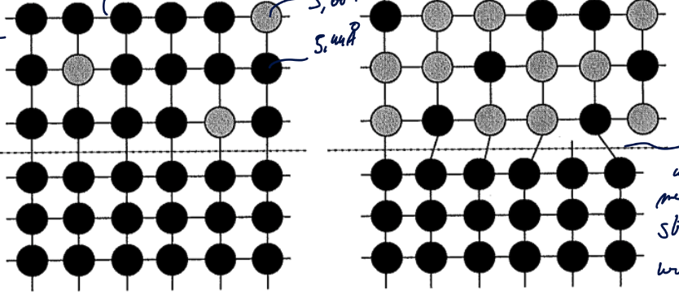{width="95%"}
:::

We can grow some layer with the epitaxial technique. We can have :

-   Homo-epitaxy : independent doping on a high-conductive substrate

-   Hetero-epitaxy : the difference in $a$ size could create some
    mechanical stress

Some more advanced and recent epitaxy technique have been developed such
as [mbe]{acronym-label="mbe" acronym-form="singular+short"}. With this
new method we can deposit some complex stack of material on our wafer.
It is still in development and so there is not yet a wide industry
adoption of industrial workstation.

### [ald]{acronym-label="ald" acronym-form="singular+short"}

With this method we can literally deposit **1 layer of molecules** at a
time ! We use some cycle consisting of a sequential precursor gas
pulses. It will produce a monolayer of gas on the substrate. Then a
second precursor gas is introduced which reacts with the monolayer and
will result into another monolayer on top.

![[ald]{acronym-label="ald" acronym-form="singular+short"} process of
pulsed mode](ALD_cycle.png){#fig:ALD-pulsed-mode-label width="65%"}

[ald]{acronym-label="ald" acronym-form="singular+short"} is a
*self-limiting* process so only one layer will be deposited at a time.
It is similar to [cvd]{acronym-label="cvd"
acronym-form="singular+short"} but we have 2 major steps to diffuse the
precursor gas not at the same time. We usually use Nitrogen or Argon as
a *purge gas* which will \"*clean*\" unwanted atoms. This 2 cycles will
help to avoid some *parasitic* deposition like in
[cvd]{acronym-label="cvd" acronym-form="singular+short"}.

It is also pretty good at making *trenches* which is usually a FoM. We
usually compare width opening/depth. This value ranges from $20$ to
$100$.

### Deposition from the liquid phase

#### Electroplating or galvanic deposition

Thick conductor layers, high aspect ratio metallization. For this
method, we will use an anode and a cathode. We will use the reduction of
$Cu$,$Ni$ or $Au$ typically onto the wafer (used as a cathode). We have
a pretty fast growth rate of $0.1-10 \mu m/min$.

It is a good solution to create *through-silicon vias* and do some IC
interconnects which is gaining more and more popularity lately.

#### Electroless deposition

Selective metallization. We can have a growth rate of $100nm/min$. For
intereconnect between IC we can use the *damascene technique* :

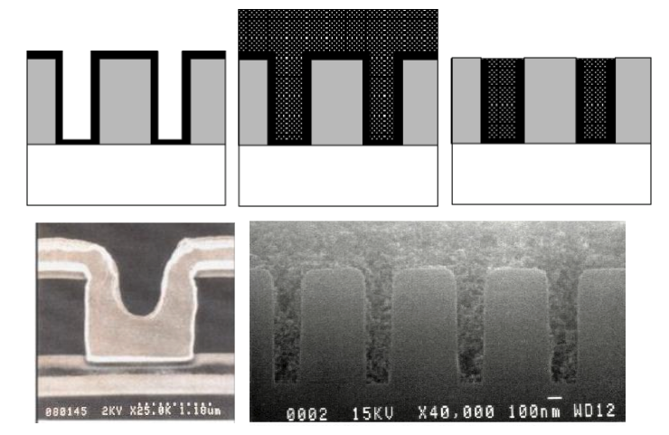{#fig:enter-label
width="50%"}

#### Spin coating

Photoresists, thick polymer layers, spin-on glasses. Usually we start at
a slower speed to have the right amount of photoresist everywhere on the
glass then we finally spin it around $5000 rpm$ which will cause
*partial drying via evaporation*.

#### Sol-gel

Porous dielectrics, thick and complex materials.

## Measuring the thickness

To measure the thickness of the layer we can :

-   Mechanical method : we use a needle that will check the thickness.
    It is not the most precise method.

-   Optical method :

    -   Reflectometry : we need the layer to not be totally opaque and
        we will measure the various wave that comes out of the wafer. We
        need to use small die and we can measure from $10nm$ to
        $50\mu m$.

    -   Elipsometry : it works with the polarization of light and can
        measure up to $100\mu m$.

# Oxidation, wet, dry

::: wrapfigure
r0.5 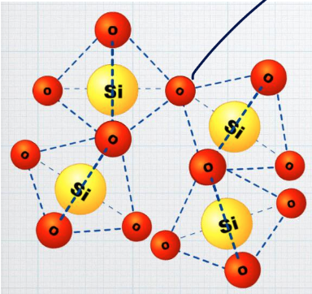{width="95%"}
:::

Sand is an abundant material that contains $SiO_2$ or Silicon dioxide.
It is the main component of glass, optical fibers and we can find a
crystalline structure of $SiO_2$ in quartz.

It has a *tetrahedral arrangement* with one silicon bonded to four
oxygen atoms. We can see how most of oxygen atoms will be bonded with
$Si$ atoms making the terahedra shape joined at corner. We call those
atoms the *bridging atoms*. Not all oxygen atoms will be bonded to two
$Si$, we call them the *non-bridging atoms*. The density of those
non-bridging atoms determine the quality of the oxide.

They are not always aligned in such regular manner, it can be random
making some *amorphous structure*. If there is no non-bridging atoms,
then

In microelectronic, we use thin layers of pure $SiO_2$ and they are
amorphous. The density is about $2-2.3 gm/cm^3$, $\varepsilon_r = 3.9$
(frequency dependent), $n=1.5$ optical index. The breakdown voltage is
$> 10^7 V/cm$ which is the main reason why we need to lower $V_{DD}$ as
the thickness of the gate is getting smaller.

But we will always have some traps at the interface which causes some
negative charges. The density of those defects is $10^{11}cm^{-2}$, we
can even lower this value using some annealing process using hydrogen.
If we had more defects, this would result in a constant channel making
the material no longer semi-conducting.

We love silicon due to its abundance, good electrical property,
excellent insulating of its oxide, low defect at the interface.

## Thermal oxidation

::: wrapfigure
r0.5 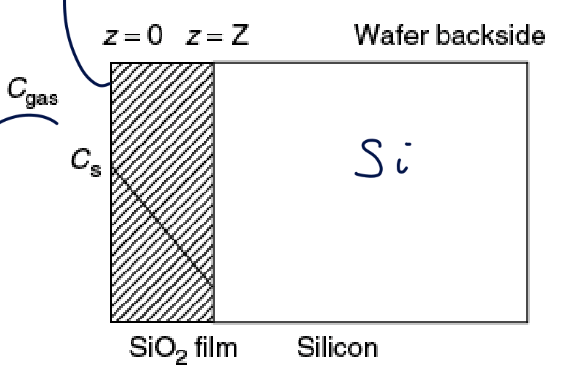{width="95%"}
:::

Silicium will naturally form an oxide and will grow a thin layer of it.
This process is only for $Si$ and not present in other type of
semi-conductor such a $GaAs$, $Ge$, \... This oxide can be used as :

-   Implant, diffusion mask

-   Surface passivation

-   Isolation between transistors

-   Key component of MOS structures

-   Dielectric for multilevel interconnect

-   Cleaning

As shown on the figure, the concentration of oxygen will reduce the
further we go towards the right which explains the slowing down of the
process. This will create a **consumption** effect where the oxide will
grow upwards and backwards. 1 mole of $SiO_2$ is taking up more volume
than 1 mole of $Si$. If we grow $d$ thickness of oxide, we will have
$0.46d$ of Si consumed.

-   $Si$ : $2\cdot 10^{-23} cm^3$

-   $SiO_2$ : $4.4\cdot 10^{-23} cm^3$ so about $2.2$ times bigger than
    $Si$. Expansion will go both ways.

### Wet and dry

$$\begin{aligned}
    \text{Dry: }& Si + O_2 \rightarrow SiO_2 & \text{Wet: }& Si + 2H_2O \rightarrow SiO_2 + 2H_2
\end{aligned}$$

In **dry and wet** oxide growth, a higher temperature will lead to
thicker oxide growth. This growth will decrease as times grows since the
concentration of oxygen diminish. The growth rate is faster in *wet
oxide* but it has lower quality which makes it easier to etch.

Since temperature plays a major role, we will have **oxidation furnace**
where our wafers loaded on quartz boat will slowly roll into the furnace
which has multiple temperature zone for better control.

-   Dry: slower growth rate, better quality, better breakdown voltage
    ($5-10MV/cm$) better suited for gate using [ald]{acronym-label="ald"
    acronym-form="singular+short"}.

-   Wet: faster growth rate, lower quality, good for masking and
    interconnect dielectric.

For a growth of $0.5\mu m$ of oxide at $1200 C^\circ$ it takes around 6
hours for dry and around 1 hour for wet oxidation.

### [locos]{acronym-label="locos" acronym-form="singular+short"}

It is a process used for *isolation between transistor*. We can simply
use *patterned oxide* as the steps (the transistor) are too high and we
can't do spin coating or metallisation. Reduction of topography by about
$56\%$.

To do some masking of oxide we can use $Si_3N_4$ which grows slower than
$Si$. But this technique will introduce some stress due to the thermal
expansion of nitrite being much higher than of $Si$. We will add between
the substrate and the nitrite a small oxide called *pad-oxide* ($SiO_2$)
as a stress release layer.

1.  We first add the pad-oxide of $20-30nm$ and then finally the
    $Si_3N_4$ of around $100-200nm$.

2.  Wet oxidation to grow the oxide, mechanical stress will cause a
    *bird's beak* to form.

3.  Remove the nitride with HF-dip to remove the *oxynitrate* and then
    $H_3PO_3$ (phosphorous acid) to etch nitrite.

4.  Etching of pad-oxide with HF

### [sti]{acronym-label="sti" acronym-form="singular+short"} and [dti]{acronym-label="dti" acronym-form="singular+short"}

#### [sti]{acronym-label="sti" acronym-form="singular+short"}

With this method we can avoid the *bird's beak* phenomena. We can do
from about $0.25 \mu m$ nodes without much stress. The process flow is
as follow :

1.  Anisotropic etching of $Si$

2.  Thermal oxidation

3.  Oxidation growth with [cvd]{acronym-label="cvd"
    acronym-form="singular+short"} (using [teos]{acronym-label="teos"
    acronym-form="singular+short"} process)

4.  [cmp]{acronym-label="cmp" acronym-form="singular+short"} of oxide

#### [sti]{acronym-label="sti" acronym-form="singular+short"} vs. [locos]{acronym-label="locos" acronym-form="singular+short"}

-   [sti]{acronym-label="sti" acronym-form="singular+short"}: The drawn
    width is almost the effective width. Can place transistor closer
    increasing the *packing density*. We have a larger drive current for
    devices with same drawn width. Less topography.

-   [locos]{acronym-label="locos" acronym-form="singular+short"}: The
    drawn width is bigger than the effective width due to *bird's beak*.
    To have the same drive current, we need wider transistor which
    diminish the packing density. Hard to do this process for sub
    $0.5 \mu m$.

## Doping

There is two main process for doping, either Thermal diffusion or Ion
implantation. The later one is more modern and we usually go for a mix
of those technique.

Doping relies on the idea to put some foreign atoms in the lattice,
either group V to negatively charge it (with an extra electron that is
free to roam) or with a group III atoms that will create a hole. It will
*locally* create a charge difference. Watch out, we can have some *hole
recombination* and so have useless mix of group V and III that will just
cancels each other.

For doping we can have:

1.  Diffusion, using some *diffusion/doping mask*:

    -   Gas that will bombard the wafer, not straight path so can have
        border effect

    -   Coating will use a thin film and will also have border effect

2.  Ion implantation, also uses a *diffusion/doping mask* but will be
    quite different.

### Diffusion

It is a common mechanic phenomena where we will have a material that
will search for stability and diffuse to reach a stable state.

#### Thermal diffusion

This process happens at high temperature $1000^\circ$ and when the wafer
get exposed to dopant material vapor. The *upper limit* is related to
the **solid solubility**. The lower limit is of $10^{13}$.

One of the advantage of using silicon, is the fact that the doping level
will impact the resistance per square making it an easy material to
module the resistance of.

#### Diffusion Theory

We have a diffusion *flux* of *impurities* in one dimension. (We are
always using x as the vertical direction of diffusion).

$$\begin{aligned}
    F &= - D \frac{\partial C(x,t)}{\partial x} & D &= D_0 exp\left( \frac{-E_{\alpha}}{kT} \right)
\end{aligned}$$

We have $D$ that is the *diffusion coefficient* in $cm^2/s$. $C$ is the
dopant concentration per unit volume. We have $D_0$ that is the
diffusion coefficient in $cm^2/s$ at infinite temperature and $E_\alpha$
is the activation energy in $eV$.

At low concentrations of dopant in silicon ($10^{12} - 10^{16} cm^3$)
can be seen as constant. With this simplification, we can easily solve
the equation, we also see that gold, coper, \... have high diffusion
coefficient which is why we tend to avoid such metal in the clean room.

If we do not have a source or sink of the impurity, we know that the
*change in impurity concentration with time must equal the local
decrease of diffusion flux*:

$$\begin{aligned}
    \frac{\partial C}{\partial t} &= - \frac{\partial F}{\partial x} = \frac{\partial}{\partial x} \left( D\frac{\partial C(x,t)}{\partial x} \right) & \frac{\partial C}{\partial t} &=  D\frac{\partial^2 C(x,t)}{\partial x^2} \text{ if D cst}
\end{aligned}$$

There are 2 methods of diffusion:

1.  [Constant-surface-concentration:]{.underline} using vapor, we have a
    constant concentration of dopants at the surface.

2.  [Constant-total-dopant:]{.underline} thin layer, we have constant
    amount of impurity at the surface.

#### Constant-surface-concentration

$$\begin{aligned}
    \text{Init: } C(x,0) &= 0 & C(0,t) &= Cs & C(\infty, t) &=0\\
    C(x,t) &= C_S erfc\left( \frac{x}{2\sqrt{Dt}} \right) & erfc(z) &= 1-erf(z) & erf(z)&=\frac{2}{\sqrt{\pi}}\int_0^\pi e^{-y^2} dy
\end{aligned}$$

We have $\sqrt{Dt}$ that is called the *diffusion length* in $cm$. The
total number of dopant atoms per unit area that has diffused into the
semiconductor is given by:

$$Q(t) = \int_{0}^\infty C(x,t) dx = \frac{2}{\sqrt{\pi}} C_s \sqrt{Dt} \approx 1.13 C_s \sqrt{Dt}$$

#### Constant-total-dopant

$$\begin{aligned}
    C(x,0) &= 0 & \int_0^\infty C(x,t) dx &= \phi & C(\infty, t) &= 0\\
     & & C(x,t) &= \frac{\phi}{\sqrt{\pi D t}} exp \left( - \frac{x^2}{4 D t} \right)
\end{aligned}$$

Where $\phi$ is the *total amount of dopant* per unit area. So the
surface concentration ($x=0$) is $\phi / \sqrt{\pi Dt}$.

We usually use those two methods and we call this a *two step diffusion
process*. a pre-deposition diffused layer is first formed using
constant-surface-concentration condition. Then a drive-in (or
redistribution) diffusion is used using constant-total-dopant condition.

For most practical cases the diffusion length for the pre-deposition
stage is much smaller than the diffusion length of the drive-in
diffusion. This allows to make deep junctions, e.g. for wells for CMOS.

#### Advanced Diffusion Theory

We are oversimplifying the problem which will gives us incorrect values
when compared with reality. Moreover, the atoms vibrate and there is a
non-zero chance that a silicon atom moves from its lattice site which
will leave a vacancy.

Dopants diffuse in combination with silicon interstitial or vacancies
and the diffusion coefficient is therefore strongly influenced by the
concentration of interstitials or vacancies.

#### High Doping Concentration Diffusion

Here, our simple theory doesn't hold anymore. The diffusion profile is
different. Moreover, the diffusion of phosphorous at high concentration
is *anomalous*. We often notice a *kink* on the doping profile. Then we
have a deep tail region that extends further in the doping region.

The anomalous diffusion behavior has been explained by the dissociation
of the phosphorus-vacancy pair (P+V2-) into P+, V- and an electron. The
singly charged acceptor vacancies (V-) enhance the diffusivity in the
tail region (by a factor of 100 at $1000^\circ$). So it is good for
creating deep n-type junction. Arsenic is preferred over phosphorous.

::: {#tab:doping_levels}
  **Dopant level**       **Designation**     **Dopant concentration** (cm$^{-3}$)            **Resistivity n/p** (ohm-cm)
  -------------------- -------------------- -------------------------------------- ------------------------------------------------
  Very lightly doped    n$^{--}$, p$^{--}$      $<$`<!-- -->`{=html}10$^{14}$       $>$`<!-- -->`{=html}100/$>$`<!-- -->`{=html}30
  Lightly doped          n$^{-}$, p$^{-}$            10$^{14}$--10$^{16}$                           1--100/0.3--30
  Moderately doped             n, p                  10$^{16}$--10$^{18}$                         0.03--1/0.02--0.3
  Highly doped           n$^{+}$, p$^{+}$            10$^{18}$--10$^{19}$                       0.01--0.03/0.005--0.02
  Very highly doped     n$^{++}$, p$^{++}$                10$^{19}$                      0.001$<$`<!-- -->`{=html}0.01/0.005

  : Doping levels, designations, concentrations, and resistivity.
:::

Here, we are always talking in $\Omega / cm$ resistance that relates to
the sheet resistance.

For diffusion we can either have diffusion through substitutional or
intersticial diffusion.

#### Using $SiO_2$ for masking

The diffusion of $B,P,As$ in $SiO_2$ is at least one order of magnitude
lower than in $Si$. There exists some table that indicates the thickness
of the oxide for the diffusion of a given material at a given
temperature during a definite amount of time.

By mixing impurities, we can slowly diffuse some up to a deep depth and
then diffuse another type. They will cancel each other out which will
create some junction and deeper junction.

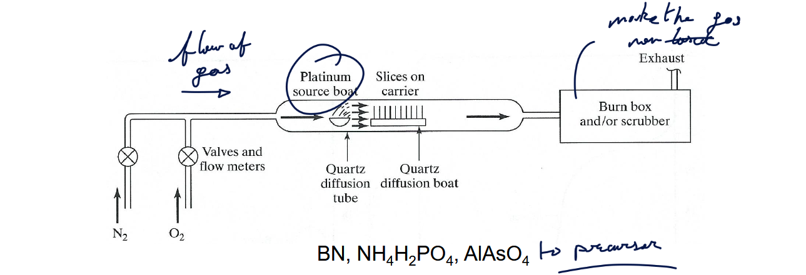{#fig:SDS-label
width="75%"}

The boat we are using has some Boron nitride wafers between 2 substrate
wafers to diffuse it.

There is also a version that uses liquid dopant sources which is similar
to the solid dopant one except the $N_2$ will be bubbling in the
bubbler. We can also have the same with gas using some dopant gas. We
have to add some scrubber system to trap all of the gases.

## Ion implantation: deposition, drive-in and RTA

{#fig:ion-implanter-label
width="75%"}

1.  [**Ion source:**]{.underline} it works at high voltage $25 kV$ and
    creates a plasma with the desired impurity.

2.  [**Mass spectrometer:**]{.underline} it will selects which ion we
    want in this right angle bend.

3.  [**High voltage accelerator column:**]{.underline} to make it faster
    we accelerate it with a field of over $5MeV$.

4.  [**Scanning system:**]{.underline} to deposit the right amount, we
    also make it slightly bend so the neutral particles will go straight
    and not hit the wafer.

5.  [**Target chamber:**]{.underline} operated in vacuum conditions and
    is where the wafer is located in.

Something important to note is the fact that the ions will hit the wafer
pretty straight but it will go through a random path in the wafer. This
will lead to a Gaussian distribution of the particles around a certain
depth.

$$N(x) = N_p exp \left( - \frac{(x-R_p)^2}{2 \Delta R_p^2} \right) \qquad N_p = \frac{\phi}{\sqrt{2 \pi} \Delta R_p}
    \label{eq:ion}$$

### Ion implantation

So the main idea is \"simply\" accelerating ions pretty quickly so that
they will penetrate inside the wafer up to a few tenths of microns. Of
course, masking is used so we can create the desired pattern and not
simply bombard the full wafer. We can either use some silicon dioxide or
photoresist.

In [\[eq:ion\]](#eq:ion){reference-type="ref" reference="eq:ion":
$\phi$ is the *ion dose per unit area* and $R_p$ is the distance to the
peak from the surface and is called the *projected range*. $\Delta R_p$
is the *projected straggle* is the distance from the peak where the
concentration is reduced by $40\%$ and is usually empirical.

One major advantage and use case of ion implantation is to put some ions
below a gate oxide for example. But we damage the lattice by bombarding
like this and we require some **annealing** at $900^\circ$ to repair the
damage. If we go even hotter we can do some *drive-in* to diffuse even
further the dopant into the silicon.

### Masking

Now, how thick should a mask be so all the ions will be trapped inside
the mask ? But it is important to note that since it is a Gaussian
distribution we will always have a probability that the ions will go
inside the substrate.

Something that is even more annoying is the fact that we will have some
ions around a slit that will go under the mask.

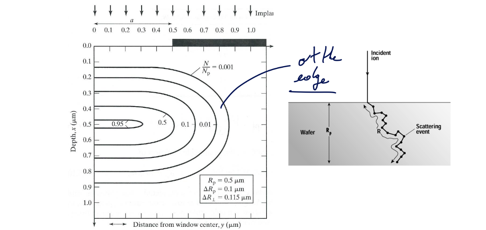{#fig:implantation-label
width="75%"}

We have to realize some empirical experiments to see under which
condition a given ions will dope or not the silicon or stop at the
silicon dioxide.

### Annealing

It is a crucial step after doing some ion implantation where we have to
restore the lattice from any damages. But it also allows the dopants to
take the correct spot inside the lattice.

As hinted previously, doing this sort of baking at high temperature will
lead to some *drive-in* by diffusion and we will have more spread.

#### [rta]{acronym-label="rta" acronym-form="singular+short"}

To avoid this diffusion to happen to fast, we can use some lighting bulb
to produce a quick and rapid heating of the substrate.

### Channeling

One thing that can happen if we have a perfect lattice is the fact that
an ion may not bounce and will went through the lattice directly. So
instead of having a nice Gaussian we will see some odd shapes and
multiple peaks.

#### Solutions

We can add a layer of oxide so it will force the ions to bounce around.
Or we can tilt the wafer or even grow some *amorphous* Poly-Si.

### Profile Verification

After applying a layer, we would like to measure the thickness of an
oxide or other things:

-   [[sims]{acronym-label="sims"
    acronym-form="singular+short"}]{.underline}

-   [[srp]{acronym-label="srp"
    acronym-form="singular+short"}:]{.underline} destructive process
    since we bombard the surface and measure the amount of ions and
    neutral particules.

There is also electrical measurement where we use two probes and measure
the resistivity by applying a current. This will leave some *damage
craters* due to the probing. There is another version that uses 4 probes
that measures the current and the voltage.

# Etching, wet, dry, plasma, DRIE

In etching, we distinguish two types:

-   Isotropic: the etching goes in every direction and etches pretty
    equally

    -   Plasma, Wet (mostly), [rie]{acronym-label="rie"
        acronym-form="singular+short"}

-   Anisotropic: the etching prefers one orientation of the lattice

    -   Plasma, [rie]{acronym-label="rie"
        acronym-form="singular+short": Ion milling,
        [drie]{acronym-label="drie" acronym-form="singular+short": KOH
        wet

## Wet Etching

### Isotropic

To keep a constant gradient locally, we have to replace all the time the
solution that's why we overflow the bath by adding continuously new
etchant and uses a stirer.

Because of the way wet etching works, we will have **undercut area**
that we also call *etch bias* and can be an issue for features that are
too close to each other. Below $3 \mu m$ we will prefer dry etching.

To stop precisely and quickly the reaction, we use a a trap at the
bottom of the bath to quickly dump the etchant and we spray the wafer
with solution to stop quickly and precisely the process.

  **Material**   **Etchant**
  -------------- --------------------------------------------------
  SiO$_2$        $NH_4F:HF \ (7:1)$ BHF, $35^\circ C$
  SiO$_2$        ${NH_4F:CH_3COOH:C_2H_6O_2:H_2O} \ (14:32:4:50)$
  poly-Si        ${HF:HNO_3:H_2O} \ (6:10:40)$
  Al             ${H_3PO_4:HNO_3:H_2O} \ (80:4:16)$,
                 water can be changed to acetic acid
  Mo             ${H_3PO_4:HNO_3:H_2O} \ (80:4:16)$
  W, TiW         ${H_2O_2:H_2O} \ (1:1)$
  Cr             ${Ce(NH_4)NO_3:HNO_3:H_2O} \ (1:1:1)$
  Cu             ${HNO_3:H_2O} \ (1:1)$
  Ni             ${HNO_3:CH_3COOH:H_2SO_4} \ (5:5:2)$
  Ti             ${HF:H_2O_2}$
  Au             ${KI:I_2:H_2O}$; ${KCN:H_2O}$

  : Etchants for various materials

We can also use other etchant or use some HF that is often used for
$SiO_2$. But HF is pretty dangerous to handle as a spill on your skin
doesn't burn or causes pain immediately, it will slowly penetrate the
body until it attacks the bone.

### Anisotropic

We also have some anisotropic wet etchant where we will have various
effect depending on the lattice orientation (using the notation as seen
previously):

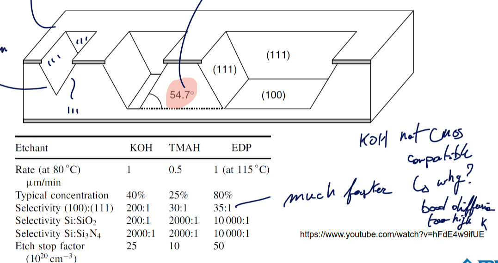{#fig:enter-label
width="75%"}

## Dry Etching

This process comes in many flavors but they are all a combination of
some excitation energy and pressure where we either have high energy-low
pressure or low energy-high pressure. We use mechanical and chemical
aswell to better control the process.

-   Physical: we bombard the wafer with some *positive ions* and we
    strike the substrate with high kinetic energy.

-   Chemical: we can either use neutral or ionized species to react with
    the surface to create some *volatile product*. This process is often
    *isotropic*.

### Plasma Etching

Plasma is a *fully or partially* ionized gas containing an equal amount
of positives and negatives charges but has different number of unionized
molecules. We then need a strong enough electrical field to ionize the
gas.

The goal of plasma etching is to produce some chemically reactive
species from a relative inert gas. Then we make this gas react with the
specific material we want to etch and the product should be pretty
volatile to be easily removed. We need high speed and high chemical
reactions between neutrals and the substrate materials. We use a
*carrier* gas producing some ions and reactive neutrals. This reactive
neutrals attack the sidewall and the normal surface. BUT, the positive
ions will **only** attack the normal surface. So we will first go in the
vertical direction.

We have around $10^{15} cm^{-3}$ and $10^8-10^{12} cm^{-3}$. After
hitting the surface, we may have the volatile particles to react against
the wall of the chamber which is really problematic. But washing is not
always the solution as it can disrupt the precise setting for the
reaction to happen at an optimal point.

To have some idea about the type of gases we can use look at the various
tables chapter 5 page 30-32.

### Ion milling - [drie]{acronym-label="drie" acronym-form="singular+short"}

Ion milling is a sort of *sputter etching* where the wafer is coupled to
a voltage source. It also uses some plasma gas but the added voltage to
the wafer add some acceleration to the positive ions.

![[rie]{acronym-label="rie" acronym-form="singular+short"}
setup](rie_setup.png){#fig:rie-setup-label width="75%"}

### [rie]{acronym-label="rie" acronym-form="singular+short"}

It is a combination of plasma etching and sputter etching/ion milling
since we use some plasma and accelerate it towards the susbtrate. Again
we use a chemical and mechanical process.

The setup is pretty similar as depicted in
[5.2](#fig:rie-setup-label){reference-type="ref"
reference="fig:rie-setup-label": we use the asymmetry between
electrodes to create a self-bias to accelerate the ions towards the
substrate. We can also add additional electrodes to create a DC electric
field.

It is a combination of chemical and sputtering:

1.  Chemical:

    -   Thermalized neutral radicals that will form volatile products.

    -   Isotropic

    -   little electrical damage

2.  Sputtering:

    -   Ion energy will mechanically ejects substrate material

    -   Anisotropic

    -   Purely physical and pretty directional, low pressure so longgg
        [mfp]{acronym-label="mfp" acronym-form="singular+short"}

    -   Low etch rate

![[rie]{acronym-label="rie" acronym-form="singular+short"} etching
possibilities](rie_etching_possibilities.png){#fig:enter-label
width="75%"}

There is two categories of [rie]{acronym-label="rie"
acronym-form="singular+short"} etching:

1.  [Ion-Induced [rie]{acronym-label="rie"
    acronym-form="singular+short"}:]{.underline} reaction controlled
    etching with typically $Cl_2/Si$

    -   When subststrate is not spontaneously etched away

    -   Ions modify the surface reactions in one way or another. Make
        the radicals to react with the substrate.

2.  [Ion-Inhibitor [rie]{acronym-label="rie"
    acronym-form="singular+short"}:]{.underline} desorption-controlled
    etching with typically $F/Si, Cl_2/Al$.

    -   Substrate is etched spontaneously so we need an inhibiting
        layers to achieve directionality.

    -   The bottom of the trench is exposed to ion bombardment.

#### Fluorine-Based Plasma - Anisotropic Si etching

Due to the isotropic nature of the chemical reaction, we have to use
some inhibitor layer composed of Silicium, Fluor and oxygen. This is
some ion-inhibitor process and the oxygen covers the silicon surface
with silicon oxide. The issue is that the SF5+ will etch the layer
making it possible for the F\* radicals to etch the silicon substrate.

#### Chlorine-Based Plasma - Thin-film Al Dry etching

Aluminum is spontaneously etched by $Cl_2$ but there is a native
aluminum oxide layer. We have to use some ion bombardment because it is
essential for aluminum.

#### Chlorine-Based Plasma - Poly-Si Dry etching

We use som ion-induced [rie]{acronym-label="rie"
acronym-form="singular+short"} with gases like $Cl_2, HBr, O_2$.

#### Ion Milling Etching: thin film platinum etching

We use some $Ar$ gas and the platinum has been *physically* etched by
argon plasma. We can witness some sort of fence because the platinum may
redeposit on the sidewall creating some fences.

#### Inductively coupled Plasma [rie]{acronym-label="rie" acronym-form="singular+short"}

Here we use some [ccp]{acronym-label="ccp"
acronym-form="singular+short"} to etch the silicon and other material
slowly. [icp]{acronym-label="icp" acronym-form="singular+short"}
[rie]{acronym-label="rie" acronym-form="singular+short"} generates the
plasma through a RF powered magnetic field which allows us to create
some very high plasma density.

![Plasma coupld [rie]{acronym-label="rie"
acronym-form="singular+short"}](Setup_plasma_rie.png){#fig:enter-label
width="75%"}

### [drie]{acronym-label="drie" acronym-form="singular+short"}

We also use some [drie]{acronym-label="drie"
acronym-form="singular+short"} or Bosh process that allows us to draw
some pretty precise features with a high-aspect ratio (20-50), it is a
cyclic process where we alternate between etching and depositing. We
etch using some $SF_6$ and deposit some polymer layer of $C_4F_8$. We
can etch over $10 \mu m/min$ and go through the whole wafer. We pulse
but it will still eat a bit of the sidewall. It is pretty good for MEMS
devices.

#### Etch Lag

A bigger opening will etch more vertically compared to a shallower one
with the same amount of cycles.

### Comparing Dry etching

  **Etching Mode**                   **Pressure (Torr)**
  ---------------------------------- ------------------------
  Ion Milling                        $10^{-4}$ -- $10^{-3}$
  Reactive Ion Etching/Ion Milling   $10^{-3}$ -- $10^{-1}$
  Plasma Etching                     $10^{-1}$ -- $5$

  : Etching Pressure Ranges

# Interconnects, Al, Cu, CMP

Interconnect is a crucial part of any IC's as they connect the various
transistors among each other and to connect the IC with other
components.

We first considered Aluminum for interconnect as it is cheap, compatible
with Si technology, it adheres well to SiO2. One major flaw is the low
melting point of 577 c. Copper was for a long time avoided as it
diffuses really fast in Si and SiO2 and adheres not really well to SiO2.

## Aluminum as interconnect

### Spiking and pitting

Silicon will naturally diffuses non-uniformly into Aluminum creating
**spiking**, this Silicon that diffuses will leave some space that the
Aluminum will \"*fall*\" into it due those pits.

Those pits could break some junction inside of a transistor.

#### Solution

Add some Silicon to the Aluminum or during the PVD step. We can also add
some barrier metrial as Titanium-Tungsten.

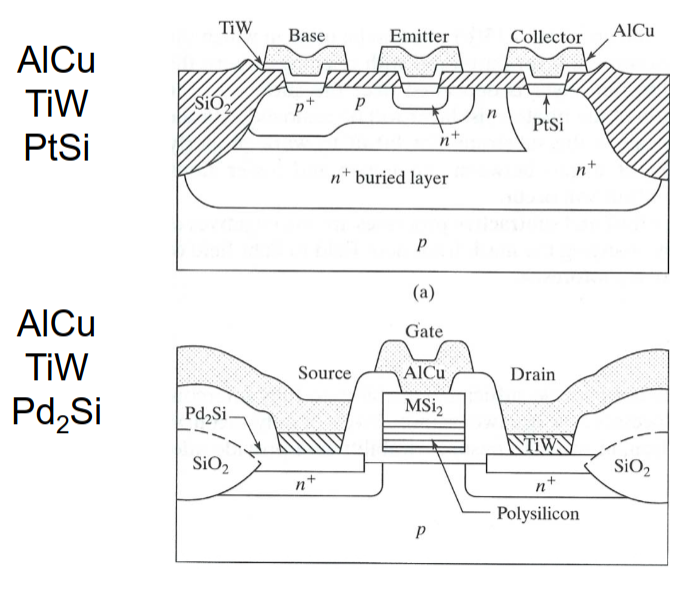{#fig:TiW-label width="50%"}

#### Silicides

Silicium can react with various metal which have various resistivity and
can appear at different conditions. Those properties can be used to make
some metal to react with the wafer, the rest of the metal that didn't
react with the silicium.

### Electromigration

If we make the interconnect too thin we can witness electrons carrying
away some chunk of metal. Also good to remember that the flow of current
is opposite to the flow of electrons.

#### Solution

We can add Cu to Al, 95 % Aluminum, 4% copper and 1% Silicon. Or the
simple solution is to use some Cu.

### Multilevel Metal Problem

We will have non planar structure in our wafer with all those layers and
structures we form. We will have some **via-depth** problem.

#### Solution

This is why we usually make the contact wider and wider contacts as the
stack increase. We can also slightly shift the stacking to avoid
alignment issues.

We also have developed techniques to make the structure more planar by
filling up via with tungsten through [cvd]{acronym-label="cvd"
acronym-form="singular+short"} and we also deposit some Aluminum using
[pvd]{acronym-label="pvd" acronym-form="singular+short"}. The filling of
tungsten is a *selective deposition* as seen with the reaction:

$$2 WF_6 (g) + 3 Si (s) \longrightarrow 2 W (s) + 3SiF_4 (g)$$

{#fig:enter-label width="75%"}

### [cmp]{acronym-label="cmp" acronym-form="singular+short"}

#### Planirize the surface

A common used techniques is to use oxide-[cmp]{acronym-label="cmp"
acronym-form="singular+short"} to planirize the surface after applying
some contacts. Then we can build on top of a flat and clean surface.

Another way is to use some [cmp]{acronym-label="cmp"
acronym-form="singular+short"} that uses a **chemo-mechanical polish**.
It can be used to:

1.  Smoothing

2.  Planarization: ideal after applying some interconnect

3.  Damascene: a commonly used techniques in Cu interconnet and allows
    to draw some precise features

#### [cmp]{acronym-label="cmp" acronym-form="singular+short"} principle

![[cmp]{acronym-label="cmp" acronym-form="singular+short"}
principle](cmp_lucent.png){#fig:enter-label width="75%"}

It is a pretty straight-forward process, we can also have some
*multiwafer* machinery that allows us to process multiple wafer in
parallel.

This process is not perfect and can smooth out *local* planarity but it
will distribute it *globally* resulting to global non-planarity which is
not really the desired effect.

#### Solution to reach global planarity

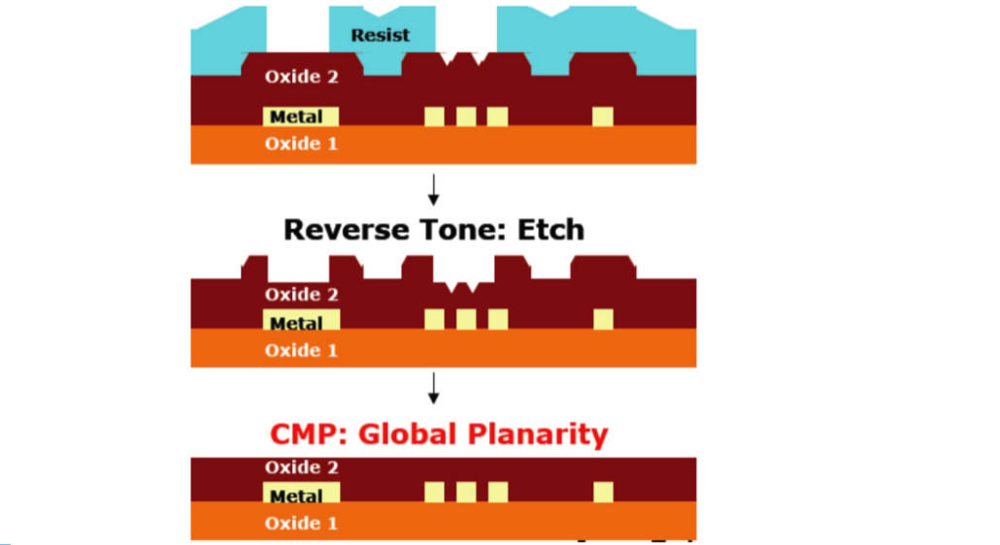{#fig:enter-label width="65%"}

Another solution would be to add dummy oxide which will make the
[cmp]{acronym-label="cmp" acronym-form="singular+short"} smoother. This
dummy oxide can sometimes be seen in finished products.

### Copper IC

The main reason to push for copper interconnect, is to further reduce
the delay time as we scale down.

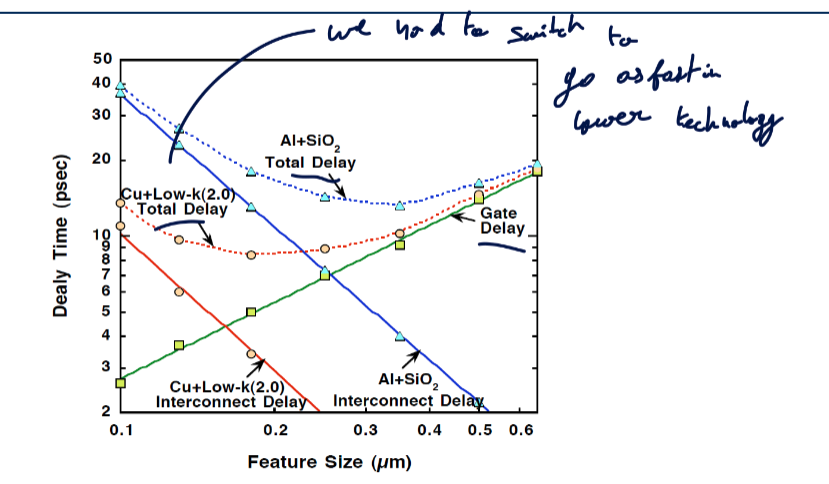{#fig:enter-label width="50%"}

It also has some better resistance against failure but it doesn't adhere
well to dielectric, it diffuses with the dielectric. It is compatible
with tungsten plug (good point) but the copper just contaminate the chip
and the equipment, \...

So to avoid this, we will use some *seed layer* that behaves as a sort
of protective layer. The damascene process is extensively used to
produce some pretty flat result.

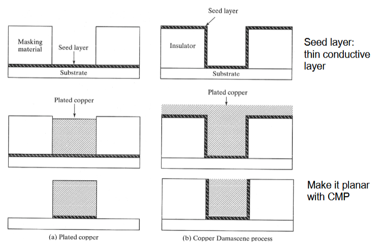{#fig:enter-label
width="50%"}

#### Damascene process

::: wrapfigure
r0.24 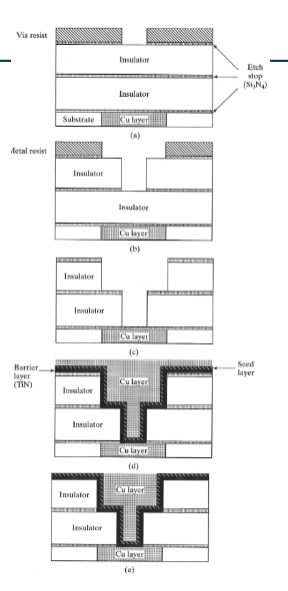{width="90%"}
:::

The idea behind this process, is to simply add this protective layer
(through [ald]{acronym-label="ald" acronym-form="singular+short"}),
deposit the copper and polish using [cmp]{acronym-label="cmp"
acronym-form="singular+short"}.

The dual damascene process is extensively used in vias and interconnect
traces as it can make some thicker top traces

It is the de facto standard in CMOS processing. This allows to create
complex stack with many many layers.

If we are using the simple platting of copper, we can use some lift-off
process which makes removing the excedant of copper quite easy. Employed
especially for and .

# IC Processing overview

## CMOS

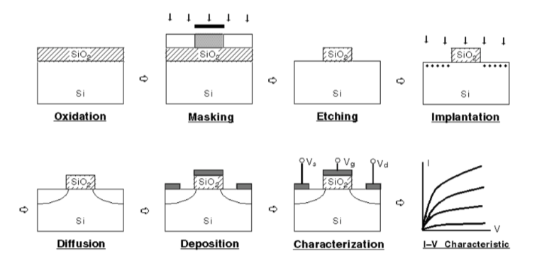{#fig:enter-label
width="50%"}

In the beginning, we used a lot of gate to control the gate which was a
sensible choice given the easy of connection and we just have some
thermal diffusion. But the biggest issue and limitation was the fact
that it was not a **self-aligned process**. Meaning that engineer had to
take margin when doing the gate creating some unnecessary overlap which
amplified the junction capacitance further reducing the speed. On top of
this, after applying we couldn't do a lot of other processes that works
at higher temperature !

In Aluminium process, we first dope through some high temperature step
then we need to align the gate on top of the source and drain.

But now, in poly-gate, we can whistand higher temperature and here we
use the poly gate as the mask for the source and drain region. **The
gate comes first, forcing the source and drain to be at the right
place**.

### Self-alignment

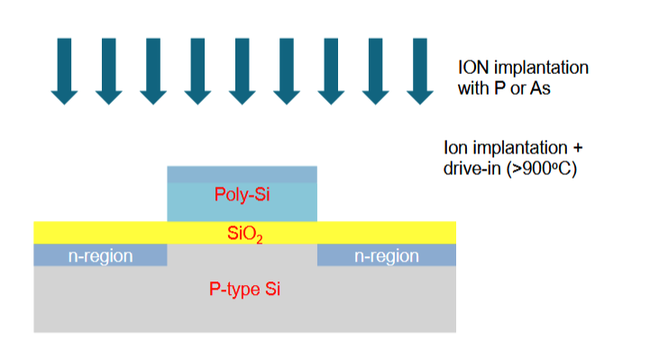{#fig:enter-label
width="50%"}

### Basic flow

We first start \"drawing\" the poly-silicon gate using a mask. We do for
the NMOS and PMOS at the same time. Once it is done, we remove the
photoresist, do some Boron implantation for NMOS. We implant some
Arsenic with low-energy (so we don't put too many) which acts like a
channel stop, to avoid any charges during operation to flow from a NMOS
to PMOS.

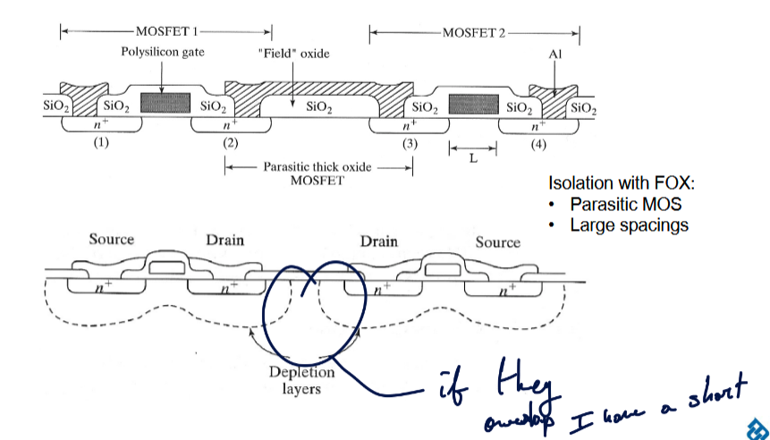{#fig:enter-label
width="50%"}

In this process step, we can find back the [locos]{acronym-label="locos"
acronym-form="singular+short"} process and see the appearance of those
bird's beak. Then we apply remove the Nitride to implant some Boron for
the PMOS.

Once we have the desired region for the channel, we can add the
polysilicon and **then** the actual doping with some high dose boron for
PMOS and high dose phosphorus for NMOS. We just have to invert the mask
from the previous step. It is self-aligning since the implantation will
slightly bend around the gate which will create a controlled channel
capacitance.

Finally, we can do some [cvd]{acronym-label="cvd"
acronym-form="singular+short"} deposition of the contact holes and
finish it with some nice metallization and etching. And voilà ! we have
a CMOS. Ofc, it is not flat and nice as depicted in schematics. It is
quite chaotic and uneven.

#### Latch-up

One big enemy: Latch-up ! Typically there is some undesired bipolar
junction that forms a *thyristor*. So for this we usually use some
[epi]{acronym-label="epi" acronym-form="singular+short"} and
[sti]{acronym-label="sti" acronym-form="singular+short"} to ensure no
such behavior can occur.

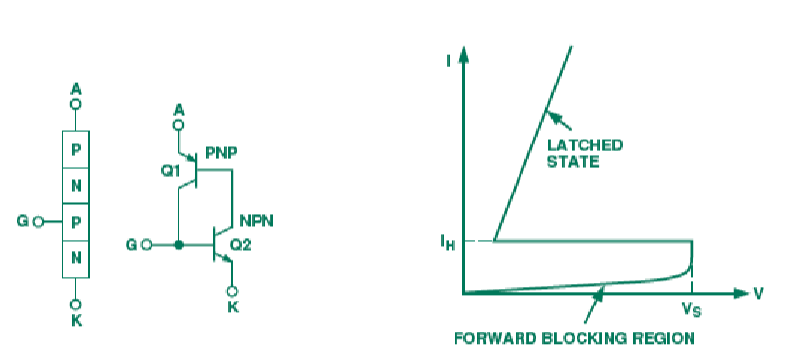{#fig:enter-label
width="50%"}

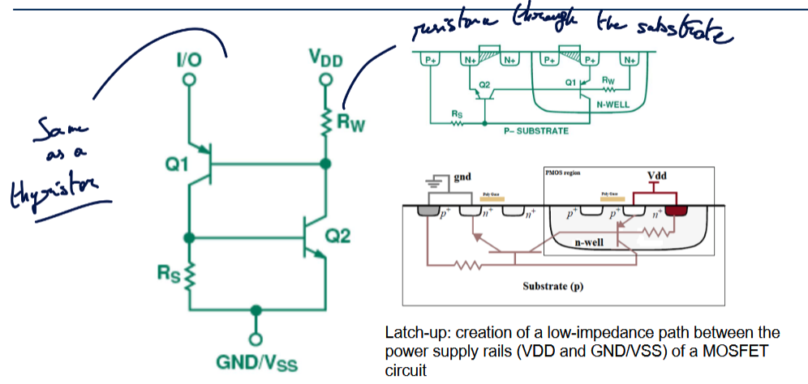{#fig:enter-label width="50%"}

So this is why we love [sti]{acronym-label="sti"
acronym-form="singular+short"} in this case !

### Advanced CMOS process

We use a base substrate p where we grow some [epi]{acronym-label="epi"
acronym-form="singular+short"} on top, we then depose some with a buffer
layer made of nitride. We use some plasma etching to create trenches
using the inverse of the active area mask.

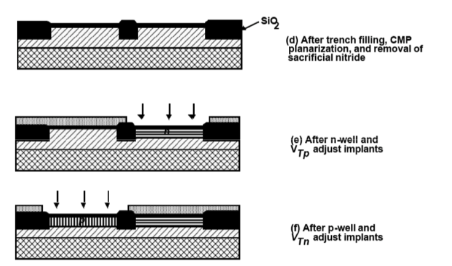{#fig:enter-label
width="50%"}

But this isn't always enough and sometimes, we need to do some
[ldd]{acronym-label="ldd" acronym-form="singular+short"} to avoid *hot
electron* effect. This effect can sometimes change the actual doping
which can then destroy the junction and make MOS not work at all !

#### Hot carrier effect

It happens when a strong EM field is applied and when an electron has
enough *kinetic energy* to break lattice bonds and hence create another
electron-hole pair. They have an energy over $kT$. This will increase
the current in the channel but the holes will be absorbed by the
substrate creating a little current that can be monitored. This creates
a sort of BJT.

This is why we often add some spacer to help with this effect.

### Salicide

It allows a better current flow synonym of more freedom in the layout !

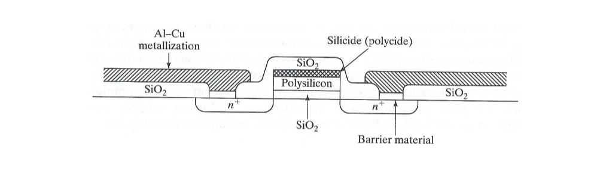{#fig:enter-label
width="50%"}

Salicides are **Self Aligned Silicides** hence the name. it consists of:

1.  metal deposition;

2.  annealing forms silicide on polysilicon gate and single-crystal
    silicon source/drain areas

3.  Unreacted metal is selectively etched away.

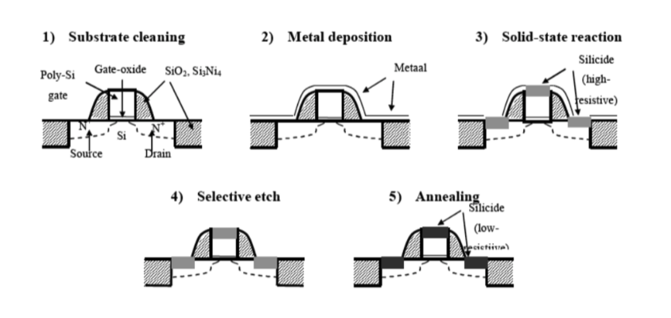{#fig:enter-label width="50%"}

As we get lower and lower, we need to use [ald]{acronym-label="ald"
acronym-form="singular+short"} to realize this technique.

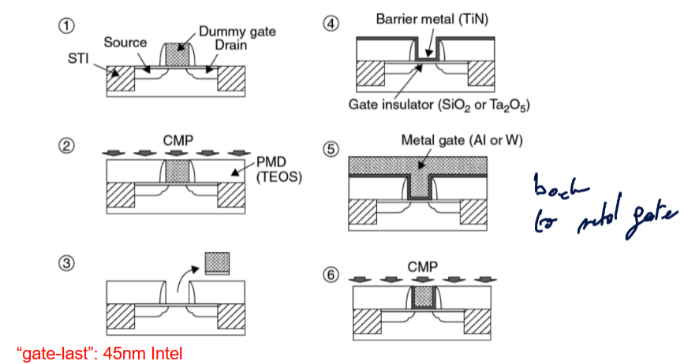{#fig:enter-label width="50%"}

# Guest Lecture

# Extra notes: Important numbers and figures

# Glossary

- Mean Free Path (MFP):
    - The average distance a particle (such as an electron, atom, or molecule) travels between collisions. In semiconductors and thin films, it influences transport phenomena.

- Chemical Vapor Deposition (CVD):
    - A process where gaseous precursors chemically react or decompose on a substrate surface to form a solid material, often used for thin-film fabrication in semiconductor manufacturing.

- Physical Vapor Deposition (PVD):
    - A vacuum-based process in which material is physically vaporized and deposited onto a substrate to form thin films.

- Molecular Beam Epitaxy (MBE):
    - An ultra-high vacuum technique where atomic or molecular beams are directed at a heated substrate to grow highly controlled epitaxial layers.

- Atomic Layer Deposition (ALD):
    - A vapor-phase technique for depositing thin films one atomic layer at a time using sequential, self-limiting reactions. Offers excellent conformality.

- Shallow Trench Isolation (STI):
    - A process used to isolate CMOS transistors on a silicon wafer by etching shallow trenches and filling them with dielectric material.

- Deep Trench Isolation (DTI):
    - An isolation method using deep etched trenches filled with insulators, used in 3D integration and high-voltage devices.

- LOCal Oxidation of Silicon (LOCOS):
    - A technique for selectively growing oxide on silicon for isolation by locally exposing regions to thermal oxidation.

- TEtraethylorthOSilicate (TEOS):
    - A silicon precursor used in CVD to deposit silicon dioxide films. TEOS provides good conformality and uniformity.

- Chemical-Mechanical Polishing (CMP):
    - A planarization process combining chemical slurry and mechanical abrasion to produce flat surfaces in semiconductor fabrication.

- Low-temperature Oxidation (LTO):
    - A thermal oxidation process performed at lower temperatures to form silicon dioxide, used when high-temperature processing is not feasible.

- High-temperature Oxidation (HTO):
    - An oxidation process performed at high temperatures to produce high-quality oxide films on silicon.

- Plasma Enhanced CVD (PECVD):
    - A variant of CVD where plasma is used to enhance chemical reactions, enabling deposition at lower temperatures.

- Low Pressure CVD (LPCVD):
    - A CVD process carried out under reduced pressure, leading to better uniformity and fewer contaminants.

- Anti Reflective Coating (ARC):
    - A thin film applied to reduce reflections and improve pattern fidelity in photolithography.

- Rapid Thermal Annealing (RTA):
    - A process of quickly heating wafers to activate dopants or repair damage without significantly affecting the rest of the structure.

- Secondary Ion eMission Spectroscopy (SIMS):
    - An analytical technique that sputters a sample surface and detects secondary ions to determine composition and depth profiles.

- Spreading Resistance Profilometry (SRP):
    - A technique for measuring the resistivity and doping profile of semiconductors by placing probes along a beveled surface.

- Reactive Ion Etching (RIE):
    - A plasma-based etching technique using reactive gases to anisotropically etch materials with fine resolution.

- Deep Reactive Ion Etching (DRIE):
    - An advanced RIE process capable of etching deep, high-aspect-ratio features, especially in MEMS and silicon micromachining.

- Capacitively Coupled Plasma (CCP):
    - A plasma generation method used in etching where power is capacitively coupled through electrodes. Often used in RIE.

- Inductively Coupled Plasma (ICP):
    - A high-density plasma source where power is inductively coupled through coils, providing high etch rates and better control.

- Epitaxy (EPI):
    - The process of epitaxy allows the growth of a higher purity layer on a substrate of the same material. The goal of the epitaxy process is to make electron transmission more effective through the device.

