- [Life Cycle Assessment](#life-cycle-assessment)
  - [Basics of Life Cycle Assessment](#basics-of-life-cycle-assessment)
  - [Goal and Scope definition](#goal-and-scope-definition)
    - [Goal](#goal)
    - [Scope](#scope)
    - [System Boundaries](#system-boundaries)
  - [The basics of life cycle inventory](#the-basics-of-life-cycle-inventory)
    - [Multi-functionality](#multi-functionality)
  - [Marginal vs Average](#marginal-vs-average)
  - [2 modelling approaches](#2-modelling-approaches)
    - [Modelling context](#modelling-context)
    - [The basics of life cycle impact assessment](#the-basics-of-life-cycle-impact-assessment)
    - [Interpretation](#interpretation)
  - [Input-output LCA](#input-output-lca)
- [Design for environment (DfE): Methods and Techniques](#design-for-environment-dfe-methods-and-techniques)
    - [Eco-Labels](#eco-labels)
    - [LIfe cycle Design Strategies (LIDS) wheel](#life-cycle-design-strategies-lids-wheel)
    - [MET matrix](#met-matrix)
    - [DfE Strategy determination](#dfe-strategy-determination)
    - [Environmental Performance Indicators](#environmental-performance-indicators)
  - [Product Concept Optimisation](#product-concept-optimisation)
    - [Product-Service Systems (PSS)](#product-service-systems-pss)
  - [Material Selection](#material-selection)
    - [Strategic consideration](#strategic-consideration)
- [Low impact manufacturing](#low-impact-manufacturing)
    - [CO2PE](#co2pe)
  - [Unit Process Approach](#unit-process-approach)
  - [Systems Approach](#systems-approach)
    - [Multi-machine level](#multi-machine-level)
    - [Factory Level](#factory-level)
    - [Multi-facility](#multi-facility)

# Life Cycle Assessment

## Basics of Life Cycle Assessment

We need to quantize the impact human actions have on the environment. This can be categorized in 3 main categories, namely : 

1. Ressource depletion
2. Ecosystem quality
3. Human health

They are not easy to quantize but we can quantize the production and equivalent production of certain molecules which have been proven to have various effect on those 3 main issues.

## Goal and Scope definition

### Goal 

Before any LCA, it is important to put boundaries and to explain to the reader our goal and intended application. We need to specify the target audience, be honest with our method (show its limitation), comparative studies need to be showcased too and explicitly say the commissioner of the study.

### Scope

We need to set the *functional unit* (primary goal or capacity aimed) and also set clear system boundaries to properly take into account the in and out.

We also need to indicate the principles for handling *multi-functionality*, LCIA impact categories, data quality requirements, critical review needs. We often need high quality data to have the best and most effective LCA.

#### Functional Unit

It is a metric that represents the actual unity of a given product for a given task (eg: $m^2$ covered for a paint bucket, $tons$ for a crane, ...). It needs to set as a comparison  and be equivalent (comparing apple to apple). 

Definition : *The functional unit names and quantifies the qualitative and quantitative aspects of the function(s) along the questions “what”, “how much”, “how well”, “where” and “for how long”. The functional unit must allow comparison between alternatives.*

Sometimes finding the right unit is quite tricky (eg: lamps) there is many units that represents different use cases. We also need to notice that the FU describes a **need** not a solution. Sometimes to be more efficient we need to change the design and zoom out.

It is hard to be totally equivalent and to exactly build a perfect metric for complex products. Often we won't have **complete functional equivalences** (eg: meeting or videoconfering). We need some qualitative descriptions and sensitivity analysis. We need to be careful about possible rebounds effect ! 

By setting a specific FU we are already implicitly declaring the boundaries of our system. The data collection can only start after converting the functional unit towards reference flows. So we have different references flows for each alternative.

#### Reference flow

Definition : *The reference flow is the flow (or flows) to which all other input and output flows (i.e. all elementary flows and non-reference product and waste flows) quantitatively relate.*

The FU is kinda like the goal and the reference flow indicates how much (quantity) we need to do a certain task specified by the FU.

### System Boundaries

We need to set *time, geographic* boundaries but also life cycle stages. Data and results can strongly vary according to location and time. For example, an electric car in India or in Norway won't have the same impact.

It is important to never omit some data and be able to measure the impact and not simply take the weight blindly into account. The boundaries depends on the goal of the study. Example : what is the consumption of a phone do we take into account the consumption of the phone system ?

#### Rebound effect

It is the fact that replacing something by something that is on paper better and will requires less reference flow for the same functional unit or less consumption is not always the best idea. We have some *unexpected effect*. For example replacing some light bulbs, it wasn't only providing light but also heat. So the increase of heating we will require will lead to maybe even more $CO_2$ emissions than first envisioned. The heat that is wasted for a light bulb is actually converted in "good" heat for heating houses.

We often speak about *eco-efficiency* where we try to be cheaper and less impact but if people spare money they may use the extra money to book holidays or carbon intensive things. We need to be cautious with this extra freedom we give when doing eco-efficient alternatives.

* You can use (but be careful with) cut-off criteria
* System boundaries depend on the goal of your study
* Consider (and document) rebound effects
* In comparative studies, processes identical to all alternatives can be excluded
  * Yet be careful not to lose important insights (you might be optimizing irrelevant things)
* Determining system boundaries can occur iteratively

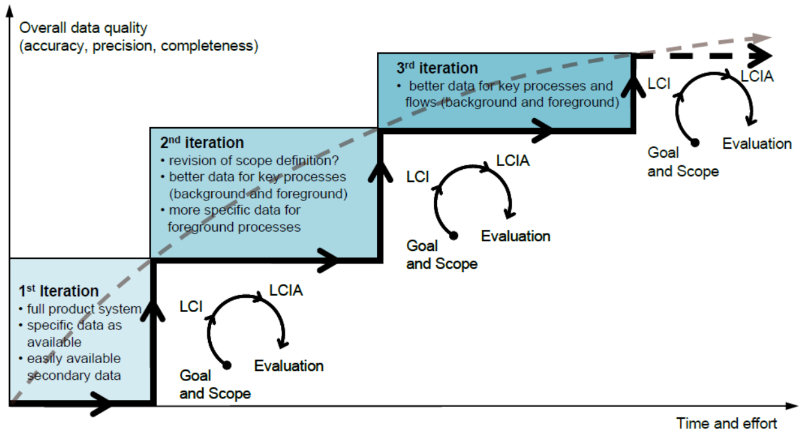

## The basics of life cycle inventory

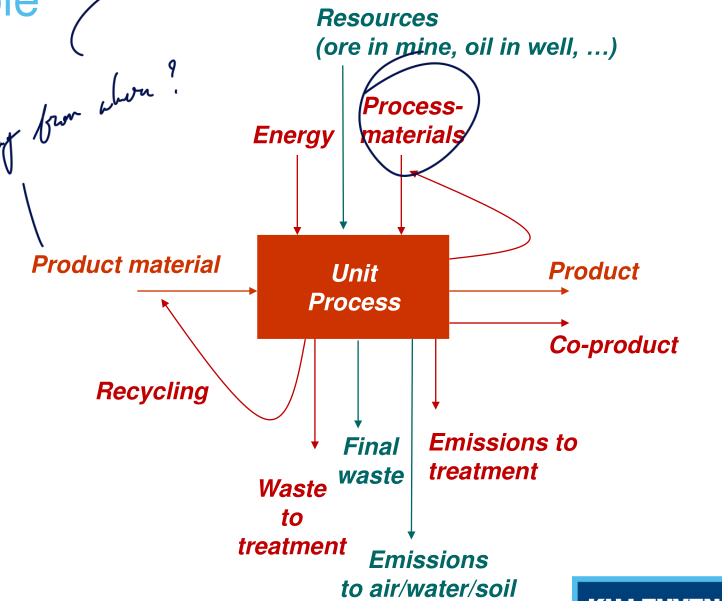

We need to analyze how much is going in and out, in emission but also waste that can be further valorized sometimes. We also need to make the distinction between the *technosphere* and *ecosphere*. When talking about the ecosphere we are taking into account all the ressources that comes from the nature while the technosphere takes into account the economic flows of products and also waste.

We have the idea of **conservation of mass and energy**.

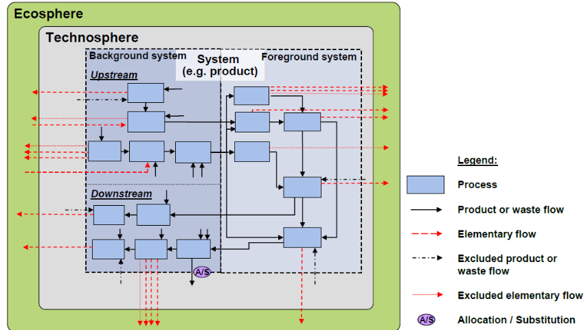

We have two types of processes

* Foreground : site specific data
* Background : market averages

### Multi-functionality

In most processes, we have some *multi-functionality* since they produces more than one *functional flow*. For example we can produce electricity and heat and use them both. We have various type of multi-functionality :

1. Co-production (multi-output)
2. Combined waste processing (multi-input)
3. Recycling (input-output)

How to distribute the impacts of these processes ? That's the main question we are trying to answer. We have 4 approaches that have their strengths and weaknesses :

1. More refined data over subdividing processes (can be expensive or not available)
   * Not partitioning but more refining of the data
2. Partitioning (allocation)
   * We see the cost of producing the two products separately
   * We need to reformulate our FU as a *basket of products*. Not efficient when the processes are somewhere in the process tree.
   * We are distributing the impact of something over an average load for example. We can't use those techniques for marginal things such as lightweight transport.
   * Economic allocation
     * The economic incentive is a good way to partition. The price per kg can be tied with the consumption of functional flows.
     * Can be hard to quantify with fluctuating prices, inflation, market distortions, not always disclosed prices
     * Don't use it when **physical relationships** exist ! Typically for products containing carbon we first have negative $CO_2$ since we are taking the storage but then releasing it later.
3. System expansion
   * A bit like the partitioning instead we are looking just for the main product, never do for by-products or we will have flawed results. We need to set a determining product the first and main goal.
   * Can have negative numbers.
   * Implies that the other functional flows holds the impact of conventional production method (for new material production)
4. Substitution
   * Always focus on the main driving and wanted production functional flow.
   * Primarily used in *consequential approach* but can be used for waste treatment in *attributional studies*.

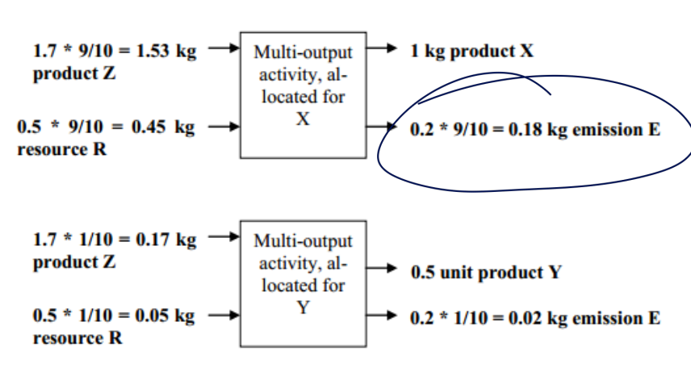

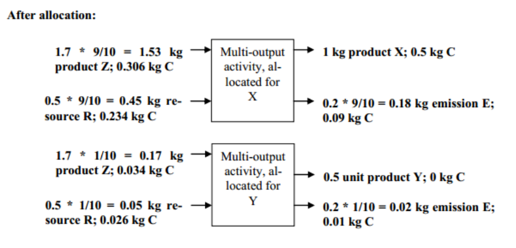

#### Allocation at point of substitution (APOS)

When we have waste, they can be valorized and transformed. But then we need to take into account the market that is for this kind of product and find the appropriate treating facilities. So we can see this process as a black box but then we need to transform it so we can see the waste as a product. 

Sometimes it is best to simply do a cutoff if the by-products are marginal in term of emissions and impacts.

Issues with our methods.

|                  |                    problem                     |
| :--------------: | :--------------------------------------------: |
| system expansion | you don’t answer the question you started with |
|   substitution   |          which processes are avoided?          |
|   partitioning   |        what are the allocation factors?        |

"*Allocation problem is artefact of wishing to isolate one function. Artefacts can only be cured in an artificial way; there is no “correct” way,
even not in theory*"

## Marginal vs Average

Marginal is a sort of short term metric where we ask ourselves "how will X change if we stop doing this ?" Usually it will lead to a stress or a short term change on one specific sector.

But this can also lead to long term marginal where we dezoom and take a closer look to change as a whole.

## 2 modelling approaches

|       Specifications        |                    Attributional approach                    |              Consequential     approach              |
| :-------------------------: | :----------------------------------------------------------: | :--------------------------------------------------: |
|         Description         | Like book-keeping, we see the sum of impacts of all products | Scenario analysis, calculated impacts reflect change |
|          Data type          |                         **average**                          |                     **marginal**                     |
| Solve multi-functionality ? |                 Partitioning and allocation                  |           Substitution (avoided products)            |

We need to be careful for the consequential approach as it uses *substitution*. We need to ask ourselves "*What is the determining product ?*", "*What is the avoided technology ?*" (technology we are replacing with our innovation). Some new technology can either add extra capacity to the market (*increasing markets*) or simply force some old technology to shut down (*decreasing markets*). When we are looking short or long term it influences the investment but not the *capacity utilization*.

Constrained markets (regulated markets) are not marginal !

### Modelling context

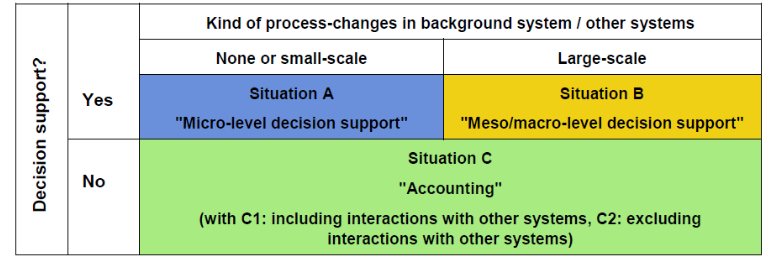

* Ecoinvent advice for attributional
  * Studies at a societal level, where the entire environmental impact of all human activities is studied, with the aim of identifying areas for improvement
  * Studies on environmental taxation, where the focus is less on the consequences of the tax, but rather on who is to carry the burden
  * Studies that seek to avoid blame or to praise or reward for past good behavior
* Ecoinvent advice for consequential models:
  * Studies that investigate the long-term consequences(including changes in production capacity) of small-scale decisions (that don’t change overall market conditions)

### The basics of life cycle impact assessment

We have multiple steps : 

* **Classification** : where does it contribute to ?
  * What is the contribution to global warming, acidification, ...
* **Characterization** : how much does it contribute ?
  * Put everything into $CO_2$ equivalent. To have a common reference
* **Normalisation** : is this much ?
  * Normalize to the region, see how much contribution it is for europe, world, ...
* **Weighting** : is this important ?
  * Subjective step where we arbitrarily give more importance to specific part.

We need to be careful with *characterization* as it by itself contains a certain weighting and choice. Namely, we only see the impact of a given compound on a 100 year scale. So some molecules can be more harmful on the short term but quickly degrade, this behavior won't be seen in the $CO_2$ equivalent methodology. Moreover, we can always quantize this into a carbon footprint (human toxicity, eco-toxicity, resource depletion). This is what we call the **mid-point**.

The **end-point** is more uncertain as we try to predict and measure the impacts and possible scenarios. We also add the weighting method to translate specific views **Individualist, Hierarchist and Egalitarian**

### Interpretation

We can :

1. Draw conclusions
2. Sensitivity analysis
3. Report
4. Quality control (peer review)

## Input-output LCA

We need to put boundaries but it can be quite tricky to partition it.

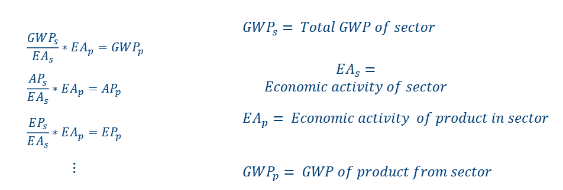

But it can be hard to measure and quantify the bi-directional relationships that exists between all the sectors. We can build this IO model based on the purchases between the sectors. 

* Sum of Value Added (non-inter-industry purchases) and Final Demand is GDP.
* Transactions include intermediate product purchases and row sum to Total Demand.
* From the IO Transactions table, form the Technical Requirements matrix by dividing each column by total sector input – matrix D. Entries represent direct inter-industry purchases per dollar of output.

With those tables we can create some matrices indicating the consumption between the sectors.

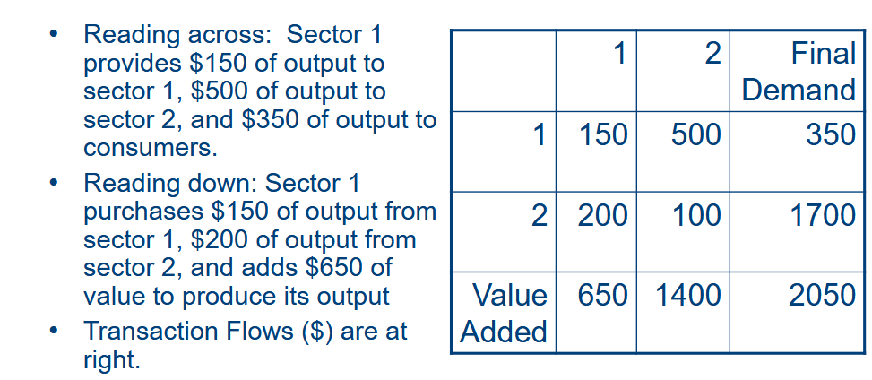

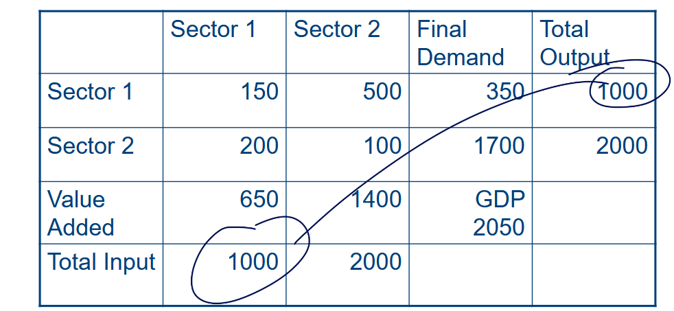

| Output from sectors    | Input to sectors | Intermediate output $O$ | Final demand $F$ | Total output $X$ |
| ---------------------- | ---------------- | ----------------------- | ---------------- | ---------------- |
|                        | 1                | 2                       | 3                | n                |       |       |       |
| 1                      | $X_{11}$         | $X_{12}$                | $X_{13}$         | $X_{1n}$         | $O_1$ | $F_1$ | $X_1$ |
| 2                      | $X_{21}$         | $X_{22}$                | $X_{23}$         | $X_{2n}$         | $O_2$ | $F_2$ | $X_2$ |
| 3                      | $X_{31}$         | $X_{32}$                | $X_{33}$         | $X_{3n}$         | $O_3$ | $F_3$ | $X_3$ |
| n                      | $X_{n1}$         | $X_{n2}$                | $X_{n3}$         | $X_{nn}$         | $O_n$ | $F_n$ | $X_n$ |
| Intermediate input $I$ | $I_1$            | $I_2$                   | $I_3$            | $I_n$            |       |       |       |
| Value added $V$        | $V_1$            | $V_2$                   | $V_3$            | $V_n$            |       | GDP   |       |
| Total input $X$        | $X_1$            | $X_2$                   | $X_3$            | $X_n$            |       |       |       |

$$
\sum X_{ij} + F_i = X_i \qquad \text{with } X_i = X_j \text{ and } A_{ij} = X_{ij}/X_j\\
\sum (A_{ij} X_j) + F_i = X_i\\
F = [I-A] X \quad X = [I-A]^{-1} F
$$

We normalize those matrix to have a view like "how to make 1 € ?" and when building those matrices, we can even incorporate the additional demand from a specific sector using $X$. And with those simple notation we can also quantify the environmental impact of various production from different sectors.

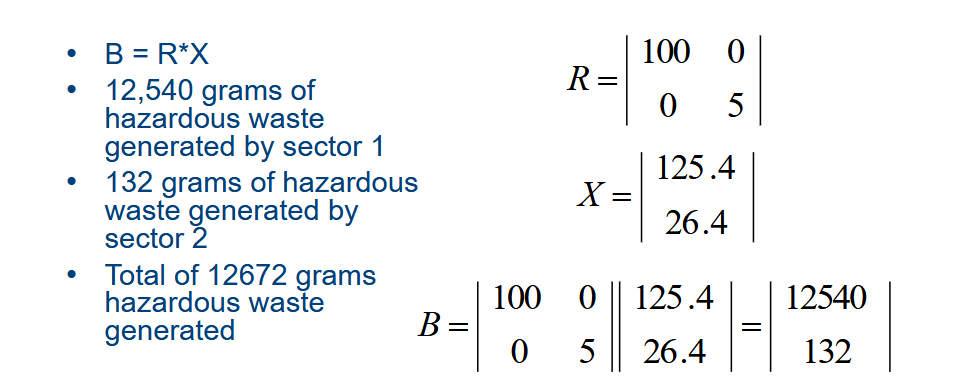

# Design for environment (DfE): Methods and Techniques

We want some fast, applicable methods that can be used in early design phase that requires little additional expertise. So we can better design for the environment.

#### Guidelines

We have 5 requirements for sustainable products, the first 3 mimick the protocols used by plant and animal ecosystems, the 4th is to maximise the utility of ressources in a finite world and the 5th to maximise human happiness and potential : 

1. **Cyclic:** the product is made form organic materials, and is recyclable or compostable, or is made form minerals that are continuously cycled in a closed loop.
2. **Solar:** the product uses solar energy or other forms of renewable energy that are cyclic and safe, both during use and manufacture.
3. **Safe:** the product is non-toxic in use and disposal, and its manufacture does not involve toxic releases or the disruption of ecosystems.
4. **Efficient:** the product in manufacture and use requires 90% less materials, energy and water than products providing equivalent utility did in 1990.
5. **Social:** the product's manufacture and use does not impinge on basic human rights or natural justice.

Then, from those generic guideline we can refine and go deeper with some more specific one. Basically we have a *mother-child* relationships between the guidelines.

For example, we can decide to select and use materials that are technically and economically recyclable, ...

### Eco-Labels

We can find some guidelines on the consumer market with the *eco-labels*, there is a wide variety that exists for all sort of category of product for different region of the world. But sometimes it is hard for marketing and can be expensive to get (*Milieukeur*).

Most of those *eco-labels* have some criteria for specific product categories that result from a LCA. Typically they will conduct a LCA to try to locate the most problematic part of the product per functional unit and give some guidelines on how to minimize its impact.

Another issue is the fact that those labels will not explicitly show the FU but just the efficiency of a product. So even if a product is large and is more than what I need it will get a good label. It has a limited scope.

#### Semi-Eco-Labels

There is also the *Der grüne punkt* which states if a product is *part of a recycling pool*. Basically, the manufacturer will pay for each of his product an *eco-tax* which will set the product in a pool. Basically they pay to be in a pool where, for example, 75% of products are recycled. But it doesn't mean each products are recycled at 75%. Typically we can have products that will never be recycled and that are part of those 25% left.

#### Best available technology

There is also the *eco-score* that showcases the electricity consumption. Those score are *market related* hence they are not **static**. They will be re-evaluated periodically. The manufacturer wants to have a big A+ label on its fridge. So they will try their best to reduce the energy consumption. But at some point all the manufacturer have reduced it and so everyone is A++. That's why we need to up the standards every few years or so.

### LIfe cycle Design Strategies (LIDS) wheel

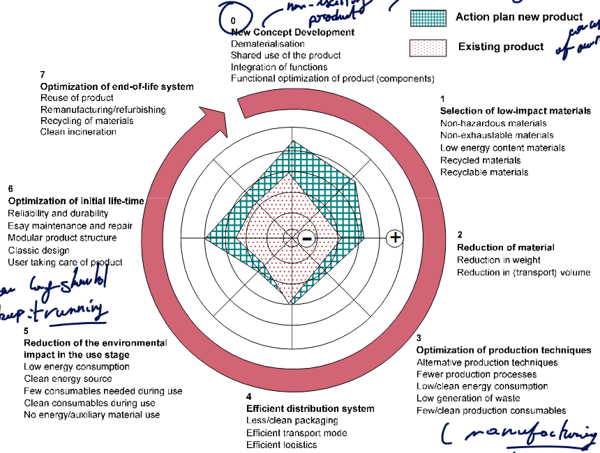

After developping a product, we can aim to develop a future generation that will be more eco-friendly.

0. We start with a new concept development. We can try *dématérialisation, shared use of products, integration of multiple functions in products, functional optimisation of product*.
1. Selection of low-impact material. So choose recycled and recyclable material, non-toxic, ...
2. Reduction of the amount of required materials. Reduction of weight, transport volume, ...
3. Selection of eco-efficient production  processes. More efficient processes, less consumable, waste, ...
4. Chose an eco-efficient distribution system. Less packaging, better means and logistic.
5. Reduction of the environmental impact in the use stage. Less energy consumption, less consumable, ...
6. Optimisation of the initial product lifetime. High reliability and durability so less replacement.
7. Optimisation of the end-of-life scenario. Reuse of the entire product, remanufacturing/refurbishment of products or components.

### MET matrix

Or the Material, Energy and Toxicity matrix. They are used as verification criteria in the different lifecycle stages.

#### Method

We identify the problematic parts of the environmental profile of a product by systematically screening the product life cycle stages.
- M: are materials consciously used ? And do we minimize the quantities to the maximum extent.
- E: is the energy consumption minimized ?
- T : is the emission of toxic substances avoided ?

|             MET Matrix             |   M   |   E   |   T   |
| :--------------------------------: | :---: | :---: | :---: |
| Material extraction and production |       |       |       |
|            Distribution            |       |       |       |
|        Use by the consumer         |       |       |       |
|             Discarding             |       |       |       |

### DfE Strategy determination

We will always have trade-off, we can't just blindly apply all strategies cause some may have a negative impact on other part of the process. Quantitative determination of the most optimal optimisation strategy is often a complex exercise for which little time or budget is allocated.

### Environmental Performance Indicators

Or EPIs for short, it gives information about the environmental impact of a product. It bridges the gap between product and environmental impact related parameters. It can facilitate and simplify evaluation of complex relations with respect to environmental performance. 

In the ISO 14031, we have 2 categories : 

- Management performance indicators (MPIs)
- Operational performance indicators (OPIs)

Product related EPIs are typically situated at the level of OPIs.

- EPIs are oriented towards specific design aspects causing environmental impact.
- EPIs should be understandable, transparent and easy to interpret
- EPI scores should reflect the quality of the design process output and can thus be influenced by the designer.
- EPIs are defined in an exact way, be it in a numerical or other format, and can thus be verified.
- If an EPI is applicable to a product or component that can further be split into lower level components or parts, then unambiguous aggregation of EPI values should be possible

With EPIs it can :

- Customer > designer/manufacturer: impose requirements with respect of the environment
- Designer > < systems engineer or project leader: verification for wether internally or externally imposed requirements are met
- Designer/manufacturer > customer: reporting of realised design quality with respect to environmental impact constraints.

In the course there was the example of the ravel where it showcases the various requirements everyone can have for each party.

## Product Concept Optimisation

We need to ask the right questions, what do the customer expect as a FU ? what type of system are we in ? product, service, ... ? We are trying to decouple added value and functionality from material and energy flows, bring more added value through innovation.

### Product-Service Systems (PSS)

Definition : business models in which the usage rights or functional results of products are sold instead of the product themselves. It can take the form of :

- Product-oriented: Product + complementary services
- Use-oriented PSS: leasing, renting, ...
- Result-oriented: sales of a functional results (usually replacing a physical device)
- 
## Material Selection

There is a risk that some material cannot be created or supplied anymore stressing the production supply.

### Strategic consideration

It can be due to many risks such as:

- Geologic availability
- Technical availability
- Regulatory availability
- Geopolitical availability
- Social availability
- Market availability

Then we have other strategic issues that are the impact of supply restrictions:

- Makes manufacturing impossible
- Delays product development
- Influences profitability

So when choosing a material, we need to take into account those 2 different dimensions.

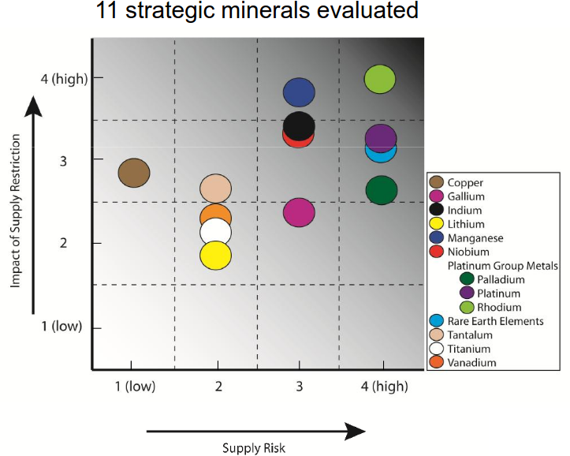

We can have a limit due to:

- ressources limited by their annual extraction: $Au,Cu$ and platinum group. 
- ressources limited and no obvious substitutes are available: $In, Re,Li, Hf, Er$. 
- Only available as secondary extraction output: $Cd, Ga, Te, In$
- High energy requirements for extraction: $Al, Ti$
- Toxicity constraints: $Pb, Hg,As,Cd$

Some company have thus developed a *black, gray, white* list of materials that can be forbidden, avoided and used. IDEmat is a good database that shows the eco-efficiency as selection criterion.

#### Optimisation

We can evaluate material based on *functional equivalence*. We can compare the stress under axial load, beams, strength of plates, ...

We do *material selection in function of minimisation of the total eco-impact*. The maximum allowed deformation being the critical factor, the ratio to be minimise is:

$$\frac{\rho \cdot Eco}{E}$$

For beams under bending load,  we find :

- Maximum allowed stress levels: $(\rho \cdot Eco )/ \sigma^{2/3}$
- Maximum allowed bending deformation: $(\rho \cdot Eco )/ E^{1/2}$

# Low impact manufacturing

Manufacturing can play a big role in the impact on the environment of a product. And such analysis are not always interesting for products or services that have a low manufacturing contribution to their footprint.

Precision manufacturing have resulted into higher power density $kW/L$. We are reducing the friction, building better tolerances, enhanced fluid flow and cooling, ...

But using more energy will also lead to more lost when producing and giving the energy to the various sectors. The trend is more and more towards *more energy intensive processes*. Less processing rates and higher energy requirements. Modern technology have introduced many more processes that give extra precision, ... but the trade-off is more energy expensive processes. And we can even push the boundaries further by taking into account the requirements to produce all this tooling.

That is why we refer to body of knowledge like **simapro**. We find usually that many processes are not that energy efficient and that they are not correctly documented, ... So we have a lot of room for improvements. That is the $CO_2 PE$ initiative : **Cooperative Effort on ($CO_2$) Process Emissions**.

### CO2PE

Objectives : 

1. Study the environmental footprint of manufacturing processes with energy consumption/$CO_2$ emissions as first priority. We limit it to *discrete part* manufacturing.
2. Develop a methodology that allows to provide data in a format useful for inclusion in LCI databases.
3. Identify opportunities for improved process design in close cooperation with machine tool developers. Derive design rules and guidelines in support of ecodesign machine tools. (less requirements, constraint, slower process, ...)
4. Draft a proposal for an eco-label system for machine tools.

Optimization can be done at multiple levels.

## Unit Process Approach

We are following the **DIN 8580** taxonomy which is:

1. Primary shaping
2. Transforming
3. Separating
4. Joining
5. Coasting & Finishing
6. Changing material properties
7. Auxiliary processes
8. Measurements & Modeling
9. Production & Process planning

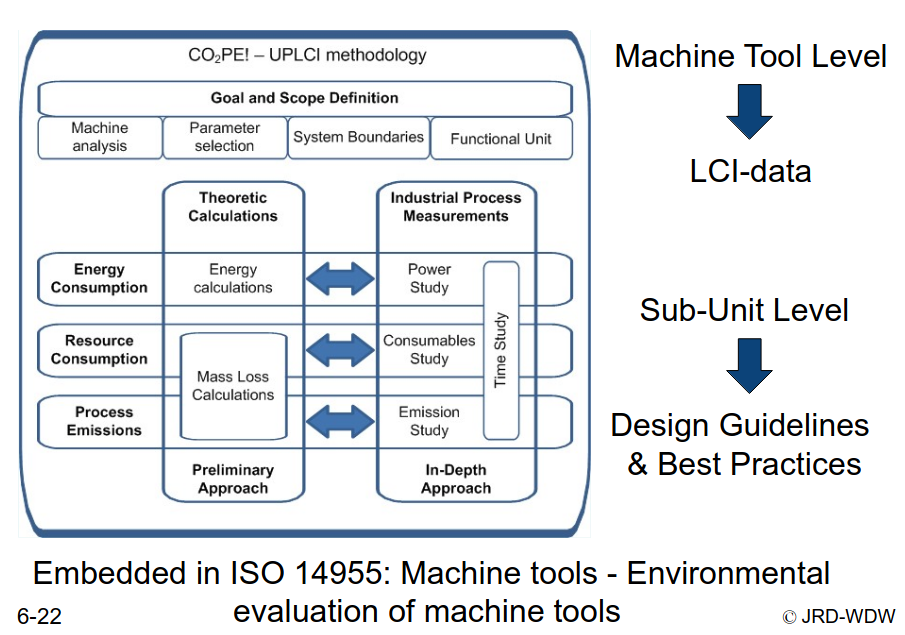

#### Conclusions

Manufacturing processes are responsible for a significant part of the environmental footprint of products, but are still poorly documented in terms of their impact.

Based on a systematic methodology for inventorisation and analysis of manufacturing unit processes significant environmental impact reduction opportunities can be identified.

#### Opportunities

- [x] Often standby consumption is substantial and has still a large potential for improvement
- [x] Auxiliary (supporting) tasks are responsible for a significant part of the electrical energy consumption.
- [x] Significant energy reduction potential in selectively switching on and off non continuously required subsystems
- [x] Despite energy is often the dominant contributor to the environmental impact, also resource consumption and process emissions (e.g. waste) are not negligible in terms of their environmental impact.
- [x] Use the right equipment for the job: use machine tools as near as possible to their maximum capacity.

## Systems Approach

We can do various optimisation at the system-level.

### Multi-machine level

It can be hard to model at this level since there is multiple  unit process happening and some interaction between processes. At higher level, we have higher resources variety and so various metric. It can be tough to analyze at this level.

#### Material flow Kg

We can analyze the process based on the input in Kg where we have $M_1-M_m$ which will result into $M^*_1-M^*_m$ by products and $Y_1-Y_n$ newly created products. We can make a matrix out of this.

| Inputs | Outputs  |          |     |          |          |     |          |
| ------ | -------- | -------- | --- | -------- | -------- | --- | -------- |
|        | $M_1^*$  | $M_2^*$  | ... | $M_m^*$  | $Y_1$    | ... | $Y_n$    |
| $M_1$  | $z_{11}$ | $z_{12}$ | ... | $z_{1m}$ | $w_{11}$ | ... | $w_{1n}$ |
| $M_2$  | $z_{21}$ | $z_{22}$ | ... | $z_{2m}$ | $w_{21}$ | ... | $w_{2n}$ |
| ...    | ...      | ...      | ... | ...      | ...      | ... | ...      |
| $M_m$  | $z_{m1}$ | $z_{m2}$ | ... | $z_{mm}$ | $w_{m1}$ | ... | $w_{mn}$ |

$$
x_i = z_{i1} + z_{i2} + \cdots + z_{ij} + \cdots + z_{im} + w_{i1} + \cdots + w_{ij} + \cdots + w_{in}\\
= a_{i1} x_1 + a_{i2} x_2 + \cdots + a_{ij} x_j + \cdots + a_{im} x_m + b_{i1} y_1 + \cdots + b_{ij} y_j + \cdots + b_{in} y_n
$$

With $x_i$ the input amount, $y_i$ the process output in new substance forms. $z_{ij}$ the material flow from material $i$ to $j$. $w_{ij}$ is the material flow from $i$ to **new substance** $j$. 

$$
a_{ij} = \frac{z_{ij}}{x_j} \qquad  b_{ij} = \frac{w_{ij}}{y_j}
$$

And we can even use matrices to have a more compact form:

$$
(I-A)X = BY \qquad X = (I-A)^{-1}BY
$$

We can usually reduce the impact of Y by reducing the input of X.

#### Metric Exergy (J)

Concept: The ‘quality of energy’ and / or materials relative to the ‘standard’ reference is monitored. So typically we start from a *reference state* and we see the amount of work needed to bring it to a defined *system state*.

But not all of this exergy is lost if we reuse waste material.

### Factory Level

Productive + support activities are analyzed in this scope. Planning and scheduling are included. We can either go for:

- holistic / integrated analysis:
  - More higher level
- components analysis:
  - Check the input and output for every components.

### Multi-facility

